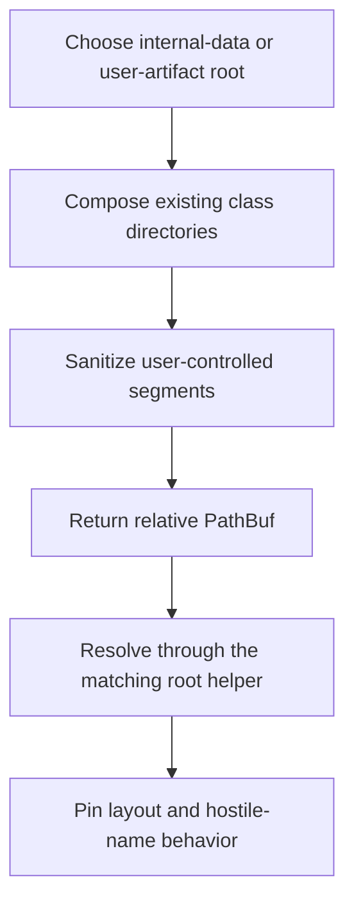
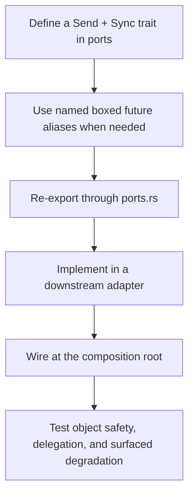

# hkask-types — How-to: Extend a Foundation Boundary

Use this guide when several kask crates must share a path, port, wire envelope,
resource limit, health snapshot, child-process environment, or process-global hook
without depending on one another's implementations. The procedure applies the
ports and adapters pattern at the workspace boundary.[^cockburn]

## Choose the smallest owning surface

| Need | Extend | Current examples |
|---|---|---|
| Relative data/artifact path | `agent_paths` | `kask/crates/hkask-types/src/agent_paths.rs:157-232` |
| Infrastructure behavior contract | `ports` | `kask/crates/hkask-types/src/ports.rs:7-23` |
| Parent/child inference wire shape | `inference_ipc` | `kask/crates/hkask-types/src/inference_ipc.rs:75-278` |
| Regulation event shape | `event` / `regulation` | `kask/crates/hkask-types/src/event.rs:14-28,298-552` |
| Shared media admission cap | `media_limits` | `kask/crates/hkask-types/src/media_limits.rs:1-24` |
| Cross-process OCR health | `ocr_health` | `kask/crates/hkask-types/src/ocr_health.rs:11-71` |
| Canonical MCP child environment | `server_env` | `kask/crates/hkask-types/src/server_env.rs:19-59` |
| Re-settable cross-crate hook | `process_global` | `kask/crates/hkask-types/src/process_global.rs:35-77` |

Do not create a generic companion type merely because one operation accepts
multiple values. Add a type only when it carries an independent invariant or wire
identity.

## Procedure A: Add a path helper



<!-- DIAGRAM_ALIGNMENT
id: DIAG-TYPES-002
verified_date: 2026-09-15
verified_against: kask/crates/hkask-types/src/agent_paths.rs:12-26,63-154,157-232,241-313
status: VERIFIED
-->

1. Choose internal app data (`resolve_data_dir`) or visible user artifacts
   (`resolve_artifacts_dir`) at
   `kask/crates/hkask-types/src/agent_paths.rs:63-154`.
2. Reuse the existing class layout and helpers at
   `kask/crates/hkask-types/src/agent_paths.rs:157-232`.
3. Pass every user-controlled path segment through `sanitize_name`
   (`kask/crates/hkask-types/src/agent_paths.rs:209-232`).
4. Return a relative `PathBuf`; let the caller resolve it through
   `resolve_under_data_dir` or `resolve_under_artifacts_dir`.
5. Add a layout test alongside the current tests at
   `kask/crates/hkask-types/src/agent_paths.rs:241-313`.

## Procedure B: Add or extend a port



<!-- DIAGRAM_ALIGNMENT
id: DIAG-TYPES-003
verified_date: 2026-09-15
verified_against: kask/crates/hkask-types/src/ports.rs:7-23; kask/crates/hkask-types/src/ports/inference_port.rs:11-36,100-161; kask/crates/hkask-types/src/ports/memory_port.rs:92-147; kask/crates/hkask-types/src/hkask_types.rs:66
status: VERIFIED
-->

1. Put the trait in the appropriate `ports/` module. Current public traits are
   `ToolDispatchPort`, `WorktreeSpawnPort`, `InferencePort`, and `MemoryPort`
   (`kask/crates/hkask-types/src/ports/inference_port.rs:100-161`;
   `kask/crates/hkask-types/src/ports/memory_port.rs:95-147`).
2. Use explicit `Pin<Box<dyn Future + Send>>` or a named alias when the trait must
   remain object-safe. Current aliases are `EmbedFuture`, `MediaFuture`,
   `RerankFuture`, and the crate-private `MemoryFuture`
   (`kask/crates/hkask-types/src/ports/inference_port.rs:11-36`;
   `kask/crates/hkask-types/src/ports/memory_port.rs:92-93`).
3. Re-export through `kask/crates/hkask-types/src/ports.rs:7-23`; the crate root
   already re-exports `ports::*` at
   `kask/crates/hkask-types/src/hkask_types.rs:66`.
4. Implement the port in the crate that owns the concrete backend and wire that
   adapter in the composition root.
5. Test object safety, delegation, and the unavailable path. Degradation must be
   surfaced as an error or explicit status, not disguised as successful empty data.

## Procedure C: Change an IPC or event contract

1. Update both sides of the boundary in the same change. For inference IPC, the
   request side is `InferenceRequest` / `InferenceMethod` / `InferenceParams` at
   `kask/crates/hkask-types/src/inference_ipc.rs:75-179`; the response side is
   `InferenceResponse` / `InferenceOutcome` and auxiliary payloads at
   `kask/crates/hkask-types/src/inference_ipc.rs:181-278`.
2. Preserve one request correlation ID and one response correlation ID. Do not add
   removed batch companion envelopes; multi-item operation inputs belong in the
   method parameters, as `embed_texts` and `rerank_documents` do at
   `kask/crates/hkask-types/src/inference_ipc.rs:131-135,167-178`.
3. For Regulation events, construct a validated namespace and add a `SpanKind`
   only when a canonical pair is reused across emitters
   (`kask/crates/hkask-types/src/event.rs:59-75,399-499`).
4. Add a serialization round-trip and an integration test that exercises the
   writer/reader or parent/child seam.

## Procedure D: Add a shared invariant module

Use a dedicated module when the shared item is not an infrastructure port:

- Add admission caps to `media_limits`; callers must reject rather than truncate
  (`kask/crates/hkask-types/src/media_limits.rs:1-24`).
- Extend `OcrHealthSnapshot` only with fields both file writer and reader can
  support, and preserve the canonical path helper
  (`kask/crates/hkask-types/src/ocr_health.rs:18-71`).
- Extend `ServerEnv` only for child-environment behavior that remains composed by
  the canonical builder (`kask/crates/hkask-types/src/server_env.rs:21-59`).
- Use `ProcessGlobal<T>` only for re-settable `Mutex<Option<T>>` hooks; use a
  set-once startup mechanism for immutable startup configuration
  (`kask/crates/hkask-types/src/process_global.rs:37-77`).

## Validation

Run the focused crate tests, then the project clippy wrapper:

```sh
cargo test -p hkask-types
./script/clippy
```

Also run the tests for every downstream writer, reader, or adapter changed with the
contract. A foundation type that serializes locally but is not consumed by the
other side has not validated the seam.

## See also

- [Why hkask-types splits boundary contracts by failure domain](./explanation.md)
- [hkask-types reference](./reference.md)

---

[^cockburn]: Cockburn, A. (2005). *Hexagonal Architecture.* <https://alistair.cockburn.us/hexagonal-architecture/>.
