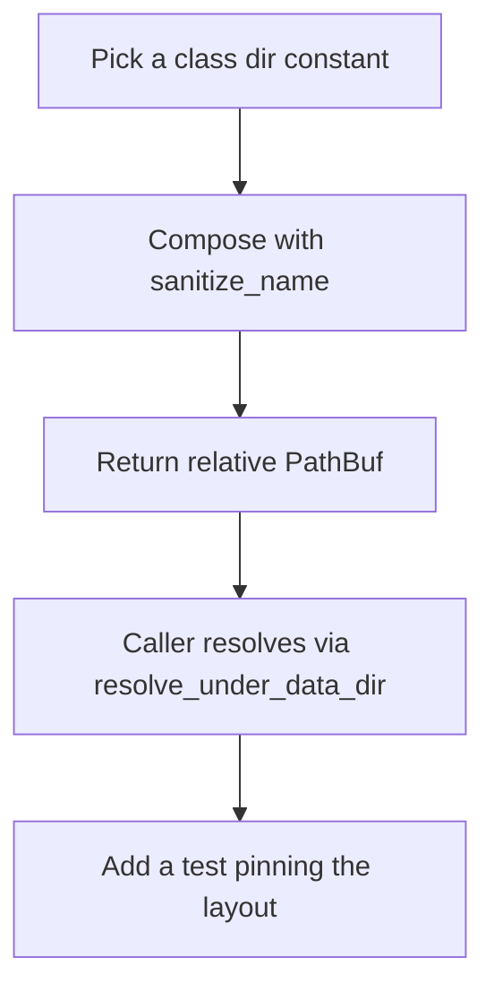
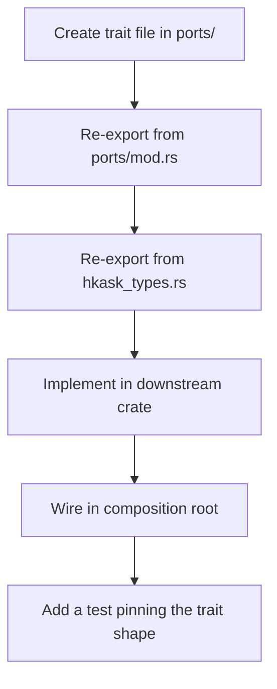

# hkask-types — How-to: Add a Path Helper or Port Trait

This guide shows how to extend `hkask-types` with a new filesystem path
helper or a new hexagonal port trait. Both flows keep kask decoupled from its
infrastructure backends and from zed's internal types.

## Source citations

| Symbol | Location |
|--------|----------|
| `AGENTS_DIR` / `MCP_DIR` / `SKILLS_DIR` / `THREADS_DIR` constants | `kask/crates/hkask-types/src/agent_paths.rs:25,29,34,38` |
| `resolve_data_dir` (single regulator) | `kask/crates/hkask-types/src/agent_paths.rs:62` |
| `resolve_under_data_dir` (delegates to regulator) | `kask/crates/hkask-types/src/agent_paths.rs:98` |
| `agent_db` (renamed from `agent_pod_db`) | `kask/crates/hkask-types/src/agent_paths.rs:146` |
| `mcp_server_db` helper | `kask/crates/hkask-types/src/agent_paths.rs:113` |
| `sanitize_name` (path-traversal guard) | `kask/crates/hkask-types/src/agent_paths.rs:180` |
| `InferencePort` trait | `kask/crates/hkask-types/src/ports/inference_port.rs:212` |
| `MemoryPort` trait | `kask/crates/hkask-types/src/ports/memory_port.rs:113` |
| `ports/mod.rs` re-export pattern | `kask/crates/hkask-types/src/ports/mod.rs:1` |
| `pub use ports::*` crate-root re-export | `kask/crates/hkask-types/src/hkask_types.rs:66` |

## Procedure A: Add a path helper



<!-- DIAGRAM_ALIGNMENT
id: DIAG-TYPES-002
verified_date: 2026-08-13
verified_against: kask/crates/hkask-types/src/agent_paths.rs:113,125,135,146,180; kask/crates/hkask-types/src/agent_paths.rs:258-407
status: VERIFIED
-->

### Step A1: Pick the class directory

All persistent kask artifacts live under one of four class subdirs of
`resolve_data_dir()`: `agents/`, `mcp/`, `skills/`, or `threads/`. Reuse the
existing constants (`AGENTS_DIR`, `MCP_DIR`, `SKILLS_DIR`, `THREADS_DIR`)
rather than introducing a new top-level directory — a new class dir is an
architecture decision, not a helper addition.

### Step A2: Compose with sanitize_name

Every user-controlled segment of the path MUST pass through `sanitize_name`
(`agent_paths.rs:180`). This replaces filesystem-hostile characters with
hyphens, collapses consecutive dashes, and substitutes `"unnamed"` for names
that sanitize to `.` or `..`. Skipping this step opens a path-traversal
escape. Follow the shape of `mcp_server_db` (`agent_paths.rs:113`):

```rust
pub fn mcp_server_db(server_id: &str, purpose: &str) -> PathBuf {
    PathBuf::from(MCP_DIR)
        .join(sanitize_name(server_id))
        .join(format!("{purpose}.db"))
}
```

### Step A3: Return a relative PathBuf

Path helpers return a *relative* path. The caller resolves it against the
data dir via `resolve_under_data_dir` (`agent_paths.rs:98`), which delegates
to `resolve_data_dir` so the `HKASK_DATA_DIR` / XDG / HOME fallback chain has
exactly one regulator. Do not call `resolve_data_dir` inside the helper —
that splits responsibilities and re-introduces the F4 divergence the single
regulator was introduced to fix.

### Step A4: Add a test pinning the layout

Add a test in the `tests` module of `agent_paths.rs` (the existing tests run
from `agent_paths.rs:213` onward). Assert the helper produces the expected
component count, lives under the right class dir, and sanitizes a hostile
name. The `mcp_server_db_sanitizes_server_id` test
(`agent_paths.rs:374-388`) is the template.

## Procedure B: Add a port trait



<!-- DIAGRAM_ALIGNMENT
id: DIAG-TYPES-003
verified_date: 2026-08-13
verified_against: kask/crates/hkask-types/src/ports/mod.rs:1; kask/crates/hkask-types/src/ports/inference_port.rs:212; kask/crates/hkask-types/src/ports/memory_port.rs:113; kask/crates/hkask-types/src/hkask_types.rs:66
status: VERIFIED
-->

### Step B1: Create the trait file

Create `kask/crates/hkask-types/src/ports/<name>_port.rs`. Define a
`Send + Sync` trait. Use `Pin<Box<dyn Future + Send + 'a>>` for async return
types — do not use `async_trait`; the `InferencePort` trait-level comment at
`inference_port.rs:65` explains the object-safety rationale. If the return
type grows complex, extract a named future alias like `EmbedFuture`
(`inference_port.rs:19`) to stay under clippy's `type_complexity` threshold.

### Step B2: Re-export from ports/mod.rs

Add `pub mod <name>_port;` and `pub use <name>_port::*;` to
`kask/crates/hkask-types/src/ports/mod.rs`. Group the re-export with the
existing cluster re-exports.

### Step B3: Re-export from crate root

The `pub use ports::*;` at `hkask_types.rs:66` automatically re-exports the
new trait. If the trait has companion types used by ≥3 downstream crates, add
an explicit re-export in the "Essential re-exports" block
(`hkask_types.rs:41-65`) following the existing pattern.

### Step B4: Implement in a downstream crate

Create an adapter struct in `kask_bridge`, `hkask-storage`, or
`hkask-regulation` that implements the trait against a concrete backend. If
the trait is object-safe and callers will hold a shared handle, add a blanket
impl for `Arc<dyn Trait>` following the `InferencePort for Arc<dyn
InferencePort>` pattern at `inference_port.rs:441`.

### Step B5: Wire in the composition root

Construct the adapter in the deferred task in `main.rs` and pass it to the
consumer via a `set_*` hook or constructor parameter. Per the project rules,
a `OnceLock` hook must `log::warn!` on the `Err` branch of `set`; a `Mutex`
hook is re-settable and does not need it.

### Step B6: Add a test pinning the trait shape

Add a test in the new trait file asserting the trait is object-safe
(`fn assert_obj_safe(_: &dyn MyPort) {}`) and that the blanket `Arc` impl
delegates correctly. The `InferencePort for Arc<dyn InferencePort>` impl at
`inference_port.rs:441-534` is the reference shape.

## See also

- [hkask-types Reference](./reference.md): class diagram of every port and
  companion type.
- [hkask-types Tutorial](./tutorial.md): reading the foundation crate.
- [hkask-types Explanation](./explanation.md): why the foundation crate is
  structured this way.

---

[^cockburn]: Cockburn, A. (2005). *Hexagonal Architecture.* <https://alistair.cockburn.us/hexagonal-architecture/>. The ports-and-adapters pattern that this guide implements.
