# hkask-types — Reference

`hkask-types` is the foundation crate of the hKask workspace. It defines the
shared domain types, identifier newtypes, and hexagonal port traits that every
downstream kask crate depends on. The crate forbids `unsafe` code and exports
no implementations of its own port traits. It defines the abstractions;
implementations live in `hkask-storage`, `hkask-regulation`, `kask_bridge`,
and `hkask-templates`.

## Source citations

| Symbol | Location |
|--------|----------|
| Crate root, module list | `kask/crates/hkask-types/src/hkask_types.rs:1` |
| `pub use ports::*` re-export | `kask/crates/hkask-types/src/hkask_types.rs:72` |
| `InferencePort` trait | `kask/crates/hkask-types/src/ports/inference_port.rs:29` |
| `MemoryPort` trait | `kask/crates/hkask-types/src/ports/memory_port.rs:94` |
| `WalletBudgetPort` trait | `kask/crates/hkask-types/src/ports/wallet_budget_port.rs:38` |
| `ConsentPort` trait | `kask/crates/hkask-types/src/ports/consent_port.rs:21` |
| `EmbeddingPort` trait | `kask/crates/hkask-types/src/ports/embedding_port.rs:16` |
| `EscalationPort` trait | `kask/crates/hkask-types/src/ports/escalation.rs:86` |
| `CircuitBreakerPort` trait | `kask/crates/hkask-types/src/ports/regulation.rs:14` |
| `LedgerObserver` trait | `kask/crates/hkask-types/src/ports/regulation.rs:64` |
| `LedgerStoragePort` trait | `kask/crates/hkask-types/src/ports/regulation.rs:81` |
| `SkillRegistryIndex` trait | `kask/crates/hkask-types/src/ports/registry.rs:288` |
| `RegistryIndex` trait | `kask/crates/hkask-types/src/ports/registry.rs:311` |
| `Id<T: IdKind>` newtype | `kask/crates/hkask-types/src/id/core.rs:20` |
| `ToolPort` trait (in `hkask-capability`, not this crate) | `kask/crates/hkask-capability/src/tool_port.rs:47` |

## Port trait hierarchy

The `ports/` module defines ten port traits organized into four clusters.
Each port is a `Send + Sync` trait that abstracts an infrastructure boundary.
Downstream crates implement these traits against concrete backends. The
`ToolPort` trait lives in `hkask-capability` rather than this crate because it
carries OCAP semantics; it is included here for context.

```mermaid
classDiagram
    class InferencePort {
        <<interface>>
        +stream_chat(request) InferenceStream
        +list_models() Vec~ModelEntry~
    }
    class MemoryPort {
        <<interface>>
        +ingest_turn(record) Result
        +recall(query) Vec~MemorySnippet~
    }
    class WalletBudgetPort {
        <<interface>>
        +check_balance(agent) WalletBalance
        +encumber(amount) Result
    }
    class ConsentPort {
        <<interface>>
        +store_consent(record) Result
        +verify_consent(scope) bool
    }
    class EmbeddingPort {
        <<interface>>
        +embed(text) Vec~f32~
        +store_embedding(record) Result
    }
    class EscalationPort {
        <<interface>>
        +create_escalation(entry) Result
        +list_escalations() Vec~EscalationEntry~
    }
    class CircuitBreakerPort {
        <<interface>>
        +is_open(circuit) bool
        +record_event(circuit, event)
    }
    class LedgerObserver {
        <<interface>>
        +on_event(event)
    }
    class LedgerStoragePort {
        <<interface>>
        +store_record(record) Result
        +query_records(filter) Vec~Record~
    }
    class SkillRegistryIndex {
        <<interface>>
        +list_skills() Vec~Skill~
        +find_skill(name) Option~Skill~
    }
    class RegistryIndex {
        <<interface>>
        +list_entries() Vec~RegistryEntry~
    }
    class ToolPort {
        <<interface>>
        +invoke_tool(call) Result
        +list_tools() Vec~ToolInfo~
    }

    InferencePort <|.. FusionLanguageModel
    MemoryPort <|.. BridgeMemoryPort
    WalletBudgetPort <|.. WalletManager
    ConsentPort <|.. ConsentStore
    EmbeddingPort <|.. EmbeddingStore
    EscalationPort <|.. EscalationQueue
    LedgerObserver <|.. RegulationLedger
    LedgerStoragePort <|.. RegulationArchive
    SkillRegistryIndex <|.. SkillRegistry
    RegistryIndex <|.. SkillRegistry
```

<!-- DIAGRAM_ALIGNMENT
id: DIAG-DIA-TYPES-001
verified_date: 2026-07-27
verified_against: kask/crates/hkask-types/src/ports/inference_port.rs:29; kask/crates/hkask-types/src/ports/memory_port.rs:94; kask/crates/hkask-types/src/ports/wallet_budget_port.rs:38; kask/crates/hkask-types/src/ports/consent_port.rs:21; kask/crates/hkask-types/src/ports/embedding_port.rs:16; kask/crates/hkask-types/src/ports/escalation.rs:86; kask/crates/hkask-types/src/ports/regulation.rs:14,64,81; kask/crates/hkask-types/src/ports/registry.rs:288,311; kask/crates/hkask-capability/src/tool_port.rs:47
status: VERIFIED
-->

## Port clusters

The ten ports group into four functional clusters by the infrastructure
boundary they abstract.

### Inference cluster

`InferencePort` (`ports/inference_port.rs:29`) abstracts LLM chat completion
and model enumeration. The companion types `ModelEntry` and
`InferenceStreamChunk` live in the same file. Implementors:
`FusionLanguageModel` in `kask_bridge/src/fusion_model.rs`,
`GuardedInferencePort` in `hkask-guard/src/guarded_inference.rs`, and the
inference-router adapters in `hkask-inference/src/`.

### Memory cluster

`MemoryPort` (`ports/memory_port.rs:94`) abstracts turn ingestion and snippet
recall. The companion types `TurnRecord`, `MemorySnippet`, `MemoryError`, and
the `MemoryFuture` type alias live in the same file. Implementor:
`BridgeMemoryPort` in `kask_bridge/src/memory.rs`, which adapts zed's
`ThreadMemoryPort` to this trait.

### Regulation cluster

Four ports govern the Regulation nervous system. `CircuitBreakerPort`
(`ports/regulation.rs:14`) abstracts circuit-breaker state queries.
`LedgerObserver` (`ports/regulation.rs:64`) receives Regulation events.
`LedgerStoragePort` (`ports/regulation.rs:81`) persists Regulation records.
`WalletBudgetPort` (`ports/wallet_budget_port.rs:38`) abstracts gas-budget
balance and encumbrance. Implementors: `WalletManager` in
`hkask-regulation/src/wallet_manager.rs`, `RegulationLedger` (as
`LedgerObserver`) in `hkask-regulation/src/runtime.rs`, and `RegulationArchive`
in `hkask-storage/src/regulation_store.rs:502`.

### Persistence cluster

Three ports abstract storage backends. `ConsentPort`
(`ports/consent_port.rs:21`) stores and verifies consent records.
`EmbeddingPort` (`ports/embedding_port.rs:16`) generates and stores vector
embeddings. `EscalationPort` (`ports/escalation.rs:86`) manages escalation
records. Implementors: `ConsentStore` in `hkask-storage/src/consent_store.rs`,
`EmbeddingStore` in `hkask-storage/src/embeddings.rs:616`, and `EscalationQueue`
in `hkask-storage/src/escalation.rs:402`.

### Registry cluster

`SkillRegistryIndex` (`ports/registry.rs:288`) and `RegistryIndex`
(`ports/registry.rs:311`) abstract the skill and template registry. The
companion types `Skill`, `RegistryEntry`, `SkillZone`, and `RegistryError`
live in the same file. Implementor: `SkillRegistry` in
`hkask-templates/src/registry.rs` and `hkask-templates/src/registry_sqlite.rs`.

## Identifier newtypes

The `id/` module defines a generic `Id<T: IdKind>` newtype
(`id/core.rs:20`) parameterized by a phantom `IdKind` marker. Each domain
entity gets a strongly typed identifier: `WebID`, `HMemId`, `GoalID`,
`TemplateID`, `TaskId`, `BoardId`, `WalletId`, `ApiKeyId`, and others. The
`IdKind` trait (`id/core.rs`) is implemented by empty marker enums
(`TemplateKind`, `BotKind`, `TripleKind`, etc.) that carry no runtime data.
This pattern prevents identifier confusion at compile time.

## Re-exports

The crate root (`hkask_types.rs:72`) re-exports the entire `ports` module via
`pub use ports::*`. Downstream crates depend on `hkask-types` and receive all
port traits, identifier newtypes, and domain types (`HMemEntry`, `WebID`,
`RJoule`, `ObservableSpan`, `RegulationRecord`, `CircuitState`, `VoiceDesign`,
and the wallet, curation, and loop types) through this single dependency.

## See also

- [hkask-types Explanation](./explanation.md): sequence diagram of how the
  port traits mediate between zed and kask at the composition root.
- [hkask-capability Reference](../hkask-capability/reference.md): the
  `ToolPort` trait and OCAP token verification flow.
- [`kask/docs/architecture/zed-host-architecture-plan.md`](../../architecture/zed-host-architecture-plan.md):
  the D1–D10 integration seams that consume these port traits.
- [`kask/docs/architecture/core/PRINCIPLES.md`](../../architecture/core/PRINCIPLES.md):
  P5.4 dual-axis ontology (PKO + DC+BIBO) that grounds the domain types.

---

[^hexagonal]: Cockburn, A. (2005). *Hexagonal Architecture.* <https://alistair.cockburn.us/hexagonal-architecture/>. The ports-and-adapters pattern that the `ports/` module implements: core logic depends on traits, infrastructure provides implementations.

[^newtype]: Rust Community. (2024). *Rust API Guidelines — Newtype Pattern.* <https://rust-lang.github.io/api-guidelines/type-conventions.html#c-newtype>. The `Id<T: IdKind>` newtype pattern that prevents identifier confusion at compile time.
