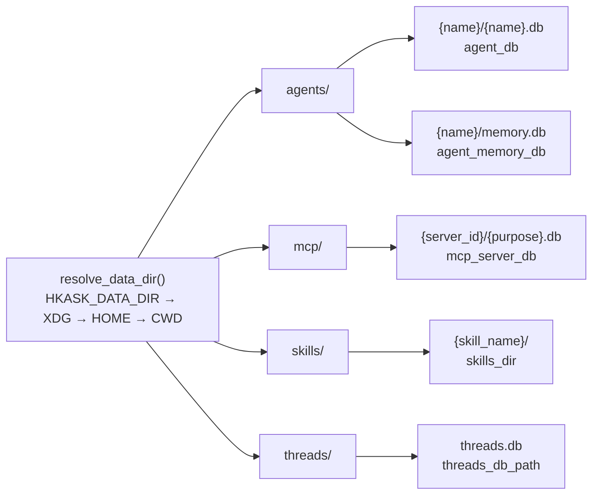
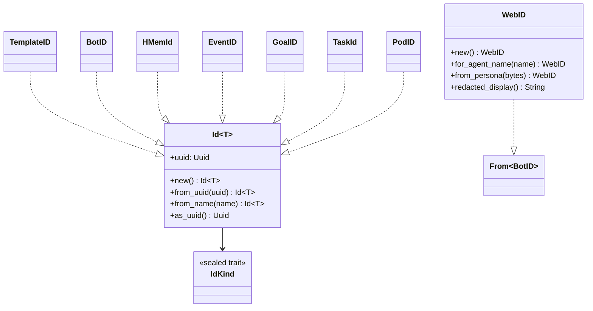

# hkask-types — Reference

`hkask-types` is the foundation crate of the hKask workspace. It defines the
shared domain types, identifier newtypes, hexagonal port traits, filesystem
path helpers, and Regulation event substrate that every downstream kask crate
depends on. The crate forbids `unsafe` code, declares no implementations of
its own port traits, and must not depend on `hkask-capability` (cycle
prevention — see `Cargo.toml:13`).

## Source citations

| Symbol | Location |
|--------|----------|
| Crate root, module list | `kask/crates/hkask-types/src/hkask_types.rs:6` |
| `pub use ports::*` re-export | `kask/crates/hkask-types/src/hkask_types.rs:66` |
| `HMemEntry` struct | `kask/crates/hkask-types/src/hkask_types.rs:68` |
| `ExpectProposal` struct | `kask/crates/hkask-types/src/hkask_types.rs:88` |
| `AGENTS_DIR` / `MCP_DIR` / `SKILLS_DIR` / `THREADS_DIR` | `kask/crates/hkask-types/src/agent_paths.rs:25,29,34,38` |
| `DEFAULT_DB_PATH` | `kask/crates/hkask-types/src/agent_paths.rs:43` |
| `resolve_data_dir` | `kask/crates/hkask-types/src/agent_paths.rs:62` |
| `resolve_under_data_dir` | `kask/crates/hkask-types/src/agent_paths.rs:98` |
| `agent_dir` | `kask/crates/hkask-types/src/agent_paths.rs:103` |
| `mcp_server_db` | `kask/crates/hkask-types/src/agent_paths.rs:113` |
| `skills_dir` | `kask/crates/hkask-types/src/agent_paths.rs:125` |
| `threads_db_path` | `kask/crates/hkask-types/src/agent_paths.rs:135` |
| `agent_db` (renamed from `agent_pod_db`) | `kask/crates/hkask-types/src/agent_paths.rs:146` |
| `agent_memory_db` | `kask/crates/hkask-types/src/agent_paths.rs:152` |
| `ensure_agent_dirs` | `kask/crates/hkask-types/src/agent_paths.rs:170` |
| `sanitize_name` | `kask/crates/hkask-types/src/agent_paths.rs:180` |
| `InferencePort` trait | `kask/crates/hkask-types/src/ports/inference_port.rs:212` |
| `ToolDispatchPort` trait | `kask/crates/hkask-types/src/ports/inference_port.rs:94` |
| `SkillExecPort` trait | `kask/crates/hkask-types/src/ports/inference_port.rs:174` |
| `WorktreeSpawnPort` trait | `kask/crates/hkask-types/src/ports/inference_port.rs:200` |
| `ModelEntry` / `MediaGenerateParams` | `kask/crates/hkask-types/src/ports/inference_port.rs:73,40` |
| `InferenceStreamChunk` | `kask/crates/hkask-types/src/ports/inference_port.rs:409` |
| `ChatMessage` / `InferenceResult` / `InferenceUsage` / `ChatToolDefinition` / `StructuredToolCall` / `InferenceError` / `compute_confidence` | `kask/crates/hkask-types/src/ports/inference_types.rs:15,139,62,108,130,45,89` |
| `MemoryPort` trait | `kask/crates/hkask-types/src/ports/memory_port.rs:113` |
| `TurnRecord` / `to_chat_turn_value` | `kask/crates/hkask-types/src/ports/memory_port.rs:29,62` |
| `MemorySnippet` / `MemoryError` / `MemoryFuture` | `kask/crates/hkask-types/src/ports/memory_port.rs:80,93,101` |
| `SkillRegistryIndex` trait | `kask/crates/hkask-types/src/ports/registry.rs:286` |
| `RegistryIndex` trait | `kask/crates/hkask-types/src/ports/registry.rs:309` |
| `Skill` / `RegistryEntry` / `SkillZone` / `RegistryError` | `kask/crates/hkask-types/src/ports/registry.rs:99,9,57,269` |
| `ConsolidationRequest` / `ConsolidationOutcome` | `kask/crates/hkask-types/src/ports/regulation.rs:3,20` |
| `EmbeddingGenerationError` | `kask/crates/hkask-types/src/ports/embedding.rs:3` |
| `RegulationRecord` / `Span` / `SpanNamespace` / `SpanKind` / `CyclePhase` / `RegulationSink` | `kask/crates/hkask-types/src/event.rs:16,670,101,722,803,839` |
| `RegulationSpan` / `ToolSubsystem` / `QueueDepth` / `LedgerHealth` / `RegulationHealth` | `kask/crates/hkask-types/src/regulation.rs:108,130,30,54,69` |
| `ObservableSpan` trait | `kask/crates/hkask-types/src/observable_span.rs:55` |
| `Id<T: IdKind>` newtype + kind aliases | `kask/crates/hkask-types/src/id/core.rs:20,191` |
| `WebID` (agent identifier) | `kask/crates/hkask-types/src/id/webid.rs:9` |
| `InfrastructureError` / `DbError` / `McpErrorKind` / `NotFound` / `DatabaseErrorKind` | `kask/crates/hkask-types/src/error.rs:117,57,231,296,26` |
| `Visibility` / `AccessControl` / `Confidence` / `Dimension` | `kask/crates/hkask-types/src/visibility.rs:34,92,213,313` |
| `CuratorHandle` / `CuratorDirective` / `EscalationSeverity` / `CurationThresholdConfig` | `kask/crates/hkask-types/src/curator.rs:27,79,53,207` |
| `Ed25519PublicKey` / `Ed25519Signature` | `kask/crates/hkask-types/src/crypto.rs:14,56` |
| `DocStructure` / `Page` / `Block` | `kask/crates/hkask-types/src/document.rs:23,88,102` |
| `TaggedChunk` / `ChunkOntology` / `ExpertiseLevel` | `kask/crates/hkask-types/src/corpus.rs:133,103,20` |
| `HMemOntology` | `kask/crates/hkask-types/src/hmem_ontology.rs:35` |
| `LLMParameters` | `kask/crates/hkask-types/src/template.rs:14` |
| `TemplateType` | `kask/crates/hkask-types/src/template_type.rs:28` |
| `SkillPolarity` | `kask/crates/hkask-types/src/skill.rs:27` |
| `VoiceDesign` | `kask/crates/hkask-types/src/voice.rs:15` |
| `TaskStatus` | `kask/crates/hkask-types/src/kanban_status.rs:24` |
| `KANBAN_SERVER_NAME` / `KANBAN_TASK_MOVE_TOOL` | `kask/crates/hkask-types/src/kanban_wire.rs:17,22` |
| `SecretRef` / `ZeroizingSecret` / `derivation_contexts` | `kask/crates/hkask-types/src/secret.rs:22,100,89` |
| `AnyJsonValue` / `find_boolean_schema_positions` | `kask/crates/hkask-types/src/tool_schema.rs:47,116` |
| `InferenceRequest` / `InferenceMethod` / `InferenceParams` / `InferenceResponse` / `InferenceOutcome` | `kask/crates/hkask-types/src/inference_ipc.rs:62,74,111,186,197` |
| `INFERENCE_SOCKET_ENV` | `kask/crates/hkask-types/src/inference_ipc.rs:58` |

## Module map

```mermaid
classDiagram
    class hkask_types {
        +forbid(unsafe_code)
        +pub use ports::*
    }
    class agent_paths
    class ports
    class event
    class id
    class regulation
    class error
    class visibility
    class curator
    class crypto
    class document
    class corpus
    class hmem_ontology
    class inference_ipc
    class template
    class template_type
    class skill
    class voice
    class kanban_status
    class kanban_wire
    class secret
    class tool_schema
    class observable_span

    hkask_types o-- agent_paths
    hkask_types o-- ports
    hkask_types o-- event
    hkask_types o-- id
    hkask_types o-- regulation
    hkask_types o-- error
    hkask_types o-- visibility
    hkask_types o-- curator
    hkask_types o-- crypto
    hkask_types o-- document
    hkask_types o-- corpus
    hkask_types o-- hmem_ontology
    hkask_types o-- inference_ipc
    hkask_types o-- template
    hkask_types o-- template_type
    hkask_types o-- skill
    hkask_types o-- voice
    hkask_types o-- kanban_status
    hkask_types o-- kanban_wire
    hkask_types o-- secret
    hkask_types o-- tool_schema
    hkask_types o-- observable_span
```

<!-- DIAGRAM_ALIGNMENT
id: DIAG-TYPES-004
verified_date: 2026-08-13
verified_against: kask/crates/hkask-types/src/hkask_types.rs:6-39
status: VERIFIED
-->

## Filesystem path model

`agent_paths.rs` is the single regulator for per-agent storage locations. All
persistent kask artifacts live under one of four class subdirs of
`resolve_data_dir()`.

<!-- DIAGRAM_ALIGNMENT
id: DIAG-TYPES-005
verified_date: 2026-08-13
verified_against: kask/crates/hkask-types/src/agent_paths.rs:62,103,113,125,135,146,152
status: VERIFIED
-->

`agent_db` produces `{name}.db` (e.g. `agents/curator/curator.db`), not
`pod.db`. `sanitize_name` (`agent_paths.rs:180`) replaces `/ \ : * ? " < > | ( )` and space with hyphens, collapses consecutive dashes, trims leading/trailing
dashes, and substitutes `"unnamed"` for names that sanitize to `.` or `..`.

## Port trait hierarchy

The `ports/` module defines port traits organized into clusters. Each port is
a `Send + Sync` trait that abstracts an infrastructure boundary. Downstream
crates implement these traits against concrete backends.

```mermaid
classDiagram
    class InferencePort {
        <<interface>>
        +generate(prompt, parameters, tools) Future
        +generate_with_model(prompt, parameters, model, tools) Future
        +generate_with_messages(messages, parameters, model, tools) Future
        +generate_stream(...) Stream
        +embed(texts, model) EmbedFuture
        +list_models() Future
        +media_generate(op, params) MediaFuture
    }
    class ToolDispatchPort {
        <<interface>>
        +invoke_tool(server, tool, args, allowed) Future
    }
    class SkillExecPort {
        <<interface>>
        +execute_skill(name, task) Future
    }
    class WorktreeSpawnPort {
        <<interface>>
        +create_worktree_thread(prompt, title, worktree, base) Future
    }
    class MemoryPort {
        <<interface>>
        +ingest_turn(record) MemoryFuture
        +recall_context(query, limit) MemoryFuture
        +recall_thread(thread_id, limit) MemoryFuture
    }
    class SkillRegistryIndex {
        <<interface>>
        +register_skill(skill) Result
        +get_skill(id) Option~Skill~
        +list_skills() Vec~Skill~
        +list_skills_visible_to(visibility) Vec~Skill~
    }
    class RegistryIndex {
        <<interface>>
        +list(domain_hint) Vec~RegistryEntry~
        +get(id) Result~RegistryEntry~
    }
    class RegulationSink {
        <<interface>>
        +persist(event) Result
        +persist_if_absent(source_event_id, event) Result
    }
    class ObservableSpan {
        <<interface>>
        +as_str() str
        +emit(operation)
        +emit_to(sink, operation, observer, phase, observation)
        +to_event(operation, observer, phase, observation) Option
    }
```

<!-- DIAGRAM_ALIGNMENT
id: DIAG-TYPES-006
verified_date: 2026-08-13
verified_against: kask/crates/hkask-types/src/ports/inference_port.rs:94,174,200,212; kask/crates/hkask-types/src/ports/memory_port.rs:113; kask/crates/hkask-types/src/ports/registry.rs:286,309; kask/crates/hkask-types/src/event.rs:839; kask/crates/hkask-types/src/observable_span.rs:55
status: VERIFIED
-->

### Inference cluster

`InferencePort` (`ports/inference_port.rs:212`) abstracts LLM generation,
streaming, vision, embedding, model listing, and media generation. Companion
types: `ModelEntry` (`inference_port.rs:73`), `MediaGenerateParams`
(`inference_port.rs:40`), `InferenceStreamChunk` (`inference_port.rs:409`),
and the `inference_types.rs` set (`ChatMessage`, `InferenceResult`,
`InferenceUsage`, `ChatToolDefinition`, `StructuredToolCall`,
`InferenceError`, `TokenProbability`, `compute_confidence`). `ToolDispatchPort`
(`inference_port.rs:94`), `SkillExecPort` (`inference_port.rs:174`), and
`WorktreeSpawnPort` (`inference_port.rs:200`) are MCP-server-side boundaries
for governed tool dispatch, skill cascade execution, and worktree-backed
agent spawning respectively. All four traits have blanket impls for
`Arc<dyn Trait>`.

### Memory cluster

`MemoryPort` (`ports/memory_port.rs:113`) abstracts turn ingestion and
snippet recall. `ingest_turn` is required; `recall_context` and
`recall_thread` default to empty vecs. Companion types: `TurnRecord`
(`memory_port.rs:29`), `MemorySnippet` (`memory_port.rs:80`), `MemoryError`
(`memory_port.rs:93`), `MemoryFuture` (`memory_port.rs:101`).

### Registry cluster

`SkillRegistryIndex` (`ports/registry.rs:286`) and `RegistryIndex`
(`ports/registry.rs:309`) abstract the skill and template registry.
`list_skills_visible_to` (`registry.rs:295`) implements the P2 affirmative-
consent default-deny: private context sees all skills; public/shared context
sees only Public or Shared. Companion types: `Skill` (`registry.rs:99`),
`RegistryEntry` (`registry.rs:9`), `SkillZone` (`registry.rs:57`),
`RegistryError` (`registry.rs:269`).

### Regulation cluster

`RegulationSink` (`event.rs:839`) persists `RegulationRecord`s.
`ObservableSpan` (`observable_span.rs:55`) is the trait typed span enums
implement to bridge into the validated `SpanNamespace` construction path.
`ConsolidationRequest` / `ConsolidationOutcome` (`ports/regulation.rs:3,20`)
carry memory-consolidation parameters.

## Identifier newtypes

The `id/` module defines a generic `Id<T: IdKind>` newtype
(`id/core.rs:20`) parameterized by a phantom `IdKind` marker. The `IdKind`
trait (`id/core.rs:13`) is sealed — external crates cannot introduce new
kinds. Each domain entity gets a strongly typed alias: `TemplateID`,
`BotID`, `HMemId`, `EventID`, `GoalID`, `EmbeddingID`, `UserID`, `PodID`,
`EscalationID`, `PhaseId`, `CommentId`, `BoardId`, `ColumnId`, `TaskId`
(`id/core.rs:191-204`). `WebID` (`id/webid.rs:9`) is the agent identifier;
`for_agent_name` (`id/webid.rs:42`) is the canonical agent-name → WebID
derivation used across CLI, API, REPL, and `AgentService`.

<!-- DIAGRAM_ALIGNMENT
id: DIAG-TYPES-007
verified_date: 2026-08-13
verified_against: kask/crates/hkask-types/src/id/core.rs:13,20,131-204; kask/crates/hkask-types/src/id/webid.rs:9,42,58,96,121
status: VERIFIED
-->

## Error taxonomy

`error.rs` defines a layered error architecture. `InfrastructureError`
(`error.rs:117`) is the cross-crate transport layer — `Database`,
`Serialization`, `LockPoisoned`, `NotFound`, `Io` — with no domain semantics.
`DbError` (`error.rs:57`) is the provider-agnostic database error moved here
to break the storage/wallet-types/database circular dependency.
`McpErrorKind` (`error.rs:231`) is the canonical MCP error taxonomy:
`is_retryable` (`error.rs:261`) returns true for `Unavailable`, `Timeout`,
`RateLimited`; `requires_intervention` (`error.rs:272`) returns true for
`PermissionDenied`, `FailedPrecondition`. `NotFound` (`error.rs:296`) is the
canonical rich not-found struct used across 17+ crates.

## Regulation event substrate

`event.rs` defines the cybernetic audit trail. `RegulationRecord`
(`event.rs:16`) carries `id`, `timestamp`, `observer_webid`, `span`,
`phase`, `observation`, `regulation`, `outcome`, `recursion_depth`,
`parent_event`, and `visibility`. `Span` (`event.rs:670`) pairs a validated
`SpanNamespace` with a fully-qualified path. `SpanNamespace` (`event.rs:101`)
is constructed via `SpanNamespace::new()` which validates against the
canonical set in `CANONICAL_NAMESPACES` (`event.rs:111`). `SpanKind`
(`event.rs:722`) enumerates canonical (namespace, path) pairs for common
spans. `CyclePhase` (`event.rs:803`) is `Sense | Compute | Compare | Act |
Verify`. `regulation.rs` defines `RegulationSpan` (`regulation.rs:108`),
`ToolSubsystem` (`regulation.rs:130`), `QueueDepth` (`regulation.rs:30`),
`LedgerHealth` (`regulation.rs:54`), and `RegulationHealth`
(`regulation.rs:69`).

## Inference IPC protocol

`inference_ipc.rs` defines the JSON-RPC protocol MCP server child processes
use to call back into the zed process. `InferenceRequest` (`inference_ipc.rs:62`)
pairs a correlation `id` with an `InferenceMethod` (`inference_ipc.rs:74`) and
`InferenceParams` (`inference_ipc.rs:111`). Methods: `generate`,
`generate_with_model`, `generate_with_messages`, `generate_vision`, `embed`,
`list_models`, `media_generate`, `tool_invoke`, `skill_execute`,
`create_worktree_thread`. `InferenceResponse` (`inference_ipc.rs:186`) carries
an `InferenceOutcome` (`inference_ipc.rs:197`). The socket path is passed via
`INFERENCE_SOCKET_ENV` = `"HKASK_INFERENCE_SOCKET"` (`inference_ipc.rs:58`).

## Domain primitives

- `visibility.rs`: `Visibility` (`visibility.rs:34` — Private/Shared/Public),
  `AccessControl` (`visibility.rs:92` — bundles perspective + visibility +
  owner), `Confidence` (`visibility.rs:213` — clamped [0,1] with
  `memory_decay`), `Dimension` (`visibility.rs:313` — 5W1H).
- `curator.rs`: `CuratorHandle` (`curator.rs:27` — singleton capability
  handle), `CuratorDirective` (`curator.rs:79` — Curation → Cybernetics
  directives), `EscalationSeverity` (`curator.rs:53`),
  `CurationThresholdConfig` (`curator.rs:207`).
- `crypto.rs`: `Ed25519PublicKey` (`crypto.rs:14`), `Ed25519Signature`
  (`crypto.rs:56`) — value types with no crypto library deps.
- `document.rs`: `DocStructure` / `Page` / `Block` (`document.rs:23,88,102`)
  — structural document representation for the corpus pipeline.
- `corpus.rs`: `TaggedChunk` (`corpus.rs:133`), `ChunkOntology`
  (`corpus.rs:103`), `ExpertiseLevel` (`corpus.rs:20`).
- `hmem_ontology.rs`: `HMemOntology` (`hmem_ontology.rs:35`) — dual-axis
  ontological anchoring (DC+BIBO state axis, PKO process axis).
- `template.rs` / `template_type.rs`: `LLMParameters` (`template.rs:14`),
  `TemplateType` (`template_type.rs:28` — WordAct/KnowAct/FlowDef/RenderAct).
- `skill.rs`: `SkillPolarity` (`skill.rs:27` —
  Generative/Evaluative/Regulative/Procedural).
- `voice.rs`: `VoiceDesign` (`voice.rs:15`).
- `kanban_status.rs` / `kanban_wire.rs`: `TaskStatus` (`kanban_status.rs:24`
  — Backlog→Ready→InProgress→Review→Done), `KANBAN_SERVER_NAME`
  (`kanban_wire.rs:17`), `KANBAN_TASK_MOVE_TOOL` (`kanban_wire.rs:22`).
- `secret.rs`: `SecretRef` (`secret.rs:22` — Env/Keychain/Derived/Generated),
  `ZeroizingSecret` (`secret.rs:100`), `derivation_contexts` (`secret.rs:89`).
- `tool_schema.rs`: `AnyJsonValue` (`tool_schema.rs:47` — `Value` wrapper
  whose `JsonSchema` emits `{}` not `true`, for Ollama/Gemini strict-schema
  compatibility), `find_boolean_schema_positions` (`tool_schema.rs:116`).

## Re-exports

The crate root (`hkask_types.rs:41-66`) re-exports the most-used types
(`Ed25519PublicKey`, `CuratorHandle`, `Block`, `DbError`, `RegulationRecord`,
the `Id` aliases, `TaskStatus`, `LedgerHealth`, `ObservableSpan`,
`SkillPolarity`, `LLMParameters`, `TemplateType`, `AnyJsonValue`,
`HMemOntology`, `Visibility`, `VoiceDesign`) and the entire `ports` module
via `pub use ports::*;`. Downstream crates depend on `hkask-types` and
receive all port traits, identifier newtypes, and domain types through this
single dependency.

## See also

- [hkask-types Explanation](./explanation.md): why the foundation crate is
  structured this way.
- [hkask-types Tutorial](./tutorial.md): reading the foundation crate.
- [hkask-types How-to](./how-to.md): adding a new path helper or port trait.
- [`kask/docs/architecture/zed-host-architecture-plan.md`](../../architecture/zed-host-architecture-plan.md):
  the D-seam integration surfaces that consume these port traits.
- [`kask/docs/architecture/core/PRINCIPLES.md`](../../architecture/core/PRINCIPLES.md):
  P5.4 dual-axis ontology (PKO + DC+BIBO) that grounds the domain types.

---

[^hexagonal]: Cockburn, A. (2005). *Hexagonal Architecture.* <https://alistair.cockburn.us/hexagonal-architecture/>. The ports-and-adapters pattern that the `ports/` module implements: core logic depends on traits, infrastructure provides implementations.

[^newtype]: Rust Community. (2024). *Rust API Guidelines — Newtype Pattern.* <https://rust-lang.github.io/api-guidelines/type-conventions.html#c-newtype>. The `Id<T: IdKind>` newtype pattern that prevents identifier confusion at compile time.
