# hkask-types — Reference

`hkask-types` is the foundation crate of the hKask workspace. It defines the
shared domain types, identifier newtypes, and hexagonal port traits that every
downstream kask crate depends on. The crate forbids `unsafe` code and exports
no implementations of its own port traits. It defines the abstractions;
implementations live in `hkask-storage`, `hkask-regulation`, `kask_bridge`,
and `hkask-templates`.

## Source citations

| Symbol | Location |
|--------|----------|
| Crate root, module list | `kask/crates/hkask-types/src/hkask_types.rs:1` |
| `pub use ports::*` re-export | `kask/crates/hkask-types/src/hkask_types.rs:71` |
| `InferencePort` trait | `kask/crates/hkask-types/src/ports/inference_port.rs:86` |
| `MemoryPort` trait | `kask/crates/hkask-types/src/ports/memory_port.rs:108` |
| `RegulationSink` trait | `kask/crates/hkask-types/src/event.rs:795` |
| `SkillRegistryIndex` trait | `kask/crates/hkask-types/src/ports/registry.rs:287` |
| `RegistryIndex` trait | `kask/crates/hkask-types/src/ports/registry.rs:310` |
| `Id<T: IdKind>` newtype | `kask/crates/hkask-types/src/id/core.rs:20` |
| `ToolPort` trait (in `hkask-capability`, not this crate) | `kask/crates/hkask-capability/src/tool_port.rs:47` |

## Port trait hierarchy

The `ports/` module defines port traits organized into clusters.
Each port is a `Send + Sync` trait that abstracts an infrastructure boundary.
Downstream crates implement these traits against concrete backends. The
`ToolPort` trait lives in `hkask-capability` rather than this crate because it
carries OCAP semantics; it is included here for context. (`LedgerObserver`
was removed; the Regulation event sink contract is now `RegulationSink` in
`event.rs`.)

```mermaid
classDiagram
    class InferencePort {
        <<interface>>
        +generate(prompt, parameters, tools) Future
        +generate_with_model(prompt, parameters, model, tools) Future
        +generate_with_messages(messages, parameters, model, tools) Future
    }
    class MemoryPort {
        <<interface>>
        +ingest_turn(record) MemoryFuture
        +recall_context(query, limit) MemoryFuture
        +recall_thread(thread_id, limit) MemoryFuture
    }
    class RegulationSink {
        <<interface>>
        +persist(event) Result
        +persist_if_absent(source_event_id, event) Result
    }
    class SkillRegistryIndex {
        <<interface>>
        +register_skill(skill) Result
        +get_skill(id) Option~Skill~
        +list_skills() Vec~Skill~
        +list_skills_visible_to(visibility) Vec~Skill~
    }
    class RegistryIndex {
        <<interface>>
        +list(domain_hint) Vec~RegistryEntry~
        +get(id) Result~RegistryEntry~
    }
    class ToolPort {
        <<interface>>
        +invoke(server, tool, args, token) ToolFuture
    }

    InferencePort <|.. LanguageModelInferencePort
    InferencePort <|.. GuardedInferencePort
    InferencePort <|.. MultiModelInferencePort
    MemoryPort <|.. RealMemoryPort
    RegulationSink <|.. RegulationArchive
    SkillRegistryIndex <|.. Registry
    RegistryIndex <|.. Registry
    SkillRegistryIndex <|.. SqliteRegistry
    RegistryIndex <|.. SqliteRegistry
    ToolPort <|.. McpRuntime
```

<!-- DIAGRAM_ALIGNMENT
id: DIAG-DIA-TYPES-001
verified_date: 2026-08-01
verified_against: kask/crates/hkask-types/src/ports/inference_port.rs:86; kask/crates/hkask-types/src/ports/memory_port.rs:108; kask/crates/hkask-types/src/event.rs:795; kask/crates/hkask-types/src/ports/registry.rs:287,310; kask/crates/hkask-capability/src/tool_port.rs:47
status: VERIFIED
-->

## Port clusters

The port traits group into functional clusters by the infrastructure
boundary they abstract. (The former Persistence cluster's port traits were
removed; `EmbeddingStore` and `EscalationQueue` are now used directly — see
the Persistence cluster section below.)

### Inference cluster

`InferencePort` (`ports/inference_port.rs:86`) abstracts LLM generation. The
trait exposes three methods: `generate` (single-prompt), `generate_with_model`
(with optional model override), and `generate_with_messages` (multi-turn with
explicit `ChatMessage` array). All return `Pin<Box<dyn Future + Send>>`. The
companion types `ModelEntry`, `InferenceStreamChunk`, `InferenceResult`,
`ChatMessage`, and `ChatToolDefinition` live in the same file and
`ports/inference_types.rs`. Implementors: `LanguageModelInferencePort` in
`kask_bridge/src/inference.rs:281` (wraps zed's `LanguageModel`),
`MultiModelInferencePort` in `kask_bridge/src/fusion_model.rs:331` (Fusion
multi-provider), and `GuardedInferencePort` in
`hkask-guard/src/guarded_inference.rs:168` (decorator that adds content
scanning).

### Memory cluster

`MemoryPort` (`ports/memory_port.rs:108`) abstracts turn ingestion and snippet
recall. The trait exposes `ingest_turn`, `recall_context` (semantic + episodic
recall by query), and `recall_thread` (recall by exact thread ID). The
companion types `TurnRecord`, `MemorySnippet`, `MemoryError`, and the
`MemoryFuture` type alias live in the same file. Implementor:
`RealMemoryPort` in `kask_bridge/src/memory.rs:42` (SQLite-backed). The
adapter `BridgeMemoryPort` in `kask_bridge/src/memory.rs:1615` adapts
`MemoryPort` to zed's `agent::ThreadMemoryPort` trait (it implements zed's
trait, not hKask's). When no DB path is configured, the memory port hook
stays `None` and the agent's thread ingest call site no-ops — there is no
`LoggingMemoryPort` placeholder.

### Regulation cluster

`RegulationSink` (`event.rs:795`) is the trait that persists Regulation
records (`persist`, `persist_if_absent`). `RegulationArchive` (in
`hkask-storage/src/regulation_store.rs:72`) implements `RegulationSink` and
persists/replays Regulation records (`query_algedonic`, `replay_weighted`,
`persist_cursor`, `load_cursor`, `query_by_namespace`) and is used directly by
consumers (no port trait beyond `RegulationSink`). `WalletManager` (in
`hkask-regulation/src/wallet_manager.rs:28`) manages gas-budget balance,
encumbrance, and settlement (`gas_to_rjoules`, `get_encumbrance`,
`can_afford`, `consume`, `settle_rjoules`) and is used directly by consumers
(no port trait). `RegulationLedger` (the in-memory subscriber bus) lives in
`hkask-regulation/src/runtime.rs:423`.

### Persistence cluster

Two concrete storage backends are used directly (no port traits).
`EmbeddingStore` (in `hkask-storage/src/embeddings.rs:105`) stores, retrieves,
searches, and deletes vector embeddings. `EscalationQueue` (in
`hkask-storage/src/escalation.rs:58`) manages escalation records (`list_pending`,
`get`, `resolve`, `dismiss`, `persist_batch`, `add`). The runtime embedding
port is `LanguageModelEmbeddingPort` in `kask_bridge` (unchanged).

(`ConsentPort` / `ConsentStore` were removed — consent records are no longer persisted.)

### Registry cluster

`SkillRegistryIndex` (`ports/registry.rs:287`) and `RegistryIndex`
(`ports/registry.rs:310`) abstract the skill and template registry. The
companion types `Skill`, `RegistryEntry`, `SkillZone`, and `RegistryError`
live in the same file. Implementors: `Registry` in
`hkask-templates/src/registry.rs:145` (in-memory read-through cache) and the
SQLite-backed `SqliteRegistry` in `hkask-templates/src/registry_sqlite.rs:65`.

## Identifier newtypes

The `id/` module defines a generic `Id<T: IdKind>` newtype
(`id/core.rs:20`) parameterized by a phantom `IdKind` marker. Each domain
entity gets a strongly typed identifier: `WebID`, `HMemId`, `GoalID`,
`TemplateID`, `TaskId`, `BoardId`, `WalletId`, `ApiKeyId`, and others. The
`IdKind` trait (`id/core.rs`) is implemented by empty marker enums
(`TemplateKind`, `BotKind`, `TripleKind`, etc.) that carry no runtime data.
This pattern prevents identifier confusion at compile time.

## Re-exports

The crate root (`hkask_types.rs:71`) re-exports the entire `ports` module via
`pub use ports::*`. Downstream crates depend on `hkask-types` and receive all
port traits, identifier newtypes, and domain types (`HMemEntry`, `WebID`,
`RJoule`, `ObservableSpan`, `RegulationRecord`, `VoiceDesign`,
and the wallet, curation, and loop types) through this single dependency.

## See also

- [hkask-types Explanation](./explanation.md): sequence diagram of how the
  port traits mediate between zed and kask at the composition root.
- [hkask-capability Reference](../hkask-capability/reference.md): the
  `ToolPort` trait and the capability-match gate in `McpRuntime::invoke`.
- [`kask/docs/architecture/zed-host-architecture-plan.md`](../../architecture/zed-host-architecture-plan.md):
  the D1–D10 integration seams that consume these port traits.
- [`kask/docs/architecture/core/PRINCIPLES.md`](../../architecture/core/PRINCIPLES.md):
  P5.4 dual-axis ontology (PKO + DC+BIBO) that grounds the domain types.

---

[^hexagonal]: Cockburn, A. (2005). *Hexagonal Architecture.* <https://alistair.cockburn.us/hexagonal-architecture/>. The ports-and-adapters pattern that the `ports/` module implements: core logic depends on traits, infrastructure provides implementations.

[^newtype]: Rust Community. (2024). *Rust API Guidelines — Newtype Pattern.* <https://rust-lang.github.io/api-guidelines/type-conventions.html#c-newtype>. The `Id<T: IdKind>` newtype pattern that prevents identifier confusion at compile time.
