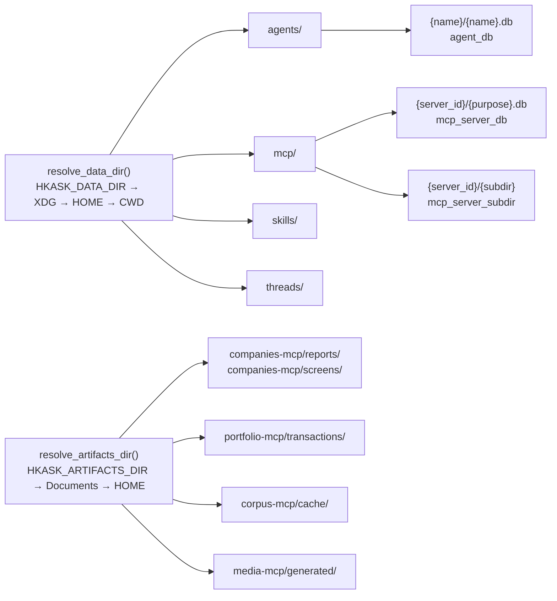
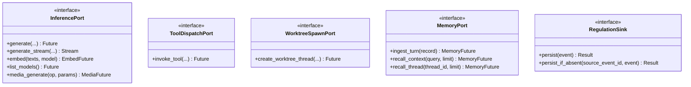
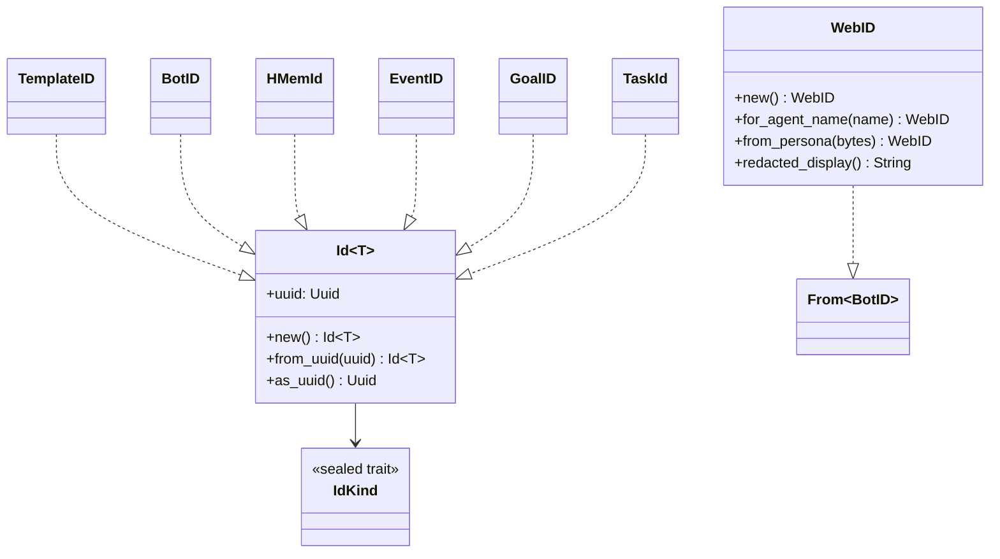

# hkask-types — Reference

`hkask-types` is the foundation crate of the hKask workspace. It defines the
shared domain types, identifier newtypes, hexagonal port traits, filesystem
path helpers, and Regulation event substrate that every downstream kask crate
depends on. The crate forbids `unsafe` code (`hkask_types.rs:1`), declares no
implementations of its own port traits, and must not depend on
`hkask-tool-port` (cycle prevention — see `Cargo.toml:13`).

## Source citations

| Symbol | Location |
|--------|----------|
| Crate root, module list | `kask/crates/hkask-types/src/hkask_types.rs:6-38` |
| `pub use ports::*` re-export | `kask/crates/hkask-types/src/hkask_types.rs:60` |
| `HMemEntry` struct | `kask/crates/hkask-types/src/hkask_types.rs:63` |
| `ExpectProposal` struct | `kask/crates/hkask-types/src/hkask_types.rs:83` |
| `AGENTS_DIR` (pub(crate)) / `MCP_DIR` / `SKILLS_DIR` / `DEFAULT_DB_PATH` | `kask/crates/hkask-types/src/agent_paths.rs:31,35,39,44` |
| `resolve_data_dir` | `kask/crates/hkask-types/src/agent_paths.rs:63` |
| `resolve_under_data_dir` | `kask/crates/hkask-types/src/agent_paths.rs:99` |
| `resolve_artifacts_dir` / `resolve_under_artifacts_dir` | `kask/crates/hkask-types/src/agent_paths.rs:120,152` |
| `agent_dir` | `kask/crates/hkask-types/src/agent_paths.rs:157` |
| `mcp_server_db` / `mcp_server_subdir` | `kask/crates/hkask-types/src/agent_paths.rs:169,188` |
| `mcp_artifacts_subdir` (visible `{server}-mcp/{type}` route) | `kask/crates/hkask-types/src/agent_paths.rs:211` |
| `agent_db` (renamed from `agent_pod_db`) | `kask/crates/hkask-types/src/agent_paths.rs:198` |
| `sanitize_name` | `kask/crates/hkask-types/src/agent_paths.rs:209` |
| `InferencePort` trait | `kask/crates/hkask-types/src/ports/inference_port.rs:147` |
| `ToolDispatchPort` trait | `kask/crates/hkask-types/src/ports/inference_port.rs:97` |
| `WorktreeSpawnPort` trait | `kask/crates/hkask-types/src/ports/inference_port.rs:135` |
| `ModelEntry` / `MediaGenerateParams` | `kask/crates/hkask-types/src/ports/inference_port.rs:77,38` |
| `EmbedFuture` / `MediaFuture` aliases | `kask/crates/hkask-types/src/ports/inference_port.rs:17,24` |
| `Arc<dyn InferencePort>` blanket impl | `kask/crates/hkask-types/src/ports/inference_port.rs:386` |
| `ChatMessage` / `InferenceError` / `InferenceUsage` / `ChatToolDefinition` / `ChatToolFunction` / `StructuredToolCall` / `InferenceResult` / `InferenceStreamChunk` | `kask/crates/hkask-types/src/ports/inference_types.rs:15,39,64,74,84,95,104,132` |
| `MemoryPort` trait | `kask/crates/hkask-types/src/ports/memory_port.rs:111` |
| `TurnRecord` / `to_chat_turn_value` | `kask/crates/hkask-types/src/ports/memory_port.rs:27,58` |
| `MemorySnippet` / `MemoryError` / `MemoryFuture` (pub(crate)) | `kask/crates/hkask-types/src/ports/memory_port.rs:75,90,98` |
| `ConsolidationRequest` / `ConsolidationOutcome` | `kask/crates/hkask-types/src/ports/regulation.rs:3,22` |
| `EmbeddingGenerationError` | `kask/crates/hkask-types/src/ports/embedding.rs:3` |
| `RegulationRecord` / `Span` / `SpanNamespace` / `SpanKind` / `SpanCategory` / `CyclePhase` / `RegulationSink` | `kask/crates/hkask-types/src/event.rs:16,623,65,670,529,715,748` |
| `CANONICAL_NAMESPACES` (private const) | `kask/crates/hkask-types/src/event.rs:75` |
| `RegulationSpan` / `QueueDepth` / `LedgerHealth` / `RegulationHealth` | `kask/crates/hkask-types/src/regulation.rs:108,29,43,69` |
| `Id<T: IdKind>` newtype + kind aliases | `kask/crates/hkask-types/src/id/core.rs:20,177-192` |
| `WebID` (agent identifier) | `kask/crates/hkask-types/src/id/webid.rs:9` |
| `InfrastructureError` / `DbError` / `McpErrorKind` / `NotFound` / `DatabaseErrorKind` | `kask/crates/hkask-types/src/error.rs:117,57,231,310,26` |
| `Visibility` / `AccessControl` / `Confidence` / `Dimension` | `kask/crates/hkask-types/src/visibility.rs:34,89,143,243` |
| `EscalationSeverity` / `CuratorDirective` / `SchemaEvolutionType` / `CurationThresholdConfig` | `kask/crates/hkask-types/src/curator.rs:20,46,143,216` |
| `DocStructure` / `Page` / `Block` | `kask/crates/hkask-types/src/document.rs:21,65,79` |
| `TaggedChunk` / `ChunkOntology` / `ExpertiseLevel` | `kask/crates/hkask-types/src/corpus.rs:133,103,20` |
| `HMemOntology` | `kask/crates/hkask-types/src/hmem_ontology.rs:35` |
| `LLMParameters` | `kask/crates/hkask-types/src/template.rs:14` |
| `VoiceDesign` | `kask/crates/hkask-types/src/voice.rs:15` |
| `TaskStatus` | `kask/crates/hkask-types/src/kanban_status.rs:24` |
| `KANBAN_SERVER_NAME` / `KANBAN_TASK_MOVE_TOOL` | `kask/crates/hkask-types/src/kanban_wire.rs:17,22` |
| `SecretRef` | `kask/crates/hkask-types/src/secret.rs:22` |
| `AnyJsonValue` / `find_boolean_schema_positions` | `kask/crates/hkask-types/src/tool_schema.rs:46,107` |
| `extract_json_from_response` | `kask/crates/hkask-types/src/json_extract.rs:47` |
| `ToolErrorEnvelope` / `unwrap_tool_envelope` / `parse_tool_response` / `parse_tool_error` | `kask/crates/hkask-types/src/tool_response.rs:30,61,53,88` |
| `now_rfc3339` / `now_rfc3339_z` | `kask/crates/hkask-types/src/time.rs:18,42` |
| `extract_youtube_id` | `kask/crates/hkask-types/src/url_utils.rs:13` |
| `InferenceRequest` / `InferenceMethod` / `InferenceParams` / `InferenceResponse` / `InferenceOutcome` | `kask/crates/hkask-types/src/inference_ipc.rs:103,115,156,237,248` |
| `BatchPromptEntry` / `BatchResultEntry` / `ModelListEntry` / `WorktreeThreadInfo` / `InferenceErrorPayload` | `kask/crates/hkask-types/src/inference_ipc.rs:79,90,303,315,322` |
| `INFERENCE_SOCKET_ENV` / `INFERENCE_TIMEOUT_ENV` | `kask/crates/hkask-types/src/inference_ipc.rs:53,71` |

## Module map

```mermaid
classDiagram
    class hkask_types {
        +forbid(unsafe_code)
        +pub use ports::*
    }
    class agent_paths
    class ports
    class event
    class id
    class regulation
    class error
    class visibility
    class curator
    class document
    class corpus
    class hmem_ontology
    class inference_ipc
    class json_extract
    class template
    class voice
    class kanban_status
    class kanban_wire
    class secret
    class tool_schema
    class tool_response
    class time
    class url_utils
    class sql_impls

    hkask_types o-- agent_paths
    hkask_types o-- ports
    hkask_types o-- event
    hkask_types o-- id
    hkask_types o-- regulation
    hkask_types o-- error
    hkask_types o-- visibility
    hkask_types o-- curator
    hkask_types o-- document
    hkask_types o-- corpus
    hkask_types o-- hmem_ontology
    hkask_types o-- inference_ipc
    hkask_types o-- json_extract
    hkask_types o-- template
    hkask_types o-- voice
    hkask_types o-- kanban_status
    hkask_types o-- kanban_wire
    hkask_types o-- secret
    hkask_types o-- tool_schema
    hkask_types o-- tool_response
    hkask_types o-- time
    hkask_types o-- url_utils
    hkask_types o-- sql_impls
```

<!-- DIAGRAM_ALIGNMENT
id: DIAG-TYPES-004
verified_date: 2026-08-28
verified_against: kask/crates/hkask-types/src/hkask_types.rs:6-38
status: VERIFIED
-->

`error`, `hmem_ontology`, and `kanban_status` are `pub(crate)` modules
(`hkask_types.rs:11,14,19`) whose key types are re-exported publicly;
`sql_impls` is behind the opt-in `sql` feature (`hkask_types.rs:35-36`,
`Cargo.toml:31-33`).

## Filesystem path model

`agent_paths.rs` regulates two rooted trees (D28 — Standardized Artifact
Storage, `agent_paths.rs:12-26`). Internal app data lives under
`resolve_data_dir()`; user-facing artifacts live under
`resolve_artifacts_dir()`.

<!-- DIAGRAM_ALIGNMENT
id: DIAG-TYPES-005
verified_date: 2026-08-28
verified_against: kask/crates/hkask-types/src/agent_paths.rs:63-89,120-154,157,167,182,198
status: VERIFIED
-->

`resolve_data_dir` (`agent_paths.rs:63`) honors `HKASK_DATA_DIR` only when
absolute or `.`-prefixed, then tries `$XDG_DATA_HOME/zed-kask`, then
`$HOME/.local/share/zed-kask`, then falls back to CWD with a `warn!`
(`agent_paths.rs:82-88`). `resolve_artifacts_dir` (`agent_paths.rs:120`)
follows the same discipline for `HKASK_ARTIFACTS_DIR` → `$XDG_DOCUMENTS_DIR/zk-data`
→ `$HOME/Documents/zk-data` → `$HOME/zk-data`. `agent_db` produces
`{name}.db` (e.g. `agents/curator/curator.db`), not `pod.db`
(`agent_paths.rs:193-201`). `sanitize_name` (`agent_paths.rs:209`) replaces
`/ \ : * ? " < > | ( )` and space with hyphens, collapses consecutive dashes,
trims leading/trailing dashes, and substitutes `"unnamed"` for names that
sanitize to `.` or `..`.

## Port trait hierarchy

The `ports` module (`ports.rs:7-11`) defines five submodules of port traits.
Each port is a `Send + Sync` trait that abstracts an infrastructure boundary.
Downstream crates implement these traits against concrete backends.

<!-- DIAGRAM_ALIGNMENT
id: DIAG-TYPES-006
verified_date: 2026-08-28
verified_against: kask/crates/hkask-types/src/ports/inference_port.rs:97,135,147; kask/crates/hkask-types/src/ports/memory_port.rs:111-146; kask/crates/hkask-types/src/event.rs:748-762
status: VERIFIED
-->

### Inference cluster

`InferencePort` (`ports/inference_port.rs:147`) abstracts LLM generation,
streaming, vision, embedding, model listing, and media generation. Companion
types: `ModelEntry` (`inference_port.rs:77`), `MediaGenerateParams`
(`inference_port.rs:38`), and the `inference_types.rs` set (`ChatMessage`,
`InferenceResult`, `InferenceUsage`, `ChatToolDefinition`,
`ChatToolFunction`, `StructuredToolCall`, `InferenceError`,
`InferenceStreamChunk` — `inference_types.rs:15-132`).
`ToolDispatchPort` (`inference_port.rs:97`) and `WorktreeSpawnPort`
(`inference_port.rs:135`) are MCP-server-side boundaries for governed tool
dispatch and worktree-backed agent spawning respectively. Both have blanket
impls for `Arc<dyn Trait>` (`inference_port.rs:118`).

### Memory cluster

`MemoryPort` (`ports/memory_port.rs:111`) abstracts turn ingestion and
snippet recall. `ingest_turn` is required (`memory_port.rs:116`);
`recall_context` (`memory_port.rs:128`) and `recall_thread`
(`memory_port.rs:146`) default to empty vecs. Companion types: `TurnRecord`
(`memory_port.rs:27`), `MemorySnippet` (`memory_port.rs:75`), `MemoryError`
(`memory_port.rs:90`), `MemoryFuture` (`memory_port.rs:98`, `pub(crate)`).

### Regulation cluster

`RegulationSink` (`event.rs:748`) persists `RegulationRecord`s;
`persist_if_absent` (`event.rs:754`) is the deduplicating variant with a
compatibility default. `ConsolidationRequest` / `ConsolidationOutcome`
(`ports/regulation.rs:3,22`) carry memory-consolidation parameters.

## Identifier newtypes

The `id/` module defines a generic `Id<T: IdKind>` newtype
(`id/core.rs:20`) parameterized by a phantom `IdKind` marker. The `IdKind`
trait (`id/core.rs:13`) is sealed by a private `Sealed` supertrait
(`id/core.rs:8`), so external crates cannot introduce new kinds. Each domain
entity gets a strongly typed alias (`id/core.rs:177-192`): `TemplateID`,
`BotID`, `HMemId`, `EventID`, `GoalID` (sql feature), `EmbeddingID`,
`UserID` (sql feature), `EscalationID`, `PhaseId`, `CommentId`, `BoardId`,
`ColumnId`, `TaskId`. `WebID` (`id/webid.rs:9`) is the agent identifier;
`for_agent_name` (`id/webid.rs:42`) is the canonical agent-name → WebID
derivation used across CLI, API, REPL, and `AgentService`.

<!-- DIAGRAM_ALIGNMENT
id: DIAG-TYPES-007
verified_date: 2026-08-28
verified_against: kask/crates/hkask-types/src/id/core.rs:8,13,20,71,81,91,177-192; kask/crates/hkask-types/src/id/webid.rs:9,42,55,78,103
status: VERIFIED
-->

## Error taxonomy

`error.rs` defines a layered error architecture. `InfrastructureError`
(`error.rs:117`, `#[non_exhaustive]` at `error.rs:116`) is the cross-crate
transport layer — `Database { message, kind }`, `Serialization`,
`LockPoisoned`, `NotFound`, `Io` — with no domain semantics and no catch-all
variant. `DbError` (`error.rs:57`) is the provider-agnostic database error
(Database, Constraint, Connection, Serialization, UnsupportedProvider).
`McpErrorKind` (`error.rs:231`) is the canonical MCP error taxonomy:
`Internal`, `Unavailable`, `Timeout`, `NotFound`, `InvalidArgument`,
`PermissionDenied`, `RateLimited`, `FailedPrecondition`.
`is_retryable` (`error.rs:261`) returns true only for `Unavailable`,
`Timeout`, `RateLimited`; `from_kind_str` (`error.rs:291`) is the inverse of
`Display` used by `tool_response::parse_tool_error`. `NotFound`
(`error.rs:310`) is the canonical rich not-found struct. The
`From<rusqlite::Error>` impl is behind the opt-in `sql` feature
(`error.rs:202-203`); callers without rusqlite construct database errors
via `InfrastructureError::database` (`error.rs:139`).

## Regulation event substrate

`event.rs` defines the cybernetic audit trail. `RegulationRecord`
(`event.rs:16`) carries `id`, `timestamp`, `observer_webid`, `span`,
`phase`, `observation`, `regulation`, `outcome`, `recursion_depth`,
`parent_event`, and `visibility`. `SpanNamespace` (`event.rs:65`) is
constructed via `SpanNamespace::new()` (`event.rs:455`) or `parse()`
(`event.rs:471`), both validating against the private
`CANONICAL_NAMESPACES` const (`event.rs:75`) — the single source of truth
for canonical Regulation spans. `TryFrom<RegulationSpan> for
SpanNamespace` (`event.rs:604`) is the typed-enum bridge onto the same
validation path. `Span` (`event.rs:623`) pairs a validated namespace with a
fully-qualified path; `SpanKind` (`event.rs:670`) enumerates canonical
(namespace, path) pairs (e.g. `ToolCompleted` → `reg.tool.completed`) and
`Span::from_kind()` constructs spans without string literals.
`SpanCategory` (`event.rs:529`) is the typed dispatch key for
span-category-dependent logic (Cybernetics, Curation, Inference, Memory,
Wallet, Skill, Unknown). `CyclePhase` (`event.rs:715`) is `Sense | Compute |
Compare | Act`. `regulation.rs` defines `QueueDepth` (`regulation.rs:29`),
`LedgerHealth` (`regulation.rs:43`), `RegulationHealth`
(`regulation.rs:69`), and `RegulationSpan` (`regulation.rs:108`).

## Inference IPC protocol

`inference_ipc.rs` defines the JSON-RPC protocol MCP server child processes
use to call back into the zed process. `InferenceRequest`
(`inference_ipc.rs:103`) pairs a correlation `id` with an `InferenceMethod`
(`inference_ipc.rs:115`) and `InferenceParams` (`inference_ipc.rs:156`).
`InferenceResponse` (`inference_ipc.rs:237`) carries an `InferenceOutcome`
(`inference_ipc.rs:248`). Batch companions: `BatchPromptEntry`
(`inference_ipc.rs:79`) and `BatchResultEntry` (`inference_ipc.rs:90`);
auxiliary payloads: `ModelListEntry` (`inference_ipc.rs:303`),
`WorktreeThreadInfo` (`inference_ipc.rs:315`), `InferenceErrorPayload`
(`inference_ipc.rs:322`). The socket path is passed via
`INFERENCE_SOCKET_ENV` = `"HKASK_INFERENCE_SOCKET"` (`inference_ipc.rs:53`)
and the timeout via `INFERENCE_TIMEOUT_ENV` =
`"HKASK_INFERENCE_TIMEOUT_SECS"` (`inference_ipc.rs:71`).

## Domain primitives

- `visibility.rs`: `Visibility` (`visibility.rs:34` — Private/Shared/Public),
  `AccessControl` (`visibility.rs:89` — bundles perspective + visibility +
  owner), `Confidence` (`visibility.rs:143` — clamped [0,1] with
  `memory_decay` at `visibility.rs:200`), `Dimension` (`visibility.rs:243`
  — 5W1H).
- `curator.rs`: `EscalationSeverity` (`curator.rs:20`), `CuratorDirective`
  (`curator.rs:46` — Curation → Cybernetics directives such as
  `CalibrateThreshold`, `UpdateCapabilities`, `OverrideEnergyBudget`),
  `SchemaEvolutionType` (`curator.rs:143`), `CurationThresholdConfig`
  (`curator.rs:216`).
- `document.rs`: `DocStructure` / `Page` / `Block`
  (`document.rs:21,65,79`) — structural document representation for the
  corpus pipeline.
- `corpus.rs`: `TaggedChunk` (`corpus.rs:133`), `ChunkOntology`
  (`corpus.rs:103`), `ExpertiseLevel` (`corpus.rs:20`).
- `hmem_ontology.rs`: `HMemOntology` (`hmem_ontology.rs:35`) — dual-axis
  ontological anchoring (DC+BIBO state axis, PKO process axis).
- `template.rs`: `LLMParameters` (`template.rs:14`) — a foundational config
  primitive.
- `voice.rs`: `VoiceDesign` (`voice.rs:15`) — structured voice profile for
  TTS generation.
- `kanban_status.rs` / `kanban_wire.rs`: `TaskStatus` (`kanban_status.rs:24`
  — Backlog→Ready→InProgress→Review→Done, with a documented Done→InProgress
  reopen exception at `kanban_status.rs:11`), `KANBAN_SERVER_NAME`
  (`kanban_wire.rs:17` = `"kata-kanban"`), `KANBAN_TASK_MOVE_TOOL`
  (`kanban_wire.rs:22`).
- `secret.rs`: `SecretRef` (`secret.rs:22` — Env/Keychain/Derived/Generated;
  `Derived` uses HKDF-SHA256 domain separation, `Generated` is debug-builds-only)
  with constructors `env`/`keychain`/`derived`/`generated`
  (`secret.rs:54,59,69,79`).
- `tool_schema.rs`: `AnyJsonValue` (`tool_schema.rs:46` — `Value` wrapper
  whose `JsonSchema` emits `{}` not `true`, for Ollama/Gemini strict-schema
  compatibility), `find_boolean_schema_positions` (`tool_schema.rs:107`).
- `json_extract.rs`: `extract_json_from_response` (`json_extract.rs:47`) —
  brace/bracket-balanced JSON extraction from LLM output (OWASP
  LLM02:2025, CWE-1336 mitigation, documented at `json_extract.rs:1-9`).
- `tool_response.rs`: `ToolErrorEnvelope` (`tool_response.rs:30`),
  `parse_tool_response` (`tool_response.rs:53`), `unwrap_tool_envelope`
  (`tool_response.rs:61`), `parse_tool_error` (`tool_response.rs:88`),
  `error_kind_from_display` (`tool_response.rs:122`),
  `is_config_gap_kind` (`tool_response.rs:147`),
  `display_hints_from_output_text` (`tool_response.rs:163`).
- `time.rs`: `now_rfc3339` (`time.rs:18`), `now_rfc3339_z` (`time.rs:42`).
- `url_utils.rs`: `extract_youtube_id` (`url_utils.rs:13`).

## Re-exports

The crate root (`hkask_types.rs:42-60`) re-exports the most-used types
(`CurationThresholdConfig`, `CuratorDirective`, `EscalationSeverity`,
`Block`, `DocStructure`, `Page`, `DatabaseErrorKind`, `DbError`,
`InfrastructureError`, `McpErrorKind`, `NotFound`, `RegulationRecord`,
`RegulationSink`, the `Id` aliases, `TaskStatus`, `LedgerHealth`,
`LLMParameters`, `AnyJsonValue`, `find_boolean_schema_positions`,
`HMemOntology`, `Confidence`, `Dimension`, `Visibility`, `VoiceDesign`) and
the entire `ports` module via `pub use ports::*;` (`hkask_types.rs:60`).
Downstream crates depend on `hkask-types` and receive all port traits,
identifier newtypes, and domain types through this single dependency.

## See also

- [hkask-types Explanation](./explanation.md): why the foundation crate is
  structured this way.
- [hkask-types Tutorial](./tutorial.md): reading the foundation crate.
- [hkask-types How-to](./how-to.md): adding a new path helper or port trait.
- [`kask/docs/architecture/core/PRINCIPLES.md`](../../architecture/core/PRINCIPLES.md):
  P5.4 dual-axis ontology (PKO + DC+BIBO) that grounds the domain types.

---

[^hexagonal]: Cockburn, A. (2005). *Hexagonal Architecture.* <https://alistair.cockburn.us/hexagonal-architecture/>. The ports-and-adapters pattern that the `ports/` module implements: core logic depends on traits, infrastructure provides implementations.

[^newtype]: Rust Community. (2024). *Rust API Guidelines — Newtype Pattern.* <https://rust-lang.github.io/api-guidelines/type-conventions.html#c-newtype>. The `Id<T: IdKind>` newtype pattern that prevents identifier confusion at compile time.
