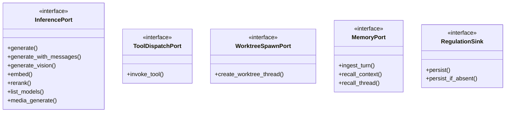
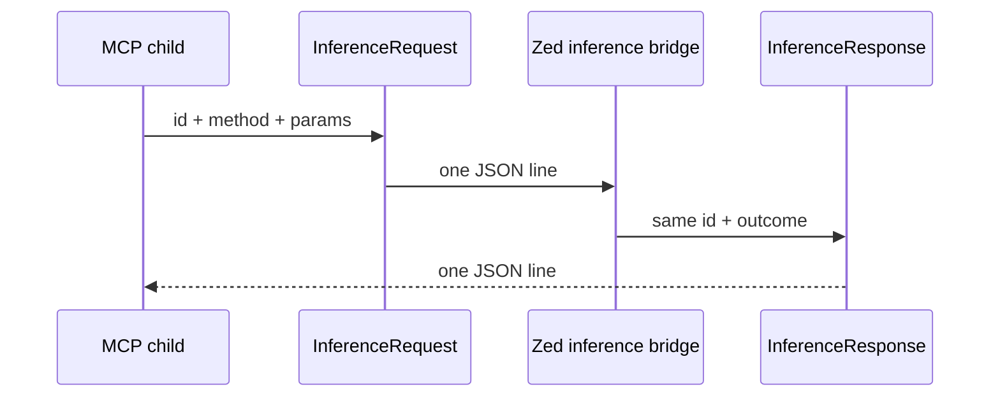
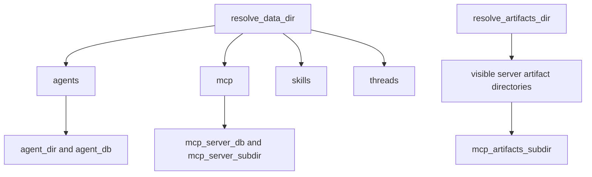

# hkask-types — Reference

`hkask-types` defines shared value types, identifiers, ports, paths, event and IPC
envelopes, resource limits, and cross-process contracts. The crate forbids unsafe
code at `kask/crates/hkask-types/src/hkask_types.rs:1` and follows the ports and
adapters pattern.[^hexagonal] Its generic identifiers use Rust's newtype discipline
to prevent cross-domain identifier confusion.[^newtype]

## Module inventory

The crate root is authoritative at
`kask/crates/hkask-types/src/hkask_types.rs:6-50`.

```mermaid
classDiagram
    class hkask_types
    class agent_paths
    class block_provenance
    class corpus
    class curator
    class document
    class error
    class event
    class hmem_ontology
    class id
    class inference_ipc
    class json_extract
    class kanban_status
    class kanban_wire
    class media_limits
    class ocr_health
    class ytdlp
    class regulation
    class secret
    class server_env
    class spreadsheet
    class template
    class ports
    class process_global
    class time
    class tool_response
    class tool_schema
    class voice
    class sql_impls
    class url_utils
    class visibility
    hkask_types o-- agent_paths
    hkask_types o-- block_provenance
    hkask_types o-- corpus
    hkask_types o-- curator
    hkask_types o-- document
    hkask_types o-- error
    hkask_types o-- event
    hkask_types o-- hmem_ontology
    hkask_types o-- id
    hkask_types o-- inference_ipc
    hkask_types o-- json_extract
    hkask_types o-- kanban_status
    hkask_types o-- kanban_wire
    hkask_types o-- media_limits
    hkask_types o-- ocr_health
    hkask_types o-- ytdlp
    hkask_types o-- regulation
    hkask_types o-- secret
    hkask_types o-- server_env
    hkask_types o-- spreadsheet
    hkask_types o-- template
    hkask_types o-- ports
    hkask_types o-- process_global
    hkask_types o-- time
    hkask_types o-- tool_response
    hkask_types o-- tool_schema
    hkask_types o-- voice
    hkask_types o-- sql_impls
    hkask_types o-- url_utils
    hkask_types o-- visibility
```

<!-- DIAGRAM_ALIGNMENT
id: DIAG-TYPES-004
verified_date: 2026-09-19
verified_against: kask/crates/hkask-types/src/hkask_types.rs:6-50
status: VERIFIED
-->

`error`, `hmem_ontology`, and `kanban_status` are crate-private modules whose common
items are re-exported; `sql_impls` is feature-gated
(`kask/crates/hkask-types/src/hkask_types.rs:11-19,41-42,46-66`).

## Foundation modules

| Module | Principal surface | Evidence |
|---|---|---|
| `agent_paths` | internal-data and user-artifact roots, relative layout helpers, name sanitation | `kask/crates/hkask-types/src/agent_paths.rs:12-26,63-232` |
| `corpus` | `ExpertiseLevel`, `ChunkOntology`, `TaggedChunk` | `kask/crates/hkask-types/src/corpus.rs:20-151` |
| `curator` | escalation severity, directives, schema evolution, threshold config | `kask/crates/hkask-types/src/curator.rs:20-229` |
| `document` | `DocStructure`, `Page`, `Block` | `kask/crates/hkask-types/src/document.rs:21-98` |
| `error` | `DatabaseErrorKind`, `DbError`, `InfrastructureError`, `McpErrorKind`, `NotFound` | `kask/crates/hkask-types/src/error.rs:26-74,116-203,231-318` |
| `hmem_ontology` | `HMemOntology` | `kask/crates/hkask-types/src/hmem_ontology.rs:35-75` |
| `id` | sealed `Id<T>` aliases and `WebID` | `kask/crates/hkask-types/src/id/core.rs:8-188`; `kask/crates/hkask-types/src/id/webid.rs:9-107` |
| `json_extract` | balanced JSON extraction from model output; property tests and Kani proofs (2026-09-16) cover the extraction core | `kask/crates/hkask-types/src/json_extract.rs:47,231-269` |
| `kanban_status` / `kanban_wire` | task lifecycle and server/tool wire constants | `kask/crates/hkask-types/src/kanban_status.rs:11-71`; `kask/crates/hkask-types/src/kanban_wire.rs:17-22` |
| `template` | `LLMParameters` | `kask/crates/hkask-types/src/template.rs:14-85` |
| `time` | RFC 3339 timestamp helpers | `kask/crates/hkask-types/src/time.rs:18-44` |
| `tool_response` | tool envelopes, parsing, error classification, display hints | `kask/crates/hkask-types/src/tool_response.rs:30-188` |
| `tool_schema` | `AnyJsonValue` and boolean-schema inspection | `kask/crates/hkask-types/src/tool_schema.rs:46-147` |
| `url_utils` | YouTube ID extraction | `kask/crates/hkask-types/src/url_utils.rs:13-35` |
| `visibility` | visibility, access control, confidence, and 5W1H dimension | `kask/crates/hkask-types/src/visibility.rs:34-269` |
| `voice` | `VoiceDesign` | `kask/crates/hkask-types/src/voice.rs:15-63` |

## Shared invariant modules

| Module | Contract | Evidence |
|---|---|---|
| `media_limits` | concat, sequence, frame, variant, job-list, and workflow admission limits; reject rather than truncate | `kask/crates/hkask-types/src/media_limits.rs:1-24` |
| `ocr_health` | bounded `OcrHealthSnapshot` and canonical health-file path | `kask/crates/hkask-types/src/ocr_health.rs:11-71` |
| `server_env` | canonical MCP child environment wrapper | `kask/crates/hkask-types/src/server_env.rs:19-59` |
| `process_global` | re-settable clone-out-of-lock, poison-recovering hook slot | `kask/crates/hkask-types/src/process_global.rs:35-77` |

## Port surface

The `ports` module re-exports the current port and companion types at
`kask/crates/hkask-types/src/ports.rs:7-23`; the crate root re-exports the module at
`kask/crates/hkask-types/src/hkask_types.rs:66`.

<!-- DIAGRAM_ALIGNMENT
id: DIAG-TYPES-006
verified_date: 2026-09-16
verified_against: kask/crates/hkask-types/src/ports/inference_port.rs:100-161,161-380; kask/crates/hkask-types/src/ports/memory_port.rs:95-147; kask/crates/hkask-types/src/event.rs:536-552
status: VERIFIED
-->

| Cluster | Types | Evidence |
|---|---|---|
| Inference values | `ChatMessage`, `InferenceError`, `InferenceUsage` (with the `reported` flag), `ChatToolDefinition`, `ChatToolFunction`, `StructuredToolCall`, `InferenceResult`, `InferenceStreamChunk` | `kask/crates/hkask-types/src/ports/inference_types.rs:15-164` |
| Inference port | `EmbedFuture`, `MediaFuture`, `RerankFuture`, `MediaGenerateParams`, `ModelEntry`, `InferencePort` | `kask/crates/hkask-types/src/ports/inference_port.rs:11-98,161-380` |
| Tool/worktree ports | `ToolDispatchPort`, `WorktreeSpawnPort` | `kask/crates/hkask-types/src/ports/inference_port.rs:100-159` |
| Memory | `TurnRecord`, `GoalEvent`, `MemorySnippet`, `MemoryError`, `MemoryPort` | `kask/crates/hkask-types/src/ports/memory_port.rs:19-147` |
| Embedding | `EmbeddingGenerationError` | `kask/crates/hkask-types/src/ports/embedding.rs:3-14` |
| Consolidation | `ConsolidationRequest`, `ConsolidationOutcome` | `kask/crates/hkask-types/src/ports/regulation.rs:3-27` |

## Event and Regulation surface

| Type | Contract | Evidence |
|---|---|---|
| `RegulationRecord` | observer, span, phase, observation, optional regulation/outcome, parent, visibility | `kask/crates/hkask-types/src/event.rs:14-28` |
| `SpanNamespace` | validated namespace wrapper | `kask/crates/hkask-types/src/event.rs:59-75` |
| `SpanCategory` | Cybernetics, Curation, Inference, Memory, Skill, Unknown | `kask/crates/hkask-types/src/event.rs:298-358` |
| `Span` | validated namespace plus full path | `kask/crates/hkask-types/src/event.rs:399-444` |
| `SpanKind` | canonical reusable event pairs, including inference transition/recovery | `kask/crates/hkask-types/src/event.rs:446-499` |
| `CyclePhase` | Sense, Compute, Compare, Act | `kask/crates/hkask-types/src/event.rs:503-521` |
| `RegulationSink` | persistence and source-ID dedup port | `kask/crates/hkask-types/src/event.rs:536-552` |
| `LedgerHealth`, `RegulationHealth`, `RegulationSpan` | Regulation measurements and typed namespace source | `kask/crates/hkask-types/src/regulation.rs:29-120` |

## Inference IPC surface

The protocol is newline-delimited JSON between MCP child processes and the Zed
inference bridge (`kask/crates/hkask-types/src/inference_ipc.rs:1-47`).

<!-- DIAGRAM_ALIGNMENT
id: DIAG-TYPES-010
verified_date: 2026-09-16
verified_against: kask/crates/hkask-types/src/inference_ipc.rs:1-47,53-120,122-278
status: VERIFIED
-->

| Surface | Current members | Evidence |
|---|---|---|
| Environment | `INFERENCE_SOCKET_ENV`, `TOOL_GRANT_ENV`, `INFERENCE_TIMEOUT_ENV` | `kask/crates/hkask-types/src/inference_ipc.rs:53-73` |
| Request envelope | `InferenceRequest { id, method, params }` | `kask/crates/hkask-types/src/inference_ipc.rs:75-84` |
| Methods | Generate, GenerateWithModel, GenerateWithMessages, GenerateVision, Embed, ListModels, ToolInvoke, CreateWorktreeThread, Rerank | `kask/crates/hkask-types/src/inference_ipc.rs:86-120` |
| Parameters | prompts/messages/images/model/tools, embedding, governed tool, worktree, and rerank fields | `kask/crates/hkask-types/src/inference_ipc.rs:122-179` |
| Response envelope | `InferenceResponse { id, outcome }` | `kask/crates/hkask-types/src/inference_ipc.rs:181-189` |
| Outcomes | Result, Embeddings, ModelList, ToolResult, WorktreeThread, RerankScores, Error | `kask/crates/hkask-types/src/inference_ipc.rs:191-237` |
| Auxiliary payloads | `RerankScoreEntry`, `ModelListEntry`, `WorktreeThreadInfo`, `InferenceErrorPayload` | `kask/crates/hkask-types/src/inference_ipc.rs:239-278` |

There are no batch companion envelopes in the current IPC surface. Multi-text
embedding and multi-document reranking are fields on `InferenceParams`, preserving
one correlation identity per request
(`kask/crates/hkask-types/src/inference_ipc.rs:131-135,167-178`).

## Filesystem path model

<!-- DIAGRAM_ALIGNMENT
id: DIAG-TYPES-005
verified_date: 2026-09-16
verified_against: kask/crates/hkask-types/src/agent_paths.rs:12-26,31-44,63-232
status: VERIFIED
-->

`resolve_data_dir` and `resolve_artifacts_dir` are the two root regulators;
relative layout helpers compose beneath them
(`kask/crates/hkask-types/src/agent_paths.rs:63-232`). User-controlled segments
pass through `sanitize_name` at
`kask/crates/hkask-types/src/agent_paths.rs:209-232`.

## Identifier model

`Id<T: IdKind>` is a sealed phantom-generic newtype
(`kask/crates/hkask-types/src/id/core.rs:8-36`). Current aliases are declared at
`kask/crates/hkask-types/src/id/core.rs:174-188`. `WebID` supplies the stable
agent identity and deterministic `for_agent_name` derivation
(`kask/crates/hkask-types/src/id/webid.rs:9-64`).

## See also

- [Why hkask-types splits boundary contracts by failure domain](./explanation.md)
- [How to extend a foundation boundary](./how-to.md)
- [Architecture principles](../../architecture/core/PRINCIPLES.md)

---

[^hexagonal]: Cockburn, A. (2005). *Hexagonal Architecture.* <https://alistair.cockburn.us/hexagonal-architecture/>.
[^newtype]: Rust Community. (2024). *Rust API Guidelines — Newtype Pattern.* <https://rust-lang.github.io/api-guidelines/type-conventions.html#c-newtype>.
