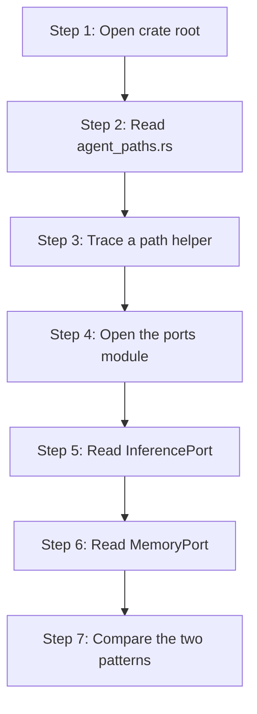

# hkask-types — Tutorial: Reading the Foundation Crate

This tutorial walks a newcomer through `hkask-types`, the foundation crate of
the hKask workspace. You will learn how the crate is laid out, how its path
helpers compute storage locations across two rooted trees (internal data and
user-facing artifacts), and how its port traits mediate between kask and zed.
By the end you will be able to navigate the crate and predict where any shared
type lives.

## Learning path

<!-- DIAGRAM_ALIGNMENT
id: DIAG-TYPES-001
verified_date: 2026-08-28
verified_against: kask/crates/hkask-types/src/hkask_types.rs:6-60; kask/crates/hkask-types/src/agent_paths.rs:63,120; kask/crates/hkask-types/src/ports.rs:1-24; kask/crates/hkask-types/src/ports/inference_port.rs:147; kask/crates/hkask-types/src/ports/memory_port.rs:111
status: VERIFIED
-->

## Step 1: Open the crate root

Open `kask/crates/hkask-types/src/hkask_types.rs`. The crate root declares
every module and re-exports the most-used types. The public modules are
`agent_paths`, `corpus`, `curator`, `document`, `event`, `id`,
`inference_ipc`, `json_extract`, `kanban_wire`, `ports`, `regulation`,
`secret`, `template`, `time`, `tool_response`, `tool_schema`, `url_utils`,
`visibility`, and `voice` (`hkask_types.rs:6-38`). Three modules are
`pub(crate)` but still surface through re-exports: `error`
(`hkask_types.rs:11`), `hmem_ontology` (`hkask_types.rs:14`), and
`kanban_status` (`hkask_types.rs:19`). One module is feature-gated:
`sql_impls`, behind the opt-in `sql` feature (`hkask_types.rs:35-36`).

The `pub use ports::*;` line at `hkask_types.rs:60` re-exports every port
trait, so downstream crates import `InferencePort` or `MemoryPort` directly
from `hkask_types::` without naming the `ports::` submodule.

The crate forbids `unsafe` code (`#![forbid(unsafe_code)]` at
`hkask_types.rs:1`) and declares no implementations of its own port traits.
It defines abstractions; implementations live in `kask_bridge`,
`hkask-storage`, and `hkask-regulation`.

## Step 2: Read agent_paths.rs

Open `kask/crates/hkask-types/src/agent_paths.rs`. This module is the single
regulator for where kask artifacts land on disk — across **two** rooted trees
per the D28 Standardized Artifact Storage plan
(`agent_paths.rs:12-26`):

- **Internal data dir** — `resolve_data_dir` (`agent_paths.rs:63`) resolves
  `HKASK_DATA_DIR` (only when absolute or `.`-prefixed), then
  `$XDG_DATA_HOME/zed-kask`, then `$HOME/.local/share/zed-kask`, then the
  current working directory with a `warn!`. Class subdirs: `agents/`,
  `mcp/`, `skills/`, `threads/`.
- **Artifacts dir** — `resolve_artifacts_dir` (`agent_paths.rs:120`) resolves
  `HKASK_ARTIFACTS_DIR` (absolute or `.`-prefixed only), then
  `$XDG_DOCUMENTS_DIR/zk-data`, then `$HOME/Documents/zk-data`, then
  `$HOME/zk-data`. This is where user-facing output (reports, screens)
  lives, deliberately separate from hidden app data (`agent_paths.rs:106-110`).

Only two class-directory constants are public: `MCP_DIR`
(`agent_paths.rs:35`) and `SKILLS_DIR` (`agent_paths.rs:39`). `AGENTS_DIR`
is `pub(crate)` (`agent_paths.rs:31`). The primary
database file `hkask.db` (`agent_paths.rs:44`).

## Step 3: Trace a path helper

Follow how `agent_db("curator")` resolves. `agent_db`
(`agent_paths.rs:198`) calls `agent_dir(name)` (`agent_paths.rs:157`), which
joins `AGENTS_DIR` with `sanitize_name(name)`. `sanitize_name`
(`agent_paths.rs:209`) replaces filesystem-hostile characters with hyphens,
collapses consecutive dashes, trims leading/trailing dashes, and guards
against `.`/`..` path traversal by substituting `"unnamed"`. The result is
`agents/curator/curator.db` — the on-disk filename is
`{sanitized_name}.db`, not `pod.db` (the rename from `agent_pod_db` is
recorded at `agent_paths.rs:195-197`).

The same pattern produces `mcp_server_db` (`agent_paths.rs:167` →
`mcp/{server_id}/{purpose}.db`) and `mcp_server_subdir`
(`agent_paths.rs:182` → `mcp/{server_id}/{subdir}` for non-DB artifacts).
All helpers return **relative** paths; the caller resolves them against a
root via `resolve_under_data_dir` (`agent_paths.rs:99`) or
`resolve_under_artifacts_dir` (`agent_paths.rs:152`). The layout contract is
pinned by tests at `agent_paths.rs:241-313` (e.g.
`agent_db_follows_agents_class_layout` at `agent_paths.rs:252`).

## Step 4: Open the ports module

Open `kask/crates/hkask-types/src/ports.rs` (a flat module file — the crate
follows the no-`mod.rs` convention). The module header states the hexagonal
intent: port traits let crates depend on abstractions rather than concrete
implementations (`ports.rs:1-5`). Five submodules — `embedding`,
`inference_port`, `inference_types`, `memory_port`, `regulation`
(`ports.rs:7-11`) — each own a cluster of related traits and companion
types, re-exported at `ports.rs:13-24`.

## Step 5: Read InferencePort

Open `kask/crates/hkask-types/src/ports/inference_port.rs:147`. The
`InferencePort` trait is `Send + Sync` and exposes generation, streaming,
vision, embedding, model listing, and media generation. Every async method
returns `Pin<Box<dyn Future + Send>>` via named aliases such as
`EmbedFuture` (`inference_port.rs:17`) and `MediaFuture`
(`inference_port.rs:24`) — a deliberate object-safety choice that lets
callers hold `Arc<dyn InferencePort>` directly, with a blanket delegating
impl at `inference_port.rs:386`. Companion types in the same file:
`MediaGenerateParams` (`inference_port.rs:38`), `ModelEntry`
(`inference_port.rs:77`).

Two further traits live in this file: `ToolDispatchPort`
(`inference_port.rs:97`) lets a child MCP server invoke governed MCP tools
that live in the zed process, and `WorktreeSpawnPort`
(`inference_port.rs:135`) lets a child spawn processes in the worktree.
Both have blanket impls for `Arc<dyn Trait>` (`inference_port.rs:118`) so
callers can hold a shared handle. The request/response shapes
(`ChatMessage`, `InferenceResult`, `InferenceUsage`, `ChatToolDefinition`,
`StructuredToolCall`, `InferenceStreamChunk`) live in
`ports/inference_types.rs:15-132`.

## Step 6: Read MemoryPort

Open `kask/crates/hkask-types/src/ports/memory_port.rs:111`. The
`MemoryPort` trait exposes `ingest_turn` (required,
`memory_port.rs:116`) plus `recall_context` (`memory_port.rs:128`) and
`recall_thread` (`memory_port.rs:146`), both default-implemented to return
empty vecs — graceful degradation when no store is configured. The
companion `TurnRecord` (`memory_port.rs:27`) carries the turn fields;
`to_chat_turn_value` (`memory_port.rs:58`) serializes it to the h_mem
`value` JSON schema. `MemoryFuture` is a `pub(crate)` alias
(`memory_port.rs:98`) used in the trait signatures.

## Step 7: Compare the two patterns

Both `InferencePort` and `MemoryPort` follow the same shape: the trait is
declared in `hkask-types`, the implementation lives in `kask_bridge`, and
the wiring happens in a deferred task in `main.rs`. This is the hexagonal
architecture applied at the crate boundary — core depends on traits,
infrastructure provides adapters, and the composition root stitches them
together.[^cockburn]

## See also

- [hkask-types Reference](./reference.md): class diagram of every port and
  companion type.
- [hkask-types Explanation](./explanation.md): why the foundation crate is
  structured this way.
- [hkask-types How-to](./how-to.md): adding a new path helper or port trait.

---

[^cockburn]: Cockburn, A. (2005). *Hexagonal Architecture.* <https://alistair.cockburn.us/hexagonal-architecture/>. The ports-and-adapters pattern that this tutorial demonstrates.
