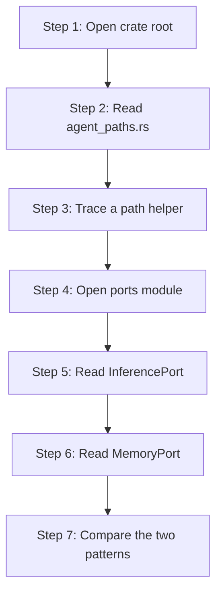

# hkask-types — Tutorial: Reading the Foundation Crate

This tutorial walks a newcomer through `hkask-types`, the foundation crate of
the hKask workspace. You will learn how the crate is laid out, how its path
helpers compute per-agent storage locations, and how its port traits mediate
between kask and zed. By the end you will be able to navigate the crate and
predict where any shared type lives.

## Learning path

<!-- DIAGRAM_ALIGNMENT
id: DIAG-TYPES-001
verified_date: 2026-08-13
verified_against: kask/crates/hkask-types/src/hkask_types.rs:6; kask/crates/hkask-types/src/agent_paths.rs:62; kask/crates/hkask-types/src/ports/mod.rs:1; kask/crates/hkask-types/src/ports/inference_port.rs:212; kask/crates/hkask-types/src/ports/memory_port.rs:113
status: VERIFIED
-->

## Step 1: Open the crate root

Open `kask/crates/hkask-types/src/hkask_types.rs`. The crate root declares
every public module (`agent_paths`, `corpus`, `crypto`, `curator`,
`document`, `error`, `event`, `id`, `inference_ipc`, `ports`, `regulation`,
`visibility`, `voice`, and others) and re-exports the most-used types. The
`pub use ports::*;` line at `hkask_types.rs:66` re-exports every port trait,
so downstream crates import `InferencePort` or `MemoryPort` directly from
`hkask_types::` without naming the `ports::` submodule.

The crate forbids `unsafe` code (`#![forbid(unsafe_code)]` at
`hkask_types.rs:1`) and declares no implementations of its own port traits.
It defines abstractions; implementations live in `kask_bridge`,
`hkask-storage`, and `hkask-regulation`.

## Step 2: Read agent_paths.rs

Open `kask/crates/hkask-types/src/agent_paths.rs`. This module is the single
regulator for where per-agent files land on disk. It defines four class
directory constants — `AGENTS_DIR` (`agent_paths.rs:25`), `MCP_DIR`
(`agent_paths.rs:29`), `SKILLS_DIR` (`agent_paths.rs:34`), and `THREADS_DIR`
(`agent_paths.rs:38`) — and a set of path helpers that compose them.

The data directory itself is resolved by `resolve_data_dir`
(`agent_paths.rs:62`), which honors `HKASK_DATA_DIR` (only when absolute or
`.`-prefixed), then `$XDG_DATA_HOME/hkask`, then `$HOME/.local/share/hkask`,
then the current working directory with a `warn!`. Every other helper
delegates to this one through `resolve_under_data_dir` (`agent_paths.rs:98`),
so the fallback chain has exactly one regulator.

## Step 3: Trace a path helper

Follow how `agent_db("curator")` resolves. `agent_db` (`agent_paths.rs:146`)
calls `agent_dir(name)` (`agent_paths.rs:103`), which joins `AGENTS_DIR` with
`sanitize_name(name)`. `sanitize_name` (`agent_paths.rs:180`) replaces
filesystem-hostile characters with hyphens, collapses consecutive dashes, and
guards against `.`/`..` path traversal by substituting `"unnamed"`. The
result is `agents/curator/curator.db` — the on-disk filename is
`{sanitized_name}.db`, not `pod.db`.

The same pattern produces `agent_memory_db` (`agent_memory_db.rs:152` →
`agents/{name}/memory.db`), `mcp_server_db` (`agent_paths.rs:113` →
`mcp/{server_id}/{purpose}.db`), `skills_dir` (`agent_paths.rs:125` →
`skills/`), and `threads_db_path` (`agent_paths.rs:135` →
`threads/threads.db`). `ensure_agent_dirs` (`agent_paths.rs:170`) creates the
agent root on disk during provisioning; it no longer scaffolds subdirectories
that no production code reads.

## Step 4: Open the ports module

Open `kask/crates/hkask-types/src/ports/mod.rs`. The module header states the
hexagonal intent: port traits let crates depend on abstractions rather than
concrete implementations. Six submodules — `embedding`, `inference_port`,
`inference_types`, `memory_port`, `registry`, `regulation` — each own a
cluster of related traits and companion types.

## Step 5: Read InferencePort

Open `kask/crates/hkask-types/src/ports/inference_port.rs:212`. The
`InferencePort` trait is `Send + Sync` and exposes `generate`,
`generate_with_model`, `generate_with_messages`, `generate_stream*`,
`generate_vision`, `embed`, `list_models`, `list_vision_models`, and
`media_generate`. Every async method returns `Pin<Box<dyn Future + Send>>`
rather than using `async_trait` — the trait-level comment explains this is a
deliberate object-safety choice. Companion types in the same file
(`ModelEntry` at `inference_port.rs:73`, `MediaGenerateParams` at
`inference_port.rs:40`, `InferenceStreamChunk`) and in `inference_types.rs`
(`ChatMessage`, `InferenceResult`, `InferenceUsage`, `ChatToolDefinition`,
`StructuredToolCall`) carry the request and response shapes.

Two further traits live in this file: `ToolDispatchPort`
(`inference_port.rs:94`) lets a child MCP server invoke governed MCP tools
that live in the zed process, and `WorktreeSpawnPort`
(`inference_port.rs:85`) lets a child spawn processes in the worktree.
Both have blanket impls for `Arc<dyn Trait>` so callers can hold a shared handle.

## Step 6: Read MemoryPort

Open `kask/crates/hkask-types/src/ports/memory_port.rs:113`. The `MemoryPort`
trait exposes `ingest_turn` (required) plus `recall_context` and
`recall_thread` (default-implemented to return empty vecs — graceful
degradation when no store is configured). The companion `TurnRecord`
(`memory_port.rs:29`) carries `thread_id`, `user_input`, `agent_response`,
`model`, `thread_title`, and `agent_id`; `to_chat_turn_value`
(`memory_port.rs:62`) serializes it to the h_mem `value` JSON schema. The
read side (recall) reads `h_mem.value` as raw JSON — there is no typed
projection struct on the read side.

## Step 7: Compare the two patterns

Both `InferencePort` and `MemoryPort` follow the same shape: the trait is
declared in `hkask-types`, the implementation lives in `kask_bridge`, and the
wiring happens in a deferred task in `main.rs`. This is the hexagonal
architecture applied at the crate boundary — core depends on traits,
infrastructure provides adapters, and the composition root stitches them
together.[^cockburn]

## See also

- [hkask-types Reference](./reference.md): class diagram of every port and
  companion type.
- [hkask-types Explanation](./explanation.md): why the foundation crate is
  structured this way.
- [hkask-types How-to](./how-to.md): adding a new path helper or port trait.

---

[^cockburn]: Cockburn, A. (2005). *Hexagonal Architecture.* <https://alistair.cockburn.us/hexagonal-architecture/>. The ports-and-adapters pattern that this tutorial demonstrates.
