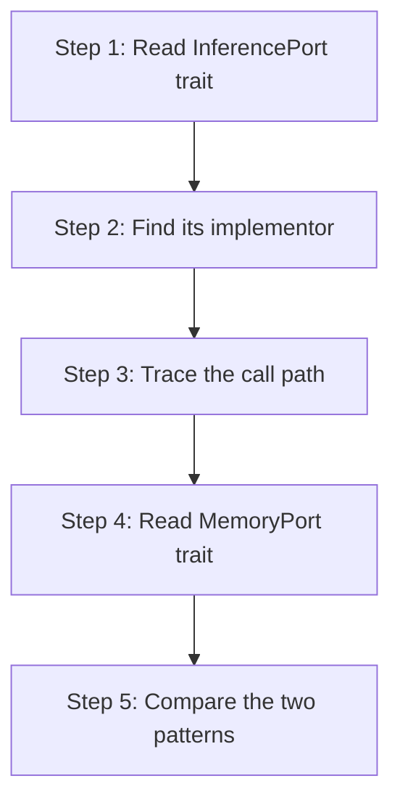

# hkask-types — Tutorial: Understanding the Port Traits

This tutorial introduces the hexagonal port traits that `hkask-types`
defines. You will learn what a port trait is, how it mediates between kask
and zed, and how to read the trait hierarchy. By the end, you will
understand why `InferencePort` and `MemoryPort` exist
and where their implementations live.

## Learning path

<!-- DIAGRAM_ALIGNMENT
id: DIAG-DIA-TYPES-003
verified_date: 2026-07-29
verified_against: kask/crates/hkask-types/src/ports/inference_port.rs:86; kask/crates/hkask-types/src/ports/memory_port.rs:108
status: VERIFIED
-->

## Steps 1-2: Read InferencePort and find its implementor

Open `kask/crates/hkask-types/src/ports/inference_port.rs:86`. The
`InferencePort` trait defines three methods: `generate` (single-prompt),
`generate_with_model` (with optional model override), and
`generate_with_messages` (multi-turn with a `ChatMessage` array). All return
pinned boxed futures because inference is asynchronous.

Search for implementors with `grep -rn "impl InferencePort for"`. The
primary implementor is `LanguageModelInferencePort` at
`kask/crates/kask_bridge/src/inference.rs:246`, which wraps zed's
`LanguageModel`.

## Steps 3-4: Trace the call path and read MemoryPort

Follow the call path: a skill calls `InferencePort::generate`, which hits
`LanguageModelInferencePort`, which calls zed's
`LanguageModel::stream_completion`. The port trait is the boundary; the
adapter is the bridge.

Now open `kask/crates/hkask-types/src/ports/memory_port.rs:108`. The
`MemoryPort` trait defines `ingest_turn`, `recall_context`, and
`recall_thread`. Its implementors are `LoggingMemoryPort` (no-op placeholder)
and `RealMemoryPort` (SQLite-backed), both in `kask/crates/kask_bridge/src/memory.rs`.

## Step 5: Compare the two patterns

Both `InferencePort` and `MemoryPort` follow the same pattern: the trait is
defined in `hkask-types`, the implementation is in `kask_bridge`, and the
wiring happens in the deferred task in `main.rs`. This is the hexagonal
architecture: core depends on traits, infrastructure provides adapters.

## See also

- [hkask-types Reference](./reference.md): class diagram of all 10 ports.
- [hkask-types Explanation](./explanation.md): why the ports exist.
- [hkask-types How-to](./how-to.md): implementing a new port.

---

[^cockburn]: Cockburn, A. (2005). *Hexagonal Architecture.* <https://alistair.cockburn.us/hexagonal-architecture/>. The ports-and-adapters pattern that this tutorial demonstrates.
