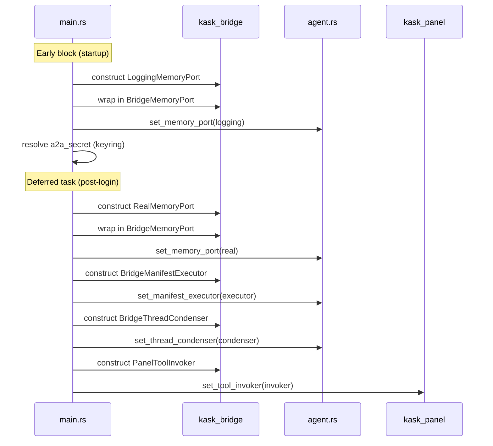

# kask_bridge — Explanation

The composition root is the single place where zed and hKask are wired
together. It runs in two phases inside `crates/zed/src/main.rs`: an early
block that wires the `a2a_secret` and a logging `BridgeMemoryPort` before
any thread can complete a turn, and a deferred task that runs after the zed
user resolves and a default language model becomes available. The
model-dependent hooks (`set_manifest_executor`, `set_thread_condenser`,
`set_tool_invoker`) are wired in the deferred task. The design centralizes
the integration so that the seams are visible in one file rather than
scattered across the codebase.

## Source citations

| Symbol | Location |
|--------|----------|
| Early-block memory wiring | `crates/zed/src/main.rs:756` |
| Deferred-task manifest wiring | `crates/zed/src/main.rs:1727` |
| Deferred-task memory upgrade | `crates/zed/src/main.rs:1148` |
| Deferred-task panel tool invoker | `crates/zed/src/main.rs:1523` |
| `set_manifest_executor` | `crates/agent/src/agent.rs:2781` |
| `set_memory_port` | `crates/agent/src/agent.rs:2860` |
| `set_thread_condenser` | `crates/agent/src/agent.rs:2995` |
| `set_tool_invoker` (panel) | `crates/kask_panel/src/kask_panel.rs:106` |
| `BridgeManifestExecutor` | `kask/crates/kask_bridge/src/skill_executor.rs:30` |
| `BridgeToolPort` | `kask/crates/kask_bridge/src/tool_port.rs:25` |
| `BridgeMemoryPort` | `kask/crates/kask_bridge/src/memory.rs:1474` |

## Composition root sequence

The sequence below shows the two-phase wiring. The early block runs at
startup (before user auth); the deferred task runs after the zed user
resolves. `set_memory_port` uses a `Mutex` (re-settable), so the early
logging port is upgraded in place by the deferred task. The other hooks use
`OnceLock` (set once).

<!-- DIAGRAM_ALIGNMENT
id: DIAG-DIA-BRIDGE-002
verified_date: 2026-07-29
verified_against: crates/zed/src/main.rs:756,1148,1727,1523; crates/agent/src/agent.rs:2781,2860,2995; crates/kask_panel/src/kask_panel.rs:106
status: VERIFIED
-->

## Why deferred wiring

The model-dependent hooks depend on
`LanguageModelRegistry::default_model()` being populated. At startup,
before user authentication, `default_model()` returns `None`. Wiring the
hooks synchronously at startup would leave them unwired for the entire
session when no model is configured at startup. The deferred task runs
after the zed user resolves, ensuring the model is available.

If the deferred task fails to find a model, the hooks remain `None` and the
`skill` tool returns a no-op envelope. This fail-closed behavior is
intentional. A missing model should not silently produce broken skill
output.

## Why OnceLock hooks (and one Mutex)

The `set_*` functions use `static ONCE_LOCK: OnceLock<Option<Arc<dyn Trait>>>`.
The `OnceLock` ensures the hook is set exactly once per process. The
`Option` allows the hook to be absent (fail-closed). The `Arc` allows the
hook to be shared across threads.

`set_memory_port` (`agent.rs:2860`) is the exception: it uses a `Mutex`
rather than a `OnceLock`, because the composition root installs a
`LoggingMemoryPort` at startup and upgrades it to a `RealMemoryPort` once
the zed user resolves. The `Mutex` allows the second `set_memory_port`
call to replace the value in place.

This pattern has a trap: if the condition for wiring fails silently, the
hook is left `None` with no signal. The `.rules` file documents this:
every `set_*` hook that is wired conditionally must `log::warn!` when the
condition fails, so operators can distinguish "not configured" from
"configured but broken." When a deferred task wires multiple `set_*` hooks
inside a single `if` block, the `else` branch warn must name ALL hooks
left unwired, not just one.

## The GPUI/tokio cybernetic boundary

The bridge is where two feedback loops cross. GPUI runs on a single
foreground thread (not `Send`); hKask's `ManifestExecutor` and `ToolPort`
run on tokio (`Send + Sync`). The `LanguageModelInferencePort`
(`inference.rs:46`) solves this with a `tokio::sync::mpsc` channel: the
adapter holds only an `UnboundedSender` (which is `Send + Sync`), and a
GPUI-side spawned task owns the `AsyncApp` and the receiver. The two
halves never cross threads. This is the `.rules` "Cross-thread GPUI
communication uses channels, not `AsyncApp` handles" trap — `AsyncApp` is
not `Send`, so any `Send + Sync` trait implemented over GPUI state must
use a channel, not capture `AsyncApp`.

The `BridgeManifestExecutor` (`skill_executor.rs:30`) holds a
`tokio::runtime::Handle` that is entered around manifest execution so that
`tokio::time::timeout` and other tokio APIs inside `ManifestExecutor` have
a reactor. The `SkillTool` runs on GPUI's foreground executor (not tokio),
so without this guard, any skill with a manifest would panic with "there is
no reactor running."

## See also

- [kask_bridge Reference](./reference.md): class diagram of settings and
  bridge adapters.
- [kask_bridge How-to](./how-to.md): wiring a new kask hook.
- [hkask-types Explanation](../hkask-types/explanation.md): the port trait
  mediation that this crate implements.
- [`kask/docs/architecture/zed-host-architecture-plan.md`](../../architecture/zed-host-architecture-plan.md):
  the D1–D10 integration seams.

---

[^cockburn]: Cockburn, A. (2005). *Hexagonal Architecture.* <https://alistair.cockburn.us/hexagonal-architecture/>. The composition root pattern: a single place where ports and adapters are wired.

[^once-lock]: Rust Community. (2024). *std::sync::OnceLock.* <https://doc.rust-lang.org/std/sync/struct.OnceLock.html>. The synchronization primitive used for process-global hooks.
