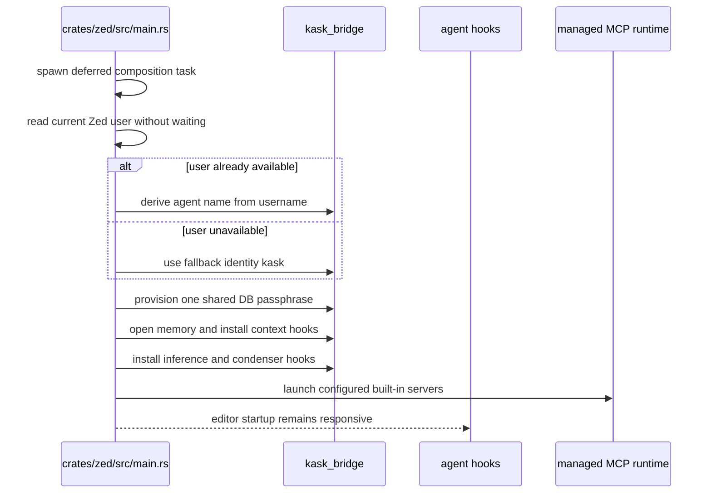
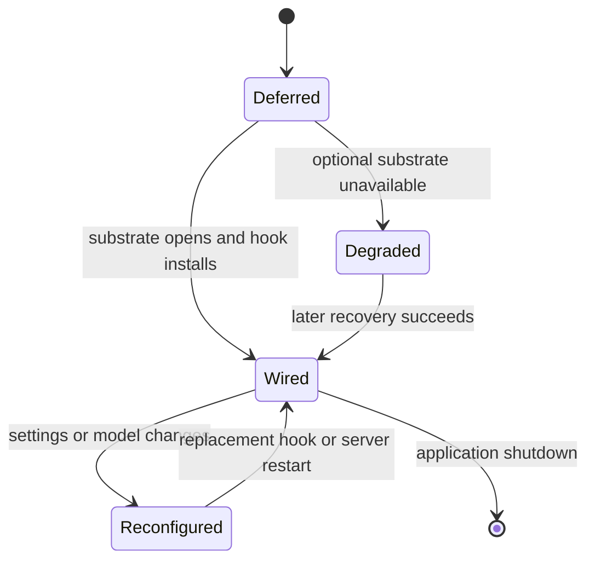

# kask_bridge — Explanation

`kask_bridge` is the sole crate allowed to depend on both hKask and Zed-side
facilities. The dependency-direction invariant is explicit in
`kask/crates/kask_bridge/src/kask_bridge.rs:3-10`: hKask crates define portable
ports; the bridge implements those ports over the editor runtime.

## Why the bridge is one seam

The bridge keeps integration policy reviewable in one place. Its current
25 top-level modules cover condensation, context injection, credentials,
database maintenance, delegation grants, identity, four inference adapters,
inference IPC/provider/socket support, scheduled passphrase rotation, MCP
environment and registry wiring, memory, model resolution, settings,
metacognition, directives, algedonic and health sources, OCR health, and
rollout events
(`kask/crates/kask_bridge/src/kask_bridge.rs:23-47,94-109`).

The rollout-event bridge also owns the harness monitor's acknowledgment
boundary. `HarnessRegressionMonitor::poll_once` completes event-store queries
before handoff, offers regressions to the bounded Regulation queue in event
order, and advances its cursor only through the accepted contiguous prefix.
Typed queue backpressure and query failure retain unaccepted summaries for
retry; later impact assessment and verdict publication remain Regulation
responsibilities (`kask/crates/kask_bridge/src/rollout_event_bridge.rs`).

That width is deliberate: moving any of those adapters into a portable hKask
crate would reverse the dependency direction. Skill body execution remains in
the Zed `agent` crate rather than the bridge; the bridge root exports no skill
executor (`kask/crates/kask_bridge/src/kask_bridge.rs:48-118`).

## Startup is deferred but nonblocking

The composition task does not wait for a Zed account. It reads the current user
if one is already available and otherwise proceeds immediately with the
fallback identity `"kask"` (`crates/zed/src/main.rs:1520-1578`). Provisioning,
memory wiring, model-dependent hooks, and MCP launch therefore happen in a
deferred foreground task without making login a prerequisite.

<!-- DIAGRAM_ALIGNMENT
id: DIAG-BRIDGE-006
verified_date: 2026-09-16
verified_against: crates/zed/src/main.rs:1520-1578; crates/zed/src/main.rs:1582-1624; crates/zed/src/main.rs:1806-1849; crates/zed/src/main.rs:1918-1993; crates/zed/src/main.rs:2190-2202
status: VERIFIED
-->

There is one SQLCipher passphrase for curator, swarm-memory, kanban, research,
and training databases. The deferred task explicitly performs no separate
swarm-memory provisioning (`crates/zed/src/main.rs:1620-1624`). Scheduled
rotation is startup-coordinated: `schedule_db_passphrase_rotation` writes the
pending slot (`hkask_db_passphrase_pending`) plus a pending record file, and
`run_pending_db_passphrase_rotation` applies it before any DB opens
(`crates/zed/src/main.rs:372`), with the keychain write always LAST — the full
lifecycle is documented in [`kask-settings.md`](../../reference/kask-settings.md)
under Passphrase rotation.

## Why MCP environment construction is centralized

`build_mcp_server_env` is the canonical child-process environment path. It
filters non-secret configuration first, then resolves only the server's
credential allowlist, then adds the inference socket and timeout
(`kask/crates/kask_bridge/src/mcp_servers.rs:679-686,687-812`). The ordering is
load-bearing because configuration and credentials are disjoint key sets
(`kask/crates/kask_bridge/src/mcp_servers.rs:11-22`).

Every built-in descriptor carries explicit `credentials` and `config_env`
allowlists. Unknown server IDs fail closed in both filters
(`kask/crates/kask_bridge/src/mcp_servers.rs:621-642,914-936`). This makes a
server's child environment an attenuated capability rather than a copy of the
parent environment.

## Why settings defaults live in `Default`

The settings hierarchy has one source of default values: each settings type's
`Default` implementation. Content conversion consults those defaults, while
MCP environment emitters compare against them
(`kask/crates/kask_bridge/src/settings.rs:24-34,697-701,790-812`). The general
settings contain concurrency, timeout, and circuit-breaker controls—there is no
batch-size setting (`kask/crates/kask_bridge/src/settings.rs:98-137`). The swarm
settings contain mode, URL, credit ceiling, curator-consent policy,
default-agent-model override, A2A toggle, and embedding dimension; they contain
no separate passphrase field (`kask/crates/kask_bridge/src/settings.rs:413-446`).

## Port lifecycle

Most bridge hooks are installed after the required substrate exists. Re-settable
process-global hooks can be upgraded; one-shot hooks remain absent until their
single installation succeeds. Memory degradation is surfaced rather than
converted into false success: `RealMemoryPort` is installed only after opening,
and the context hooks are installed from that concrete port
(`crates/zed/src/main.rs:1806-1869,1918-1993`).

<!-- DIAGRAM_ALIGNMENT
id: DIAG-BRIDGE-007
verified_date: 2026-09-16
verified_against: crates/zed/src/main.rs:1806-1869; crates/zed/src/main.rs:1912-1917; crates/zed/src/main.rs:2037-2048; kask/crates/kask_bridge/src/memory/curator_stores.rs:52-61,118-137
status: VERIFIED
-->

## Further reading

- [How to add a built-in MCP server](./how-to.md)
- [Bridge reference](./reference.md)
