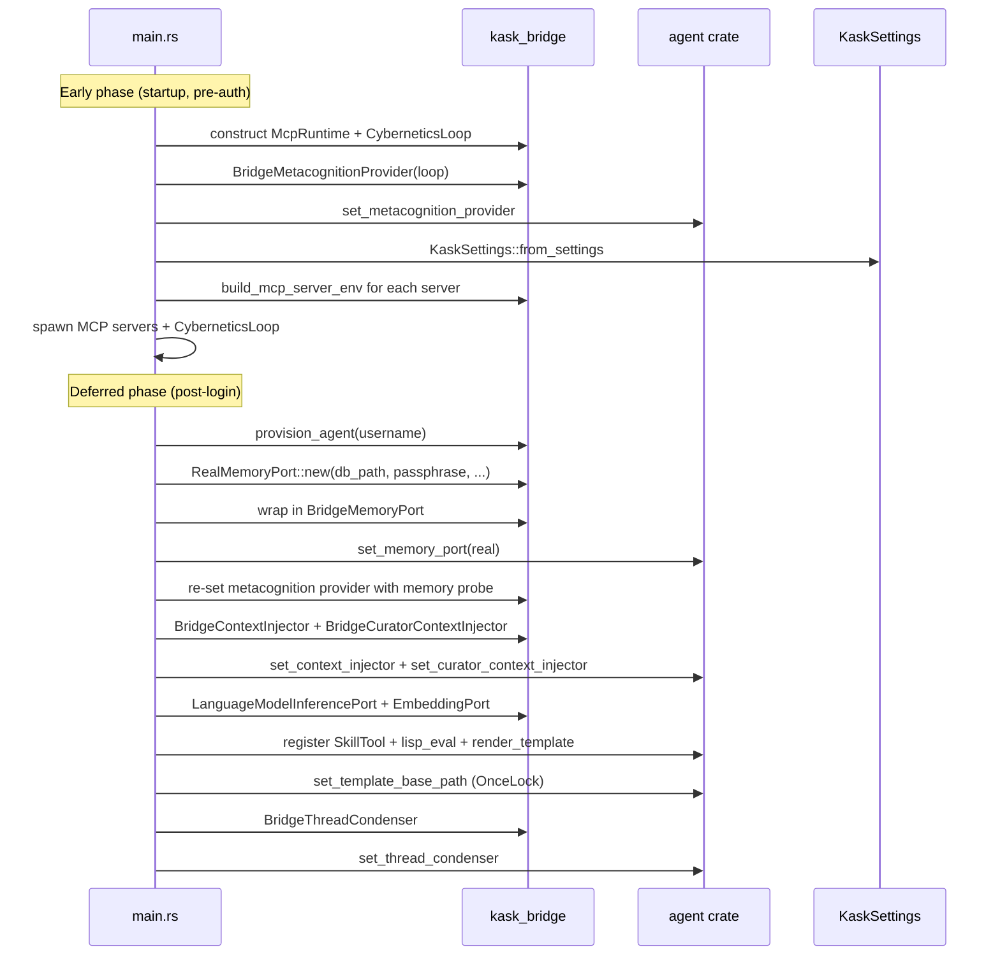
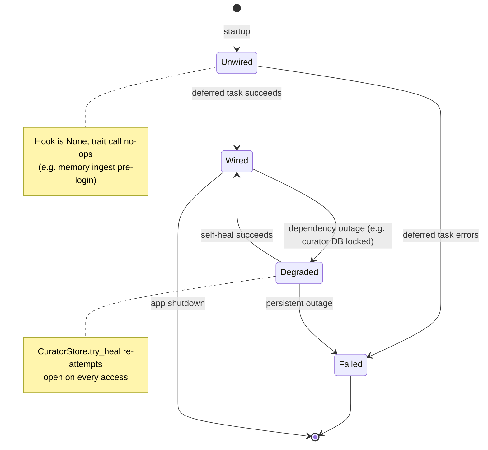

# kask_bridge — Explanation

`kask_bridge` exists because zed-kask and hKask have opposite dependency
directions. hKask is a standalone system that defines port traits
(`InferencePort`, `MemoryPort`, `ToolPort`, etc.) in `hkask-types` and
implements them over its own substrates. zed-kask is a fork of the Zed
editor that owns the user-facing runtime — the `LanguageModel` registry,
the settings system, the keychain, the foreground executor. The bridge is
the only crate that depends on both sides, so it is the only place where
the two worlds meet at runtime.

The governing invariant is at `kask/crates/kask_bridge/src/kask_bridge.rs:9-10`:
hKask crates never depend on zed crates; zed-kask depends on hKask. This
keeps hKask buildable and testable in isolation, and confines every
integration concern to one crate whose diff is reviewable as a unit.

## Source citations

| Symbol | Location |
|--------|----------|
| Governing invariant | `kask/crates/kask_bridge/src/kask_bridge.rs:9-10` |
| `BridgeContextInjector` | `kask/crates/kask_bridge/src/context_injector.rs:144-160` |
| `LanguageModelInferencePort` channel split | `kask/crates/kask_bridge/src/inference.rs:179-216` |
| Skill execution (D1 seam) | `crates/agent/src/tools/skill_tool.rs:266` (`SkillTool::run`) |
| `render_skill_envelope` | `crates/agent/src/agent.rs` (body injection) |
| `lisp_eval` tool | `crates/agent/src/tools/lisp_eval_tool.rs` |
| `render_template` tool | `crates/agent/src/tools/render_template_tool.rs` |
| Template base path hook | `agent::set_template_base_path()` (OnceLock, wired in `main.rs`) |
| `RealMemoryPort` | `kask/crates/kask_bridge/src/memory.rs:65-119` |
| `RealMemoryPort::new` | `kask/crates/kask_bridge/src/memory.rs:128-253` |
| `BridgeMemoryPort` | `kask/crates/kask_bridge/src/memory.rs:1359-1361` |
| `CuratorStore` self-healing | `kask/crates/kask_bridge/src/memory/curator_stores.rs:52-161` |
| `curator_db_path` | `kask/crates/kask_bridge/src/memory/curator_stores.rs:20-29` |
| `BUILT_IN_MCP_SERVERS` | `kask/crates/kask_bridge/src/mcp_servers.rs:53-394` |
| `build_mcp_server_env` | `kask/crates/kask_bridge/src/mcp_servers.rs:514-559` |
| `provision_agent` | `kask/crates/kask_bridge/src/identity.rs:217-257` |
| `KaskSettings::mcp_env` | `kask/crates/kask_bridge/src/settings.rs:717-1046` |
| `HKASK_TRANSACTIONS_DIR` emission (D28) | `kask/crates/kask_bridge/src/settings.rs:804-816` |

## Why a single seam

Before the bridge was consolidated, the zed↔hKask wiring was scattered
across `zed/src/main.rs`, the settings UI, and a now-removed panel crate.
The MCP server list alone was duplicated in three places with drift between
them (`mcp_servers.rs:1-9`). The consolidation moves every integration
concern into one crate so that:

- The diff for any integration change is reviewable as a unit.
- hKask remains buildable without zed (its crates never depend on zed).
- The settings → env → MCP-server contract is enforced in one place
  (`mcp_env` + `build_mcp_server_env`).
- The allowlist blast-radius discipline (per-server credentials/config) has
  a single enforcement point.

The cost is that the bridge crate is wide: it touches settings, identity,
memory, inference, skills, condensation, context injection, metacognition,
directives, and the IPC server. The depth is justified by the alternative —
scattered seams that drift.

## Two-phase composition

The composition root in `crates/zed/src/main.rs` runs the bridge in two
phases. The split exists because some hooks need a resolved language model
and a provisioned agent, which only exist after the zed user logs in. The
early phase wires everything that can run before auth; the deferred phase
wires everything that depends on the user identity and the model registry.

<!-- DIAGRAM_ALIGNMENT
id: DIAG-BRIDGE-006
verified_date: 2026-08-20
verified_against: kask/crates/kask_bridge/src/kask_bridge.rs:9-10; kask/crates/kask_bridge/src/metacognition_bridge.rs:16-24; kask/crates/kask_bridge/src/identity.rs:217-257; kask/crates/kask_bridge/src/memory.rs:128-253,1359-1361; kask/crates/kask_bridge/src/context_injector.rs:168-204; kask/crates/kask_bridge/src/inference.rs:189-216; crates/agent/src/tools/skill_tool.rs:266; crates/agent/src/tools/lisp_eval_tool.rs; crates/agent/src/tools/render_template_tool.rs; kask/crates/kask_bridge/src/condenser_bridge.rs:22-25
status: VERIFIED
-->

`set_memory_port` and `set_metacognition_provider` use `Mutex` (re-settable)
because the early phase leaves them `None` and the deferred phase upgrades
them. The context injectors and the template base path use `OnceLock` (set
once). This is the `.rules` "Failure signals" pattern: a hook wired
conditionally must `log::warn!` on failure so operators can distinguish "not
configured" from "configured but broken."

## Why the inference adapter uses channels

`LanguageModelInferencePort` (`inference.rs:179-182`) does not call
`LanguageModel::stream_completion` directly from the trait method. Instead
it sends an `InferenceRequest` over an mpsc channel to a task running on
the GPUI foreground executor, which owns the `AsyncApp` and performs the
streaming completion (`inference.rs:189-216`).

The reason is a GPUI constraint: `AsyncApp` is not `Send` (the foreground
executor holds `Rc`-based state). The hKask `InferencePort` trait methods are
called from tokio workers (MCP servers, the skill cascade), which are
`Send + Sync`. A direct call would require moving the `AsyncApp` across
threads, which Rust's type system forbids. The channel split lets the
`Send + Sync` adapter hold only senders while the non-`Send` receiver task
stays pinned to the foreground executor.

This is the same constraint that forces `cx.background_spawn` to panic on
tokio-dependent futures and requires `gpui_tokio::Tokio::spawn` instead
(see `.rules` "GPUI traps"). The bridge is the boundary where the two
executors meet, and channels are the only safe crossing.

## Why MCP server env has one canonical path

`build_mcp_server_env` (`mcp_servers.rs:514-559`) is the single place that
assembles a kask MCP server child-process env. It composes two filters in
load-bearing order: config first, then credentials, then the inference
socket last.

The order matters because the two filters apply to disjoint key sets.
Config vars live in `BuiltinMcpServer::config_env`; credentials live in
`BuiltinMcpServer::credentials`. If the config filter ran over a map that
already contained credentials, it would drop every credential (the config
allowlist does not list credential keys). This is exactly the regression
the previous two-path design had: one path leaked the full unfiltered
`mcp_env()` map, the other dropped every credential. Both bugs were
invisible because the allowlist-alignment tests exercised the filter helpers
in isolation, never the composed path (`mcp_servers.rs:11-22`).

The single-path design makes the composition testable:
`build_mcp_server_env_composition_respects_allowlists`
(`mcp_servers.rs:1452-1510`) exercises the composed path and would catch
either regression.

## Why the curator has a sovereign database

`RealMemoryPort` writes each completed turn to two databases: the user's
`memory.db` (episodic, first-person) and the curator's `curator.db`
(semantic, shared). The curator DB path is resolved by `curator_db_path`
(`memory/curator_stores.rs:20-29`) to `agents/curator/curator.db` under the
hKask data dir.

The split exists for two reasons:

1. **Perspective separation.** The user's first-person record is private;
   the curator's copy is shared. Storing them in separate SQLCipher
   databases lets each have its own encryption key and access policy. The
   `HMemOntology` blob on each h_mem distinguishes them, so no second store
   struct is needed (`memory/curator_stores.rs:42-46`).

2. **Curator MCP server reads.** The curator MCP server's
   `curator_memory_recall` and `curator_semantic_search` tools read from
   the same `curator.db` the agent writes to. If the curator's copy lived
   in the user's `memory.db`, the curator server would need the user's DB
   passphrase — a wider secret surface. The sovereign DB keeps the
   curator's reads scoped to its own passphrase.

The `CuratorStore` handle (`memory/curator_stores.rs:52-161`) is
self-healing because the curator DB can be transiently unavailable at
startup (locked by a previous MCP server instance, I/O error). When the
initial open fails, the store is `None` and every access re-attempts the
open. A successful re-open restores curator memory mid-session without an
app restart; persistent failure is signaled with a warn-once per healing
attempt, never silently. This is the `.rules` "Advertised invariants need
enforcement points" pattern — the self-healing claim points at
`CuratorStore::try_heal` (`memory/curator_stores.rs:118-160`).

## Why skills execute via body injection, not a manifest cascade

Skill execution in zed-kask follows upstream Zed's body-injection model.
`SkillTool::run` (`crates/agent/src/tools/skill_tool.rs:266`) reads the
`SKILL.md` body from disk via `agent_skills::read_skill_body` and injects it
into the conversation via `render_skill_envelope`. The model reads the body
and follows the instructions — there is no manifest executor, no step
machine, no Jinja2 cascade, and no `BridgeManifestExecutor` / `skill_executor.rs`
in `kask_bridge`.

Two companion built-in tools support the model-coordinated PDCA loops the
SKILL.md bodies describe:

1. **`lisp_eval`** (`crates/agent/src/tools/lisp_eval_tool.rs`) — wraps
   `hkask_lisp::eval_sandboxed_with_budget`. The agent calls it directly when a
   SKILL.md instructs it to perform deterministic computation (convergence
   signals, invariant checks, scoring). Registered in `add_default_tools`.
2. **`render_template`** (`crates/agent/src/tools/render_template_tool.rs`) —
   renders Jinja2 templates from the kask registry (`kask/registry/templates/`)
   via `minijinja`. The agent calls it when a SKILL.md instructs it to get
   structured prompt scaffolding for a specific step. The template base path
   is wired via `agent::set_template_base_path()` (OnceLock), called from
   `main.rs` at startup (dev: `kask/registry/templates/`, prod:
   `{kask_data_dir}/skills/registry/templates/`). Registered in
   `register_session` alongside `SkillTool`.

The bridge crate does not participate in skill execution — it has no skill
executor module. The D1 seam lives entirely in the `agent` crate's tool
registration, matching the upstream Zed constructor `SkillTool::new(skills,
fs)`. PDCA iteration is model-coordinated: the SKILL.md body describes
convergence criteria, and the model uses `lisp_eval` for deterministic
convergence checks and `render_template` for structured prompt scaffolding
within iterations.

## Why settings defaults live in `Default` impls

Per the `.rules` "Kask settings defaults" trap, `Default` impls are the
single source of truth for kask settings defaults — not `#[serde(default)]`
attributes, not `From<Content>` literals, not `mcp_env()` comparison
literals. `From<Content>` reads from `Default` via `unwrap_or(default.field)`
(e.g. `settings.rs:686-695` for `KaskToolRouterSettings`), and `mcp_env()`
compares against `Default` to decide whether to emit a var
(`settings.rs:755-760`).

The trap is real: inlining magic numbers instead of comparing against
`Default` is the drift class that silently disabled all 10 kask MCP servers
when `KaskMcpSettings::default()` disagreed with the serde default. The
`Default`-as-source rule means changing `Default` automatically updates
both the `From<Content>` path and the `mcp_env()` emission decision — there
is one place to edit.

## Bridge port state

Each bridge port has a lifecycle state determined by whether its hook is
wired. The diagram below shows the states and the transitions the
composition root drives.

<!-- DIAGRAM_ALIGNMENT
id: DIAG-BRIDGE-007
verified_date: 2026-08-13
verified_against: kask/crates/kask_bridge/src/memory.rs:65-119; kask/crates/kask_bridge/src/memory/curator_stores.rs:97-160; kask/crates/kask_bridge/src/kask_bridge.rs:9-10
status: VERIFIED
-->

The `Unwired` state is intentional for `set_memory_port` and
`set_metacognition_provider`: the early phase leaves them `None` so turn
ingest no-ops until the deferred task wires `BridgeMemoryPort` after the
zed user resolves. The `Degraded` state is specific to the curator store:
a transient open failure does not fail the port — it enters self-healing,
where every access re-attempts the open. Only persistent outage transitions
to `Failed`.

## D28 changes

The D28 divergence surface touches this crate in four places:

1. **Threads DB override hook** — `HKASK_CURATOR_DB` is read by
   `curator_db_path` (`memory/curator_stores.rs:20-29`) to override the
   curator DB location.
2. **Skills dir override hook** — `HKASK_SKILLS_DIR` is emitted from
   `mcp_env` when `swarm.skills_dir` is set (`settings.rs:953-958`) and
   allowlisted for the swarm server (`mcp_servers.rs:332-337`). Retained for
   settings UI compatibility; the swarm server no longer reads it (skill
   cascade cleanup removed the read site).
3. **`HKASK_TRANSACTIONS_DIR` emission** — always emitted, default
   `mcp/portfolio/transactions/` under the kask data root
   (`settings.rs:804-816`); allowlisted for the portfolio server
   (`mcp_servers.rs:78`).
4. **MCP server DB paths under `mcp/{server_id}/`** — the transactions dir
   follows the `mcp/<server>/` convention; the curator DB lives at
   `agents/curator/curator.db` (renamed from the former `pod.db`).

The former `seed_registry_to_disk` registry-seeding path (which wrote to
`{kask_data_dir}/skills/registry/`) was removed with the `hkask-templates`
executor infrastructure. Skill bodies and templates now live under the
skills directory read by `agent_skills::read_skill_body` and the
`render_template` tool's base path.
