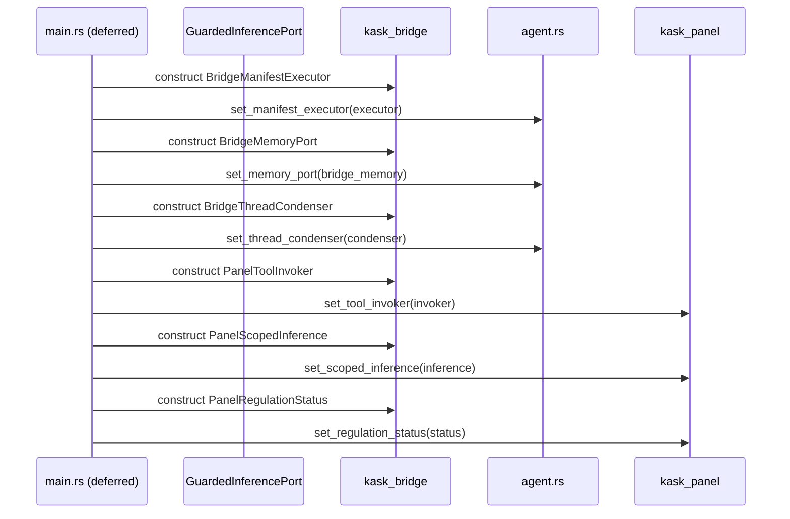

# kask_bridge — Explanation

The composition root is the single place where zed and hKask are wired
together. It runs in a deferred task in `crates/zed/src/main.rs` after the
zed user resolves and a default language model becomes available. Every
`set_*` hook (manifest executor, memory port, thread condenser, tool
invoker, scoped inference, regulation status) is wired here. The design
centralizes the integration so that the seams are visible in one file rather
than scattered across the codebase.

## Source citations

| Symbol | Location |
|--------|----------|
| Deferred-task wiring | `crates/zed/src/main.rs:1491` |
| `set_manifest_executor` | `crates/agent/src/agent.rs:2712` |
| `set_memory_port` | `crates/agent/src/agent.rs:2766` |
| `set_thread_condenser` | `crates/agent/src/agent.rs:2857` |
| `set_tool_invoker` (panel) | `crates/kask_panel/src/kask_panel.rs:136` |
| `set_scoped_inference` (panel) | `crates/kask_panel/src/kask_panel.rs:141` |
| `set_regulation_status` (panel) | `crates/kask_panel/src/kask_panel.rs:146` |
| `BridgeManifestExecutor` | `kask/crates/kask_bridge/src/skill_executor.rs:30` |
| `BridgeToolPort` | `kask/crates/kask_bridge/src/tool_port.rs:25` |
| `BridgeMemoryPort` | `kask/crates/kask_bridge/src/memory.rs:580` |

## Composition root sequence

The sequence below shows the D1–D10 wiring in the deferred task. Each
`set_*` call populates a process-global `OnceLock`. The hooks are checked
at runtime when the corresponding feature is invoked.

<!-- DIAGRAM_ALIGNMENT
id: DIAG-DIA-BRIDGE-002
verified_date: 2026-07-27
verified_against: crates/zed/src/main.rs:1491; crates/agent/src/agent.rs:2712,2766,2857; crates/kask_panel/src/kask_panel.rs:136,141,146
status: VERIFIED
-->

## Why deferred wiring

The hooks depend on `LanguageModelRegistry::default_model()` being populated.
At startup, before user authentication, `default_model()` returns `None`.
Wiring the hooks synchronously at startup would leave them unwired for the
entire session when no model is configured at startup. The deferred task runs
after the zed user resolves, ensuring the model is available.

If the deferred task fails to find a model, the hooks remain `None` and the
`skill` tool returns a no-op envelope. This fail-closed behavior is
intentional. A missing model should not silently produce broken skill output.

## Why OnceLock hooks

The `set_*` functions use `OnceLock<Option<Arc<dyn Trait>>>`. The `OnceLock`
ensures the hook is set exactly once per process. The `Option` allows the
hook to be absent (fail-closed). The `Arc` allows the hook to be shared
across threads.

This pattern has a trap: if the condition for wiring fails silently, the
hook is left `None` with no signal. The `.rules` file documents this: every
`set_*` hook that is wired conditionally must `log::warn!` when the condition
fails, so operators can distinguish "not configured" from "configured but
broken."

## See also

- [kask_bridge Reference](./reference.md): class diagram of settings and
  bridge adapters.
- [kask_bridge How-to](./how-to.md): wiring a new kask hook.
- [hkask-types Explanation](../hkask-types/explanation.md): the port trait
  mediation that this crate implements.
- [`kask/docs/architecture/zed-host-architecture-plan.md`](../../architecture/zed-host-architecture-plan.md):
  the D1–D10 integration seams.

---

[^cockburn]: Cockburn, A. (2005). *Hexagonal Architecture.* <https://alistair.cockburn.us/hexagonal-architecture/>. The composition root pattern: a single place where ports and adapters are wired.

[^once-lock]: Rust Community. (2024). *std::sync::OnceLock.* <https://doc.rust-lang.org/std/sync/struct.OnceLock.html>. The synchronization primitive used for process-global hooks.
