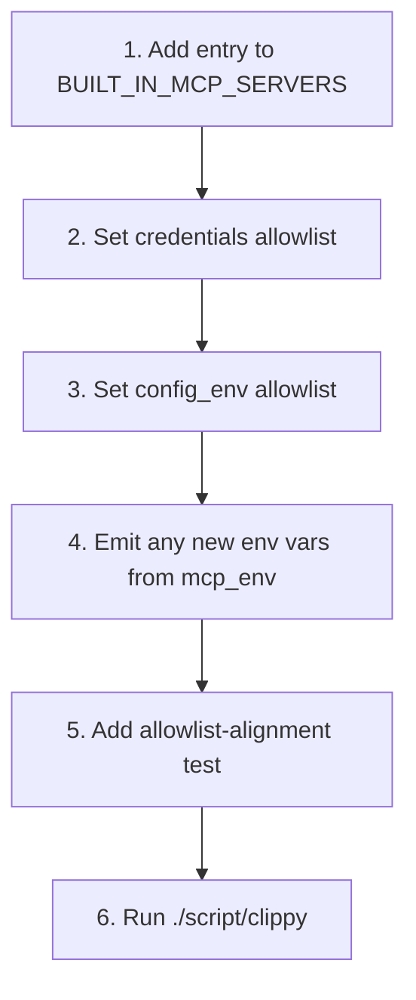

# kask_bridge — How-to: Add a Built-in MCP Server

This guide shows how to register a new built-in kask MCP server so it loads
at startup, receives only the credentials and config it needs, and shows up
in the settings UI. The canonical registry is `BUILT_IN_MCP_SERVERS` in
`mcp_servers.rs`; adding a server means adding one entry to that array, then
aligning the allowlists with what the server crate actually reads. There
are no companion ID/pair slices to maintain — `builtin_mcp_server_ids()` and
`builtin_mcp_server_pairs()` derive their output from the registry directly
(`mcp_servers.rs:435-447`).

The registry is the single source of truth for the server ID → binary →
description mapping. Previously this list was duplicated in three places with
drift between them; the consolidation is documented at
`mcp_servers.rs:1-9`. The registry currently enumerates **11** servers
(`mcp_servers.rs:55-431`), one per server crate under `kask/mcp-servers/`.
The most recent addition — `media` (`mcp_servers.rs:405-430`) — is the
worked example below.

## Source citations

| Symbol | Location |
|--------|----------|
| `BuiltinMcpServer` struct | `kask/crates/kask_bridge/src/mcp_servers.rs:28-50` |
| `BUILT_IN_MCP_SERVERS` registry (11 servers) | `kask/crates/kask_bridge/src/mcp_servers.rs:55-431` |
| `builtin_mcp_server_ids` (derived) | `kask/crates/kask_bridge/src/mcp_servers.rs:435-437` |
| `builtin_mcp_server_pairs` (derived) | `kask/crates/kask_bridge/src/mcp_servers.rs:442-447` |
| `find_server` | `kask/crates/kask_bridge/src/mcp_servers.rs:451-453` |
| `filter_credentials_for_server` | `kask/crates/kask_bridge/src/mcp_servers.rs:465-486` |
| `filter_config_env_for_server` | `kask/crates/kask_bridge/src/mcp_servers.rs:717-738` |
| `build_mcp_server_env` (canonical path) | `kask/crates/kask_bridge/src/mcp_servers.rs:523-649` |
| `mcp_env` (config half) | `kask/crates/kask_bridge/src/settings.rs:674-712` + `mcp_env.rs` (19 translators) |
| Allowlist-alignment test pattern | `kask/crates/kask_bridge/src/mcp_servers.rs:1110-1132` (`research_allowlist_matches_actual_reads`) |
| Config-env test pattern | `kask/crates/kask_bridge/src/mcp_servers.rs:888-901` (`curator_config_env_includes_email_settings`) |
| Registry-derivation pin tests | `kask/crates/kask_bridge/src/mcp_servers.rs:765-777` |
| Composed-path regression test | `kask/crates/kask_bridge/src/mcp_servers.rs:1279-1343` |
| Media entry (worked example) | `kask/crates/kask_bridge/src/mcp_servers.rs:405-430` |
| Media 67-tool surface pin | `kask/mcp-servers/hkask-mcp-media/src/hkask_mcp_media.rs:389-392` |

## Procedure

<!-- DIAGRAM_ALIGNMENT
id: DIAG-BRIDGE-002
verified_date: 2026-08-28
verified_against: kask/crates/kask_bridge/src/mcp_servers.rs:55-431,435-447,465-486,717-738,523-649; kask/crates/kask_bridge/src/settings.rs:674-712
status: VERIFIED
-->

### Step 1 — Add the entry to `BUILT_IN_MCP_SERVERS`

Add a `BuiltinMcpServer { ... }` entry to the array at `mcp_servers.rs:55`.
Order is stable and meaningful — the kask panel uses index-based selection
(`mcp_servers.rs:54`). Set:

- `id` — the server ID used in `kask.mcp.overrides` and as the
  `ContextServerId`. Must be unique. **Not yet enforced by test** — there is
  no `all_servers_have_unique_ids` test in the current tree; uniqueness is
  only enforced by review.
- `binary` — the executable name without path, following the
  `hkask-mcp-<id>` naming convention. **Not yet enforced by test** — there is
  no naming-convention test in the current tree.
- `description` — human-readable, shown in the settings UI.

The `media` entry (`mcp_servers.rs:405-430`) is a complete example: id
`"media"`, binary `hkask-mcp-media`, a two-key credentials allowlist
(`OPENROUTER_API_KEY`, `DEEPINFRA_API_KEY`), and an eight-var config
allowlist (inference socket, data dir, gallery DB, five model overrides).

Because `builtin_mcp_server_ids()` and `builtin_mcp_server_pairs()`
(`mcp_servers.rs:435-447`) derive from the registry, your new entry
automatically appears in `HKASK_MCP_SERVER_IDS` (via
`emit_mcp_server_ids_env`, `mcp_env.rs:64-72`) and in the settings UI. The
derivation is pinned by `builtin_mcp_server_ids_match_main_registry`
(`mcp_servers.rs:765-768`) and `builtin_mcp_server_pairs_match_main_registry`
(`mcp_servers.rs:771-777`).

### Step 2 — Set the `credentials` allowlist

`credentials` is the list of keychain-secret env vars the server may receive.
Per the `.rules` trap "MCP server credentials/config are scoped per-server via
allowlists. New servers use `Some(&[])` for both, never `None`."

- `Some(&[])` — the server receives no credentials. Use this for servers
  with no secret reads (e.g. `portfolio`, `scenarios`).
- `Some(&["KEY_A", "KEY_B"])` — only the listed keys are injected. Every
  entry must have a read site in the server crate; the
  `*_allowlist_matches_actual_reads` tests (e.g.
  `research_allowlist_matches_actual_reads`, `mcp_servers.rs:1110-1132`)
  grep the crate for `std::env::var` and `ctx.credentials.get` reads and
  assert the allowlist matches exactly.
- `None` — backward-compatible "receives all credentials." Do not use for
  new servers.

`filter_credentials_for_server` (`mcp_servers.rs:465-486`) applies this
allowlist at child-process launch. An unknown server id fails closed and
receives no credentials (`mcp_servers.rs:469-477`).

Every credential grant must also be secret-shaped or carry a comment
documenting why a non-secret sits in the credentials list — enforced by
`every_credential_grant_is_secret_shaped_or_documented`
(`mcp_servers.rs:1241-1261`).

### Step 3 — Set the `config_env` allowlist

`config_env` is the list of non-secret config env vars (from `mcp_env()`)
the server may receive. The same `Some(&[])` / `Some(&[...])` / `None`
rules apply. `filter_config_env_for_server` (`mcp_servers.rs:717-738`)
applies it; an unknown server id fails closed (`mcp_servers.rs:721-728`).

The two allowlists apply to **disjoint key sets** — config vars live in
`config_env`, secrets live in `credentials`. The canonical composition path
`build_mcp_server_env` (`mcp_servers.rs:523-649`) filters config first, then
resolves credentials and merges them into the already-filtered map. Reversing
this order drops every credential (the config allowlist does not list
credential keys). This regression existed in the previous two-path design;
do not reintroduce it (`mcp_servers.rs:11-22`). The composed path is pinned
by `build_mcp_server_env_composition_respects_allowlists`
(`mcp_servers.rs:1279-1343`).

### Step 4 — Emit any new env vars from `mcp_env`

If your server reads a config var that is not already emitted by
`KaskSettings::mcp_env` (`settings.rs:674-712`, delegating to the
`emit_*_env` translators in `mcp_env.rs`), add the emission there — either
in the sub-struct's existing translator or as a new `emit_*_env` function
(the media server added `emit_media_env`, `mcp_env.rs:352`). Follow the
existing pattern: read from the relevant `Kask*Settings` sub-struct, compare
against the sub-struct's `Default` impl (the single source of truth), and
only emit non-default values. Inlining magic numbers instead of comparing
against `Default` is the drift class that silently disabled all kask MCP
servers once before.

D28 example: `HKASK_TRANSACTIONS_DIR` is always emitted (default
`mcp/portfolio/transactions/` under the kask data root) so the portfolio
server can auto-load transaction files (`mcp_env.rs:127-138`).

### Step 5 — Add an allowlist-alignment test

Add a test named `<server>_allowlist_matches_actual_reads` in the
`mcp_servers.rs` test module. Follow the pattern at
`mcp_servers.rs:1110-1132` (`research_allowlist_matches_actual_reads`):
grep the server crate for `std::env::var("...")` and
`ctx.credentials.get("...")` reads, collect the read env-var names, and
assert the allowlist in the registry entry matches exactly. This is the
test class that catches the "key never arrives" bugs documented in the
inline comments (e.g. `mcp_servers.rs:86-91` for the `HKASK_SERPAPI_API_KEY`
normalization).

Also add a `*_config_env_*` test if your server reads config vars, following
the pattern at `mcp_servers.rs:888-901`
(`curator_config_env_includes_email_settings`).

If your server registers tools via rmcp routers, also pin the registered
tool surface end-to-end, as the media server does
(`tool_surface_is_exactly_67_registered_tools`,
`kask/mcp-servers/hkask-mcp-media/src/hkask_mcp_media.rs:389-392`) — a
`#[tool]` impl block without `#[tool_router]`, or a sub-router missing from
`combined_router()`, silently registers nothing.

### Step 6 — Run clippy

Run `./script/clippy` (per the `.rules` build instruction — not
`cargo clippy`). The allowlist-alignment tests run as part of the test
suite; confirm they pass before merging.
