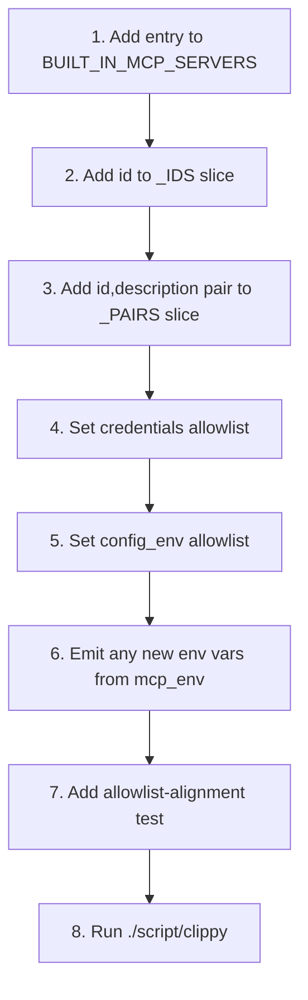

# kask_bridge — How-to: Add a Built-in MCP Server

This guide shows how to register a new built-in kask MCP server so it loads
at startup, receives only the credentials and config it needs, and shows up
in the settings UI. The canonical registry is `BUILT_IN_MCP_SERVERS` in
`mcp_servers.rs`; adding a server means adding one entry to that array and
three companion slices, then aligning the allowlists with what the server
crate actually reads.

The registry is the single source of truth for the server ID → binary →
description mapping. Previously this list was duplicated in three places with
drift between them; the consolidation is documented at
`mcp_servers.rs:1-9`.

## Source citations

| Symbol | Location |
|--------|----------|
| `BuiltinMcpServer` struct | `kask/crates/kask_bridge/src/mcp_servers.rs:24-48` |
| `BUILT_IN_MCP_SERVERS` registry | `kask/crates/kask_bridge/src/mcp_servers.rs:53-394` |
| `BUILT_IN_MCP_SERVERS_IDS` | `kask/crates/kask_bridge/src/mcp_servers.rs:398-412` |
| `BUILT_IN_MCP_SERVERS_PAIRS` | `kask/crates/kask_bridge/src/mcp_servers.rs:416-451` |
| `find_server` | `kask/crates/kask_bridge/src/mcp_servers.rs:455-457` |
| `filter_credentials_for_server` | `kask/crates/kask_bridge/src/mcp_servers.rs:469-490` |
| `filter_config_env_for_server` | `kask/crates/kask_bridge/src/mcp_servers.rs:571-592` |
| `build_mcp_server_env` (canonical path) | `kask/crates/kask_bridge/src/mcp_servers.rs:514-559` |
| `mcp_env` (config half) | `kask/crates/kask_bridge/src/settings.rs:717-1046` |
| Allowlist-alignment test pattern | `kask/crates/kask_bridge/src/mcp_servers.rs:691-718` |

## Procedure

<!-- DIAGRAM_ALIGNMENT
id: DIAG-BRIDGE-002
verified_date: 2026-08-13
verified_against: kask/crates/kask_bridge/src/mcp_servers.rs:53-394,398-412,416-451,469-490,571-592,514-559; kask/crates/kask_bridge/src/settings.rs:717-1046
status: VERIFIED
-->

### Step 1 — Add the entry to `BUILT_IN_MCP_SERVERS`

Add a `BuiltinMcpServer { ... }` entry to the array at `mcp_servers.rs:53`.
Order is stable and meaningful — the kask panel uses index-based selection
(`mcp_servers.rs:51-52`). Set:

- `id` — the server ID used in `kask.mcp.overrides` and as the
  `ContextServerId`. Must be unique (enforced by `all_servers_have_unique_ids`
  at `mcp_servers.rs:599-605`).
- `binary` — the executable name without path, following the
  `hkask-mcp-<id>` naming convention (enforced by
  `all_binaries_follow_naming_convention` at `mcp_servers.rs:608-616`).
- `description` — human-readable, shown in the settings UI.

### Step 2 — Add the id to `BUILT_IN_MCP_SERVERS_IDS`

Append the same `id` string to the `BUILT_IN_MCP_SERVERS_IDS` slice at
`mcp_servers.rs:398`. This slice is consumed by `mcp_env()` to emit
`HKASK_MCP_SERVER_IDS` (`settings.rs:750-753`), which the swarm server uses
as the provenance boundary for third-party ABW cards. The slice order must
match the main registry (enforced by `ids_slice_matches_main_registry` at
`mcp_servers.rs:631-638`).

### Step 3 — Add the `(id, description)` pair to `BUILT_IN_MCP_SERVERS_PAIRS`

Append the same pair to `BUILT_IN_MCP_SERVERS_PAIRS` at `mcp_servers.rs:416`.
This is the convenience view the settings UI renders. Order must match the
main registry (enforced by `pairs_slice_matches_main_registry` at
`mcp_servers.rs:641-651`).

### Step 4 — Set the `credentials` allowlist

`credentials` is the list of keychain-secret env vars the server may receive.
Per the `.rules` trap "MCP server credentials/config are scoped per-server via
allowlists. New servers use `Some(&[])` for both, never `None`."

- `Some(&[])` — the server receives no credentials. Use this for servers
  with no secret reads (e.g. `portfolio`, `scenarios`).
- `Some(&["KEY_A", "KEY_B"])` — only the listed keys are injected. Every
  entry must have a read site in the server crate; the
  `*_allowlist_matches_actual_reads` tests (e.g. `mcp_servers.rs:691-718`)
  grep the crate for `std::env::var` and `ctx.credentials.get` reads and
  assert the allowlist matches exactly.
- `None` — backward-compatible "receives all credentials." Do not use for
  new servers.

`filter_credentials_for_server` (`mcp_servers.rs:469-490`) applies this
allowlist at child-process launch. An unknown server id fails closed and
receives no credentials (`mcp_servers.rs:473-481`).

### Step 5 — Set the `config_env` allowlist

`config_env` is the list of non-secret config env vars (from `mcp_env()`)
the server may receive. The same `Some(&[])` / `Some(&[...])` / `None`
rules apply. `filter_config_env_for_server` (`mcp_servers.rs:571-592`)
applies it.

The two allowlists apply to **disjoint key sets** — config vars live in
`config_env`, secrets live in `credentials`. The canonical composition path
`build_mcp_server_env` (`mcp_servers.rs:514-559`) filters config first, then
resolves credentials and merges them into the already-filtered map. Reversing
this order drops every credential (the config allowlist does not list
credential keys). This regression existed in the previous two-path design;
do not reintroduce it (`mcp_servers.rs:11-22`).

### Step 6 — Emit any new env vars from `mcp_env`

If your server reads a config var that is not already emitted by
`KaskSettings::mcp_env` (`settings.rs:717-1046`), add the emission there.
Follow the existing pattern: read from the relevant `Kask*Settings`
sub-struct, compare against the sub-struct's `Default` impl (the single
source of truth), and only emit non-default values. Inlining magic numbers
instead of comparing against `Default` is the drift class that silently
disabled all kask MCP servers once before (`settings.rs:755-760`).

D28 example: `HKASK_TRANSACTIONS_DIR` is always emitted (default
`mcp/portfolio/transactions/` under the kask data root) so the portfolio
server can auto-load transaction files (`settings.rs:804-816`).

### Step 7 — Add an allowlist-alignment test

Add a test named `<server>_allowlist_matches_actual_reads` in the
`mcp_servers.rs` test module. Follow the pattern at `mcp_servers.rs:691-718`
for `companies`: grep the server crate for `std::env::var("...")` and
`ctx.credentials.get("...")` reads, collect the read env-var names, and
assert the allowlist in the registry entry matches exactly. This is the test
class that catches the "key never arrives" bugs documented in the inline
comments (e.g. `mcp_servers.rs:91-96` for the `HKASK_SERPAPI_API_KEY`
normalization).

Also add a `*_config_env_*` test if your server reads config vars, following
the pattern at `mcp_servers.rs:887-919` for codegraph.

### Step 8 — Run clippy

Run `./script/clippy` (per the `.rules` build instruction — not
`cargo clippy`). The allowlist-alignment tests run as part of the test
suite; confirm they pass before merging.
