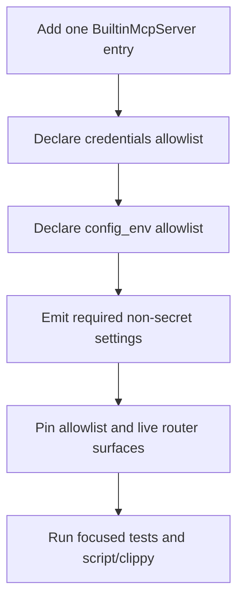

# kask_bridge — How-to: Add a Built-in MCP Server

Use this procedure to add a managed MCP server without leaking unrelated
configuration or credentials. The canonical registry currently contains 11
servers (`kask/crates/kask_bridge/src/mcp_servers.rs:52-506`).

## Procedure

<!-- DIAGRAM_ALIGNMENT
id: DIAG-BRIDGE-002
verified_date: 2026-09-16
verified_against: kask/crates/kask_bridge/src/mcp_servers.rs:26-50; kask/crates/kask_bridge/src/mcp_servers.rs:52-506; kask/crates/kask_bridge/src/mcp_servers.rs:570-600; kask/crates/kask_bridge/src/mcp_servers.rs:612-769; kask/crates/kask_bridge/src/mcp_servers.rs:873-894
status: VERIFIED
-->

### 1. Add the descriptor

Add one `BuiltinMcpServer` value to `BUILT_IN_MCP_SERVERS`. Supply a unique
`id`, the binary name, the settings description, and both allowlists. The
registry order is stable and used by the panel
(`kask/crates/kask_bridge/src/mcp_servers.rs:26-55`). The ID and description
views derive from the registry, so no companion list is maintained
(`kask/crates/kask_bridge/src/mcp_servers.rs:508-512,554-562`).

### 2. Declare the credential boundary

Use `Some(&[])` when the server reads no secrets, or `Some(&[...])` with only
the exact credential environment names it consumes. New servers must not use
`None`; that value means unfiltered backward-compatible access
(`kask/crates/kask_bridge/src/mcp_servers.rs:37-49`).

`filter_credentials_for_server` passes only the declared names and gives an
unknown ID no credentials (`kask/crates/kask_bridge/src/mcp_servers.rs:570-600`).
Add an allowlist-alignment test beside the existing per-server tests, such as
`research_allowlist_matches_actual_reads`
(`kask/crates/kask_bridge/src/mcp_servers.rs:1359-1400`).

### 3. Declare the non-secret configuration boundary

Set `config_env` to `Some(&[])` or an exact list of non-secret variables emitted
by `KaskSettings::mcp_env`. The config filter also fails closed for unknown IDs
(`kask/crates/kask_bridge/src/mcp_servers.rs:873-894`). Do not place database
passphrases or API keys in this list.

The current `media` descriptor is the worked example: two credentials and ten
configuration variables, including the IPC socket, data/artifact roots, gallery
DB, five media-model fields, and the embedding model
(`kask/crates/kask_bridge/src/mcp_servers.rs:468-505`).

### 4. Emit new settings through `mcp_env`

If the server needs a new non-secret setting, add it to the relevant settings
sub-structure and its `mcp_env` emitter, then add that exact environment name to
the server descriptor. Defaults belong only in `Default` implementations
(`kask/crates/kask_bridge/src/settings.rs:24-34`).

Do not invent a batch-size control or a second database-passphrase setting. The
general settings expose concurrency, timeout, and circuit-breaker controls
(`kask/crates/kask_bridge/src/settings.rs:98-137`), and all SQLCipher consumers
share `HKASK_DB_PASSPHRASE` (`crates/zed/src/main.rs:1620-1624`).

### 5. Pin the registered tool surface

A router can compile while silently omitting a sub-router. Add an end-to-end
count/name pin in the server crate. The current media server pins exactly 81
registered tools in `tool_surface_is_exactly_81_registered_tools`
(`kask/mcp-servers/hkask-mcp-media/src/hkask_mcp_media.rs:475-485`).

### 6. Validate

Run the focused server tests, the bridge allowlist tests, and then
`./script/clippy`. Confirm that:

- the registry count is still intentional;
- credential and config read sites equal their allowlists;
- the composed environment path preserves both key classes;
- the live router equals the advertised tool surface.

The composed-path regression test is
`build_mcp_server_env_composition_respects_allowlists`
(`kask/crates/kask_bridge/src/mcp_servers.rs:1541-1589`).

## Further reading

- [Why the bridge centralizes composition](./explanation.md)
- [Bridge reference](./reference.md)
