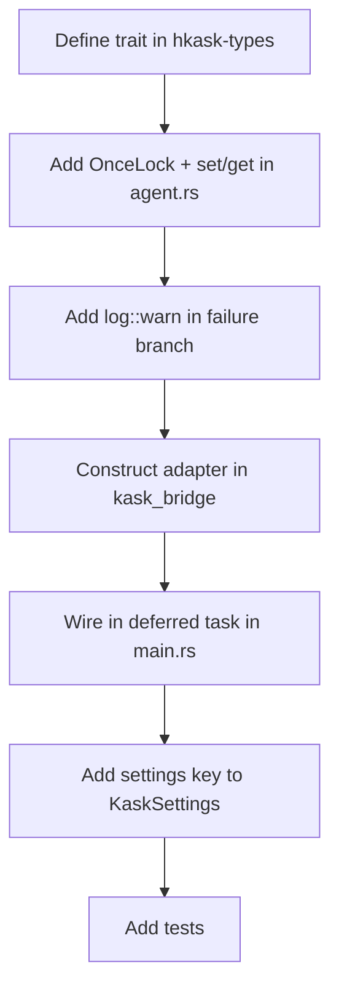

# kask_bridge — How-to: Wire a New Kask Hook

This guide shows how to add a new process-global hook using the `set_*`
OnceLock pattern. The pattern is used by `set_manifest_executor`,
`set_memory_port`, `set_thread_condenser`, and the kask_panel hooks. A new
hook follows the same structure: define the trait, add the `OnceLock`, add
the `set_*` and getter functions, and wire in the deferred task.

## Source citations

| Symbol | Location |
|--------|----------|
| `set_manifest_executor` | `crates/agent/src/agent.rs:2712` |
| `set_memory_port` | `crates/agent/src/agent.rs:2766` |
| `set_thread_condenser` | `crates/agent/src/agent.rs:2857` |
| `set_tool_invoker` (panel) | `crates/kask_panel/src/kask_panel.rs:136` |
| Deferred-task wiring | `crates/zed/src/main.rs:1491` |
| `.rules` hook trap | `zed-kask/.rules` (zed-kask integration traps) |

## Procedure

<!-- DIAGRAM_ALIGNMENT
id: DIAG-DIA-BRIDGE-003
verified_date: 2026-07-27
verified_against: crates/agent/src/agent.rs:2712,2766,2857; crates/kask_panel/src/kask_panel.rs:136; crates/zed/src/main.rs:1491
status: VERIFIED
-->

### Step 1: Define the trait

Define the port trait in `hkask-types/src/ports/`. The trait must be
`Send + Sync` and return pinned boxed futures for async methods.

### Step 2: Add the OnceLock and set/get functions

In `crates/agent/src/agent.rs`, add a `static ONCE_LOCK: OnceLock<Option<Arc<dyn NewTrait>>>`
and two functions: `set_new_hook(value: Option<Arc<dyn NewTrait>>)` and
`new_hook() -> Option<Arc<dyn NewTrait>>`. Follow the pattern of
`set_manifest_executor` at `agent.rs:2712`.

### Step 3: Add log::warn in the failure branch

When the hook is wired conditionally, add a `log::warn!` in the `else`
branch. Name the hook, the failure reason, and the remediation. This is
the `.rules` trap: operators reading logs cannot distinguish "not
configured" from "configured but broken" without the warning.

### Step 4: Construct the adapter in kask_bridge

Create a bridge adapter struct in `kask/crates/kask_bridge/src/` that
implements the new trait against zed types. Follow the pattern of
`BridgeMemoryPort` at `memory.rs:580`.

### Step 5: Wire in the deferred task

In `crates/zed/src/main.rs`, inside the deferred task (around line 1491),
construct the adapter and call `agent::set_new_hook(Some(adapter))`. The
wiring must happen inside the deferred task because it depends on
`LanguageModelRegistry::default_model()` being populated.

### Step 6: Add settings key

Add a field to `KaskSettings` or a sub-struct in
`kask/crates/kask_bridge/src/settings.rs` so users can configure the hook
in `settings.json`.

## See also

- [kask_bridge Reference](./reference.md): class diagram of settings and
  adapters.
- [kask_bridge Explanation](./explanation.md): the composition root sequence.
- [kask_bridge Tutorial](./tutorial.md): your first kask hook.

---

[^once-lock]: Rust Community. (2024). *std::sync::OnceLock.* <https://doc.rust-lang.org/std/sync/struct.OnceLock.html>. The synchronization primitive used for process-global hooks.
