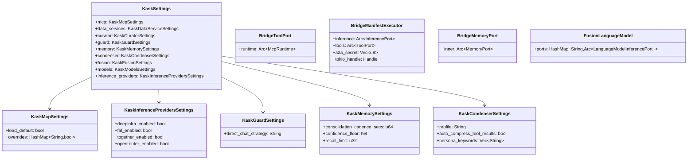

# kask_bridge — Reference

`kask_bridge` is the D8 composition root adapter — the sole bidirectional seam
between zed-kask and hKask. It connects zed's internal types to hKask's port
traits. Every integration seam (D1 through D10) passes through this crate. It
defines `KaskSettings`, `BridgeToolPort`, `BridgeManifestExecutor`,
`BridgeMemoryPort`, `LanguageModelInferencePort`, `FusionLanguageModel`, and
the settings structs that configure the kask subsystem.

## Source citations

| Symbol | Location |
|--------|----------|
| `KaskSettings` | `kask/crates/kask_bridge/src/settings.rs:35` |
| `KaskMcpSettings` | `kask/crates/kask_bridge/src/settings.rs:89` |
| `KaskDataServiceSettings` | `kask/crates/kask_bridge/src/settings.rs:109` |
| `KaskInferenceProvidersSettings` | `kask/crates/kask_bridge/src/settings.rs:143` |
| `KaskCuratorSettings` | `kask/crates/kask_bridge/src/settings.rs:189` |
| `KaskGuardSettings` | `kask/crates/kask_bridge/src/settings.rs:248` |
| `KaskMemorySettings` | `kask/crates/kask_bridge/src/settings.rs:263` |
| `KaskCondenserSettings` | `kask/crates/kask_bridge/src/settings.rs:297` |
| `BridgeToolPort` | `kask/crates/kask_bridge/src/tool_port.rs:25` |
| `BridgeManifestExecutor` | `kask/crates/kask_bridge/src/skill_executor.rs:30` |
| `BridgeMemoryPort` | `kask/crates/kask_bridge/src/memory.rs:1474` |
| `LoggingMemoryPort` | `kask/crates/kask_bridge/src/memory.rs:33` |
| `LanguageModelInferencePort` | `kask/crates/kask_bridge/src/inference.rs:46` |
| `InferencePort` impl | `kask/crates/kask_bridge/src/inference.rs:246` |
| `FusionLanguageModel` | `kask/crates/kask_bridge/src/fusion_model.rs:86` |
| `FusionProviderState` | `kask/crates/kask_bridge/src/fusion_model.rs:530` |
| `resolve_fusion_models` | `kask/crates/kask_bridge/src/fusion_model.rs:450` |
| `BridgeThreadCondenser` | `kask/crates/kask_bridge/src/condenser_bridge.rs:22` |
| `provision_agent` | `kask/crates/kask_bridge/src/identity.rs:212` |

## Settings model

The `KaskSettings` struct (`settings.rs:35`) is the root of the kask settings
hierarchy. It is registered with zed's settings system and appears in
`settings.json` under the `"kask"` key. Each sub-struct configures one
subsystem. Per the `.rules` "Kask settings defaults" trap, `Default` impls are
the single source of truth — `From<Content>` and `mcp_env()` read from them,
and `#[serde(default = "...)]` attributes are dead code because the settings
system deserializes `SettingsContent`, not `KaskSettings`.

<!-- DIAGRAM_ALIGNMENT
id: DIAG-DIA-BRIDGE-001
verified_date: 2026-07-29
verified_against: kask/crates/kask_bridge/src/settings.rs:35,89,143,248,263,297; kask/crates/kask_bridge/src/tool_port.rs:25; kask/crates/kask_bridge/src/skill_executor.rs:30; kask/crates/kask_bridge/src/memory.rs:1474; kask/crates/kask_bridge/src/fusion_model.rs:86
status: VERIFIED
-->

## Bridge adapters

Three bridge adapters implement hKask port traits against zed types:

- `BridgeToolPort` (`tool_port.rs:25`) implements hKask's `ToolPort` by
  wrapping zed's `McpRuntime`. The `McpRuntime` launches one copy of each
  kask MCP server for governed dispatch (OCAP token verification, gas/rjoule
  budgeting, `reg.tool.*` span emission).
- `BridgeManifestExecutor` (`skill_executor.rs:30`) implements zed's
  `SkillManifestExecutor` by delegating to hKask's `ManifestExecutor`. It
  holds an `Arc<dyn InferencePort>` (the `GuardedInferencePort`), an
  `Arc<dyn ToolPort>` (the `BridgeToolPort`), the `a2a_secret` for OCAP
  token minting, and a `tokio::runtime::Handle` that is entered around
  manifest execution so `tokio::time::timeout` has a reactor.
- `BridgeMemoryPort` (`memory.rs:1474`) implements zed's `ThreadMemoryPort`
  by delegating to hKask's `MemoryPort`. It wraps an `Arc<dyn MemoryPort>`
  — either a `LoggingMemoryPort` (startup, no DB) or a `RealMemoryPort`
  (after the zed user resolves).

The `LanguageModelInferencePort` (`inference.rs:46`, trait impl at `:246`)
implements hKask's `InferencePort` by wrapping zed's `LanguageModel`. It
holds only a `tokio::sync::mpsc::UnboundedSender` — the actual inference
call happens on the GPUI foreground executor via a spawned task that owns
the `AsyncApp`. This channel pattern solves the GPUI/tokio `Send`+`Sync`
boundary: the sender is `Send + Sync`, the receiver task is not, and the
two never cross threads. The `FusionLanguageModel` (`fusion_model.rs:86`)
wraps multiple `LanguageModelInferencePort` instances for multi-model
deliberation.

## See also

- [kask_bridge Explanation](./explanation.md): sequence diagram of the
  composition root.
- [kask_bridge How-to](./how-to.md): wiring a new kask hook.
- [kask_bridge Tutorial](./tutorial.md): your first kask hook.
- [hkask-types Reference](../hkask-types/reference.md): the port traits these
  adapters implement.

---

[^cockburn]: Cockburn, A. (2005). *Hexagonal Architecture.* <https://alistair.cockburn.us/hexagonal-architecture/>. The adapter pattern that this crate embodies: every port trait gets a bridge adapter.
