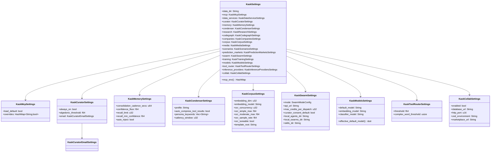
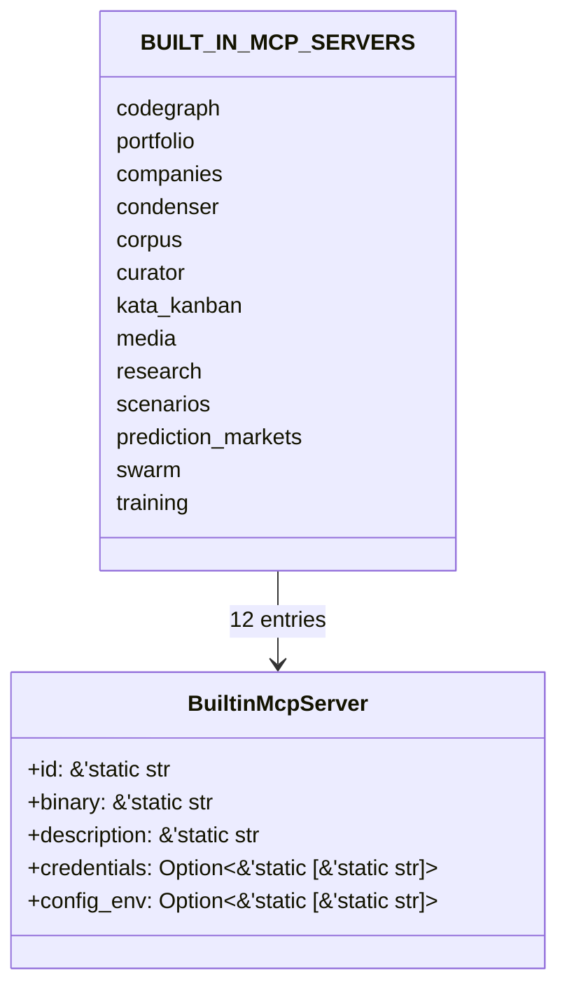

# kask_bridge — Reference

`kask_bridge` is the D8 composition root adapter — the sole bidirectional
seam between zed-kask and hKask. It implements hKask port traits
(`InferencePort`, `MemoryPort`, `SkillManifestExecutor`, `ThreadCondenser`,
`ContextInjector`, `MetacognitionProvider`, `CuratorDirectiveSink`,
`AlertEscalationSink`, `KaskCompletionPort`) over zed facilities
(`LanguageModel`, the in-process tool registry, the settings system, the
keychain). Every integration seam passes through this crate. The governing
invariant is at `kask/crates/kask_bridge/src/kask_bridge.rs:9-10`: hKask
crates never depend on zed crates; zed-kask depends on hKask; this bridge
is the only crate that depends on both sides.

## Source citations

| Symbol | Location |
|--------|----------|
| Crate root + re-exports | `kask/crates/kask_bridge/src/kask_bridge.rs:1-117` |
| `KASK_CREDENTIAL_NAMESPACE` | `kask/crates/kask_bridge/src/kask_bridge.rs:74-76` |
| `spawn_test_email` | `kask/crates/kask_bridge/src/kask_bridge.rs:87-104` |
| `KaskSettings` | `kask/crates/kask_bridge/src/settings.rs:36-102` |
| `KaskMcpSettings` | `kask/crates/kask_bridge/src/settings.rs:110-118` |
| `KaskDataServiceSettings` | `kask/crates/kask_bridge/src/settings.rs:130-152` |
| `KaskInferenceProvidersSettings` | `kask/crates/kask_bridge/src/settings.rs:164-174` |
| `KaskInferenceProvidersSettings::from_env` | `kask/crates/kask_bridge/src/settings.rs:183-189` |
| `KaskCollabSettings` | `kask/crates/kask_bridge/src/settings.rs:203-220` |
| `KaskCuratorSettings` | `kask/crates/kask_bridge/src/settings.rs:240-252` |
| `KaskCuratorEmailSettings` | `kask/crates/kask_bridge/src/settings.rs:270-295` |
| `KaskMemorySettings` | `kask/crates/kask_bridge/src/settings.rs:298-314` |
| `KaskCondenserSettings` | `kask/crates/kask_bridge/src/settings.rs:332-353` |
| `KaskCodegraphSettings` | `kask/crates/kask_bridge/src/settings.rs:367-371` |
| `KaskResearchSettings` | `kask/crates/kask_bridge/src/settings.rs:374-379` |
| `KaskCompaniesSettings` | `kask/crates/kask_bridge/src/settings.rs:382-395` |
| `KaskCorpusSettings` | `kask/crates/kask_bridge/src/settings.rs:398-425` |
| `KaskMediaSettings` | `kask/crates/kask_bridge/src/settings.rs:447-460` |
| `KaskPredictionMarketsSettings` | `kask/crates/kask_bridge/src/settings.rs:463-471` |
| `KaskScenariosSettings` | `kask/crates/kask_bridge/src/settings.rs:474-478` |
| `KaskSwarmSettings` | `kask/crates/kask_bridge/src/settings.rs:485-523` |
| `SwarmModeConfig` | `kask/crates/kask_bridge/src/settings.rs:529-537` |
| `KaskTrainingSettings` | `kask/crates/kask_bridge/src/settings.rs:582-591` |
| `KaskModelsSettings` | `kask/crates/kask_bridge/src/settings.rs:606-621` |
| `KaskModelsSettings::effective_default_model` | `kask/crates/kask_bridge/src/settings.rs:636-642` |
| `KaskToolRouterSettings` | `kask/crates/kask_bridge/src/settings.rs:666-675` |
| `KaskSettings::mcp_env` | `kask/crates/kask_bridge/src/settings.rs:717-1046` |
| `BuiltinMcpServer` | `kask/crates/kask_bridge/src/mcp_servers.rs:24-48` |
| `BUILT_IN_MCP_SERVERS` (12 servers) | `kask/crates/kask_bridge/src/mcp_servers.rs:53-394` |
| `BUILT_IN_MCP_SERVERS_IDS` | `kask/crates/kask_bridge/src/mcp_servers.rs:398-412` |
| `BUILT_IN_MCP_SERVERS_PAIRS` | `kask/crates/kask_bridge/src/mcp_servers.rs:416-451` |
| `find_server` | `kask/crates/kask_bridge/src/mcp_servers.rs:455-457` |
| `filter_credentials_for_server` | `kask/crates/kask_bridge/src/mcp_servers.rs:469-490` |
| `build_mcp_server_env` | `kask/crates/kask_bridge/src/mcp_servers.rs:514-559` |
| `filter_config_env_for_server` | `kask/crates/kask_bridge/src/mcp_servers.rs:571-592` |
| `provision_agent` | `kask/crates/kask_bridge/src/identity.rs:217-257` |
| `agent_name_from_username` | `kask/crates/kask_bridge/src/identity.rs:50-57` |
| `ProvisionedAgent` | `kask/crates/kask_bridge/src/identity.rs:187-194` |
| `ProvisionError` | `kask/crates/kask_bridge/src/identity.rs:30-40` |
| `RealMemoryPort` | `kask/crates/kask_bridge/src/memory.rs:65-119` |
| `RealMemoryPort::new` | `kask/crates/kask_bridge/src/memory.rs:128-253` |
| `MemoryPort` impl | `kask/crates/kask_bridge/src/memory.rs:628-956` |
| `BridgeMemoryPort` | `kask/crates/kask_bridge/src/memory.rs:1359-1361` |
| `curator_db_path` | `kask/crates/kask_bridge/src/memory/curator_stores.rs:20-29` |
| `CuratorStore` | `kask/crates/kask_bridge/src/memory/curator_stores.rs:52-161` |
| `open_curator_regulation_archive` | `kask/crates/kask_bridge/src/memory/curator_stores.rs:37-41` |
| `BridgeAlertEscalationSink` | `kask/crates/kask_bridge/src/memory/alert_escalation.rs` |
| `LanguageModelInferencePort` | `kask/crates/kask_bridge/src/inference.rs:179-182` |
| `LanguageModelInferencePort::new` | `kask/crates/kask_bridge/src/inference.rs:189-216` |
| `InferencePort` impl | `kask/crates/kask_bridge/src/inference.rs:459-654` |
| `LanguageModelEmbeddingPort` | `kask/crates/kask_bridge/src/inference.rs:691-693` |
| `BridgeEditPredictionPort` | `kask/crates/kask_bridge/src/inference.rs:942-944` |
| `NoModelInferencePort` | `kask/crates/kask_bridge/src/inference.rs:1132` |
| `InferenceIpcServer` | `kask/crates/kask_bridge/src/inference_ipc_server.rs` |
| `INFERENCE_PROVIDERS` | `kask/crates/kask_bridge/src/inference_providers.rs:44-69` |
| `DATA_SERVICES` | `kask/crates/kask_bridge/src/inference_providers.rs` |
| `BridgeManifestExecutor` | `kask/crates/kask_bridge/src/skill_executor.rs:88-109` |
| `BridgeManifestExecutor::new` | `kask/crates/kask_bridge/src/skill_executor.rs:118-134` |
| `seed_registry_to_disk` | `kask/crates/kask_bridge/src/skill_executor.rs:457-531` |
| `SkillManifestExecutor` impl | `kask/crates/kask_bridge/src/skill_executor.rs:534-908` |
| `ProfileResolver` trait | `kask/crates/kask_bridge/src/skill_executor.rs:50-52` |
| `SnapshotProfileResolver` | `kask/crates/kask_bridge/src/skill_executor.rs:67-81` |
| `BridgeContextInjector` | `kask/crates/kask_bridge/src/context_injector.rs:144-160` |
| `BridgeContextInjector::new` | `kask/crates/kask_bridge/src/context_injector.rs:168-181` |
| `BridgeContextInjector::new_curator` | `kask/crates/kask_bridge/src/context_injector.rs:191-204` |
| `should_recall` | `kask/crates/kask_bridge/src/context_injector.rs:110-115` |
| `format_recall_context` | `kask/crates/kask_bridge/src/context_injector.rs:127-141` |
| `TOOL_WARNING_PROMPT` | `kask/crates/kask_bridge/src/context_injector.rs:77-85` |
| `BridgeThreadCondenser` | `kask/crates/kask_bridge/src/condenser_bridge.rs:22-25` |
| `BridgeMetacognitionProvider` | `kask/crates/kask_bridge/src/metacognition_bridge.rs:16-24` |
| `BridgeCuratorDirectiveSink` | `kask/crates/kask_bridge/src/directive_bridge.rs:22-30` |
| `resolve_model_names` | `kask/crates/kask_bridge/src/model_resolution.rs` |

## Settings model

`KaskSettings` (`settings.rs:36-102`) is the root of the kask settings
hierarchy. It is registered with zed's settings system and appears in
`settings.json` under the `"kask"` key. Each sub-struct configures one
subsystem. Per the `.rules` "Kask settings defaults" trap, `Default` impls
are the single source of truth — `From<Content>` reads from them via
`unwrap_or(default.field)`, and `mcp_env()` compares against them. Do not
add `#[serde(default = "...)]` attributes; `KaskSettings` is never
deserialized directly (the settings system deserializes `SettingsContent`
and converts via `From`).



<!-- DIAGRAM_ALIGNMENT
id: DIAG-BRIDGE-003
verified_date: 2026-08-13
verified_against: kask/crates/kask_bridge/src/settings.rs:36-102,110-118,240-252,270-295,298-314,332-353,398-425,485-523,606-621,666-675,203-220
status: VERIFIED
-->

### Defaults table

| Sub-struct | Notable defaults | Source |
|------------|------------------|--------|
| `KaskMcpSettings` | `load_default = true` | `settings.rs:120-127` |
| `KaskCollabSettings` | `enabled = true`, `http_port = 3000`, `sqlite:kask_marketplace.db?mode=rwc` | `settings.rs:222-232` |
| `KaskCuratorSettings` | `always_on = true`, `algedonic_threshold = 0.8` | `settings.rs:254-262` |
| `KaskMemorySettings` | `consolidation_cadence_secs = 300`, `confidence_floor = 0.3`, `recall_limit = 5`, `auto_inject = true` | `settings.rs:316-326` |
| `KaskCondenserSettings` | `profile = "normal"`, `auto_compress_tool_results = false`, `saliency_window = 5` | `settings.rs:355-364` |
| `KaskCorpusSettings` | `embedding_dim = 1024`, `ocr_concurrency = 4`, `template_root = "kask/registry"` | `settings.rs:427-440` |
| `KaskSwarmSettings` | `mode = Abw`, `max_credits_per_dispatch = 50`, `curator_consent_default = false` | `settings.rs:557-579` |
| `KaskToolRouterSettings` | `threshold = 0.30`, `complex_word_threshold = 6` | `settings.rs:677-684` |

## MCP server registry

`BUILT_IN_MCP_SERVERS` (`mcp_servers.rs:53-394`) is the canonical list of
12 built-in kask MCP servers. Each entry binds an `id` to a `binary`, a
human-readable `description`, and two allowlists: `credentials` (keychain
secrets) and `config_env` (non-secret config from `mcp_env()`).



<!-- DIAGRAM_ALIGNMENT
id: DIAG-BRIDGE-004
verified_date: 2026-08-13
verified_against: kask/crates/kask_bridge/src/mcp_servers.rs:24-48,53-394,398-412
status: VERIFIED
-->

### Server table

| ID | Binary | Credentials allowlist size | Config allowlist size |
|----|--------|---------------------------|----------------------|
| `codegraph` | `hkask-mcp-codegraph` | 2 | 3 |
| `portfolio` | `hkask-mcp-portfolio` | 0 | 1 |
| `companies` | `hkask-mcp-companies` | 6 | 2 |
| `condenser` | `hkask-mcp-condenser` | 1 | 4 |
| `corpus` | `hkask-mcp-corpus` | 1 | 16 |
| `curator` | `hkask-mcp-curator` | 2 | 10 |
| `kata-kanban` | `hkask-mcp-kata-kanban` | 1 | 2 |
| `media` | `hkask-mcp-media` | 2 | 6 |
| `research` | `hkask-mcp-research` | 7 | 3 |
| `scenarios` | `hkask-mcp-scenarios` | 0 | 1 |
| `prediction-markets` | `hkask-mcp-prediction-markets` | 1 | 3 |
| `swarm` | `hkask-mcp-swarm` | 2 | 15 |
| `training` | `hkask-mcp-training` | 7 | 17 |

### Env-construction path

There is exactly one env-construction path for a kask MCP server child
process: `build_mcp_server_env` (`mcp_servers.rs:514-559`). It composes
two filters in load-bearing order:

1. **Config** — `filter_config_env_for_server` over `settings.mcp_env()`
   output (`mcp_servers.rs:524`).
2. **Credentials** — `filter_credentials_for_server` over
   `credential_urls_for_mcp(settings)`, resolved from the keychain
   (`mcp_servers.rs:531-547`).
3. **Inference socket** — injected last, not in any allowlist
   (`mcp_servers.rs:549-556`).

The two filters apply to disjoint key sets and never run in sequence on the
same map. Reversing the order drops every credential. This regression existed
in the previous two-path design; do not reintroduce it (`mcp_servers.rs:11-22`).

## `mcp_env` emission map

`KaskSettings::mcp_env` (`settings.rs:717-1046`) translates all kask settings
into the env vars MCP servers read at startup. Only non-empty/non-default
values are included — servers have their own fallback defaults.

| Env var | Source field | Emission condition |
|---------|--------------|--------------------|
| `HKASK_DATA_DIR` | `data_dir` | Always (settings → env → resolved default) |
| `HKASK_WEBID` | `HKASK_CURATOR_WEBID` env | When `HKASK_CURATOR_WEBID` is set |
| `HKASK_MCP_SERVER_IDS` | `BUILT_IN_MCP_SERVERS_IDS` | Always |
| `HKASK_TRANSACTIONS_DIR` | `companies.transactions_dir` | Always (D28; default `mcp/portfolio/transactions/`) |
| `HKASK_CODEGRAPH_DB` | `codegraph.db_path` | Non-empty |
| `HKASK_RSS_DB` | `research.rss_db` | Non-empty |
| `HKASK_CHRONIC_STALENESS_DAYS` | `companies.chronic_staleness_days` | `> 0` |
| `HKASK_FERMI_DEFAULTS` | `companies.fermi_defaults` | Non-empty |
| `HKASK_EMBEDDING_DIM` | `corpus.embedding_dim` | `!= default` |
| `HKASK_EMBEDDING_MODEL` | `corpus.embedding_model` or `models.embedding_model` | `!= default` / non-empty |
| `HKASK_OCR_*` | `corpus.ocr_*` | `!= default` |
| `HKASK_TEMPLATE_ROOT` | `corpus.template_root` | `!= default` |
| `HKASK_MEDIA_*_MODEL` | `media.*_model` | Non-empty |
| `HKASK_SCENARIOS_DATA` | `scenarios.data_dir` | Non-empty |
| `HKASK_PREDICTION_MARKETS_*` | `prediction_markets.*` | Non-empty / `> 0` |
| `HKASK_SWARM_MODE` | `swarm.mode` | `!= default` |
| `HKASK_ABW_API_URL` | `swarm.api_url` | Non-empty |
| `HKASK_ABW_MAX_CREDITS` | `swarm.max_credits_per_dispatch` | `!= default` |
| `HKASK_ABW_CURATOR_CONSENT_DEFAULT` | `swarm.curator_consent_default` | `!= default` |
| `HKASK_LOCAL_AGENTS_DIR` | `swarm.local_agents_dir` | Non-empty |
| `HKASK_LOCAL_SWARMS_DIR` | `swarm.local_swarms_dir` | Non-empty |
| `HKASK_SKILLS_DIR` | `swarm.skills_dir` | Non-empty |
| `HKASK_TRAINING_HOST` / `HKASK_TRAINING_CACHE_DIR` | `training.*` | Non-empty |
| `HKASK_DEFAULT_MODEL` | `models.default_model` | Non-empty |
| `HKASK_CLASSIFIER_MODEL` | `models.classifier_model` | Non-empty |
| `HKASK_MXROUTE_SERVER` / `HKASK_SMTP_USERNAME` / `HKASK_CURATOR_EMAIL` / `HKASK_ALERT_EMAIL` | `curator.email.*` | Non-empty |
| `HKASK_AUTHORIZED_EMAILS` | `curator.email.authorized_emails` | Non-empty |
| `HKASK_INBOX_POLL_INTERVAL_SECS` / `HKASK_DIGEST_INTERVAL_SECS` | `curator.email.*` | `> 0` |

## Memory data model

`RealMemoryPort` (`memory.rs:65-119`) stores each completed turn across two
SQLCipher databases. The user's `memory.db` holds the first-person episodic
record and prompt embeddings; the curator's sovereign `curator.db` holds the
shared semantic copies the curator MCP server reads.

```mermaid
erDiagram
    USER_MEMORY_DB ||--o{ EPISODIC_H_MEM : "stores"
    USER_MEMORY_DB ||--o{ EMBEDDING : "stores"
    CURATOR_DB ||--o{ SEMANTIC_H_MEM : "stores"
    CURATOR_DB ||--o{ REGULATION_ARCHIVE : "stores"
    CURATOR_DB ||--o{ ESCALATION_QUEUE : "stores"
    EPISODIC_H_MEM {
        visibility Private
        perspective user_webid
        ontology PKO
    }
    SEMANTIC_H_MEM {
        visibility Shared
        ontology DC
        perspective user_webid
    }
    EMBEDDING {
        model embedding_model
        dim 1024
    }
    REGULATION_ARCHIVE {
        sink reg.memory.encode
    }
```

<!-- DIAGRAM_ALIGNMENT
id: DIAG-BRIDGE-005
verified_date: 2026-08-13
verified_against: kask/crates/kask_bridge/src/memory.rs:51-64,65-119; kask/crates/kask_bridge/src/memory/curator_stores.rs:20-29,37-41
status: VERIFIED
-->

The curator DB path is resolved by `curator_db_path`
(`memory/curator_stores.rs:20-29`): `HKASK_CURATOR_DB` if set, else
`agent_db("curator")` resolved under the hKask data dir, yielding
`agents/curator/curator.db`. The `CuratorStore` handle
(`memory/curator_stores.rs:52-161`) is self-healing: when the initial open
fails, every access re-attempts it, and a successful re-open restores
curator memory mid-session without an app restart.

## Identity and provisioning

`provision_agent` (`identity.rs:217-257`) handles first-run setup as a set
of lookups and directory creation — no interactive onboarding:

1. Derive the agent name from the Zed username via `agent_name_from_username`
   (`identity.rs:50-57`), which sanitizes for filesystem use and returns
   `None` for empty/`unnamed` results.
2. Create the agent directory structure under the hKask data dir
   (`identity.rs:230-232`). D28: scaffolding subdirs removed — only the
   agent root is created; DBs create their own parent dir on open.
3. Resolve the DB passphrase from the keychain; if none exists, generate a
   random 8+ letter English word and store it (`identity.rs:264-283`).
4. Compute the absolute `memory.db` path under the agent root
   (`identity.rs:234`).

The result is a `ProvisionedAgent` (`identity.rs:187-194`) carrying
`db_path`, `passphrase`, and `webid` — everything needed to construct a
`RealMemoryPort` directly.

## Inference ports

| Port | Backed by | Use |
|------|-----------|-----|
| `LanguageModelInferencePort` (`inference.rs:179-182`) | zed `LanguageModel` | Full inference for MCP servers and the skill cascade |
| `LanguageModelEmbeddingPort` (`inference.rs:691-693`) | zed `LanguageModel` (OpenAI-compatible `/embeddings`) | Prompt embedding for memory recall |
| `BridgeEditPredictionPort` (`inference.rs:942-944`) | zed `LanguageModel` (OpenAI-compatible `/completions`) | Edit prediction via `KaskCompletionPort` |
| `NoModelInferencePort` (`inference.rs:1132`) | None | Pre-login stub; returns `NotConfigured` |

The `LanguageModelInferencePort` adapter holds only channel senders
(`Send + Sync`); the actual inference call happens on the GPUI foreground
executor via a spawned task that owns the `AsyncApp` (`inference.rs:189-216`).
This split is forced by GPUI: `AsyncApp` is not `Send`.

## Skill executor

`BridgeManifestExecutor` (`skill_executor.rs:88-109`) is the D1 seam between
zed's `SkillManifestExecutor` trait and hKask's `ManifestExecutor`. It holds
an `InferencePort`, a `ToolPort`, the registry manifests/templates dirs, a
tokio handle, an optional `ProfileResolver` for proposer/evaluator separation,
and a manifest cache keyed by skill name with mtime invalidation
(`skill_executor.rs:103-108`).

`seed_registry_to_disk` (`skill_executor.rs:457-531`) populates the on-disk
registry at `{kask_data_dir}/skills/registry/` (D28) from the compiled seed
payload. Existing files are never overwritten — user edits are sovereign.
The disk copy is the single runtime source of truth; YAML/J2 edits take
effect immediately without recompilation.

## Context injector

`BridgeContextInjector` (`context_injector.rs:144-160`) implements
`agent::ContextInjector`. Two constructors select the recall perspective:

- `new` (`context_injector.rs:168-181`) — recalls from the user's `memory.db`.
- `new_curator` (`context_injector.rs:191-204`) — recalls from the curator's
  `curator.db`.

The prompt-length gate `should_recall` (`context_injector.rs:110-115`)
skips recall for prompts shorter than 20 chars or 3 words. The
`auto_inject` flag gates memory recall only; the kask tool-use warnings
(`TOOL_WARNING_PROMPT`, `context_injector.rs:77-85`) are always emitted from
`inject_static_context` regardless of the flag.

## Re-exports

The crate root (`kask_bridge.rs:25-72`) re-exports the public surface:
`BridgeThreadCondenser`, `BridgeContextInjector`, `resolve_data_dir`,
identity types, inference ports, the IPC server, inference provider
descriptors, the MCP server registry and helpers, memory ports and
curator-store openers, `resolve_model_names`, all `Kask*Settings` structs,
`BridgeManifestExecutor` + `seed_registry_to_disk`, and
`BridgeMetacognitionProvider` / `BridgeCuratorDirectiveSink`. The
`KASK_CREDENTIAL_NAMESPACE` constant (`kask_bridge.rs:74-76`) is the URL
prefix for kask-namespaced keychain credentials.
