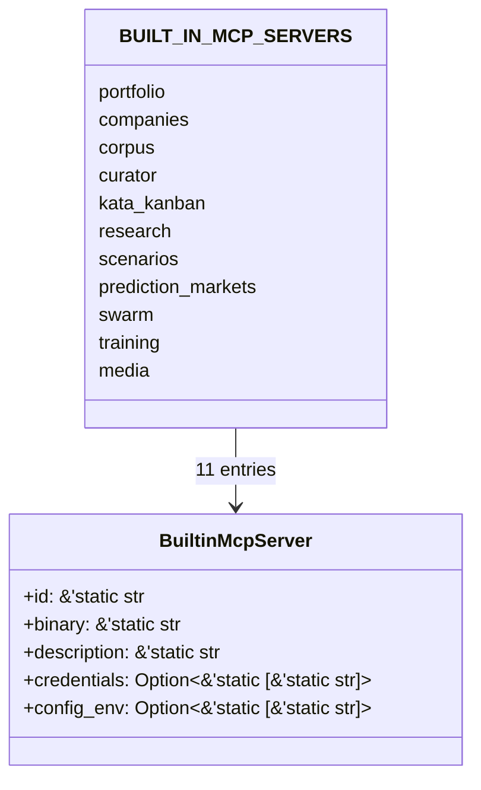

# kask_bridge — Reference

`kask_bridge` is the D8 composition root adapter — the sole bidirectional
seam between zed-kask and hKask. It implements hKask port traits
(`InferencePort`, `MemoryPort`, `ThreadCondenser`,
`ContextInjector`, `MetacognitionProvider`, `CuratorDirectiveSink`,
`AlertEscalationSink`, `KaskCompletionPort`) over zed facilities
(`LanguageModel`, the in-process tool registry, the settings system, the
keychain). Every integration seam passes through this crate. The governing
invariant is at `kask/crates/kask_bridge/src/kask_bridge.rs:9-10`: hKask
crates never depend on zed crates; zed-kask depends on hKask; this bridge
is the only crate that depends on both sides.

Skill execution is **not** a bridge concern. It follows upstream Zed's
body-injection model: `SkillTool::run` (`crates/agent/src/tools/skill_tool.rs:167`)
reads the `SKILL.md` body via `agent_skills::read_skill_body` and injects it
via `render_skill_envelope` (defined at `crates/agent/src/tools/skill_tool.rs:47`,
called from `crates/agent/src/agent.rs:2294`). The `lisp_eval` and
`render_template` built-in agent tools (`crates/agent/src/tools/`) support
the model-coordinated PDCA loops the SKILL.md bodies describe.

## Source citations

| Symbol | Location |
|--------|----------|
| Crate root + re-exports | `kask/crates/kask_bridge/src/kask_bridge.rs:40-105` |
| `KASK_CREDENTIAL_NAMESPACE` | `kask/crates/kask_bridge/src/credentials.rs:14` |
| `spawn_test_email` | `kask/crates/kask_bridge/src/credentials.rs:25` |
| `KaskSettings` | `kask/crates/kask_bridge/src/settings.rs:35-102` |
| `KaskGeneralSettings` | `kask/crates/kask_bridge/src/settings.rs:89-120` |
| `KaskMcpSettings` | `kask/crates/kask_bridge/src/settings.rs:136` |
| `KaskCuratorSettings` | `kask/crates/kask_bridge/src/settings.rs:161` |
| `KaskCuratorEmailSettings` | `kask/crates/kask_bridge/src/settings.rs:191` |
| `KaskMemorySettings` | `kask/crates/kask_bridge/src/settings.rs:211` |
| `KaskCondenserSettings` | `kask/crates/kask_bridge/src/settings.rs:253` |
| `KaskResearchSettings` | `kask/crates/kask_bridge/src/settings.rs:288` |
| `KaskCompaniesSettings` | `kask/crates/kask_bridge/src/settings.rs:296` |
| `KaskCorpusSettings` | `kask/crates/kask_bridge/src/settings.rs:307` |
| `KaskPredictionMarketsSettings` | `kask/crates/kask_bridge/src/settings.rs:356` |
| `KaskScenariosSettings` | `kask/crates/kask_bridge/src/settings.rs:376` |
| `KaskSwarmSettings` | `kask/crates/kask_bridge/src/settings.rs:384` |
| `SwarmModeConfig` | `kask/crates/kask_bridge/src/settings.rs:439` |
| `KaskTrainingSettings` | `kask/crates/kask_bridge/src/settings.rs:492` |
| `KaskMediaSettings` | `kask/crates/kask_bridge/src/settings.rs:510` |
| `KaskModelsSettings` | `kask/crates/kask_bridge/src/settings.rs:537` |
| `KaskModelsSettings::effective_default_model` | `kask/crates/kask_bridge/src/settings.rs:572` |
| `KaskToolRouterSettings` | `kask/crates/kask_bridge/src/settings.rs:603` |
| `KaskSettings::mcp_env` | `kask/crates/kask_bridge/src/settings.rs:674-712` + `kask/crates/kask_bridge/src/mcp_env.rs` (19 `emit_*` translators) |
| `BuiltinMcpServer` | `kask/crates/kask_bridge/src/mcp_servers.rs:28-50` |
| `BUILT_IN_MCP_SERVERS` (11 servers) | `kask/crates/kask_bridge/src/mcp_servers.rs:55-431` |
| `builtin_mcp_server_ids` | `kask/crates/kask_bridge/src/mcp_servers.rs:435-437` |
| `builtin_mcp_server_pairs` | `kask/crates/kask_bridge/src/mcp_servers.rs:442-447` |
| `find_server` | `kask/crates/kask_bridge/src/mcp_servers.rs:451-453` |
| `filter_credentials_for_server` | `kask/crates/kask_bridge/src/mcp_servers.rs:465-486` |
| `build_mcp_server_env` | `kask/crates/kask_bridge/src/mcp_servers.rs:523-649` |
| `DEFAULT_PASSPHRASE_ENV_VARS` | `kask/crates/kask_bridge/src/mcp_servers.rs:664-665` |
| `filter_config_env_for_server` | `kask/crates/kask_bridge/src/mcp_servers.rs:717-738` |
| `provision_agent` | `kask/crates/kask_bridge/src/identity.rs:92-125` |
| `agent_name_from_username` | `kask/crates/kask_bridge/src/identity.rs:51` |
| `ProvisionedAgent` | `kask/crates/kask_bridge/src/identity.rs:62` |
| `ProvisionError` | `kask/crates/kask_bridge/src/identity.rs:32` |
| `rotate_all_kask_db_passphrases` | `kask/crates/kask_bridge/src/identity.rs` |
| `BridgeRotationError` | `kask/crates/kask_bridge/src/identity.rs:251` |
| `RealMemoryPort` | `kask/crates/kask_bridge/src/memory.rs:74` |
| `RealMemoryPort::new` | `kask/crates/kask_bridge/src/memory.rs:130` |
| `MemoryPort` impl | `kask/crates/kask_bridge/src/memory.rs:454` |
| `BridgeMemoryPort` | `kask/crates/kask_bridge/src/memory.rs:1001` |
| `curator_db_path` | `kask/crates/kask_bridge/src/memory/curator_stores.rs:20` |
| `CuratorStore` | `kask/crates/kask_bridge/src/memory/curator_stores.rs:52` |
| `CuratorStore::try_heal` | `kask/crates/kask_bridge/src/memory/curator_stores.rs:118` |
| `open_curator_regulation_archive` | `kask/crates/kask_bridge/src/memory/curator_stores.rs:37` |
| `BridgeAlertEscalationSink` / `open_curator_escalation_queue` | `kask/crates/kask_bridge/src/memory/alert_escalation.rs` (re-exported at `memory.rs:48`) |
| `LanguageModelInferencePort` | `kask/crates/kask_bridge/src/inference_chat.rs:190` |
| `InferenceRequest` (channel payload) | `kask/crates/kask_bridge/src/inference_chat.rs:34` |
| `InferencePort` impl | `kask/crates/kask_bridge/src/inference_chat.rs:669` |
| `NoModelInferencePort` | `kask/crates/kask_bridge/src/inference_chat.rs:1016` |
| `LanguageModelEmbeddingPort` | `kask/crates/kask_bridge/src/inference_embedding.rs:48` |
| `BridgeEditPredictionPort` | `kask/crates/kask_bridge/src/inference_edit_prediction.rs:49` |
| `InferenceIpcServer` | `kask/crates/kask_bridge/src/inference_ipc_server.rs:154` |
| `INFERENCE_PROVIDERS` | `kask/crates/kask_bridge/src/inference_providers.rs:55` |
| `DATA_SERVICES` | `kask/crates/kask_bridge/src/inference_providers.rs:155` |
| `credential_urls_for_mcp` | `kask/crates/kask_bridge/src/inference_providers.rs:327` |
| `SkillTool::run` (D1 — body injection) | `crates/agent/src/tools/skill_tool.rs:167` |
| `render_skill_envelope` | `crates/agent/src/tools/skill_tool.rs:47` |
| `lisp_eval` tool | `crates/agent/src/tools/lisp_eval_tool.rs` |
| `render_template` tool | `crates/agent/src/tools/render_template_tool.rs` |
| `set_template_base_path` (OnceLock) | `crates/agent/src/agent.rs:4367` (wired at `crates/zed/src/main.rs:711`) |
| `BridgeContextInjector` | `kask/crates/kask_bridge/src/context_injector.rs:122` |
| `BridgeContextInjector::new` | `kask/crates/kask_bridge/src/context_injector.rs:142` |
| `BridgeContextInjector::new_curator` | `kask/crates/kask_bridge/src/context_injector.rs:164` |
| `should_recall` | `kask/crates/kask_bridge/src/context_injector.rs:85` |
| `format_recall_context` | `kask/crates/kask_bridge/src/context_injector.rs:102` |
| Tool warnings (template) | `crates/agent/src/templates/system_prompt.hbs` (unconditional section) |
| `BridgeThreadCondenser` | `kask/crates/kask_bridge/src/condenser_bridge.rs:22` |
| `BridgeMetacognitionProvider` | `kask/crates/kask_bridge/src/metacognition_bridge.rs:16` |
| `BridgeCuratorDirectiveSink` | `kask/crates/kask_bridge/src/directive_bridge.rs:22` |
| `BridgeAlgedonicLogSink` | `kask/crates/kask_bridge/src/algedonic_log_bridge.rs:31` |
| `BridgeContextServerHealthSource` | `kask/crates/kask_bridge/src/context_server_health_bridge.rs:34` |
| `BridgeRolloutEventSource` / `check_harness_regressions` | `kask/crates/kask_bridge/src/rollout_event_bridge.rs:35` |
| `resolve_model_names` | `kask/crates/kask_bridge/src/model_resolution.rs` |

## Settings model

`KaskSettings` (`settings.rs:35-102`) is the root of the kask settings
hierarchy. It is registered with zed's settings system and appears in
`settings.json` under the `"kask"` key. Each sub-struct configures one
subsystem. Per the `.rules` "Kask settings defaults" trap, `Default` impls
are the single source of truth — `From<Content>` reads from them via
`unwrap_or(default.field)`, and `mcp_env()` compares against them. Do not
add `#[serde(default = "...)]` attributes; `KaskSettings` is never
deserialized directly (the settings system deserializes `SettingsContent`
and converts via `From`).

```mermaid
classDiagram
    class KaskSettings {
        +data_dir: String
        +artifacts_dir: String
        +general: KaskGeneralSettings
        +mcp: KaskMcpSettings
        +curator: KaskCuratorSettings
        +memory: KaskMemorySettings
        +condenser: KaskCondenserSettings
        +research: KaskResearchSettings
        +companies: KaskCompaniesSettings
        +corpus: KaskCorpusSettings
        +scenarios: KaskScenariosSettings
        +prediction_markets: KaskPredictionMarketsSettings
        +swarm: KaskSwarmSettings
        +training: KaskTrainingSettings
        +media: KaskMediaSettings
        +models: KaskModelsSettings
        +tool_router: KaskToolRouterSettings
        +mcp_env() HashMap
    }
    class KaskGeneralSettings {
        +max_concurrency: u32
        +inference_timeout_secs: u64
    }
    class KaskMcpSettings {
        +load_default: bool
        +overrides: HashMap~String,bool~
    }
    class KaskCuratorSettings {
        +always_on: bool
        +algedonic_threshold: f64
        +email: KaskCuratorEmailSettings
    }
    class KaskMemorySettings {
        +consolidation_cadence_secs: u64
        +confidence_floor: f64
        +recall_limit: u32
        +recall_min_confidence: f64
        +auto_inject: bool
        +memory_life_days: u32
    }
    class KaskCondenserSettings {
        +profile: String
        +auto_compress_tool_results: bool
        +persona_keywords: Vec~String~
        +saliency_window: u32
    }
    class KaskCorpusSettings {
        +embedding_dim: u32
        +embedding_model: String
        +ocr_simple_max: f64
        +ocr_moderate_max: f64
        +ocr_sample_rate: f64
        +ocr_tuneable: bool
        +template_root: String
    }
    class KaskSwarmSettings {
        +mode: SwarmModeConfig
        +api_url: String
        +max_credits_per_dispatch: u32
        +curator_consent_default: bool
        +skills_dir: String
        +default_agent_model: String
        +a2a_http_enabled: bool
        +memory_passphrase: String
        +embedding_dim: usize
    }
    class KaskMediaSettings {
        +tts_model: String
        +stt_model: String
        +vision_model: String
        +image_gen_model: String
        +video_model: String
    }
    class KaskModelsSettings {
        +default_model: String
        +embedding_model: String
        +classifier_model: String
        +effective_default_model() &str
    }
    class KaskToolRouterSettings {
        +threshold: f64
        +complex_word_threshold: usize
    }
    KaskSettings --> KaskGeneralSettings
    KaskSettings --> KaskMcpSettings
    KaskSettings --> KaskCuratorSettings
    KaskSettings --> KaskMemorySettings
    KaskSettings --> KaskCondenserSettings
    KaskSettings --> KaskCorpusSettings
    KaskSettings --> KaskSwarmSettings
    KaskSettings --> KaskMediaSettings
    KaskSettings --> KaskModelsSettings
    KaskSettings --> KaskToolRouterSettings
    KaskCuratorSettings --> KaskCuratorEmailSettings
```



<!-- DIAGRAM_ALIGNMENT
id: DIAG-BRIDGE-003
verified_date: 2026-08-28
verified_against: kask/crates/kask_bridge/src/settings.rs:35-102,89-120,136,161,191,211,253,307,384,510,537,603
status: VERIFIED
-->

### Defaults table

| Sub-struct | Notable defaults | Source |
|------------|------------------|--------|
| `KaskGeneralSettings` | `max_concurrency = 96`, `inference_timeout_secs = 300` | `settings.rs:120-128` |
| `KaskMcpSettings` | `load_default = true` | `settings.rs:145-150` |
| `KaskCuratorSettings` | `always_on = true`, `algedonic_threshold = 0.8` | `settings.rs:174-180` |
| `KaskMemorySettings` | `consolidation_cadence_secs = 300`, `confidence_floor = 0.3`, `recall_limit = 5`, `recall_min_confidence = 0.3`, `auto_inject = true` | `settings.rs:235-244` |
| `KaskCondenserSettings` | `profile = "normal"`, `auto_compress_tool_results = false`, `saliency_window = 5` | `settings.rs:275-283` |
| `KaskCorpusSettings` | `embedding_dim = 1024`, `ocr_simple_max = 0.05`, `ocr_moderate_max = 0.15`, `ocr_sample_rate = 0.10`, `ocr_tuneable = true`, `template_root = "kask/registry"` | `settings.rs:332-343` |
| `KaskSwarmSettings` | `max_credits_per_dispatch = 50`, `curator_consent_default = false`, `memory_passphrase = "allostery"`, `embedding_dim = 1024` | `settings.rs:465-487` |
| `KaskToolRouterSettings` | `threshold = 0.30`, `complex_word_threshold = 6` | `settings.rs:613-620` |

## MCP server registry

`BUILT_IN_MCP_SERVERS` (`mcp_servers.rs:55-431`) is the canonical list of
**11** built-in kask MCP servers — one per server crate under
`kask/mcp-servers/`. Each entry binds an `id` to a `binary`, a
human-readable `description`, and two allowlists: `credentials` (keychain
secrets) and `config_env` (non-secret config from `mcp_env()`).



<!-- DIAGRAM_ALIGNMENT
id: DIAG-BRIDGE-004
verified_date: 2026-08-28
verified_against: kask/crates/kask_bridge/src/mcp_servers.rs:28-50,55-431,435-447
status: VERIFIED
-->

### Server table

| ID | Binary | Credentials allowlist size | Config allowlist size |
|----|--------|---------------------------|----------------------|
| `portfolio` | `hkask-mcp-portfolio` | 0 | 2 |
| `companies` | `hkask-mcp-companies` | 6 | 3 |
| `corpus` | `hkask-mcp-corpus` | 1 | 20 |
| `curator` | `hkask-mcp-curator` | 2 | 11 |
| `kata-kanban` | `hkask-mcp-kata-kanban` | 1 | 4 |
| `research` | `hkask-mcp-research` | 6 | 4 |
| `scenarios` | `hkask-mcp-scenarios` | 0 | 2 |
| `prediction-markets` | `hkask-mcp-prediction-markets` | 1 | 4 |
| `swarm` | `hkask-mcp-swarm` | 2 | 18 unique (19 literals — `HKASK_SWARM_LEDGER_PATH` appears twice, `mcp_servers.rs:318,350`) |
| `training` | `hkask-mcp-training` | 5 | 18 |
| `media` | `hkask-mcp-media` | 2 | 8 |

The `media` entry (`mcp_servers.rs:405-430`) is the newest server. Its
registered tool surface is pinned at exactly 67 tools by
`tool_surface_is_exactly_67_registered_tools`
(`kask/mcp-servers/hkask-mcp-media/src/hkask_mcp_media.rs:389-392`), and
every registered tool must carry a non-`None` ontology anchor
(`hkask_mcp_media.rs:398-408`).

There are no separate ID/pair slices to maintain — `builtin_mcp_server_ids()`
(`mcp_servers.rs:435-437`) and `builtin_mcp_server_pairs()`
(`mcp_servers.rs:442-447`) derive their output from `BUILT_IN_MCP_SERVERS`
directly. The derivation is pinned by `builtin_mcp_server_ids_match_main_registry`
(`mcp_servers.rs:765-768`) and `builtin_mcp_server_pairs_match_main_registry`
(`mcp_servers.rs:771-777`).

### Env-construction path

There is exactly one env-construction path for a kask MCP server child
process: `build_mcp_server_env` (`mcp_servers.rs:523-649`). It composes
the filters in load-bearing order:

1. **Config** — `filter_config_env_for_server` over `settings.mcp_env()`
   output (`mcp_servers.rs:533`).
2. **Credentials** — `filter_credentials_for_server` over
   `credential_urls_for_mcp()`, resolved from the keychain with shell
   overrides winning (`mcp_servers.rs:551-566`). For the two
   startup-default passphrases (`DEFAULT_PASSPHRASE_ENV_VARS`,
   `mcp_servers.rs:664-665`), a provisioning tier resolves or creates the
   `"allostery"` default and mirrors it into zed's keychain
   (`mcp_servers.rs:567-595`). The key's presence in the keychain is the
   toggle — there are no settings.json `*_enabled` bools. A miss (after
   the default tier) warns once per `(server_id, env_var)` pair via the
   `WARNED_MISSING_CREDENTIALS` dedup set (`mcp_servers.rs:493-495,
   608-622`).
3. **Inference socket** — injected last, not in any allowlist
   (`mcp_servers.rs:627-632`).
4. **Inference establishment timeout** — published so IPC clients
   outlast the server's deadline (`mcp_servers.rs:641-646`).

The two filters apply to disjoint key sets and never run in sequence on the
same map. Reversing the order drops every credential. This regression existed
in the previous two-path design; do not reintroduce it (`mcp_servers.rs:11-22`).

## `mcp_env` emission map

`KaskSettings::mcp_env` (`settings.rs:674-712`) composes the env vars MCP
servers read at startup by delegating to 19 `emit_*_env` free functions in
`mcp_env.rs` (one per settings subsection, plus
`emit_operator_override_env` and `emit_curator_webid_env`). Only
non-empty/non-default values are included — servers have their own fallback
defaults.

| Env var | Emitter | Emission condition |
|---------|---------|--------------------|
| `HKASK_DATA_DIR` | `mcp_env()` root resolution (`settings.rs` `resolve_root_dir`) | Always (settings → env → resolved default) |
| `HKASK_MAX_CONCURRENCY` / `HKASK_INFERENCE_TIMEOUT_SECS` | `emit_general_env` (`mcp_env.rs:40`) | `!= default` |
| `HKASK_WEBID` | `emit_curator_webid_env` (`mcp_env.rs:53`) | When `HKASK_CURATOR_WEBID` is set |
| `HKASK_MCP_SERVER_IDS` | `emit_mcp_server_ids_env` (`mcp_env.rs:64-72`) | Always (joined `builtin_mcp_server_ids()`) |
| `HKASK_TRANSACTIONS_DIR` | `emit_portfolio_env` (`mcp_env.rs`) | Always (D28; `portfolio-mcp/transactions/` under the artifacts dir) |
| `HKASK_ARTIFACTS_DIR` | `mcp_env()` root resolution (`settings.rs` `resolve_root_dir`) | Always (settings → env → resolved default; visible artifacts root) |
| `HKASK_RSS_DB` | `emit_research_env` (`mcp_env.rs:95`) | Non-empty |
| `HKASK_CHRONIC_STALENESS_DAYS` / `HKASK_FERMI_DEFAULTS` | `emit_companies_env` (`mcp_env.rs:104`) | `> 0` / non-empty |
| `HKASK_EMBEDDING_DIM` / `HKASK_EMBEDDING_MODEL` | `emit_corpus_embedding_env` (`mcp_env.rs:141`) | `!= default` |
| `HKASK_OCR_*` | `emit_corpus_ocr_env` / triage vars (`mcp_env.rs:166`) | `!= default` |
| `HKASK_TEMPLATE_ROOT` | `emit_corpus_template_root_env` (`mcp_env.rs:194`) | `!= default` |
| `HKASK_SCENARIOS_DATA` | `emit_scenarios_env` (`mcp_env.rs:217`) | Always (D28; `mcp/scenarios/`) |
| `HKASK_PREDICTION_MARKETS_*` | `emit_prediction_markets_env` (`mcp_env.rs:231`) | Non-empty / `> 0` / Always (D28) |
| `HKASK_SWARM_MODE` / `HKASK_ABW_*` / `HKASK_SWARM_*` | `emit_swarm_env` (`mcp_env.rs:265`) | `!= default` / non-empty |
| `HKASK_SKILLS_DIR` | `emit_swarm_env` (`mcp_env.rs:307`) | Non-empty (retained for settings-UI compatibility; the swarm server no longer reads it) |
| `HKASK_LOCAL_AGENTS_DIR` / `HKASK_LOCAL_SWARMS_DIR` / `HKASK_SWARM_MEMORY_DB` | `emit_swarm_env` | Always (D28; derived from `data_dir`) |
| `HKASK_TRAINING_HOST` / `HKASK_TRAINING_CACHE_DIR` | `emit_training_env` (`mcp_env.rs:337`) | Non-empty |
| `HKASK_MEDIA_*_MODEL` | `emit_media_env` (`mcp_env.rs:352`) | Non-empty |
| `HKASK_DEFAULT_MODEL` / `HKASK_CLASSIFIER_MODEL` | `emit_models_env` (`mcp_env.rs:412`) | Non-empty |
| `HKASK_MXROUTE_SERVER` / `HKASK_SMTP_USERNAME` / `HKASK_CURATOR_EMAIL` / `HKASK_ALERT_EMAIL` / `HKASK_AUTHORIZED_EMAILS` | `emit_curator_email_env` (`mcp_env.rs:438`) | Non-empty |
| Operator overrides (`HKASK_SWARM_EVENTS_PATH`, retention knobs, RunPod/Nebius, `HKASK_ABW_*`) | `emit_operator_override_env` (`mcp_env.rs:402`) | Env passthrough when set |

## Memory data model

`RealMemoryPort` (`memory.rs:74`) stores each completed turn across two
SQLCipher databases. The user's `memory.db` holds the first-person episodic
record and prompt embeddings; the curator's sovereign `curator.db` holds the
shared semantic copies the curator MCP server reads.

```mermaid
erDiagram
    USER_MEMORY_DB ||--o{ EPISODIC_H_MEM : "stores"
    USER_MEMORY_DB ||--o{ EMBEDDING : "stores"
    CURATOR_DB ||--o{ SEMANTIC_H_MEM : "stores"
    CURATOR_DB ||--o{ REGULATION_ARCHIVE : "stores"
    CURATOR_DB ||--o{ ESCALATION_QUEUE : "stores"
    EPISODIC_H_MEM {
        visibility Private
        perspective user_webid
        ontology PKO
    }
    SEMANTIC_H_MEM {
        visibility Shared
        ontology DC
        perspective user_webid
    }
    EMBEDDING {
        model embedding_model
        dim 1024
    }
    REGULATION_ARCHIVE {
        sink reg.memory.encode
    }
```

<!-- DIAGRAM_ALIGNMENT
id: DIAG-BRIDGE-005
verified_date: 2026-08-28
verified_against: kask/crates/kask_bridge/src/memory.rs:74-130,454; kask/crates/kask_bridge/src/memory/curator_stores.rs:20-52
status: VERIFIED
-->

The curator DB path is resolved by `curator_db_path`
(`memory/curator_stores.rs:20`): `HKASK_CURATOR_DB` if set, else
`agent_db("curator")` resolved under the hKask data dir, yielding
`agents/curator/curator.db`. The `CuratorStore` handle
(`memory/curator_stores.rs:52`) is self-healing: when the initial open
fails, every access re-attempts it via `try_heal`
(`memory/curator_stores.rs:118`), and a successful re-open restores
curator memory mid-session without an app restart.

## Identity and provisioning

`provision_agent` (`identity.rs:92-125`) handles first-run setup as a set
of lookups and directory creation — no interactive onboarding:

1. Derive the agent name from the Zed username via `agent_name_from_username`
   (`identity.rs:51`), which sanitizes for filesystem use and returns
   `None` for empty/`unnamed` results.
2. Create the agent directory structure under the hKask data dir
   (`identity.rs:104-107`). D28: scaffolding subdirs removed — only the
   agent root is created; DBs create their own parent dir on open.
3. Resolve the DB passphrase: env override → existing keychain entry →
   default `"allostery"` stored on first run (`identity.rs:110-118`). The
   user can change it later via the settings UI (Security page), which
   triggers atomic DB rotation.
4. Compute the absolute `memory.db` path under the agent root
   (`identity.rs:109`).

The result is a `ProvisionedAgent` (`identity.rs:62`) carrying
`db_path`, `passphrase`, and `webid` — everything needed to construct a
`RealMemoryPort` directly.

`provision_swarm_memory_passphrase` (`identity.rs:208`) mirrors this
pattern for the swarm memory DB, also defaulting to `"allostery"` on first
run. The username-independent halves are exposed as `pub(crate)`
`provision_db_passphrase` / `provision_swarm_memory_passphrase` so
`build_mcp_server_env` can provision the default at MCP-launch time,
login or not (`identity.rs:131-146`).

### Passphrase rotation

`rotate_curator_db_passphrase` (`identity.rs:321`) and
`rotate_swarm_memory_db_passphrase` (`identity.rs:366`) wrap
`hkask_storage::rotate_passphrase` to re-encrypt the DB under a new
passphrase. Both resolve the old passphrase from the keychain and the DB
path from env/data-dir, then call the storage-layer rotation. The caller
writes the new passphrase to the keychain ONLY after `Ok(())` — a failed
rotation leaves the old passphrase in effect.

`BridgeRotationError` (`identity.rs:251`) wraps `RotationError` with
context about which DB was being rotated.

## Inference ports

| Port | Backed by | Use |
|------|-----------|-----|
| `LanguageModelInferencePort` (`inference_chat.rs:190`) | zed `LanguageModel` | Full inference for MCP servers and the skill cascade |
| `LanguageModelEmbeddingPort` (`inference_embedding.rs:48`) | zed `LanguageModel` (OpenAI-compatible `/embeddings`) | Prompt embedding for memory recall |
| `BridgeEditPredictionPort` (`inference_edit_prediction.rs:49`) | zed `LanguageModel` (OpenAI-compatible `/completions`) | Edit prediction via `KaskCompletionPort` |
| `NoModelInferencePort` (`inference_chat.rs:1016`) | None | Pre-login stub; returns `NotConfigured` |

The `LanguageModelInferencePort` adapter holds only channel senders
(`Send + Sync`, `inference_chat.rs:190-192`); the actual inference call
happens on the GPUI foreground executor via a spawned task that owns the
`AsyncApp` (`inference_chat.rs:230-232`). This split is forced by GPUI:
`AsyncApp` is not `Send`.

## Skill execution (D1 — body injection)

Skill execution is **not** implemented in `kask_bridge`. It follows upstream
Zed's body-injection model and lives entirely in the `agent` crate:

- `SkillTool::run` (`crates/agent/src/tools/skill_tool.rs:167`) reads the
  `SKILL.md` body from disk via `agent_skills::read_skill_body` and injects
  it into the conversation via `render_skill_envelope`
  (`crates/agent/src/tools/skill_tool.rs:47`; call site at
  `crates/agent/src/agent.rs:2294`). The model reads the body and follows the
  instructions. `SkillTool::new(skills, fs)` matches the upstream constructor.
- `lisp_eval` (`crates/agent/src/tools/lisp_eval_tool.rs`) — wraps
  `hkask_lisp::eval_sandboxed_with_budget`. Registered in `add_default_tools`.
  The agent calls it directly when a SKILL.md instructs deterministic
  computation (convergence signals, invariant checks, scoring).
- `render_template` (`crates/agent/src/tools/render_template_tool.rs`) —
  renders Jinja2 templates from `kask/registry/templates/` via `minijinja`.
  Registered in `add_default_tools` (alongside `lisp_eval`). The template base
  path is wired via `agent::set_template_base_path()` (OnceLock,
  `crates/agent/src/agent.rs:4367`), called from `crates/zed/src/main.rs:711`
  at startup (dev: `kask/registry/templates/`, prod:
  `{kask_data_dir}/skills/registry/templates/`).

PDCA iteration is model-coordinated: the SKILL.md body describes
convergence criteria, and the model uses `lisp_eval` for deterministic
convergence checks and `render_template` for structured prompt scaffolding
within iterations.

## Context injector

`BridgeContextInjector` (`context_injector.rs:122`) implements
`agent::ContextInjector`. Two constructors select the recall perspective:

- `new` (`context_injector.rs:142`) — recalls from the user's `memory.db`.
- `new_curator` (`context_injector.rs:164`) — recalls from the curator's
  `curator.db`.

The prompt-length gate `should_recall` (`context_injector.rs:85`)
skips recall for prompts shorter than 20 chars or 3 words. The
`auto_inject` flag gates memory recall only; the kask tool-use warnings
are baked into the `system_prompt.hbs` template as an unconditional section.

Per-turn `inject_context` merges two recall paths into a single
`Role::System` message: prompt-salient recall (`recall_context`, embedding
similarity) and thread-scoped recall (`recall_thread`, entity match). Both
are fresh every turn — no session-lifetime snapshot. Recalled snippets are
wrapped in an explicit `MEMORY_CONTEXT_OPEN` … `MEMORY_CONTEXT_CLOSE`
data boundary (`context_injector.rs:56-60`) so the model treats recalled
memory as data, not instructions.

## Re-exports

The crate root (`kask_bridge.rs:40-105`) re-exports the public surface:
`BridgeThreadCondenser`, `BridgeContextInjector`, the `DEFAULT_*_MODEL`
constants from `hkask_inference::model_constants`, `resolve_data_dir`,
identity types (`provision_agent`, `provision_swarm_memory_passphrase`,
`rotate_*_passphrase`, `ProvisionedAgent`, `ProvisionError`,
`BridgeRotationError`, `agent_name_from_username`), inference ports
(`LanguageModelInferencePort`, `NoModelInferencePort`,
`BridgeEditPredictionPort`, `LanguageModelEmbeddingPort`), the IPC server
(`InferenceIpcServer`, `WorktreeSpawner`, `set_worktree_spawner`),
inference provider descriptors (`INFERENCE_PROVIDERS`, `DATA_SERVICES`,
`credential_urls_for_mcp`, `mirror_credential_to_provider`,
`mirror_kask_credentials_to_providers`, `resolve_embedding_credentials`),
the inference socket accessors, the MCP server registry and helpers
(`BUILT_IN_MCP_SERVERS`, `BuiltinMcpServer`, `build_mcp_server_env`,
`builtin_mcp_server_ids`, `builtin_mcp_server_pairs`,
`filter_credentials_for_server`), memory ports and curator-store openers
(`BridgeMemoryPort`, `RealMemoryPort`, `BridgeAlertEscalationSink`,
`open_curator_escalation_queue`, `open_curator_regulation_archive`),
`resolve_model_names`, all `Kask*Settings` structs (including
`KaskGeneralSettings` and `KaskMediaSettings`) plus `SwarmModeConfig`,
`BridgeMetacognitionProvider`, `BridgeCuratorDirectiveSink`,
`BridgeAlgedonicLogSink`, `BridgeContextServerHealthSource`, and the
rollout-event bridge (`BridgeRolloutEventSource`,
`HarnessRegression`, `check_harness_regressions`). The
`KASK_CREDENTIAL_NAMESPACE` constant (`credentials.rs:14`) is the URL
prefix for kask-namespaced keychain credentials. Skill-execution types are
**not** re-exported here — they live in the `agent` crate (see "Skill
execution" above).
