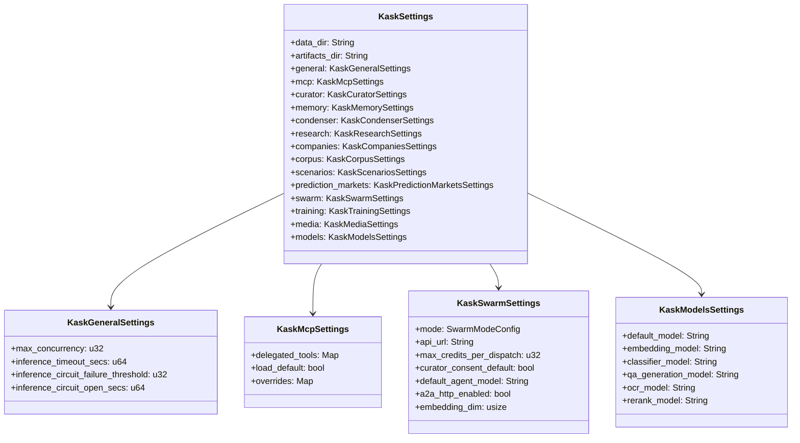
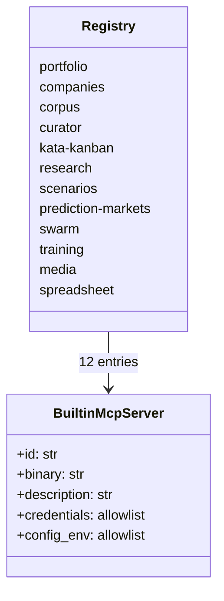

# kask_bridge — Reference

`kask_bridge` is the D8 adapter between portable hKask ports and Zed-side
runtime facilities. Its governing dependency invariant and module root are at
`kask/crates/kask_bridge/src/kask_bridge.rs:3-46`.

## Current module surface

The crate root declares 25 top-level modules
(`kask/crates/kask_bridge/src/kask_bridge.rs:23-47,94-109`):

`condenser_bridge`, `context_injector`, `credentials`,
`database_maintenance`, `delegation_grants`, `identity`, `inference_chat`,
`inference_edit_prediction`, `inference_resilience`, `passphrase_rotation`,
`inference_embedding`, `inference_ipc_server`, `inference_providers`,
`inference_socket`, `mcp_env`, `mcp_servers`, `memory`, `model_resolution`,
`settings`, `metacognition_bridge`, `directive_bridge`,
`algedonic_log_bridge`, `context_server_health_bridge`, `ocr_health_bridge`,
and `rollout_event_bridge`.

The public re-exports are defined at
`kask/crates/kask_bridge/src/kask_bridge.rs:28-118`. Skill execution is not a
bridge module; the agent-side `SkillTool` owns body injection.

## Settings hierarchy

`KaskSettings` contains the data and artifact roots plus 14 subsystem sections:
`general`, `mcp`, `curator`, `memory`, `condenser`, `research`, `companies`,
`corpus`, `scenarios`, `prediction_markets`, `swarm`, `training`, `media`, and
`models` (`kask/crates/kask_bridge/src/settings.rs:35-96`).

<!-- DIAGRAM_ALIGNMENT
id: DIAG-BRIDGE-003
verified_date: 2026-09-19
verified_against: kask/crates/kask_bridge/src/settings.rs:35-96; kask/crates/kask_bridge/src/settings.rs:98-166; kask/crates/kask_bridge/src/settings.rs:413-446; kask/crates/kask_bridge/src/settings.rs:581-615
status: VERIFIED
-->

There is no general batch-size setting and no swarm-specific passphrase setting.
The database passphrase is provisioned once and shared by SQLCipher consumers
(`crates/zed/src/main.rs:1620-1624`); scheduled rotation is applied at startup
by `run_pending_db_passphrase_rotation` (`crates/zed/src/main.rs:372`) — see
[`kask-settings.md`](../../reference/kask-settings.md) under Passphrase rotation.

### Defaults

| Settings type | Current defaults | Evidence |
| --- | --- | --- |
| `KaskGeneralSettings` | concurrency 96; timeout 300s; circuit threshold 3; open interval 30s | `kask/crates/kask_bridge/src/settings.rs:129-137` |
| `KaskMcpSettings` | load defaults; empty overrides; empty delegated-tool grants | `kask/crates/kask_bridge/src/settings.rs:160-168` |
| `KaskCuratorSettings` | always on; algedonic threshold 0.8 | `kask/crates/kask_bridge/src/settings.rs:190-198` |
| `KaskMemorySettings` | consolidation 300s; confidence 0.3; recall 5 at 0.3; auto-inject; distillation 600s/300s; forgetting 7 days | `kask/crates/kask_bridge/src/settings.rs:270-283` |
| `KaskCondenserSettings` | normal profile; incoming-result compression off | `kask/crates/kask_bridge/src/settings.rs:291-311` |
| `KaskCompaniesSettings` | staleness 0; no Fermi override; required return 0.15 | `kask/crates/kask_bridge/src/settings.rs:336-344` |
| `KaskCorpusSettings` | dimension 1024; configured embedding default; template root `kask/registry` | `kask/crates/kask_bridge/src/settings.rs:361-369` |
| `KaskSwarmSettings` | ABW mode; credit ceiling 50; curator consent off; A2A HTTP off; dimension 1024; string overrides empty | `kask/crates/kask_bridge/src/settings.rs:480-501` |
| `KaskMediaSettings` | STT and vision use shared constants; TTS/image/video empty | `kask/crates/kask_bridge/src/settings.rs:539-551` |
| `KaskModelsSettings` | default GLM 5.3; classifier GLM 5.2; QA generator empty; OCR and reranker configured | `kask/crates/kask_bridge/src/settings.rs:631-652` |

## Built-in MCP registry

`BUILT_IN_MCP_SERVERS` contains 12 descriptors
(`kask/crates/kask_bridge/src/mcp_servers.rs:55-547`). IDs and descriptions
are derived from that registry
(`kask/crates/kask_bridge/src/mcp_servers.rs:549-553,595-603`).

<!-- DIAGRAM_ALIGNMENT
id: DIAG-BRIDGE-004
verified_date: 2026-09-19
verified_against: kask/crates/kask_bridge/src/mcp_servers.rs:26-50; kask/crates/kask_bridge/src/mcp_servers.rs:55-547
status: VERIFIED
-->

### Allowlist sizes

Sizes below are counted directly from each descriptor in
`kask/crates/kask_bridge/src/mcp_servers.rs:55-547`.

| Server | Credentials | Config |
| --- | ---: | ---: |
| `portfolio` | 0 | 3 |
| `companies` | 6 | 5 |
| `corpus` | 1 | 22 |
| `curator` | 2 | 17 |
| `kata-kanban` | 1 | 4 |
| `research` | 6 | 6 |
| `scenarios` | 0 | 2 |
| `prediction-markets` | 1 | 4 |
| `swarm` | 2 | 18 |
| `training` | 3 | 20 |
| `media` | 3 | 10 |

The media server's live router is pinned at 93 tools
(`kask/mcp-servers/hkask-mcp-media/src/hkask_mcp_media.rs:478-489`).

## Child environment lifecycle

`build_mcp_server_env` receives settings, a credential provider, an optional
inference socket, and an optional timeout
(`kask/crates/kask_bridge/src/mcp_servers.rs:679-686`). It then:

1. filters non-secret configuration and adds the database catalog and delegated
   tool grant (`kask/crates/kask_bridge/src/mcp_servers.rs:687-711`);
2. filters and resolves credentials from shell or keychain, with first-run
   provisioning for the shared database passphrase
   (`kask/crates/kask_bridge/src/mcp_servers.rs:713-802`);
3. adds the inference socket and timeout
   (`kask/crates/kask_bridge/src/mcp_servers.rs:804-812`).

Unknown IDs receive neither credentials nor configuration
(`kask/crates/kask_bridge/src/mcp_servers.rs:621-642,914-936`).

## Nonblocking composition

The deferred composition task samples the current Zed user but never waits for
one; it uses `"kask"` when absent (`crates/zed/src/main.rs:1520-1578`). The
same task provisions storage, installs memory/context hooks, installs the
condenser, and launches the configured servers
(`crates/zed/src/main.rs:1582-1624,1806-1849,1918-1993,2190-2202`).

## Further reading

- [Bridge explanation](./explanation.md)
- [How to add a built-in MCP server](./how-to.md)
