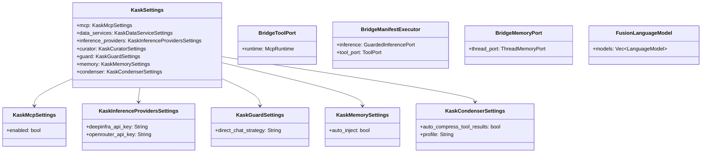

# kask_bridge — Reference

`kask_bridge` is the D8 composition root adapter. It connects zed's internal
types to hKask's port traits. Every integration seam (D1 through D10) passes
through this crate. It defines `KaskSettings`, `BridgeToolPort`,
`BridgeManifestExecutor`, `BridgeMemoryPort`, `FusionLanguageModel`, and the
settings structs that configure the kask subsystem.

## Source citations

| Symbol | Location |
|--------|----------|
| `KaskSettings` | `kask/crates/kask_bridge/src/settings.rs:22` |
| `KaskMcpSettings` | `kask/crates/kask_bridge/src/settings.rs:86` |
| `KaskInferenceProvidersSettings` | `kask/crates/kask_bridge/src/settings.rs:139` |
| `KaskGuardSettings` | `kask/crates/kask_bridge/src/settings.rs:229` |
| `KaskMemorySettings` | `kask/crates/kask_bridge/src/settings.rs:241` |
| `KaskCondenserSettings` | `kask/crates/kask_bridge/src/settings.rs:284` |
| `BridgeToolPort` | `kask/crates/kask_bridge/src/tool_port.rs:25` |
| `BridgeManifestExecutor` | `kask/crates/kask_bridge/src/skill_executor.rs:30` |
| `BridgeMemoryPort` | `kask/crates/kask_bridge/src/memory.rs:580` |
| `LoggingMemoryPort` | `kask/crates/kask_bridge/src/memory.rs:33` |
| `FusionLanguageModel` | `kask/crates/kask_bridge/src/fusion_model.rs:86` |
| `FusionProviderState` | `kask/crates/kask_bridge/src/fusion_model.rs:509` |
| `resolve_fusion_models` | `kask/crates/kask_bridge/src/fusion_model.rs:450` |
| `BridgeThreadCondenser` | `kask/crates/kask_bridge/src/condenser_bridge.rs:22` |
| `LanguageModelInferencePort` | `kask/crates/kask_bridge/src/inference.rs:46` |
| `provision_agent` | `kask/crates/kask_bridge/src/identity.rs:212` |

## Settings model

The `KaskSettings` struct (`settings.rs:22`) is the root of the kask settings
hierarchy. It is registered with zed's settings system and appears in
`settings.json` under the `"kask"` key. Each sub-struct configures one
subsystem.

<!-- DIAGRAM_ALIGNMENT
id: DIAG-DIA-BRIDGE-001
verified_date: 2026-07-27
verified_against: kask/crates/kask_bridge/src/settings.rs:22,86,139,229,241,284; kask/crates/kask_bridge/src/tool_port.rs:25; kask/crates/kask_bridge/src/skill_executor.rs:30; kask/crates/kask_bridge/src/memory.rs:580; kask/crates/kask_bridge/src/fusion_model.rs:86
status: VERIFIED
-->

## Bridge adapters

Three bridge adapters implement hKask port traits against zed types:
`BridgeToolPort` (`tool_port.rs:25`) implements `ToolPort` by wrapping zed's
`McpRuntime`. `BridgeManifestExecutor` (`skill_executor.rs:30`) implements
zed's `SkillManifestExecutor` by delegating to hKask's `ManifestExecutor`.
`BridgeMemoryPort` (`memory.rs:580`) implements zed's `ThreadMemoryPort` by
delegating to hKask's `MemoryPort`.

The `LanguageModelInferencePort` (`inference.rs:46`) implements hKask's
`InferencePort` by wrapping zed's `LanguageModel`. The `FusionLanguageModel`
(`fusion_model.rs:86`) wraps multiple language models for multi-model
deliberation.

## See also

- [kask_bridge Explanation](./explanation.md): sequence diagram of the
  composition root.
- [kask_bridge How-to](./how-to.md): wiring a new kask hook.
- [kask_bridge Tutorial](./tutorial.md): your first kask hook.
- [hkask-types Reference](../hkask-types/reference.md): the port traits these
  adapters implement.

---

[^cockburn]: Cockburn, A. (2005). *Hexagonal Architecture.* <https://alistair.cockburn.us/hexagonal-architecture/>. The adapter pattern that this crate embodies: every port trait gets a bridge adapter.
