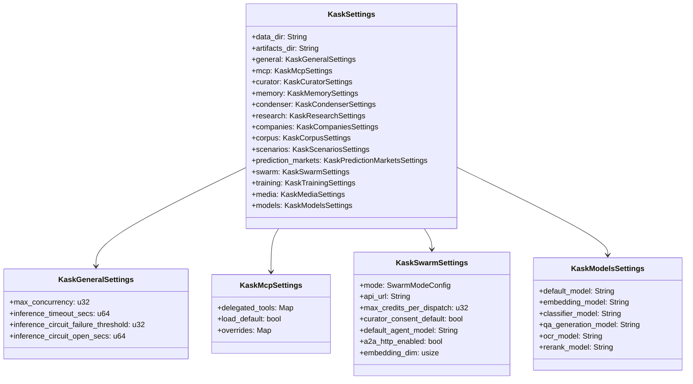
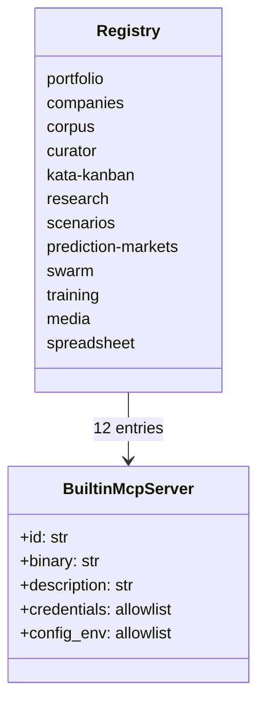
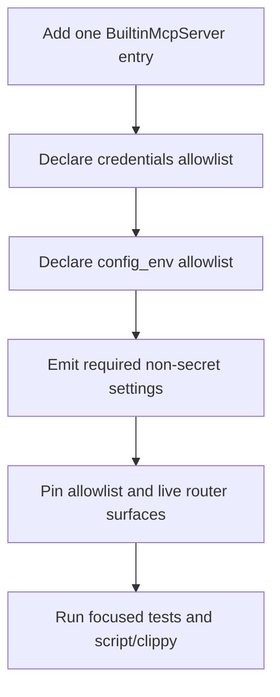

# kask_bridge — Reference

`kask_bridge` is the D8 adapter between portable hKask ports and Zed-side
runtime facilities. Its governing dependency invariant and module root are at
`kask/crates/kask_bridge/src/kask_bridge.rs:3-10,23-119`.

## Current module surface

The crate root declares 27 top-level production modules
(`kask/crates/kask_bridge/src/kask_bridge.rs:23-119`; a 28th declaration,
`algedonic_board_real_tests`, is `#[cfg(test)]` at `:111-112`):

`condenser_bridge`, `context_injector`, `credentials`,
`database_maintenance`, `delegation_grants`, `host_skill_tools`, `identity`,
`inference_chat`, `inference_edit_prediction`, `inference_resilience`,
`passphrase_rotation`, `inference_embedding`, `inference_ipc_server`,
`inference_providers`, `inference_socket`, `mcp_env`, `mcp_servers`, `memory`,
`model_resolution`, `settings`, `metacognition_bridge`, `directive_bridge`,
`algedonic_log_bridge`, `algedonic_board`, `context_server_health_bridge`,
`ocr_health_bridge`, and `rollout_event_bridge`.

The public re-exports are defined at
`kask/crates/kask_bridge/src/kask_bridge.rs:27-124`. Skill execution is not a
bridge module; the agent-side `SkillTool` owns body injection — the bridge root
exports no skill executor (`kask/crates/kask_bridge/src/kask_bridge.rs:50-124`).

## Settings hierarchy

`KaskSettings` contains the data and artifact roots plus 14 subsystem sections:
`general`, `mcp`, `curator`, `memory`, `condenser`, `research`, `companies`,
`corpus`, `scenarios`, `prediction_markets`, `swarm`, `training`, `media`, and
`models` (`kask/crates/kask_bridge/src/settings.rs:35-96`).

```mermaid
classDiagram
    class KaskSettings {
        +data_dir: String
        +artifacts_dir: String
        +general: KaskGeneralSettings
        +mcp: KaskMcpSettings
        +curator: KaskCuratorSettings
        +memory: KaskMemorySettings
        +condenser: KaskCondenserSettings
        +research: KaskResearchSettings
        +companies: KaskCompaniesSettings
        +corpus: KaskCorpusSettings
        +scenarios: KaskScenariosSettings
        +prediction_markets: KaskPredictionMarketsSettings
        +swarm: KaskSwarmSettings
        +training: KaskTrainingSettings
        +media: KaskMediaSettings
        +models: KaskModelsSettings
    }
    class KaskGeneralSettings {
        +max_concurrency: u32
        +inference_timeout_secs: u64
        +inference_circuit_failure_threshold: u32
        +inference_circuit_open_secs: u64
    }
    class KaskMcpSettings {
        +delegated_tools: Map
        +load_default: bool
        +overrides: Map
    }
    class KaskSwarmSettings {
        +mode: SwarmModeConfig
        +api_url: String
        +max_credits_per_dispatch: u32
        +curator_consent_default: bool
        +default_agent_model: String
        +a2a_http_enabled: bool
        +embedding_dim: usize
    }
    class KaskModelsSettings {
        +default_model: String
        +embedding_model: String
        +classifier_model: String
        +qa_generation_model: String
        +ocr_model: String
        +rerank_model: String
    }
    KaskSettings --> KaskGeneralSettings
    KaskSettings --> KaskMcpSettings
    KaskSettings --> KaskSwarmSettings
    KaskSettings --> KaskModelsSettings
```

<!-- DIAGRAM_ALIGNMENT
id: DIAG-BRIDGE-003
verified_date: 2026-09-28
verified_against: kask/crates/kask_bridge/src/settings.rs:35-96 (KaskSettings); settings.rs:110-138 (general + Default); settings.rs:148-168 (mcp + Default); settings.rs:429-446,496-512 (swarm + Default); settings.rs:597-667 (models + Default)
status: VERIFIED
-->

There is no general batch-size setting and no swarm-specific passphrase setting.
The database passphrase is provisioned once and shared by SQLCipher consumers
(`crates/zed/src/main.rs:1625-1628`); scheduled rotation is applied at startup
by `run_pending_db_passphrase_rotation` (`crates/zed/src/main.rs:373`) — see
[`kask-settings.md`](../../reference/kask-settings.md) under Passphrase rotation.

### Defaults

| Settings type | Current defaults | Evidence |
| --- | --- | --- |
| `KaskGeneralSettings` | concurrency 96; timeout 300s; circuit threshold 3; open interval 30s | `kask/crates/kask_bridge/src/settings.rs:130-138` |
| `KaskMcpSettings` | load defaults; empty overrides; empty delegated-tool grants | `kask/crates/kask_bridge/src/settings.rs:161-168` |
| `KaskCuratorSettings` | always on; algedonic threshold 0.8 | `kask/crates/kask_bridge/src/settings.rs:196-203` |
| `KaskMemorySettings` | consolidation 300s; confidence 0.3; recall 5 at 0.3; auto-inject; distillation 600s/300s; memory life 180 from `MemoryStore::default_memory_life_days`; forgetting 7 | `kask/crates/kask_bridge/src/settings.rs:284-297`; `kask/crates/hkask-memory/src/memory_store.rs:186` |
| `KaskCondenserSettings` | normal profile; incoming-result compression off | `kask/crates/kask_bridge/src/settings.rs:320-326` |
| `KaskCompaniesSettings` | staleness 0; no Fermi override; required return 0.15 | `kask/crates/kask_bridge/src/settings.rs:352-358` |
| `KaskCorpusSettings` | dimension 1024; configured embedding default; template root `kask/registry` | `kask/crates/kask_bridge/src/settings.rs:377-383` |
| `KaskSwarmSettings` | ABW mode; empty URL; credit ceiling 50; curator consent off; A2A HTTP off; dimension 1024; empty model override | `kask/crates/kask_bridge/src/settings.rs:496-512` |
| `KaskMediaSettings` | STT and vision use shared constants; TTS/image/video empty | `kask/crates/kask_bridge/src/settings.rs:555-566` |
| `KaskModelsSettings` | default GLM 5.3; classifier GLM 5.2; QA generator empty; OCR `ollama/glm-ocr:latest`; reranker from `DEFAULT_RERANK_MODEL` | `kask/crates/kask_bridge/src/settings.rs:647-667` |

## Built-in MCP registry

`BUILT_IN_MCP_SERVERS` contains 12 descriptors
(`kask/crates/kask_bridge/src/mcp_servers.rs:55-549`). IDs and descriptions
are derived from that registry
(`kask/crates/kask_bridge/src/mcp_servers.rs:551-554,598-603`).

```mermaid
classDiagram
    class BuiltinMcpServer {
        +id: str
        +binary: str
        +description: str
        +credentials: allowlist
        +config_env: allowlist
    }
    class Registry {
        portfolio
        companies
        corpus
        curator
        kata-kanban
        research
        scenarios
        prediction-markets
        swarm
        training
        media
        spreadsheet
    }
    Registry --> BuiltinMcpServer : 12 entries
```

<!-- DIAGRAM_ALIGNMENT
id: DIAG-BRIDGE-004
verified_date: 2026-09-28
verified_against: kask/crates/kask_bridge/src/mcp_servers.rs:26-50 (BuiltinMcpServer); kask/crates/kask_bridge/src/mcp_servers.rs:55-549 (12-entry registry)
status: VERIFIED
-->

### Allowlist sizes

Sizes below are counted directly from each descriptor in
`kask/crates/kask_bridge/src/mcp_servers.rs:55-549` (method: extraction of the
quoted env-var names inside each `credentials` / `config_env` array).

| Server | Credentials | Config |
| --- | ---: | ---: |
| `portfolio` | 0 | 3 |
| `companies` | 6 | 5 |
| `corpus` | 1 | 22 |
| `curator` | 1 | 12 |
| `kata-kanban` | 1 | 4 |
| `research` | 6 | 6 |
| `scenarios` | 0 | 2 |
| `prediction-markets` | 1 | 4 |
| `swarm` | 2 | 19 |
| `training` | 3 | 20 |
| `media` | 4 | 10 |
| `spreadsheet` | 0 | 1 |

The media server's live router is pinned at 98 tools
(`kask/mcp-servers/hkask-mcp-media/src/hkask_mcp_media.rs:453-456`).

## Child environment lifecycle

`build_mcp_server_env` receives settings, a credential provider, an optional
inference socket, and an optional timeout
(`kask/crates/kask_bridge/src/mcp_servers.rs:681-687`). It then:

1. filters non-secret configuration and adds the database catalog and delegated
   tool grant (`kask/crates/kask_bridge/src/mcp_servers.rs:691-699`);
2. filters and resolves credentials from shell or keychain, with first-run
   provisioning for the shared database passphrase
   (`kask/crates/kask_bridge/src/mcp_servers.rs:735-812`);
3. adds the inference socket and timeout
   (`kask/crates/kask_bridge/src/mcp_servers.rs:814-830`).

Unknown IDs receive neither credentials nor configuration
(`kask/crates/kask_bridge/src/mcp_servers.rs:623-645,920-942`).

## Nonblocking composition

The deferred composition task samples the current Zed user but never waits for
one; it uses `"kask"` when absent (`crates/zed/src/main.rs:1535-1592`). The
same task provisions storage, installs memory/context hooks, installs the
condenser, and launches the configured servers
(`crates/zed/src/main.rs:1625-1692,1894-2060,2302,2500-2560`).

## Procedures

### Add a built-in MCP server

Use this procedure to add a managed MCP server without leaking unrelated
configuration or credentials. The canonical registry currently contains 12
servers (`kask/crates/kask_bridge/src/mcp_servers.rs:55-549`).

```mermaid
flowchart TD
    A[Add one BuiltinMcpServer entry] --> B[Declare credentials allowlist]
    B --> C[Declare config_env allowlist]
    C --> D[Emit required non-secret settings]
    D --> E[Pin allowlist and live router surfaces]
    E --> F[Run focused tests and script/clippy]
```

<!-- DIAGRAM_ALIGNMENT
id: DIAG-BRIDGE-002
verified_date: 2026-09-28
verified_against: kask/crates/kask_bridge/src/mcp_servers.rs:26-50 (descriptor shape); kask/crates/kask_bridge/src/mcp_servers.rs:55-549 (registry); kask/crates/kask_bridge/src/mcp_servers.rs:623-645,920-942 (fail-closed filters); kask/crates/kask_bridge/src/mcp_servers.rs:681-830 (build_mcp_server_env)
status: VERIFIED
-->

#### 1. Add the descriptor

Add one `BuiltinMcpServer` value to `BUILT_IN_MCP_SERVERS`. Supply a unique
`id`, the binary name, the settings description, and both allowlists. The
registry order is stable and used by the panel
(`kask/crates/kask_bridge/src/mcp_servers.rs:26-55`). The ID and description
views derive from the registry, so no companion list is maintained
(`kask/crates/kask_bridge/src/mcp_servers.rs:551-554,598-603`).

#### 2. Declare the credential boundary

Use `Some(&[])` when the server reads no secrets, or `Some(&[...])` with only
the exact credential environment names it consumes. New servers must not use
`None`; that value means unfiltered backward-compatible access
(`kask/crates/kask_bridge/src/mcp_servers.rs:37-49`).

`filter_credentials_for_server` passes only the declared names and gives an
unknown ID no credentials (`kask/crates/kask_bridge/src/mcp_servers.rs:623-645`).
Add an allowlist-alignment test beside the existing per-server tests, such as
`research_allowlist_matches_actual_reads`
(`kask/crates/kask_bridge/src/mcp_servers.rs:1490`).

#### 3. Declare the non-secret configuration boundary

Set `config_env` to `Some(&[])` or an exact list of non-secret variables emitted
by `KaskSettings::mcp_env` (`kask/crates/kask_bridge/src/settings.rs:738`). The
config filter also fails closed for unknown IDs
(`kask/crates/kask_bridge/src/mcp_servers.rs:920-942`). Do not place database
passphrases or API keys in this list.

The current `media` descriptor is the worked example: four credentials
(`OPENROUTER_API_KEY`, `DEEPINFRA_API_KEY`, `HKASK_SERPAPI_API_KEY`,
`REDUCT_API_KEY`) and ten configuration variables, including the IPC socket,
data/artifact roots, gallery DB, five media-model fields, and the embedding
model (`kask/crates/kask_bridge/src/mcp_servers.rs:486-529`).

#### 4. Emit new settings through `mcp_env`

If the server needs a new non-secret setting, add it to the relevant settings
sub-structure and its `mcp_env` emitter, then add that exact environment name to
the server descriptor. Defaults belong only in `Default` implementations
(`kask/crates/kask_bridge/src/settings.rs:24-34`). The emitted-default seam is
pinned by `swarm_settings_default_emits_no_env`
(`kask/crates/kask_bridge/src/mcp_env.rs:813`).

Do not invent a batch-size control or a second database-passphrase setting. The
general settings expose concurrency, timeout, and circuit-breaker controls
(`kask/crates/kask_bridge/src/settings.rs:110-138`), and all SQLCipher consumers
share `HKASK_DB_PASSPHRASE` (`crates/zed/src/main.rs:1625-1628`). Rotation is
startup-coordinated via the pending slot and is documented in
[`kask-settings.md`](../../reference/kask-settings.md) under Passphrase rotation.

#### 5. Pin the registered tool surface

A router can compile while silently omitting a sub-router. Add an end-to-end
count/name pin in the server crate. The current media server pins exactly 98
registered tools in `tool_surface_is_exactly_98_registered_tools`
(`kask/mcp-servers/hkask-mcp-media/src/hkask_mcp_media.rs:453-456`).

#### 6. Validate

Run the focused server tests, the bridge allowlist tests, and then
`./script/clippy`. Confirm that:

- the registry count is still intentional;
- credential and config read sites equal their allowlists;
- the composed environment path preserves both key classes;
- the live router equals the advertised tool surface.

The composed-path regression test is
`build_mcp_server_env_composition_respects_allowlists`
(`kask/crates/kask_bridge/src/mcp_servers.rs:1688`).

## Further reading

- [Bridge explanation](./explanation.md)
