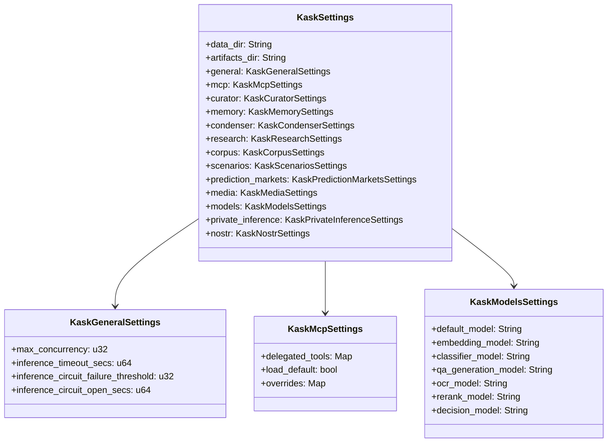
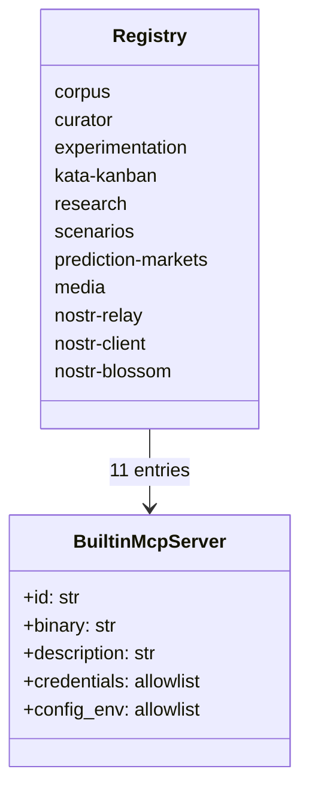
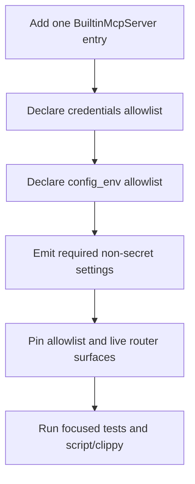

# kask_bridge — Reference

`kask_bridge` is the D8 adapter between portable hKask ports and Zed-side
runtime facilities. Its governing dependency invariant and module root are at
`kask/crates/kask_bridge/src/kask_bridge.rs:3-10,26-143`.

## Current module surface

The crate root declares 29 top-level production modules
(`kask/crates/kask_bridge/src/kask_bridge.rs:26-130`; two additional declarations,
`test_support` at `:57` and `algedonic_board_real_tests` at `:131`, are `#[cfg(test)]`):

`affordance`, `condenser_bridge`, `context_injector`, `credential_recovery`,
`credentials`, `database_maintenance`, `delegation_grants`, `goals`, `identity`,
`inference_chat`, `inference_resilience`, `passphrase_rotation`,
`inference_embedding`, `inference_ipc_server`, `inference_providers`,
`inference_socket`, `mcp_env`, `mcp_servers`, `memory`, `model_resolution`,
`nostr_signing`, `settings`, `metacognition_bridge`, `directive_bridge`,
`algedonic_log_bridge`, `context_server_health_bridge`, `ocr_health_bridge`,
`experimentation_health_bridge`, `algedonic_board`.

The public re-exports are defined at
`kask/crates/kask_bridge/src/kask_bridge.rs:29-143`. Skill execution is not a
bridge module; the agent-side `SkillTool` owns body injection — the bridge root
exports no skill executor (`kask/crates/kask_bridge/src/kask_bridge.rs:59-143`).

## Settings hierarchy

`KaskSettings` contains the data and artifact roots plus 13 subsystem sections:
`general`, `mcp`, `curator`, `memory`, `condenser`, `research`,
`corpus`, `scenarios`, `prediction_markets`, `media`, `models`,
`private_inference`, and `nostr` (`kask/crates/kask_bridge/src/settings.rs:36-94@KaskSettings`).

```mermaid
classDiagram
    class KaskSettings {
        +data_dir: String
        +artifacts_dir: String
        +general: KaskGeneralSettings
        +mcp: KaskMcpSettings
        +curator: KaskCuratorSettings
        +memory: KaskMemorySettings
        +condenser: KaskCondenserSettings
        +research: KaskResearchSettings
        +corpus: KaskCorpusSettings
        +scenarios: KaskScenariosSettings
        +prediction_markets: KaskPredictionMarketsSettings
        +media: KaskMediaSettings
        +models: KaskModelsSettings
        +private_inference: KaskPrivateInferenceSettings
        +nostr: KaskNostrSettings
    }
    class KaskGeneralSettings {
        +max_concurrency: u32
        +inference_timeout_secs: u64
        +inference_circuit_failure_threshold: u32
        +inference_circuit_open_secs: u64
    }
    class KaskMcpSettings {
        +delegated_tools: Map
        +load_default: bool
        +overrides: Map
    }
    class KaskModelsSettings {
        +default_model: String
        +embedding_model: String
        +classifier_model: String
        +qa_generation_model: String
        +ocr_model: String
        +rerank_model: String
        +decision_model: String
    }
    KaskSettings --> KaskGeneralSettings
    KaskSettings --> KaskMcpSettings
    KaskSettings --> KaskModelsSettings
```

<!-- DIAGRAM_ALIGNMENT
id: DIAG-BRIDGE-003
verified_date: 2026-11-18
verified_against: kask/crates/kask_bridge/src/settings.rs:36-94; kask/crates/kask_bridge/src/settings.rs:107-166; kask/crates/kask_bridge/src/settings.rs:524-702
status: VERIFIED
-->

There is no general batch-size setting and no per-DB passphrase setting.
The database passphrase is provisioned once and shared by SQLCipher consumers
(`crates/zed/src/main.rs:1690-1693`); scheduled rotation is applied at startup
by `run_pending_db_passphrase_rotation` (`crates/zed/src/main.rs:373`) — see
[`kask-settings.md`](../../reference/kask-settings.md) under Passphrase rotation.

### Defaults

| Settings type | Current defaults | Evidence |
| --- | --- | --- |
| `KaskGeneralSettings` | concurrency 96; timeout 300s; circuit threshold 3; open interval 30s | `kask/crates/kask_bridge/src/settings.rs:110-139@KaskGeneralSettings` |
| `KaskMcpSettings` | load defaults; empty overrides; empty delegated-tool grants | `kask/crates/kask_bridge/src/settings.rs:148-169@KaskMcpSettings` |
| `KaskCuratorSettings` | always on; algedonic threshold 0.8; `collaboration` interaction mode | `kask/crates/kask_bridge/src/settings.rs:178-199@KaskCuratorSettings` |
| `KaskMemorySettings` | consolidation 300s; confidence 0.3; recall 5 at 0.3; auto-inject; federated auto-inject off with empty `federated_source_ids`; distillation 600s/300s; memory life 90 from `MemoryStore::default_memory_life_days`; forgetting 7 | `kask/crates/kask_bridge/src/settings.rs:203-269@KaskMemorySettings`; `kask/crates/hkask-memory/src/memory_store.rs:302@MemoryStore::default_memory_life_days` |
| `KaskCondenserSettings` | normal profile; incoming-result compression off | `kask/crates/kask_bridge/src/settings.rs:276-296@KaskCondenserSettings` |
| `KaskCorpusSettings` | dimension 1024; embedding default `OpenRouter/qwen/qwen3-embedding-8b` (MRL — every embed request carries `dimensions = embedding_dim`); template root `kask/registry` | `kask/crates/kask_bridge/src/settings.rs:309-330@KaskCorpusSettings` |
| `KaskNostrSettings` | empty `npub`, `seed_relays`, `blossom_servers`; `autopublish: false`; `relay` (`port: 0`, empty allowlist/sync relays); `blossom` (`port: 0`, `max_bytes: 10 GiB`, empty `public_base_url`) | `kask/crates/kask_bridge/src/settings.rs:355-421@KaskNostrSettings` |
| `KaskMediaSettings` | STT, cross-check STT fleet, vision, and role models (sound annotation, grounded tagging) use shared constants; the former TTS/image/video fields are removed | `kask/crates/kask_bridge/src/settings.rs:460-495@KaskMediaSettings` |
| `KaskModelsSettings` | default GLM 5.3; classifier GLM 5.2; QA generator empty; OCR from `DEFAULT_OCR_MODEL` (`RunPod/kask-ocr`); reranker from `DEFAULT_RERANK_MODEL`; decision from `DEFAULT_DECISION_MODEL` (`OpenRouter/typesafe/jev-1.14`) | `kask/crates/kask_bridge/src/settings.rs:527-614@KaskModelsSettings` |
| `KaskPrivateInferenceSettings` | private-thread disabled servers `media`, `corpus`, `nostr-relay`, `nostr-client`, `nostr-blossom`; local private-memory models `ollama/qwen3-embedding:0.6b`, `ollama/qwen3.5:4b`, `ollama/qwen3-reranker-4b:latest` | `kask/crates/kask_bridge/src/settings.rs:653-705@KaskPrivateInferenceSettings` |

## Built-in MCP registry

`BUILT_IN_MCP_SERVERS` contains 11 descriptors
(`kask/crates/kask_bridge/src/mcp_servers/catalog.rs:26-424@BUILT_IN_MCP_SERVERS`). IDs and descriptions
are derived from that registry
(`kask/crates/kask_bridge/src/mcp_servers/catalog.rs:450@builtin_mcp_server_ids,497@builtin_mcp_server_pairs`).

```mermaid
classDiagram
    class BuiltinMcpServer {
        +id: str
        +binary: str
        +description: str
        +credentials: allowlist
        +config_env: allowlist
    }
    class Registry {
        corpus
        curator
        experimentation
        kata-kanban
        research
        scenarios
        prediction-markets
        media
        nostr-relay
        nostr-client
        nostr-blossom
    }
    Registry --> BuiltinMcpServer : 11 entries
```

<!-- DIAGRAM_ALIGNMENT
id: DIAG-BRIDGE-004
verified_against: kask/crates/kask_bridge/src/mcp_servers/catalog.rs:5-21; kask/crates/kask_bridge/src/mcp_servers/catalog.rs:26-424
status: VERIFIED
verified_date: 2026-11-18
-->

### Allowlist sizes

Sizes below are counted directly from each descriptor in
`kask/crates/kask_bridge/src/mcp_servers/catalog.rs:26-424@BUILT_IN_MCP_SERVERS` (method: extraction of the
env-var names — quoted strings and const references — inside each
`credentials` / `config_env` array).

| Server | Credentials | Config |
| --- | ---: | ---: |
| `corpus` | 1 | 18 |
| `curator` | 1 | 14 |
| `kata-kanban` | 1 | 2 |
| `research` | 7 | 8 |
| `scenarios` | 0 | 2 |
| `prediction-markets` | 1 | 4 |
| `media` | 4 | 11 |
| `experimentation` | 1 | 2 |
| `nostr-relay` | 0 | 4 |
| `nostr-client` | 0 | 5 |
| `nostr-blossom` | 0 | 5 |

The media server's live router is pinned at 91 tools
(`kask/mcp-servers/hkask-mcp-media/src/tool_surface_tests.rs:16-21`).

## Child environment lifecycle

`build_mcp_server_env_with_sweep` receives settings, a credential provider, a
shared credential sweep, an optional inference socket, and an optional timeout
(`kask/crates/kask_bridge/src/mcp_servers/env.rs:93-101@build_mcp_server_env_with_sweep`, full fn to `:276`);
`build_mcp_server_env` is the fresh-sweep form for tests and single-call
callers (`kask/crates/kask_bridge/src/mcp_servers/env.rs:284@build_mcp_server_env`). It then:

1. filters non-secret configuration and adds the database catalog and delegated
   tool grant (`kask/crates/kask_bridge/src/mcp_servers/env.rs:102-134@build_mcp_server_env_with_sweep`);
2. filters and resolves credentials from shell or keychain, with first-run
   provisioning for the shared database passphrase
   (`kask/crates/kask_bridge/src/mcp_servers/env.rs:136-250@build_mcp_server_env_with_sweep`);
3. adds the inference socket and timeout
   (`kask/crates/kask_bridge/src/mcp_servers/env.rs:252-273@build_mcp_server_env_with_sweep`).

Unknown IDs receive neither credentials nor configuration
(`kask/crates/kask_bridge/src/mcp_servers/env.rs:13@filter_credentials_for_server,633@filter_config_env_for_server`).

## Nonblocking composition

The deferred composition task samples the current Zed user but never waits for
one; it uses `"kask"` when absent (`crates/zed/src/main.rs:1589-1646`). The
same task provisions storage, installs memory/context hooks, installs the
condenser, and launches the configured servers
(`crates/zed/src/main.rs:1690-1760,1982-2109,2510-2519,2545-2600`).

## Procedures

### Add a built-in MCP server

Use this procedure to add a managed MCP server without leaking unrelated
configuration or credentials. The canonical registry currently contains 11
servers (`kask/crates/kask_bridge/src/mcp_servers/catalog.rs:26-424@BUILT_IN_MCP_SERVERS`).

```mermaid
flowchart TD
    A[Add one BuiltinMcpServer entry] --> B[Declare credentials allowlist]
    B --> C[Declare config_env allowlist]
    C --> D[Emit required non-secret settings]
    D --> E[Pin allowlist and live router surfaces]
    E --> F[Run focused tests and script/clippy]
```

<!-- DIAGRAM_ALIGNMENT
id: DIAG-BRIDGE-002
verified_date: 2026-11-18
verified_against: kask/crates/kask_bridge/src/mcp_servers/catalog.rs:5-21; kask/crates/kask_bridge/src/mcp_servers/catalog.rs:26-424; kask/crates/kask_bridge/src/mcp_servers/env.rs:259-562
status: VERIFIED
-->

#### 1. Add the descriptor

Add one `BuiltinMcpServer` value to `BUILT_IN_MCP_SERVERS`. Supply a unique
`id`, the binary name, the settings description, and both allowlists. The
registry order is stable and used by the panel
(`kask/crates/kask_bridge/src/mcp_servers/catalog.rs:26-424@BUILT_IN_MCP_SERVERS`). The ID and description
views derive from the registry, so no companion list is maintained
(`kask/crates/kask_bridge/src/mcp_servers/catalog.rs:450@builtin_mcp_server_ids,497@builtin_mcp_server_pairs`).

#### 2. Declare the credential boundary

Declare `&[]` when the server reads no secrets, or `&[...]` with only the
exact credential environment names it consumes — the allowlist is
non-optional, so every server declares its credential boundary explicitly
(`kask/crates/kask_bridge/src/mcp_servers/catalog.rs:14-17`).

`filter_credentials_for_server` passes only the declared names and gives an
unknown ID no credentials (`kask/crates/kask_bridge/src/mcp_servers/env.rs:13@filter_credentials_for_server`).
Add an allowlist-alignment test beside the existing per-server tests, such as
`research_allowlist_matches_actual_reads`
(`kask/crates/kask_bridge/src/mcp_servers/tests.rs:676@research_allowlist_matches_actual_reads`).

#### 3. Declare the non-secret configuration boundary

Set `config_env` to `&[]` or an exact list of non-secret variables emitted
by `KaskSettings::mcp_env` (`kask/crates/kask_bridge/src/settings.rs:799@KaskSettings::mcp_env`). The
config filter also fails closed for unknown IDs
(`kask/crates/kask_bridge/src/mcp_servers/env.rs:633@filter_config_env_for_server`). Do not place database
passphrases or API keys in this list.

The current `media` descriptor is the worked example: four credentials
(`OPENROUTER_API_KEY`, `DEEPINFRA_API_KEY`, `HKASK_SERPAPI_API_KEY`,
`HKASK_DB_PASSPHRASE`) and eleven configuration variables, including the
IPC socket, data/artifact roots, gallery DB, six media-model fields (STT,
cross-check fleet, vision, sound-annotation, tagging, pass), and the
embedding model (`kask/crates/kask_bridge/src/mcp_servers/catalog.rs:287-339`).

#### 4. Emit new settings through `mcp_env`

If the server needs a new non-secret setting, add it to the relevant settings
sub-structure and its `mcp_env` emitter, then add that exact environment name to
the server descriptor. Defaults belong only in `Default` implementations
(`kask/crates/kask_bridge/src/settings.rs:30-34`). The emitted-default seam is
pinned by `mcp_env_emits_nothing_for_default_settings`
(`kask/crates/kask_bridge/src/mcp_env.rs:536@mcp_env_emits_nothing_for_default_settings`).

Do not invent a batch-size control or a second database-passphrase setting. The
general settings expose concurrency, timeout, and circuit-breaker controls
(`kask/crates/kask_bridge/src/settings.rs:110-139@KaskGeneralSettings`), and all SQLCipher consumers
share `HKASK_DB_PASSPHRASE`. Rotation is
startup-coordinated via the pending slot and is documented in
[`kask-settings.md`](../../reference/kask-settings.md) under Passphrase rotation.

#### 5. Pin the registered tool surface

A router can compile while silently omitting a sub-router. Add an end-to-end
count/name pin in the server crate. The current media server pins exactly 91
registered tools in `tool_surface_is_exactly_91_registered_tools`
(`kask/mcp-servers/hkask-mcp-media/src/tool_surface_tests.rs:16-21`).

#### 6. Validate

Run the focused server tests, the bridge allowlist tests, and then
`./script/clippy`. Confirm that:

- the registry count is still intentional;
- credential and config read sites equal their allowlists;
- the composed environment path preserves both key classes;
- the live router equals the advertised tool surface.

The composed-path regression test is
`build_mcp_server_env_composition_respects_allowlists`
(`kask/crates/kask_bridge/src/mcp_servers/tests.rs:862@build_mcp_server_env_composition_respects_allowlists`).

## Further reading

- [Bridge explanation](./explanation.md)
