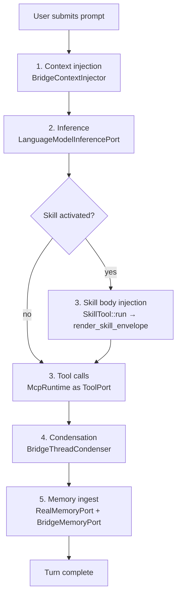

# kask_bridge — Tutorial: Tracing a Turn Through the Bridge

This tutorial follows a single agent turn from the moment the user submits a
prompt to the moment the completed turn is ingested into memory. You will
learn how `kask_bridge` — the sole bidirectional seam between zed-kask and
hKask — carries the turn across five ports: context injection, inference,
tool execution, condensation, and memory ingestion. By the end you will be
able to read any seam file in `kask/crates/kask_bridge/src/` and place it on
this path.

The governing invariant is stated in the crate root: hKask crates never
depend on zed crates; zed-kask depends on hKask; this bridge is the only
crate that depends on both sides (`kask/crates/kask_bridge/src/kask_bridge.rs:9-10`).

## Source citations

| Symbol | Location |
|--------|----------|
| Crate-level invariant | `kask/crates/kask_bridge/src/kask_bridge.rs:3-10` |
| `BridgeContextInjector` | `kask/crates/kask_bridge/src/context_injector.rs:122` |
| `should_recall` gate | `kask/crates/kask_bridge/src/context_injector.rs:85` |
| `LanguageModelInferencePort` | `kask/crates/kask_bridge/src/inference_chat.rs:190` |
| `InferencePort` impl | `kask/crates/kask_bridge/src/inference_chat.rs:669` |
| `SkillTool::run` (D1 — body injection) | `crates/agent/src/tools/skill_tool.rs:167` |
| `BridgeThreadCondenser` | `kask/crates/kask_bridge/src/condenser_bridge.rs:22` |
| `RealMemoryPort` | `kask/crates/kask_bridge/src/memory.rs:74` |
| `BridgeMemoryPort` | `kask/crates/kask_bridge/src/memory.rs:1001` |
| `MemoryPort` impl | `kask/crates/kask_bridge/src/memory.rs:454` |
| `curator_db_path` | `kask/crates/kask_bridge/src/memory/curator_stores.rs:20` |

## Learning path

The turn flows through five bridge ports in order. Each port is an adapter
that implements an hKask trait over a zed facility. The diagram below is the
map for the rest of the tutorial — every section corresponds to one node.

<!-- DIAGRAM_ALIGNMENT
id: DIAG-BRIDGE-001
verified_date: 2026-08-28
verified_against: kask/crates/kask_bridge/src/context_injector.rs:122; kask/crates/kask_bridge/src/inference_chat.rs:190; crates/agent/src/tools/skill_tool.rs:167; kask/crates/kask_bridge/src/condenser_bridge.rs:22; kask/crates/kask_bridge/src/memory.rs:74,1001
status: VERIFIED
-->

## Step 1 — Context injection

When the agent crate receives a `UserPrompt` intent, it calls the
`ContextInjector` hook. The bridge's implementation is `BridgeContextInjector`
(`context_injector.rs:122`), which delegates to an `hkask_types::MemoryPort`.

Before any SQL or HTTP fires, the injector applies a zero-cost prompt-length
gate: prompts shorter than 20 characters or 3 words skip recall entirely
(`context_injector.rs:85`). This avoids an embedding HTTP call for short
code-focused prompts like "run the tests."

When recall does fire, the injector calls `memory_port.recall_context`
(prompt-salient, embedding similarity) and `memory_port.recall_thread`
(thread-scoped, entity match) — the two-path contract is documented at
`context_injector.rs:6-8` — filters each by its confidence threshold,
and wraps each snippet in an explicit data boundary
(`MEMORY_CONTEXT_OPEN` … `MEMORY_CONTEXT_CLOSE`, `context_injector.rs:56-60`)
so the model treats recalled memory as data, not as instructions. Both recall
paths are fresh every turn — no session-lifetime snapshot. The kask tool-use
warnings are baked into the `system_prompt.hbs` template as an unconditional
`## Tool failure-mode warnings (kask)` section.

A second constructor, `new_curator` (`context_injector.rs:164`), produces
an injector that recalls from the curator's sovereign `curator.db` instead of
the user's `memory.db` — same logic, different perspective-scoped store.

## Step 2 — Inference

The agent crate needs an `InferencePort`. The bridge provides
`LanguageModelInferencePort` (`inference_chat.rs:190`), which wraps zed's
`LanguageModel` trait.

The adapter holds only channel senders (`Send + Sync`,
`inference_chat.rs:190-192`); the actual inference call happens on the GPUI
foreground executor via a spawned task that owns the `AsyncApp`
(`inference_chat.rs:230-232`). This split is forced by GPUI:
`AsyncApp` is not `Send` (the foreground executor holds `Rc`-based state), so
the tokio-side trait method cannot call `stream_completion` directly. Instead
it sends an `InferenceRequest` (`inference_chat.rs:34`) over an mpsc channel and
awaits a oneshot reply.

Two paths exist: non-streaming (`generate`) collects the stream into a single
`InferenceResult`; streaming (`generate_stream`) forwards
`InferenceStreamChunk`s as they arrive for live thinking traces in the skill
cascade. A `model_override` field on each request (`inference_chat.rs:41, 49`)
lets the caller route to a specific provider-prefixed model via
`LanguageModelRegistry` resolution — an unresolvable override is logged, not
silently dropped (`inference_chat.rs:354-355`).

## Step 3 — Skill body injection and tool calls

If the user activates a skill, the agent crate's `SkillTool` follows
upstream Zed's body-injection model. `SkillTool::run`
(`crates/agent/src/tools/skill_tool.rs:167`) reads the `SKILL.md` body from
disk via `agent_skills::read_skill_body` and injects it into the
conversation via `render_skill_envelope`
(`crates/agent/src/tools/skill_tool.rs:47`). The model reads the body and
follows the instructions. The bridge does not participate in this path.

Two companion built-in agent tools support the model-coordinated PDCA loops
the SKILL.md bodies describe:

- `lisp_eval` (`crates/agent/src/tools/lisp_eval_tool.rs`) — the agent calls
  it directly when a SKILL.md instructs deterministic computation
  (convergence signals, invariant checks, scoring). Wraps
  `hkask_lisp::eval_sandboxed_with_budget`. Registered in `add_default_tools`.
- `render_template` (`crates/agent/src/tools/render_template_tool.rs`) —
  renders Jinja2 templates from `kask/registry/templates/` via `minijinja`.
  The agent calls it when a SKILL.md instructs structured prompt scaffolding
  for a specific step. Template base path wired via
  `agent::set_template_base_path()` (OnceLock, `crates/agent/src/agent.rs:4367`)
  in `main.rs` at startup (`crates/zed/src/main.rs:711`). Registered in
  `add_default_tools` alongside `lisp_eval`.

For tool execution during skill iteration (and during ordinary agent turns),
the composition root passes `McpRuntime` directly as the `ToolPort`. There is
no adapter struct — the runtime already implements the trait. The 11 built-in
MCP servers are registered in `BUILT_IN_MCP_SERVERS`
(`mcp_servers.rs:55-431`), and each server's child-process env is assembled by
the single canonical path `build_mcp_server_env` (`mcp_servers.rs:523-649`).

## Step 4 — Condensation

Before a tool result enters the message history, the agent crate calls the
`ThreadCondenser` hook. The bridge's implementation is
`BridgeThreadCondenser` (`condenser_bridge.rs:22`), which wraps
`hkask_condenser::CondenserEngine`.

If `auto_compress_tool_results` is false (the default,
`settings.rs:275-283`), the condenser returns the output verbatim
(`condenser_bridge.rs:46`). Otherwise it calls the engine using the
configured profile (`heavy`, `normal`, `soft`, or `light`). The engine is
behind a `Mutex`; if the lock is poisoned the condenser logs a warn and
returns the uncompressed output rather than panicking.

## Step 5 — Memory ingest

When the turn completes, the agent crate calls the `ThreadMemoryPort` hook.
The bridge's implementation is `BridgeMemoryPort` (`memory.rs:1001`),
a thin wrapper over `RealMemoryPort` (`memory.rs:74`) that adapts the
agent crate's `ThreadMemoryPort` trait to the hKask `MemoryPort` trait.

`RealMemoryPort::new` (`memory.rs:130`) opens a SQLCipher database at the
provisioned `memory.db` path, creates unified `HMemStore` + `EmbeddingStore`
instances, and wires a regulation archive so every `store()` persists a
`reg.memory.encode` span (`memory.rs:333-346`). It also opens the curator's
sovereign `curator.db` behind a self-healing handle (`CuratorStore`,
`memory/curator_stores.rs:52`): if the initial open fails, every access
re-attempts it via `try_heal` (`memory/curator_stores.rs:118`), and a
successful re-open restores curator memory mid-session.

The `MemoryPort` impl (`memory.rs:454`) stores each completed turn as:
1. an episodic h_mem (Private, perspective = user WebID) in the user's
   `memory.db`;
2. a semantic h_mem (Shared) in the curator's `curator.db` — the same DB the
   curator MCP server reads, so `curator_memory_recall` sees turns the agent
   has observed;
3. an embedding of the user prompt for future semantic retrieval.

The curator DB path is resolved by `curator_db_path`
(`memory/curator_stores.rs:20`): `HKASK_CURATOR_DB` if set, else
`agent_db("curator")` resolved under the hKask data dir — which yields
`agents/curator/curator.db`.

## Recap

You have traced one turn through all five bridge ports. The mental model is:

| Step | Bridge port | hKask trait | zed facility |
|------|-------------|------------|--------------|
| 1 | `BridgeContextInjector` | `ContextInjector` | `MemoryPort` |
| 2 | `LanguageModelInferencePort` | `InferencePort` | `LanguageModel` |
| 3 | — (agent crate, not bridge) | — | `SkillTool::run` + `McpRuntime` |
| 4 | `BridgeThreadCondenser` | `ThreadCondenser` | `CondenserEngine` |
| 5 | `BridgeMemoryPort` / `RealMemoryPort` | `MemoryPort` | `MemoryStore` |

Every seam file in `kask/crates/kask_bridge/src/` implements exactly one row
of this table (skill execution is the exception — it lives in the `agent`
crate, not the bridge). When you encounter a new file, identify which trait it
implements and which zed facility it wraps — that places it on the path.
