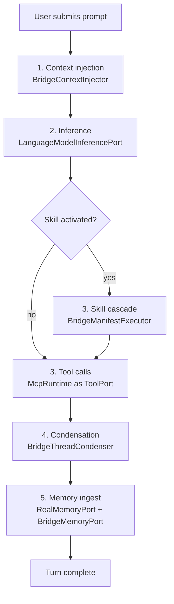

# kask_bridge — Tutorial: Tracing a Turn Through the Bridge

This tutorial follows a single agent turn from the moment the user submits a
prompt to the moment the completed turn is ingested into memory. You will
learn how `kask_bridge` — the sole bidirectional seam between zed-kask and
hKask — carries the turn across five ports: context injection, inference,
tool execution, condensation, and memory ingestion. By the end you will be
able to read any seam file in `kask/crates/kask_bridge/src/` and place it on
this path.

The governing invariant is stated in the crate root: hKask crates never
depend on zed crates; zed-kask depends on hKask; this bridge is the only
crate that depends on both sides (`kask/crates/kask_bridge/src/kask_bridge.rs:9-10`).

## Source citations

| Symbol | Location |
|--------|----------|
| Crate-level invariant | `kask/crates/kask_bridge/src/kask_bridge.rs:3-10` |
| `BridgeContextInjector` | `kask/crates/kask_bridge/src/context_injector.rs:144-160` |
| `should_recall` gate | `kask/crates/kask_bridge/src/context_injector.rs:110-115` |
| `LanguageModelInferencePort` | `kask/crates/kask_bridge/src/inference.rs:179-182` |
| `InferencePort` impl | `kask/crates/kask_bridge/src/inference.rs:459-654` |
| `BridgeManifestExecutor` | `kask/crates/kask_bridge/src/skill_executor.rs:88-109` |
| `BridgeThreadCondenser` | `kask/crates/kask_bridge/src/condenser_bridge.rs:22-25` |
| `RealMemoryPort` | `kask/crates/kask_bridge/src/memory.rs:65-119` |
| `BridgeMemoryPort` | `kask/crates/kask_bridge/src/memory.rs:1359-1361` |
| `MemoryPort` impl | `kask/crates/kask_bridge/src/memory.rs:628-956` |
| `curator_db_path` | `kask/crates/kask_bridge/src/memory/curator_stores.rs:20-29` |

## Learning path

The turn flows through five bridge ports in order. Each port is an adapter
that implements an hKask trait over a zed facility. The diagram below is the
map for the rest of the tutorial — every section corresponds to one node.

<!-- DIAGRAM_ALIGNMENT
id: DIAG-BRIDGE-001
verified_date: 2026-08-13
verified_against: kask/crates/kask_bridge/src/context_injector.rs:144-160; kask/crates/kask_bridge/src/inference.rs:179-182; kask/crates/kask_bridge/src/skill_executor.rs:88-109; kask/crates/kask_bridge/src/condenser_bridge.rs:22-25; kask/crates/kask_bridge/src/memory.rs:65-119,1359-1361
status: VERIFIED
-->

## Step 1 — Context injection

When the agent crate receives a `UserPrompt` intent, it calls the
`ContextInjector` hook. The bridge's implementation is `BridgeContextInjector`
(`context_injector.rs:144-160`), which delegates to an `hkask_types::MemoryPort`.

Before any SQL or HTTP fires, the injector applies a zero-cost prompt-length
gate: prompts shorter than 20 characters or 3 words skip recall entirely
(`context_injector.rs:110-115`). This avoids an embedding HTTP call for short
code-focused prompts like "run the tests."

When recall does fire, the injector calls `memory_port.recall_context`, filters
by `recall_min_confidence`, and wraps each snippet in an explicit data boundary
(`MEMORY_CONTEXT_OPEN` … `MEMORY_CONTEXT_CLOSE`, `context_injector.rs:54-58`)
so the model treats recalled memory as data, not as instructions. A separate
`inject_static_context` path always appends the kask tool-use warnings
(`TOOL_WARNING_PROMPT`, `context_injector.rs:77-85`) regardless of the
`auto_inject` setting.

A second constructor, `new_curator` (`context_injector.rs:191-204`), produces
an injector that recalls from the curator's sovereign `curator.db` instead of
the user's `memory.db` — same logic, different perspective-scoped store.

## Step 2 — Inference

The agent crate needs an `InferencePort`. The bridge provides
`LanguageModelInferencePort` (`inference.rs:179-182`), which wraps zed's
`LanguageModel` trait.

The adapter holds only channel senders (`Send + Sync`); the actual inference
call happens on the GPUI foreground executor via a spawned task that owns the
`AsyncApp` (`inference.rs:189-216`). This split is forced by GPUI:
`AsyncApp` is not `Send` (the foreground executor holds `Rc`-based state), so
the tokio-side trait method cannot call `stream_completion` directly. Instead
it sends an `InferenceRequest` (`inference.rs:33-42`) over an mpsc channel and
awaits a oneshot reply.

Two paths exist: non-streaming (`generate`) collects the stream into a single
`InferenceResult`; streaming (`generate_stream`) forwards
`InferenceStreamChunk`s as they arrive for live thinking traces in the skill
cascade. A `model_override` field on each request lets the caller route to a
specific provider-prefixed model via `LanguageModelRegistry` resolution
(`inference.rs:219-253`).

## Step 3 — Skill cascade and tool calls

If the user activates a skill that has an hKask manifest, the agent crate's
`SkillTool` calls the `SkillManifestExecutor` hook. The bridge's implementation
is `BridgeManifestExecutor` (`skill_executor.rs:88-109`), the D1 seam.

The executor resolves the skill name to a YAML manifest on disk under
`kask/registry/manifests/<name>.yaml` (`skill_executor.rs:155-170`), loads it
as a `BundleManifest`, and runs `ManifestExecutor::execute_manifest()`. Disk
is the single runtime source — there is no compiled-in fallback. The shipped
manifests are seeded to disk at startup by `seed_registry_to_disk`
(`skill_executor.rs:457-531`), which writes to `{kask_data_dir}/skills/registry/`
(D28) and never overwrites existing files — user edits are sovereign.

When a skill has no manifest, the `SkillTool` falls back to `SKILL.md` body
injection. The bridge does not participate in that path.

For tool execution during the cascade (and during ordinary agent turns), the
composition root passes `McpRuntime` directly as the `ToolPort`. There is no
adapter struct — the runtime already implements the trait. The 12 built-in MCP
servers are registered in `BUILT_IN_MCP_SERVERS`
(`mcp_servers.rs:53-394`), and each server's child-process env is assembled by
the single canonical path `build_mcp_server_env` (`mcp_servers.rs:514-559`).

## Step 4 — Condensation

Before a tool result enters the message history, the agent crate calls the
`ThreadCondenser` hook. The bridge's implementation is
`BridgeThreadCondenser` (`condenser_bridge.rs:22-25`), which wraps
`hkask_condenser::CondenserEngine`.

If `auto_compress_tool_results` is false (the default,
`settings.rs:355-364`), the condenser returns the output verbatim. Otherwise
it calls `CondenserEngine::compress(tool_name, output, None)` using the
configured profile (`heavy`, `normal`, `soft`, or `light`). The engine is
behind a `Mutex`; if the lock is poisoned the condenser logs a warn and
returns the uncompressed output rather than panicking
(`condenser_bridge.rs:50-60`).

## Step 5 — Memory ingest

When the turn completes, the agent crate calls the `ThreadMemoryPort` hook.
The bridge's implementation is `BridgeMemoryPort` (`memory.rs:1359-1361`),
a thin wrapper over `RealMemoryPort` (`memory.rs:65-119`) that adapts the
agent crate's `ThreadMemoryPort` trait to the hKask `MemoryPort` trait.

`RealMemoryPort::new` (`memory.rs:128-253`) opens a SQLCipher database at the
provisioned `memory.db` path, creates unified `HMemStore` + `EmbeddingStore`
instances, and wires a regulation archive so every `store()` persists a
`reg.memory.encode` span. It also opens the curator's sovereign
`curator.db` behind a self-healing handle (`CuratorStore`,
`memory/curator_stores.rs:52-161`): if the initial open fails, every access
re-attempts it, and a successful re-open restores curator memory mid-session.

The `MemoryPort` impl (`memory.rs:628-956`) stores each completed turn as:
1. an episodic h_mem (Private, perspective = user WebID) in the user's
   `memory.db`;
2. a semantic h_mem (Shared) in the curator's `curator.db` — the same DB the
   curator MCP server reads, so `curator_memory_recall` sees turns the agent
   has observed;
3. an embedding of the user prompt for future semantic retrieval.

The curator DB path is resolved by `curator_db_path`
(`memory/curator_stores.rs:20-29`): `HKASK_CURATOR_DB` if set, else
`agent_db("curator")` resolved under the hKask data dir — which yields
`agents/curator/curator.db`.

## Recap

You have traced one turn through all five bridge ports. The mental model is:

| Step | Bridge port | hKask trait | zed facility |
|------|-------------|------------|--------------|
| 1 | `BridgeContextInjector` | `ContextInjector` | `MemoryPort` |
| 2 | `LanguageModelInferencePort` | `InferencePort` | `LanguageModel` |
| 3 | `BridgeManifestExecutor` | `SkillManifestExecutor` | `SkillTool` + `McpRuntime` |
| 4 | `BridgeThreadCondenser` | `ThreadCondenser` | `CondenserEngine` |
| 5 | `BridgeMemoryPort` / `RealMemoryPort` | `MemoryPort` | `MemoryStore` |

Every seam file in `kask/crates/kask_bridge/src/` implements exactly one row
of this table. When you encounter a new file, identify which trait it
implements and which zed facility it wraps — that places it on the path.
