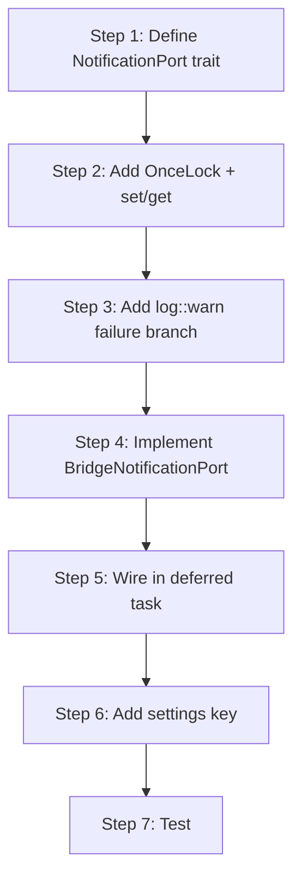

# kask_bridge — Tutorial: Your First Kask Hook

This tutorial walks through wiring a new kask hook end-to-end. You will add a
hypothetical `NotificationPort` trait, implement it in `kask_bridge`, and wire
it in the composition root. By the end, you will understand the full path from
trait definition to runtime wiring.

**Reference patterns:** `set_manifest_executor`
(`crates/agent/src/agent.rs:2829`), `set_memory_port`
(`crates/agent/src/agent.rs:2908`), `BridgeMemoryPort`
(`kask/crates/kask_bridge/src/memory.rs:1615`), deferred-task wiring
(`crates/zed/src/main.rs:1778`), `KaskSettings`
(`kask/crates/kask_bridge/src/settings.rs:35`).

## Learning path



<!-- DIAGRAM_ALIGNMENT
id: DIAG-DIA-BRIDGE-004
verified_date: 2026-07-29
verified_against: crates/agent/src/agent.rs:2829,2908; kask/crates/kask_bridge/src/memory.rs:1615; crates/zed/src/main.rs:1778; kask/crates/kask_bridge/src/settings.rs:35
status: VERIFIED
-->

## Steps 1-2: Define the trait and add the OnceLock

Create `kask/crates/hkask-types/src/ports/notification_port.rs`. Define a
`Send + Sync` trait with an async method that sends a notification. Re-export
it from `ports/mod.rs` and `hkask_types.rs`.

In `crates/agent/src/agent.rs`, add:

```rust
static NOTIFICATION_PORT: OnceLock<Option<Arc<dyn NotificationPort>>> = OnceLock::new();

pub fn set_notification_port(port: Option<Arc<dyn NotificationPort>>) {
    let _ = NOTIFICATION_PORT.set(port);
}

pub fn notification_port() -> Option<Arc<dyn NotificationPort>> {
    NOTIFICATION_PORT.get().and_then(|p| p.clone())
}
```

Follow the pattern of `set_manifest_executor` at `agent.rs:2829`. Note that
`set_manifest_executor` itself logs a `warn!` when a second wiring attempt is
rejected by the `OnceLock` — a stronger variant of the failure-branch warn
that this tutorial teaches in Step 3.

## Steps 3-4: Add log::warn and implement the bridge adapter

When wiring the hook conditionally, add a `log::warn!` in the `else` branch.
This is the `.rules` trap: without the warning, operators cannot distinguish
"not configured" from "configured but broken."

Create `kask/crates/kask_bridge/src/notification.rs` with a
`BridgeNotificationPort` struct that implements `NotificationPort` by
delegating to zed's notification surface. Follow the pattern of
`BridgeMemoryPort` at `memory.rs:1615`.

## Steps 5-6: Wire in the deferred task and add settings

In `crates/zed/src/main.rs`, inside the deferred task (around line 1778,
where `set_manifest_executor` is called), construct the
`BridgeNotificationPort` and call
`agent::set_notification_port(Some(port))`. The wiring must happen inside
the deferred task because it depends on the zed user being resolved and on
`LanguageModelRegistry::default_model()` being populated.

Add a `notifications` field to `KaskSettings` in
`kask/crates/kask_bridge/src/settings.rs:35` so users can enable or disable
notifications in `settings.json`. Per the `.rules` "Kask settings defaults"
trap, set the default in the `Default` impl — not in a `#[serde(default)]`
attribute, a `From<Content>` literal, or an `mcp_env()` comparison literal.

## Step 7: Test

Write a test that constructs the `BridgeNotificationPort`, calls the trait
method, and verifies the behavior. Run `cargo test -p kask_bridge`.

## See also

- [kask_bridge How-to](./how-to.md): the procedural reference for this
  pattern.
- [kask_bridge Explanation](./explanation.md): why the wiring is deferred.
- [hkask-types Tutorial](../hkask-types/tutorial.md): understanding the port
  traits.

---

[^cockburn]: Cockburn, A. (2005). *Hexagonal Architecture.* <https://alistair.cockburn.us/hexagonal-architecture/>. The ports-and-adapters pattern that this tutorial demonstrates.
