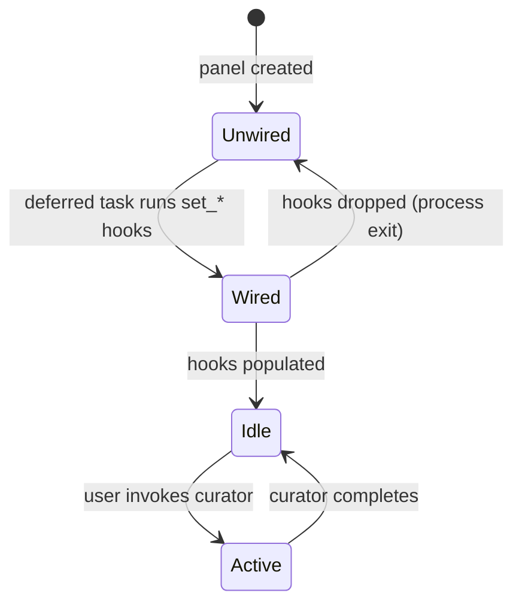

# kask_panel — Explanation: Curator Variant Lifecycle

The kask panel hosts the Curator agent variant (D2 integration seam). The
Curator is a special agent that evaluates skill artifacts for coherence
and makes Accept, Revise, or Reject decisions. The panel surfaces the
Curator's decisions and the Regulation system's health snapshots.

## Source citations

| Symbol | Location |
|--------|----------|
| `KaskPanel` | `crates/kask_panel/src/kask_panel.rs:190` |
| `RegulationStatus` trait | `crates/kask_panel/src/kask_panel.rs:125` |
| `RegulationSnapshot` | `crates/kask_panel/src/kask_panel.rs:110` |
| `ToolInvoker` trait | `crates/kask_panel/src/kask_panel.rs:87` |
| `ScopedInference` trait | `crates/kask_panel/src/kask_panel.rs:99` |
| `set_tool_invoker` | `crates/kask_panel/src/kask_panel.rs:136` |
| `init` fn | `crates/kask_panel/src/kask_panel.rs:982` |

## Curator lifecycle

<!-- DIAGRAM_ALIGNMENT
id: DIAG-DIA-PANEL-004
verified_date: 2026-07-27
verified_against: crates/kask_panel/src/kask_panel.rs:190,125,110,87,99,136,982
status: VERIFIED
-->

## Why the curator is a panel variant

The Curator is surfaced as a panel variant rather than a separate window
because it shares the panel's `ToolInvoker` and `ScopedInference` hooks.
This avoids duplicating the wiring. The panel's `RegulationStatus` trait
(`kask_panel.rs:125`) provides the health snapshot that the Curator uses
to assess system state before making decisions.

## See also

- [kask_panel Reference](./reference.md): class diagram of the panel.
- [kask_panel Tutorial](./tutorial.md): your first panel action.
- [kask_bridge Explanation](../kask_bridge/explanation.md): the composition
  root that wires the panel hooks.

---

[^gpui]: Zed Industries. (2024). *GPUI — Zed's GPU-accelerated UI framework.* <https://github.com/zed-industries/zed>.
