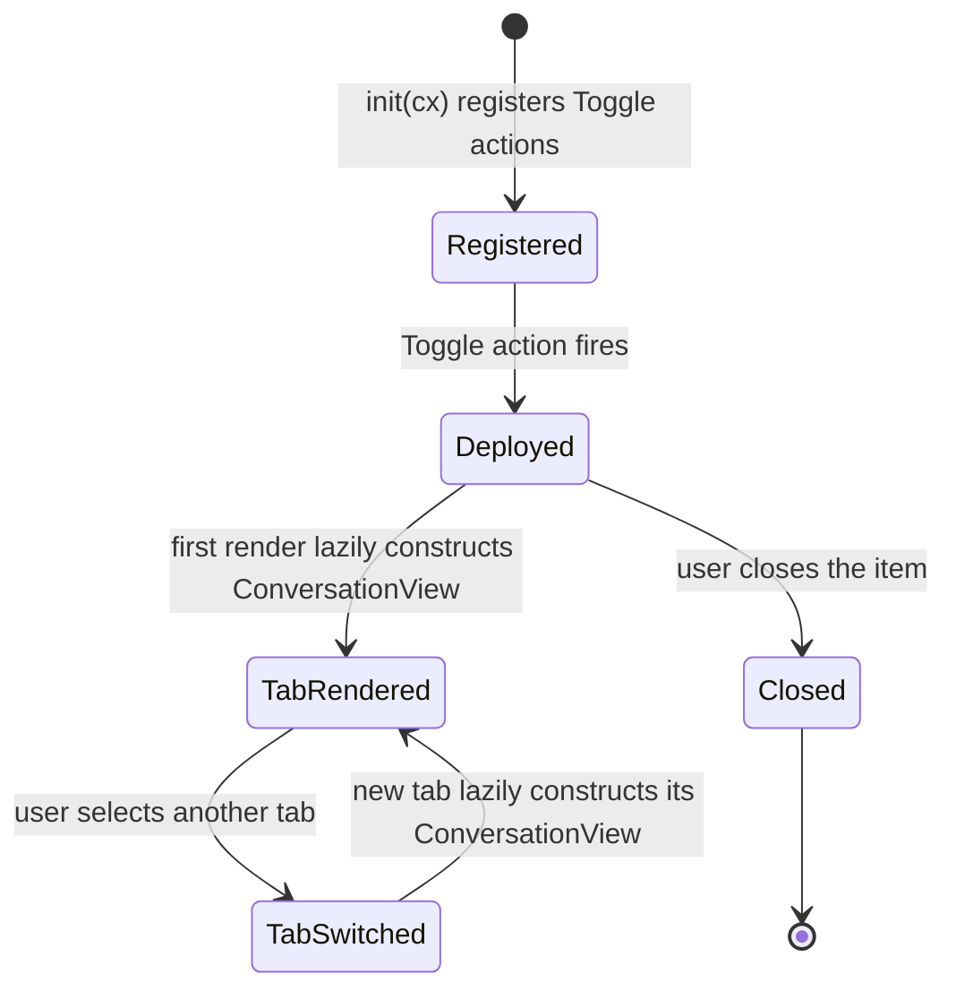

# kask_panel — Explanation: Why a Thin ConversationView Wrapper

The kask panel is a native GPUI center-pane `Item` (D10 integration seam).
It is deliberately a thin wrapper around the agent panel's
`ConversationView`: one tab per built-in MCP server, each lazily
constructing a `ConversationView` with `Agent::Curator` and a per-tab
system prompt. The `ConversationView` handles all rendering — messages,
input editor, tool-call cards, scroll, retry, cancel, copy, markdown,
streaming, mentions, drag-and-drop. The kask panel only adds the tab strip
and tab-switch logic.

## Source citations

| Symbol | Location |
|--------|----------|
| `KaskPanel` struct | `crates/kask_panel/src/kask_panel.rs:168` |
| `ToolInvoker` trait | `crates/kask_panel/src/kask_panel.rs:89` |
| `set_tool_invoker` | `crates/kask_panel/src/kask_panel.rs:106` |
| `init` fn | `crates/kask_panel/src/kask_panel.rs:447` |
| `Item` impl | `crates/kask_panel/src/kask_panel.rs:324` |
| `ensure_thread_for_tab` | `crates/kask_panel/src/kask_panel.rs:224` |

## Panel lifecycle

<!-- DIAGRAM_ALIGNMENT
id: DIAG-DIA-PANEL-004
verified_date: 2026-07-29
verified_against: crates/kask_panel/src/kask_panel.rs:168,89,106,447,324,224
status: VERIFIED
-->

## Why a thin wrapper, not a custom chat surface

The kask panel does NOT define its own message types, inference trait, or
regulation status surface. The structural pins
`kask_panel_has_no_curator_session_trait` and
`kask_panel_has_no_regulation_status_bar` (in `kask_panel.rs` tests) assert
that no `CuratorSession` trait, `RegulationSnapshot` struct, or
`RegulationStatus` trait exists in this crate. The chat panel routes
inference and regulation through `NativeAgent`'s `ToolRouter` and the
`ThreadView` activity bar, respectively.

This is the essentialist deletion test applied: a custom chat surface
would duplicate the agent panel's `ConversationView` rendering, streaming,
tool dispatch, and cancel logic. Deleting the custom surface and reusing
`ConversationView` makes the complexity vanish. The kask panel only adds
what `ConversationView` cannot provide: the per-MCP-server tab strip and
the per-tab system prompt scoping.

## Why the curator is the agent for every tab

Every tab's `ConversationView` is constructed with `Agent::Curator`
(`kask_panel.rs:248`), not with a per-server agent variant. The per-server
scope is injected via `CuratorAgentServer::with_extra_static_context`,
which appends a per-tab prompt to `CURATOR_STATIC_CONTEXT`. The curator is
the regulation cascade hub and the default tab (`DEFAULT_SERVER_INDEX = 4`,
the "curator" server). This avoids one agent variant per MCP server — the
curator's tool scope is narrowed by the system prompt, not by the agent
type.

## Why ToolInvoker is separate from the chat path

The `ToolInvoker` trait (`kask_panel.rs:89`) and `set_tool_invoker` hook
(`kask_panel.rs:106`) exist for the visualization views
(`KanbanBoardView`, `PortfolioDashboardView`, `ScenariosView`), which
fetch data via direct MCP tool calls — not through the curator agent. The
chat panel itself does not use this hook; it routes through
`NativeAgent`'s `ToolRouter`, which is OCAP-gated and streaming-aware. The
bridge provides the `PanelToolInvoker` implementation (in `main.rs`),
which wraps `BridgeToolPort` with a `DelegationToken` minted from the
`a2a_secret`.

## See also

- [kask_panel Reference](./reference.md): class diagram of the panel.
- [kask_panel Tutorial](./tutorial.md): your first panel action.
- [kask_bridge Explanation](../kask_bridge/explanation.md): the composition
  root that wires the panel hooks.

---

[^gpui]: Zed Industries. (2024). *GPUI — Zed's GPU-accelerated UI framework.* <https://github.com/zed-industries/zed>.
