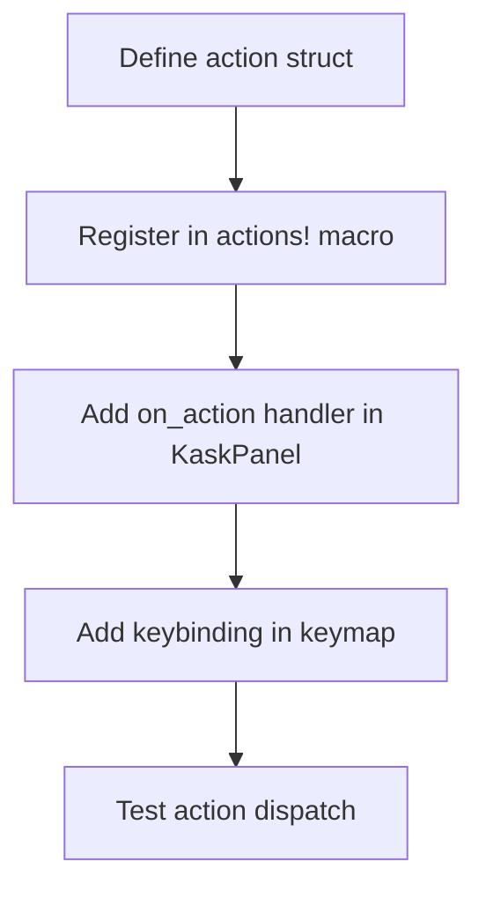

# kask_panel — How-to: Add a New Panel Action

This guide shows how to add a new keyboard-invoked action to the kask panel.
The panel uses GPUI's action dispatch system. An action is a type that
implements the `Action` trait, registered on the panel's element tree.

## Source citations

| Symbol | Location |
|--------|----------|
| `KaskPanel` struct | `crates/kask_panel/src/kask_panel.rs:190` |
| `init` fn | `crates/kask_panel/src/kask_panel.rs:982` |
| `ToolInvoker` trait | `crates/kask_panel/src/kask_panel.rs:87` |

## Procedure

<!-- DIAGRAM_ALIGNMENT
id: DIAG-DIA-PANEL-002
verified_date: 2026-07-27
verified_against: crates/kask_panel/src/kask_panel.rs:190,982,87
status: VERIFIED
-->

### Step 1: Define the action struct

Define a unit struct that implements the `Action` trait. Use the `actions!`
macro to register it in the kask_panel namespace. The action struct carries
no data for simple actions.

### Step 2: Add the on_action handler

In the `KaskPanel`'s `render` method, register an `.on_action` handler using
`cx.listener`. The handler receives the action, the window, and the context.
Follow the GPUI pattern documented in `.rules` (GPUI section).

### Step 3: Add a keybinding

Add a keybinding in the keymap that dispatches the action in the kask panel
context. The keybinding context should be the kask panel's focus scope.

### Step 4: Test

Write a test that dispatches the action and verifies the panel state
changes. Use `VisualTestContext` for GPUI tests per the `.rules` timer
guidance.

## See also

- [kask_panel Reference](./reference.md): class diagram of the panel.
- [kask_panel Tutorial](./tutorial.md): your first panel action (planned).
- [kask_bridge How-to](../kask_bridge/how-to.md): wiring hooks that the panel
  consumes.

---

[^gpui]: Zed Industries. (2024). *GPUI — Actions and Dispatch.* <https://github.com/zed-industries/zed>. The action dispatch system that this guide uses.
