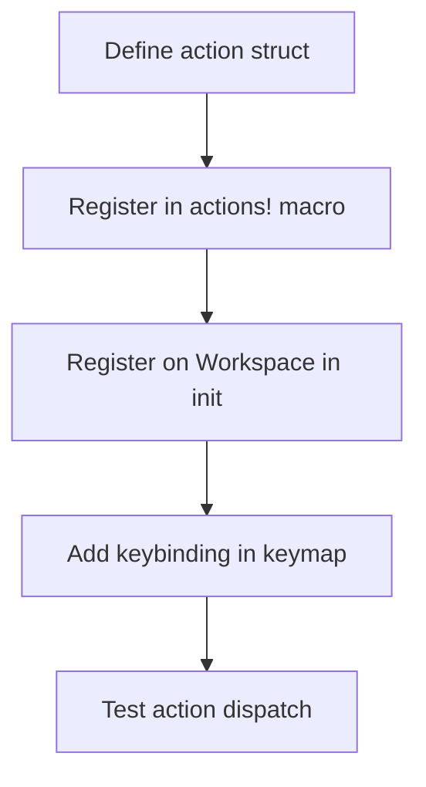

# kask_panel — How-to: Add a New Panel Action

This guide shows how to add a new keyboard-invoked action to the kask panel.
The panel uses GPUI's action dispatch system. An action is a type that
implements the `Action` trait, registered on the `Workspace` in
`kask_panel::init`.

## Source citations

| Symbol | Location |
|--------|----------|
| `KaskPanel` struct | `crates/kask_panel/src/kask_panel.rs:168` |
| `init` fn | `crates/kask_panel/src/kask_panel.rs:447` |
| `ToolInvoker` trait | `crates/kask_panel/src/kask_panel.rs:89` |
| `Toggle` action import | `crates/kask_panel/src/kask_panel.rs:52` |

## Procedure

<!-- DIAGRAM_ALIGNMENT
id: DIAG-DIA-PANEL-002
verified_date: 2026-07-29
verified_against: crates/kask_panel/src/kask_panel.rs:168,447,89,52
status: VERIFIED
-->

### Step 1: Define the action struct

Define a unit struct that implements the `Action` trait. Use the `actions!`
macro to register it in the kask_panel namespace. The action struct carries
no data for simple actions.

### Step 2: Register the action on the Workspace

In `kask_panel::init` (`kask_panel.rs:447`), the panel registers actions on
the `Workspace` via `workspace.register_action(|workspace, _: &MyAction,
window, cx| { ... })` inside a `cx.observe_new` callback. The handler
receives the action, the window, and the context. Follow the GPUI pattern
documented in `.rules` (GPUI section).

For center-pane `Item` actions that deploy a new item, use the `Toggle`
pattern (not `ToggleFocus`). Per the `.rules` "Center-pane Item
deploy-and-focus" trap: after `add_item_to_active_pane`, explicitly call
`page.focus_handle(cx).focus(window, cx)` on the newly created entity if
the item's `Focusable::focus_handle` delegates to a child entity
constructed inside `cx.new`. Clone the `Entity` before boxing it so the
handle remains available. The kask panel's `Toggle` handler
(`kask_panel.rs:466`) does exactly this.

### Step 3: Add a keybinding

Add a keybinding in the keymap that dispatches the action in the kask panel
context. The keybinding context should be the kask panel's focus scope.

### Step 4: Test

Write a test that dispatches the action and verifies the panel state
changes. Use `VisualTestContext` for GPUI tests per the `.rules` timer
guidance.

## See also

- [kask_panel Reference](./reference.md): class diagram of the panel.
- [kask_panel Tutorial](./tutorial.md): your first panel action.
- [kask_bridge How-to](../kask_bridge/how-to.md): wiring hooks that the panel
  consumes.

---

[^gpui]: Zed Industries. (2024). *GPUI — Actions and Dispatch.* <https://github.com/zed-industries/zed>. The action dispatch system that this guide uses.
