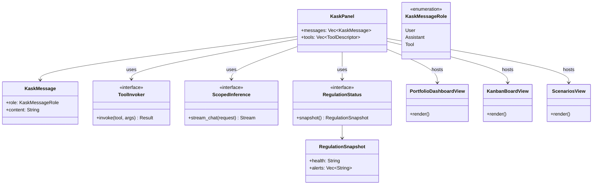

# kask_panel — Reference

`kask_panel` implements the kask panel UI surface inside zed-kask. It defines
the `KaskPanel` view, the `ToolInvoker` and `ScopedInference` traits that the
panel uses to invoke tools and inference, and the `RegulationStatus` trait
that surfaces Regulation system health. The panel also hosts the portfolio,
kanban, and scenarios views.

## Source citations

| Symbol | Location |
|--------|----------|
| `KaskPanel` struct | `crates/kask_panel/src/kask_panel.rs:190` |
| `KaskMessage` | `crates/kask_panel/src/kask_panel.rs:65` |
| `KaskMessageRole` enum | `crates/kask_panel/src/kask_panel.rs:71` |
| `ToolDescriptor` | `crates/kask_panel/src/kask_panel.rs:80` |
| `ToolInvoker` trait | `crates/kask_panel/src/kask_panel.rs:87` |
| `ScopedInference` trait | `crates/kask_panel/src/kask_panel.rs:99` |
| `RegulationSnapshot` | `crates/kask_panel/src/kask_panel.rs:110` |
| `RegulationStatus` trait | `crates/kask_panel/src/kask_panel.rs:125` |
| `set_tool_invoker` | `crates/kask_panel/src/kask_panel.rs:136` |
| `set_scoped_inference` | `crates/kask_panel/src/kask_panel.rs:141` |
| `set_regulation_status` | `crates/kask_panel/src/kask_panel.rs:146` |
| `init` fn | `crates/kask_panel/src/kask_panel.rs:982` |
| `PortfolioDashboardView` | `crates/kask_panel/src/portfolio_view.rs:170` |
| `KanbanBoardView` | `crates/kask_panel/src/kanban_view.rs:90` |
| `ScenariosView` | `crates/kask_panel/src/scenarios_view.rs:217` |

## Panel architecture

The `KaskPanel` struct (`kask_panel.rs:190`) is the main view. It holds
messages, tool descriptors, and references to the `ToolInvoker`,
`ScopedInference`, and `RegulationStatus` traits. These traits are wired via
process-global `set_*` hooks that are populated in the deferred task.

<!-- DIAGRAM_ALIGNMENT
id: DIAG-DIA-PANEL-001
verified_date: 2026-07-27
verified_against: crates/kask_panel/src/kask_panel.rs:190,65,71,87,99,125,110; crates/kask_panel/src/portfolio_view.rs:170; crates/kask_panel/src/kanban_view.rs:90; crates/kask_panel/src/scenarios_view.rs:217
status: VERIFIED
-->

## Panel hooks

Three `set_*` hooks populate the panel's trait references:
`set_tool_invoker` (`kask_panel.rs:136`), `set_scoped_inference`
(`kask_panel.rs:141`), and `set_regulation_status` (`kask_panel.rs:146`).
These are wired in the deferred task in `main.rs` after the zed user
resolves.

## Sub-views

The panel hosts three sub-views: `PortfolioDashboardView`
(`portfolio_view.rs:170`) for the companies/portfolio surface,
`KanbanBoardView` (`kanban_view.rs:90`) for the kata-kanban task board, and
`ScenariosView` (`scenarios_view.rs:217`) for the scenario planning surface.

## See also

- [kask_panel How-to](./how-to.md): adding a new panel action.
- [kask_bridge Explanation](../kask_bridge/explanation.md): the composition
  root that wires the panel hooks.
- [`kask/docs/architecture/zed-host-architecture-plan.md`](../../architecture/zed-host-architecture-plan.md):
  D2 (curator agent) integration seam.

---

[^gpui]: Zed Industries. (2024). *GPUI — Zed's GPU-accelerated UI framework.* <https://github.com/zed-industries/zed>. The UI framework that `KaskPanel` implements `Render` for.
