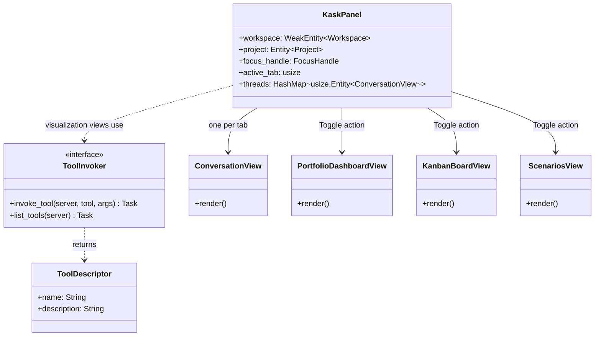

# kask_panel — Reference

`kask_panel` implements the kask panel UI surface inside zed-kask. It is a
native GPUI center-pane `Item` (not a dock `Panel`) — the same surface that
hosts the terminal, editor, and extensions view. The panel is a thin wrapper
around the agent panel's `ConversationView`: one tab per built-in MCP
server, each lazily constructing a `ConversationView` with `Agent::Curator`
and a per-tab system prompt describing the server's tool scope. The
`ConversationView` handles all rendering (messages, input, tool-call cards,
scroll, retry, cancel, copy, markdown, streaming, mentions). The kask panel
only adds the tab strip and tab-switch logic.

The panel also defines the `ToolInvoker` trait and `set_tool_invoker` hook,
which the per-server visualization views (`KanbanBoardView`,
`PortfolioDashboardView`, `ScenariosView`) use to fetch data via direct MCP
tool calls. The chat panel itself does NOT use this hook — it routes through
`NativeAgent`'s `ToolRouter`.

## Source citations

| Symbol | Location |
|--------|----------|
| `KaskPanel` struct | `crates/kask_panel/src/kask_panel.rs:179` |
| `ToolDescriptor` | `crates/kask_panel/src/kask_panel.rs:82` |
| `ToolInvoker` trait | `crates/kask_panel/src/kask_panel.rs:89` |
| `set_tool_invoker` | `crates/kask_panel/src/kask_panel.rs:106` |
| `kanban_tool_invoker` | `crates/kask_panel/src/kask_panel.rs:119` |
| `init` fn | `crates/kask_panel/src/kask_panel.rs:447` |
| `Item` impl | `crates/kask_panel/src/kask_panel.rs:324` |
| `Focusable` impl | `crates/kask_panel/src/kask_panel.rs:316` |
| `PortfolioDashboardView` | `crates/kask_panel/src/portfolio_view.rs:170` |
| `KanbanBoardView` | `crates/kask_panel/src/kanban_view.rs:90` |
| `ScenariosView` | `crates/kask_panel/src/scenarios_view.rs:217` |

## Panel architecture

The `KaskPanel` struct (`kask_panel.rs:179`) is the main view. It holds a
`WeakEntity<Workspace>`, a `Project`, an `fs`, a `FocusHandle`, the
`active_tab` index into `BUILT_IN_MCP_SERVERS`, and a
`HashMap<usize, Entity<ConversationView>>` — one retained `ConversationView`
per tab (mirrors the agent panel's `retained_threads` pattern). It does NOT
hold messages, tool descriptors, or trait references directly — all of that
lives inside each tab's `ConversationView`.

<!-- DIAGRAM_ALIGNMENT
id: DIAG-DIA-PANEL-001
verified_date: 2026-07-29
verified_against: crates/kask_panel/src/kask_panel.rs:179,82,89; crates/kask_panel/src/portfolio_view.rs:170; crates/kask_panel/src/kanban_view.rs:90; crates/kask_panel/src/scenarios_view.rs:217
status: VERIFIED
-->

## Panel hooks

One `set_*` hook populates the panel's `ToolInvoker`:
`set_tool_invoker` (`kask_panel.rs:106`). It is wired in the deferred task
in `main.rs` after the zed user resolves. The hook is read by
`kanban_tool_invoker()` (`kask_panel.rs:119`), which the visualization
views use. The chat panel does not read this hook.

There is no `ScopedInference` trait, `RegulationStatus` trait, or
`RegulationSnapshot` struct in this crate. The structural pins
`kask_panel_has_no_curator_session_trait` and
`kask_panel_has_no_regulation_status_bar` (in `kask_panel.rs` tests) assert
this. The chat panel routes inference and regulation through
`NativeAgent`'s `ToolRouter` and the `ThreadView` activity bar,
respectively.

## Sub-views

The panel deploys three visualization sub-views via `Toggle` actions
registered in `init`: `PortfolioDashboardView`
(`portfolio_view.rs:170`) for the companies/portfolio surface,
`KanbanBoardView` (`kanban_view.rs:90`) for the kata-kanban task board, and
`ScenariosView` (`scenarios_view.rs:217`) for the scenario planning
surface. These views fetch data via direct MCP tool calls through
`kanban_tool_invoker()`, not through the curator agent.

## See also

- [kask_panel How-to](./how-to.md): adding a new panel action.
- [kask_panel Explanation](./explanation.md): why the panel is a thin
  ConversationView wrapper.
- [kask_bridge Explanation](../kask_bridge/explanation.md): the composition
  root that wires the panel hooks.
- [`kask/docs/architecture/zed-host-architecture-plan.md`](../../architecture/zed-host-architecture-plan.md):
  D10 (kask panel) integration seam.

---

[^gpui]: Zed Industries. (2024). *GPUI — Zed's GPU-accelerated UI framework.* <https://github.com/zed-industries/zed>. The UI framework that `KaskPanel` implements `Render` for.
