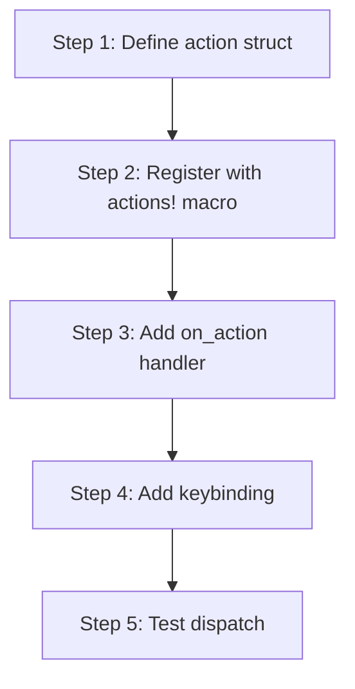

# kask_panel — Tutorial: Your First Panel Action

This tutorial walks through adding a keyboard-invoked action to the kask
panel. You will learn the GPUI action dispatch system and how to register a
handler.

## Learning path

<!-- DIAGRAM_ALIGNMENT
id: DIAG-DIA-PANEL-003
verified_date: 2026-07-27
verified_against: crates/kask_panel/src/kask_panel.rs:190,982
status: VERIFIED
-->

## Steps 1-2: Define and register the action

Define a unit struct that implements the `Action` trait. Register it with
the `actions!` macro in the kask_panel namespace.

## Steps 3-4: Add handler and keybinding

In the `KaskPanel` render method (`kask_panel.rs:190`), register an
`.on_action` handler using `cx.listener`. Add a keybinding in the keymap
that dispatches the action in the kask panel context.

## Step 5: Test

Dispatch the action in a test using `VisualTestContext` and verify the
panel state changes.

## See also

- [kask_panel Reference](./reference.md): class diagram of the panel.
- [kask_panel How-to](./how-to.md): procedural reference for panel actions.

---

[^gpui]: Zed Industries. (2024). *GPUI — Zed's GPU-accelerated UI framework.* <https://github.com/zed-industries/zed>.
