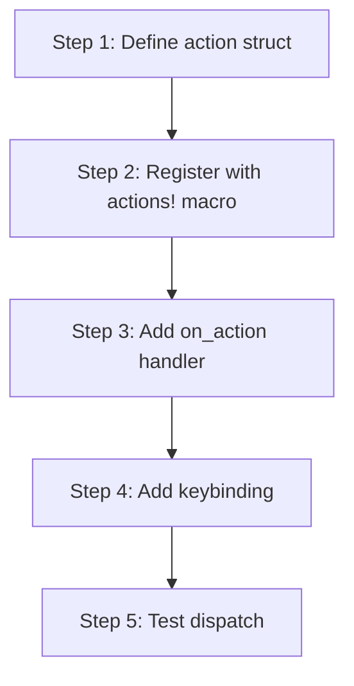

# kask_panel — Tutorial: Your First Panel Action

This tutorial walks through adding a keyboard-invoked action to the kask
panel. You will learn the GPUI action dispatch system and how to register a
handler on a center-pane `Item`.

The kask panel is a native GPUI center-pane `Item` (not a dock `Panel`). It
opens via `workspace.add_item_to_active_pane(...)` and is deployed on demand
by the `Toggle` action registered in `kask_panel::init`
(`crates/kask_panel/src/kask_panel.rs:447`).

## Learning path

<!-- DIAGRAM_ALIGNMENT
id: DIAG-DIA-PANEL-003
verified_date: 2026-07-29
verified_against: crates/kask_panel/src/kask_panel.rs:447
status: VERIFIED
-->

## Steps 1-2: Define and register the action

Define a unit struct that implements the `Action` trait. Register it with
the `actions!` macro in the kask_panel namespace. The action struct carries
no data for simple actions.

## Steps 3-4: Add handler and keybinding

In the `kask_panel::init` function (`kask_panel.rs:447`), the panel
registers `Toggle`, `ToggleFocus`, `ToggleKanbanBoard`,
`TogglePortfolioDashboard`, and `ToggleScenarios` actions on the
`Workspace` via `workspace.register_action`. Register your new action the
same way, using `cx.listener` for the handler. Add a keybinding in the
keymap that dispatches the action in the kask panel context.

Per the `.rules` "Center-pane Item Toggle vs ToggleFocus" trap: the View
menu entry must use `Toggle` (deploys a new item if none exists), NOT
`ToggleFocus` (silent no-op when no item is open). `Toggle` is for
center-pane `Item`s; `ToggleFocus` is for dock `Panel`s.

## Step 5: Test

Dispatch the action in a test using `VisualTestContext` and verify the
panel state changes. Per the `.rules` timer guidance, prefer GPUI executor
timers (`cx.background_executor().timer(duration).await`) over
`smol::Timer::after(...)` when you rely on `run_until_parked()`.

## See also

- [kask_panel Reference](./reference.md): class diagram of the panel.
- [kask_panel How-to](./how-to.md): procedural reference for panel actions.

---

[^gpui]: Zed Industries. (2024). *GPUI — Zed's GPU-accelerated UI framework.* <https://github.com/zed-industries/zed>.
