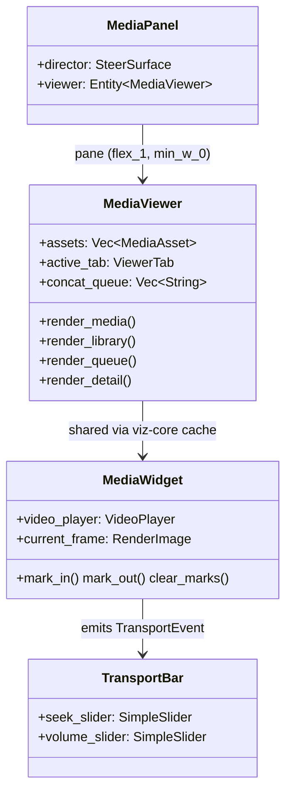

# media_panel — Reference: Media Viewer Interaction Model

The reference model for the media panel's viewing pane: the interaction
patterns a media viewer must supply, audited against the implementation.
Each capability is marked **supplied** (with file:line evidence), **missing**
(absent from the tree — verified by grep), or **degraded** (present but
defective, with the defect named). All citations were re-derived from disk on
2026-08-31. The implementation can be audited against this model after any
change; a capability not listed here is out of model.

## Component map

The panel is two columns: the director (Steer conversation, `min_w_96`) and
the viewing pane (`crates/media_panel/src/media_panel.rs:307-320`). The
viewer is four tabs over real state; the media widget is the same entity the
conversation renders inline (one player per body — two would play two audio
streams).

## Capability audit

| Capability | Status | Evidence |
| --- | --- | --- |
| Playback: play/pause | supplied | `transport.rs:157-166` → `media_widget.rs:566-577` |
| Playback: seek/position | supplied | `transport.rs:180` → `media_widget.rs:578-587` → `video_decoder.rs:230`, `audio_player.rs:112` |
| Playback: stop | supplied | `transport.rs:169-178` → `media_widget.rs:596-604` |
| Playback: rate control | missing | no rate/set-speed surface anywhere in `hkask-media-widget` or `media_panel` |
| Audio: volume | supplied | `transport.rs:187` (logarithmic slider) → `media_widget.rs:588-594` → `video_decoder.rs:247`, `audio_player.rs:121` |
| Audio: mute | missing | no mute toggle; volume slider floor is 0.001 (`transport.rs:44`) |
| Display: fit-to-pane, aspect preserved | supplied | `media_widget.rs:872` (video `img` `size_full` + `ObjectFit::Contain`), `media_widget.rs:814` (image path); pinned by layout tests (below) |
| Display: frame size adjustment | missing | no zoom / scale control |
| Display: fullscreen | missing | zero hits in `media_panel` / `hkask-media-widget` |
| Library: asset selection | supplied | `media_viewer.rs:859-882` (row click selects + switches to Media tab) |
| Library: queue/concat | supplied | `media_viewer.rs:754` (queue), `:773` (concat), `:245` (dispatch) |
| Library: trim to marks | supplied | `media_viewer.rs:745` (button), `:213` (dispatch); marks at `media_widget.rs:936/944/952` |
| Library: delete asset | supplied | `media_viewer.rs:887-905` (two-step confirm) |
| Library: detail inspector | supplied | `media_viewer.rs:1020-1071` (record/tags/lineage/faces) |
| Chrome: refresh | supplied | `media_viewer.rs:1161-1168` (rebuild widgets + reload tab) |

### Degraded register

None at 2026-08-31. (The horizontal-fit defect — video content rendering
wider than the pane's available width, clipped and unviewable — was fixed
the same day; see Layout invariants.)

## Layout invariants

The viewer's fit contract, pinned by tests so it cannot silently regress:

1. **Vertical**: the player fits the pane's height — `flex_1` + `min_h_0`
   on the tab content root (`media_viewer.rs:830-846`), pinned by
   `viewer_layout_tests::viewer_video_area_scales_with_window_size`
   (`media_viewer.rs:1362`).
2. **Horizontal**: no part of the viewer — media content, header, toolbar,
   or tab bar — exceeds the pane's available width at any pane width or
   video aspect ratio. The pane is a flex-row item and MUST carry
   `min_w_0` (`media_panel.rs:319`): without it the pane cannot shrink
   below its content's min-content width, and a long untruncated header
   src or a wide toolbar inflates the pane past the dock (the recurring
   horizontal-overflow bug). Row-level containment — truncating labels
   (`media_viewer.rs:666`, tab bar `:1147`), a wrapping toolbar
   (`media_viewer.rs:698`), `overflow_hidden` — is the presentation layer;
   it does NOT stop min-content propagation (verified empirically: removing
   only the pane's `min_w_0` re-inflates the pane to ~699px inside a 316px
   pane). Pinned by
   `viewer_layout_tests::viewer_content_fits_narrow_pane`
   (`media_viewer.rs:1504`) across 700px/480px docks and by
   `hkask-media-widget` `layout_tests::wide_frame_fits_narrow_host`
   (`media_widget.rs:1534`) for a 21:9 frame in a 320px host.
3. **Aspect preservation**: the video frame derives its laid-out size from
   the video area (`size_full` + `Contain`), never from the frame's natural
   dimensions — including when gpui injects the frame's intrinsic aspect
   ratio into the img style (`crates/gpui/src/elements/img.rs:350-352`).

Known constraint (not a defect): the director's `min_w_96` (384px) means
docks narrower than ~400px starve the pane entirely; the pane degrades by
truncation, never by overflow.

## Missing-capability register

Rate control, mute, frame-size adjustment, and fullscreen are absent. Any
future addition should extend the transport bar (`transport.rs`) for
rate/mute, and the viewer chrome for fullscreen/frame-size, then update the
audit table above in the same change.
