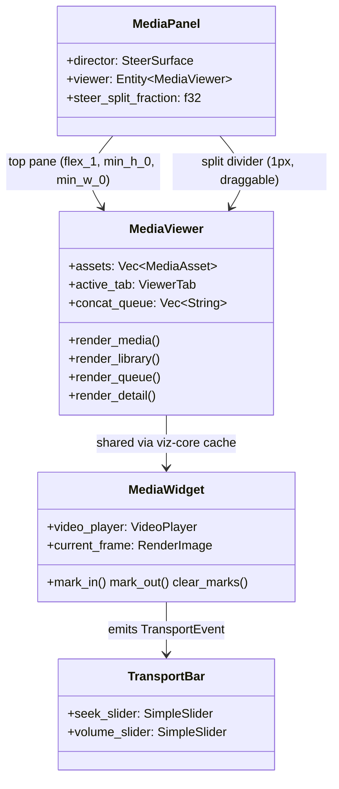

# media_panel — Reference: Media Viewer Interaction Model

The reference model for the media panel's viewing pane: the interaction
patterns a media viewer must supply, audited against the implementation.
Each capability is marked **supplied** (with file:line evidence), **missing**
(absent from the tree — verified by grep), or **degraded** (present but
defective, with the defect named). All citations were re-derived from disk on
2026-09-04. The implementation can be audited against this model after any
change; a capability not listed here is out of model.

## Component map

The panel is two rows split by a draggable 1px divider: the viewing pane on
top and the director (Steer conversation) below, whose height is a fraction
of the panel the divider drag adjusts (clamped to 20–80%; double-click resets
to 50%) — `crates/media_panel/src/media_panel.rs:337-420`, handle at
`:207-244`, drag math at `:327-335`. The viewer is four tabs over real
state; the media widget is the same entity the conversation renders inline
(one player per body — two would play two audio streams).

## Capability audit

| Capability | Status | Evidence |
| --- | --- | --- |
| Playback: play/pause | supplied | `transport.rs:163` → `media_widget.rs:606` |
| Playback: seek/position | supplied | `transport.rs:78` → `media_widget.rs:618` |
| Playback: stop | supplied | `transport.rs:175` → `media_widget.rs:636` |
| Playback: rate control | missing | no rate/set-speed surface anywhere in `hkask-media-widget` or `media_panel` |
| Audio: volume | supplied | `transport.rs:92` (logarithmic slider, `:44`) → `media_widget.rs:628` |
| Audio: mute | missing | no mute toggle; autoplay starts muted with a "Muted" transport label (`transport.rs:187-194`), volume slider floor is 0.001 (`transport.rs:44`) |
| Display: fit-to-pane, aspect preserved | supplied | `media_widget.rs:911-912` (video `img` `size_full` + `ObjectFit::Contain`), `media_widget.rs:854` (image path); pinned by layout tests (below) |
| Display: frame size adjustment | missing | no zoom / scale control |
| Display: fullscreen | missing | zero hits in `media_panel` / `hkask-media-widget` |
| Library: asset selection | supplied | `media_viewer.rs:895-912` (row click selects + switches to Media tab) |
| Library: queue/concat | supplied | `media_viewer.rs:788` (queue), `:807` (concat), `:283` (dispatch) |
| Library: trim to marks | supplied | `media_viewer.rs:779` (button), `:213` (dispatch); marks at `media_widget.rs:976/984/992` |
| Library: delete asset | supplied | `media_viewer.rs:917-946` (two-step confirm) → `:516` (`delete_asset`); the post-delete reload reconciles the list (`merge_gallery_records`, `:1254`) so the deleted row drops |
| Library: tracks gallery mutations | supplied | `media_viewer.rs:125-180` (`ingest_thread` reloads on a newly-completed gallery-mutating call, `:177`; classification `tool_mutates_gallery`, `:1298`) + `:364-411` (`merge_gallery_listing` re-locates selection/confirm by src) |
| Library: detail inspector | supplied | `media_viewer.rs:1050` (`render_detail` — record/tags/lineage/faces) |
| Chrome: refresh | supplied | `media_viewer.rs:1191` (rebuild widgets + reload tab); tab activation reloads its data (`:631`) |

### Degraded register

None at 2026-08-31. (The horizontal-fit defect — video content rendering
wider than the pane's available width, clipped and unviewable — was fixed
the same day; see Layout invariants.)

## Layout invariants

The viewer's fit contract, pinned by tests so it cannot silently regress:

1. **Vertical**: the player fits the pane's height — `flex_1` + `min_h_0`
   on the tab content root (`media_viewer.rs:838-844`), pinned by
   `viewer_layout_tests::viewer_video_area_scales_with_window_size`
   (`media_viewer.rs:1580`).
2. **Horizontal**: no part of the viewer — media content, header, toolbar,
   or tab bar — exceeds the pane's available width at any pane width or
   video aspect ratio. The pane is a flex-column child of the top/bottom
   split and MUST carry `min_w_0` (`media_panel.rs:412`): without it the
   pane cannot shrink below its content's min-content width, and a long
   untruncated header src or a wide toolbar inflates the pane past the
   dock (the recurring horizontal-overflow bug). Row-level containment —
   truncating labels (`media_viewer.rs:895`, tab bar `:1177`), a wrapping
   toolbar (`media_viewer.rs:728-729`), `overflow_hidden` — is the presentation
   layer; it does NOT stop min-content propagation (verified empirically:
   removing only the pane's `min_w_0` re-inflates the pane to ~699px inside
   a 316px pane). Pinned by
   `viewer_layout_tests::viewer_content_fits_narrow_pane`
   (`media_viewer.rs:1729`, host at `:1676`) across 700px/480px docks and
   by `hkask-media-widget` `layout_tests::wide_frame_fits_narrow_host`
   (`media_widget.rs:1574`) for a 21:9 frame in a 320px host.
3. **Split**: the pane is a flex-column child and MUST carry `min_h_0`
   (`media_panel.rs:411`): without it the pane cannot shrink below its
   content's min-content height as the divider drags, and the director
   (`media_panel.rs:372`) likewise — its content's min-content height
   would override the dragged fraction. The drag math is pure and pinned
   by `tests::split_fraction_follows_pointer_and_clamps` and
   `tests::split_fraction_guards_zero_height_panel` (`media_panel.rs:549-580`).
4. **Aspect preservation**: the video frame derives its laid-out size from
   the video area (`size_full` + `Contain`), never from the frame's natural
   dimensions — including when gpui injects the frame's intrinsic aspect
   ratio into the img style (`crates/gpui/src/elements/img.rs:350-352`).

Known constraint (not a defect): the divider drag clamps the steer pane to
20–80% of the panel height (`media_panel.rs:50-52`), so at very short panel
heights both panes can get tight; the viewer degrades by truncation, never
by overflow. The split fraction is in-memory only — it is not serialized
with the workspace.

## Missing-capability register

Rate control, mute, frame-size adjustment, and fullscreen are absent. Any
future addition should extend the transport bar (`transport.rs`) for
rate/mute, and the viewer chrome for fullscreen/frame-size, then update the
audit table above in the same change.
