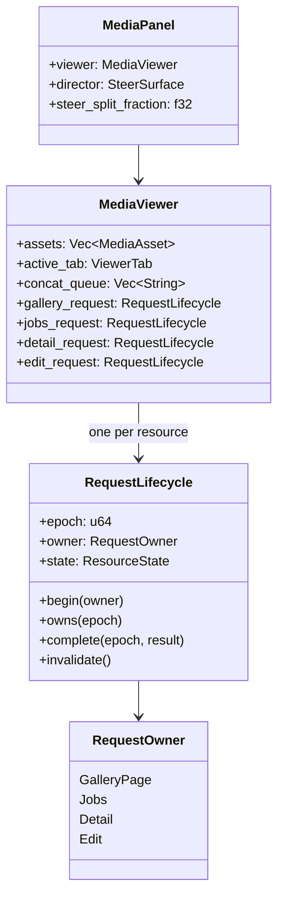

# media_panel — Reference: Media Viewer Interaction Model

The media viewer has four tabs backed by live state: selected media, paginated
gallery assets, process-local generation jobs, and selected-asset detail. All
server calls route through the governed `ToolInvoker` to the `media` server
(`crates/media_panel/src/media_viewer.rs:1-15,27-31`).

## Component and request map



<!-- DIAGRAM_ALIGNMENT
id: DIAG-MEDIA-PANEL-001
verified_date: 2026-09-16
verified_against: crates/media_panel/src/media_panel.rs:337-420; crates/media_panel/src/media_viewer.rs:33-100; crates/media_panel/src/media_viewer.rs:140-196
status: VERIFIED
-->

## Request ownership

Each asynchronous read resource has an independent `RequestLifecycle` with an epoch,
owner, and `Idle | Loading | Ready | Failed` state
(`crates/media_panel/src/media_viewer.rs:33-100`). `begin` suppresses duplicate
requests for the same loading owner; a newer owner advances the epoch. Callback
handlers mutate state only when they still own that epoch. This prevents a slow
page, job, or detail response from overwriting newer state. Direct edits are
serialized instead: trim and concat controls disable while one side effect is
active, so no completed operation can be hidden by a later epoch.

| Resource | Owner key | Latest-response gate | Evidence |
| --- | --- | --- | --- |
| Gallery | requested offset | `gallery_request.owns(epoch)` | `crates/media_panel/src/media_viewer.rs:547-605` |
| Jobs | queue resource | `jobs_request.owns(epoch)` | `crates/media_panel/src/media_viewer.rs:696-760` |
| Detail | stable gallery asset ID | `detail_request.owns(epoch)` | `crates/media_panel/src/media_viewer.rs:782-863` |
| Edit | one admitted side-effecting operation | `begin_edit` rejects overlap; `edit_request.owns(epoch)` closes it | `crates/media_panel/src/media_viewer.rs` |

Failures retain last-good data and surface degraded status instead of clearing
the resource (`crates/media_panel/src/media_viewer.rs:1631-1662`).

## Result-derived Library freshness

Published assets, imports, transcript renders, and deletions carry
`gallery_changed: true` only after their durable gallery transition succeeds.
The panel observes that completed-result field rather than classifying tool
names; read-only `gallery_*` results therefore do not trigger reloads. A
mutation-driven or manual Library reload invalidates an older same-page request
before dispatch, while switching to Library always requests current state.
Completed background jobs carry the same enriched display/mutation result and
are ingested once by stable job identity.

## Gallery pagination lifecycle

The Library requests 100 rows per page
(`crates/media_panel/src/media_viewer.rs:27-31,547-580`). A response commits only
when its gallery ID, total, requested offset, positive limit, row count, row
indices, and required asset fields validate
(`crates/media_panel/src/media_viewer.rs:1664-1743`). Failed or superseded page
requests preserve the prior page and cursor.

Previous/next navigation uses the server-confirmed page size and total, with
saturating cursor arithmetic (`crates/media_panel/src/media_viewer.rs:678-694`).
A gallery-root change removes prior indexed rows, clears pending selection and
delete state, and invalidates detail; a same-gallery refresh reconciles by
stable asset source (`crates/media_panel/src/media_viewer.rs:608-662`).

```mermaid
stateDiagram-v2
    [*] --> Idle
    Idle --> Loading: request page offset
    Loading --> Loading: newer offset supersedes epoch
    Loading --> Ready: owned response validates and commits
    Loading --> Failed: owned response fails; keep last-good page
    Ready --> Loading: previous, next, or refresh
    Failed --> Loading: retry
```

<!-- DIAGRAM_ALIGNMENT
id: DIAG-MEDIA-PANEL-002
verified_date: 2026-09-16
verified_against: crates/media_panel/src/media_viewer.rs:540-694; crates/media_panel/src/media_viewer.rs:1631-1743
status: VERIFIED
-->

## Bounded concatenation

Only selected video assets can enter the concat queue. Duplicates are no-ops;
an over-cap addition is rejected without truncating the queue. Dispatch requires
at least two clips and rechecks the upper bound before calling `video_concat`
(`crates/media_panel/src/media_viewer.rs:461-509`). The shared admission limit is
64 inputs (`kask/crates/hkask-types/src/media_limits.rs:1-9`).

## Job lifecycle

The Queue calls `job_list` with the shared default limit of 20. Producer and
panel consume one strict `JobListPayload` carrying `jobs`, `total`, `limit`,
`has_more`, `history_scope`, and `restart_behavior`. Legacy arrays, incomplete
objects, incoherent counts, and unknown statuses surface degradation while the
last-good queue remains visible.

While the Queue tab is active and any job remains nonterminal, one GPUI-native
one-second poll task is scheduled. Polling stops on terminal state, tab change,
or failure (`crates/media_panel/src/media_viewer.rs:762-779`). Queued or running
jobs can be cancelled through `job_cancel`, followed by a fresh listing
(`crates/media_panel/src/media_viewer.rs:913-930`). Job history is process-local,
so a server restart may produce an empty ready queue.

## Detail lifecycle

Detail requests address the selected asset by stable gallery ID, never by its
positional index. Assets not yet indexed surface a remediation message instead
of dispatching (`crates/media_panel/src/media_viewer.rs:782-824`). Only an owned,
object-shaped `gallery_asset_detail` response replaces the last-good detail;
stale and failed responses do not blank it
(`crates/media_panel/src/media_viewer.rs:825-863`). The renderer exposes image
record, tags, lineage, and faces when present
(`crates/media_panel/src/media_viewer.rs:1532-1583`).

## Playback and layout contracts

The selected media entity is owned directly by the viewer so trim marks and the
playback clock remain reachable; selection replacement resolves through the
stable asset registry (`crates/media_panel/src/media_viewer.rs:148-164`). The
panel remains a vertically split viewer/director surface with a draggable split
(`crates/media_panel/src/media_panel.rs:337-420`).

The viewer pane must retain `min_h_0` and `min_w_0` so media and toolbars shrink
inside the dock instead of propagating intrinsic dimensions. The selected media
uses the shared media widget, preserving aspect ratio through the widget's
contain fit. Playback timing is source-driven: source PTS and the audio-master
clock decide when frames are due; a 4 ms decoder poll provides deadline
headroom, while an 8 ms foreground poll follows GPUI's 120 Hz frame cadence and
renders only on a new source frame or state change. The production benchmark
requires one visible 30 fps player to present at least 89 of 90 source frames.
Volume and mute are intentionally delegated to the operating
system's default output device; the widget keeps unity application gain and
provides no competing mixer. Playback speed, zoom, and fullscreen controls are
not implemented in `media_panel` as of this edit.

## Capability summary

| Capability | State |
| --- | --- |
| Play/pause, seek, stop, trim marks | supplied |
| Volume and mute | operating-system controlled |
| Paginated gallery selection and refresh | supplied |
| Stable-ID detail and delete operations | supplied |
| Bounded video concatenation | supplied |
| Job list, polling, status, and cancellation | supplied |
| Playback speed, zoom, fullscreen | absent |
