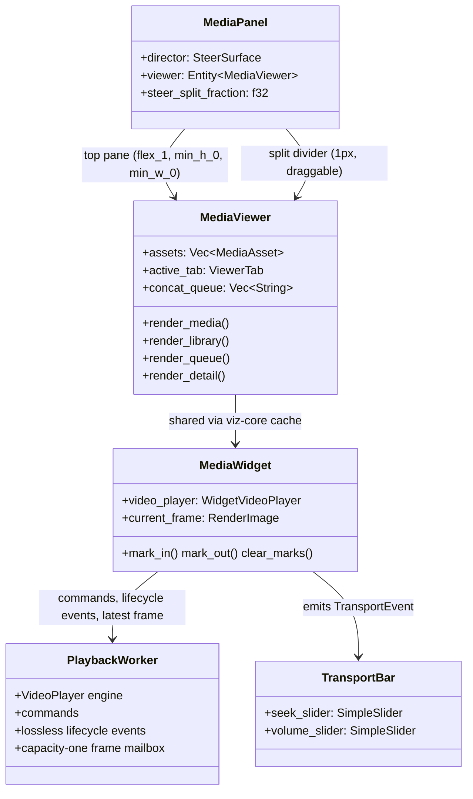

# media_panel — Reference: Media Viewer Interaction Model

The reference model for the media panel's viewing pane: the interaction
patterns a media viewer must supply, audited against the implementation.
Each capability is marked **supplied** (with file:line evidence), **missing**
(absent from the tree — verified by grep), or **degraded** (present but
defective, with the defect named). Playback citations and measurements were
re-derived from disk on 2026-09-13. The implementation can be audited against this model after any
change; a capability not listed here is out of model.

## Component map

The panel is two rows split by a draggable 1px divider: the viewing pane on
top and the director (Steer conversation) below, whose height is a fraction
of the panel the divider drag adjusts (clamped to 20–80%; double-click resets
to 50%) — `crates/media_panel/src/media_panel.rs:337-420`, handle at
`:207-244`, drag math at `:327-335`. The viewer is four tabs over real
state; the media widget is the same entity the conversation renders inline
(one player per body — two would play two audio streams).

## Capability audit

| Capability | Status | Evidence |
| --- | --- | --- |
| Playback: play/pause | supplied | `TransportEvent::TogglePlay` → `MediaWidget::handle_transport_event` |
| Playback: seek/position | supplied | `TransportEvent::Seek` → `MediaWidget::handle_transport_event` → generation-scoped worker seek |
| Playback: stop | supplied | `TransportEvent::Stop` stops the worker player and cancels widget polling |
| Playback: first-frame paused | supplied | opening runs on the playback worker and returns a poster frame without entering `Playing` |
| Playback: timestamp pacing | supplied | `VideoDecoderInner` retains one future frame and returns `Pending` until the media clock reaches its PTS; the first decoded PTS becomes timeline zero and remains stable across seeks; pinned by `future_frame_waits_for_its_presentation_timestamp` and `nonzero_source_pts_is_normalized_to_the_playback_timeline` |
| Playback: bounded frame delivery | supplied | ordinary BGRA frames use a capacity-one latest-frame mailbox; later due frames replace an unconsumed frame, while `Opened`/`Completed`/`Failed` remain an ordered lossless event batch; open/seek/stop generations reject stale frames and events; pinned by `worker_frame_backlog_is_bounded_to_latest_frame`, `lifecycle_events_survive_frame_coalescing`, `polling_preserves_repeated_lifecycle_events_in_order`, and `replacement_open_invalidates_unconsumed_prior_generation` |
| Playback: completion | supplied | FFmpeg EOF is drained into the lossless `Completed` event and `PlaybackState::Finished`; normal completion is not an error and closes polling |
| Playback: loading/failure feedback | supplied | transport renders `Loading…`; worker failures or channel disconnection become one visible widget error and close polling |
| Playback: responsiveness benchmark | supplied | isolated `hkask-media-benchmarks` GPUI benchmark uses production widget/decoder/viz-cache paths without `test-support`, for 1/8/32 visible and cached videos; asserts order/count/final frame/backlog and reports completion, foreground, draw, and frame-budget metrics |
| Playback: rate control | missing | no rate/set-speed surface anywhere in `hkask-media-widget` or `media_panel` |
| Audio: volume | supplied | `TransportEvent::VolumeChange` updates audio or worker-owned video playback |
| Audio: mute | missing | no mute toggle; video and audio both load paused, so neither produces unsolicited sound |
| Display: fit-to-pane, aspect preserved | supplied | `MediaWidget::render` applies `size_full` + `ObjectFit::Contain` to video and image paths; pinned by layout tests (below) |
| Display: frame size adjustment | missing | no zoom / scale control |
| Display: fullscreen | missing | zero hits in `media_panel` / `hkask-media-widget` |
| Library: asset selection | supplied | `media_viewer.rs:895-912` (row click selects + switches to Media tab) |
| Library: queue/concat | supplied | `media_viewer.rs:788` (queue), `:807` (concat), `:283` (dispatch) |
| Library: trim to marks | supplied | `media_viewer.rs:779` (button), `:213` (dispatch); marks at `media_widget.rs:976/984/992` |
| Library: delete asset | supplied | `media_viewer.rs:917-946` (two-step confirm) → `:516` (`delete_asset`); the post-delete reload reconciles the list (`merge_gallery_records`, `:1254`) so the deleted row drops |
| Library: tracks gallery mutations | supplied | `media_viewer.rs:125-180` (`ingest_thread` reloads on a newly-completed gallery-mutating call, `:177`; classification `tool_mutates_gallery`, `:1298`) + `:364-411` (`merge_gallery_listing` re-locates selection/confirm by src) |
| Library: detail inspector | supplied | `media_viewer.rs:1050` (`render_detail` — record/tags/lineage/faces) |
| Chrome: refresh | supplied | `media_viewer.rs:1191` (rebuild widgets + reload tab); tab activation reloads its data (`:631`) |

### Degraded register

None at 2026-09-13. Video decoding and remote packet reads run on a dedicated
playback thread; the GPUI foreground consumes at most one pending BGRA frame per
player. Future PTS frames remain decoder-owned until due, and non-zero source
PTS is normalized to the first decoded frame. EOF, loading, fatal failure, and
worker disconnection are ordered generation-scoped outcomes that cannot be
overwritten by frame coalescing or leak across source replacement. The horizontal-fit defect remains
fixed as described under Layout invariants.

## Playback performance baseline

The production-shaped benchmark is `crates/hkask-media-benchmarks/benches/playback.rs`.
It runs the same 600ms, six-frame, 10 FPS fixture through 1, 8, and 32 visible
or viz-cached `MediaWidget` entities. The measured 2026-09-13 Linux run used
120 FPS, ten samples per input, 100ms warm-up, and a one-second requested
measurement window (Criterion extended each input to ten complete iterations).
Completion intervals were 695.97–777.57ms across visible workloads and
700.38–724.51ms across cached workloads. Across the combined run, foreground
work p95/p99/max was 1.800/2.490/6.259ms, draw p95/p99/max was
1.753/2.456/6.033ms, and both reported zero 8.33ms frame-budget overruns.
The Linux headless path measures CPU scheduling/render work, not real GPU
submission. Correctness gates require monotonic consumed PTS, final PTS 500ms,
a retained final frame, and mailbox high-water exactly one.

## Layout invariants

The viewer's fit contract, pinned by tests so it cannot silently regress:

1. **Vertical**: the player fits the pane's height — `flex_1` + `min_h_0`
   on the tab content root (`media_viewer.rs:838-844`), pinned by
   `viewer_layout_tests::viewer_video_area_scales_with_window_size`
   (`media_viewer.rs:1580`).
2. **Horizontal**: no part of the viewer — media content, header, toolbar,
   or tab bar — exceeds the pane's available width at any pane width or
   video aspect ratio. The pane is a flex-column child of the top/bottom
   split and MUST carry `min_w_0` (`media_panel.rs:412`): without it the
   pane cannot shrink below its content's min-content width, and a long
   untruncated header src or a wide toolbar inflates the pane past the
   dock (the recurring horizontal-overflow bug). Row-level containment —
   truncating labels (`media_viewer.rs:895`, tab bar `:1177`), a wrapping
   toolbar (`media_viewer.rs:728-729`), `overflow_hidden` — is the presentation
   layer; it does NOT stop min-content propagation (verified empirically:
   removing only the pane's `min_w_0` re-inflates the pane to ~699px inside
   a 316px pane). Pinned by
   `viewer_layout_tests::viewer_content_fits_narrow_pane`
   (`media_viewer.rs:1729`, host at `:1676`) across 700px/480px docks and
   by `hkask-media-widget` `layout_tests::wide_frame_fits_narrow_host`
   (`media_widget.rs:1574`) for a 21:9 frame in a 320px host.
3. **Split**: the pane is a flex-column child and MUST carry `min_h_0`
   (`media_panel.rs:411`): without it the pane cannot shrink below its
   content's min-content height as the divider drags, and the director
   (`media_panel.rs:372`) likewise — its content's min-content height
   would override the dragged fraction. The drag math is pure and pinned
   by `tests::split_fraction_follows_pointer_and_clamps` and
   `tests::split_fraction_guards_zero_height_panel` (`media_panel.rs:549-580`).
4. **Aspect preservation**: the video frame derives its laid-out size from
   the video area (`size_full` + `Contain`), never from the frame's natural
   dimensions — including when gpui injects the frame's intrinsic aspect
   ratio into the img style (`crates/gpui/src/elements/img.rs:350-352`).

Known constraint (not a defect): the divider drag clamps the steer pane to
20–80% of the panel height (`media_panel.rs:50-52`), so at very short panel
heights both panes can get tight; the viewer degrades by truncation, never
by overflow. The split fraction is in-memory only — it is not serialized
with the workspace.

## Missing-capability register

Rate control, mute, frame-size adjustment, and fullscreen are absent. Any
future addition should extend the transport bar (`transport.rs`) for
rate/mute, and the viewer chrome for fullscreen/frame-size, then update the
audit table above in the same change.
