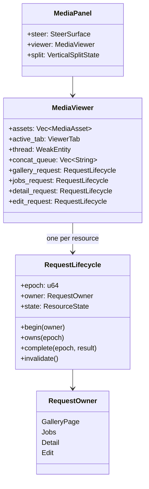

# media_panel — Reference: Media Viewer Interaction Model

The media viewer has four tabs backed by live state — Media, Library, Queue,
and Detail (`crates/media_panel/src/media_viewer.rs:138-143`) — covering
selected media, paginated gallery assets, process-local generation jobs, and
selected-asset detail. All server calls route through the governed tool
invoker to the `media` server, and pages are sized at 100 rows with a
one-second queue poll (`crates/media_panel/src/media_viewer.rs:33-34`).

## Component and request map

```mermaid
classDiagram
    class MediaPanel {
        +steer: SteerSurface
        +viewer: MediaViewer
        +split: VerticalSplitState
    }
    class MediaViewer {
        +assets: Vec~MediaAsset~
        +active_tab: ViewerTab
        +thread: WeakEntity
        +concat_queue: Vec~String~
        +gallery_request: RequestLifecycle
        +jobs_request: RequestLifecycle
        +detail_request: RequestLifecycle
        +edit_request: RequestLifecycle
    }
    class RequestLifecycle {
        +epoch: u64
        +owner: RequestOwner
        +state: ResourceState
        +begin(owner)
        +owns(epoch)
        +complete(epoch, result)
        +invalidate()
    }
    class RequestOwner {
        GalleryPage
        Jobs
        Detail
        Edit
    }
    MediaPanel --> MediaViewer
    MediaViewer --> RequestLifecycle : one per resource
    RequestLifecycle --> RequestOwner
```

<!-- DIAGRAM_ALIGNMENT
id: DIAG-MEDIA-PANEL-001
verified_date: 2026-09-28
verified_against: crates/media_panel/src/media_panel.rs:101-121 (MediaPanel fields); crates/media_panel/src/media_viewer.rs:37-100 (RequestOwner, ResourceState, RequestLifecycle); crates/media_panel/src/media_viewer.rs:145-183 (MediaViewer fields incl. thread, concat_queue, four requests)
status: VERIFIED
-->

## Request ownership

Each asynchronous read resource has an independent `RequestLifecycle` with an epoch,
owner, and `Idle | Loading | Ready | Failed` state
(`crates/media_panel/src/media_viewer.rs:37-100`). `begin` suppresses duplicate
requests for the same loading owner; a newer owner advances the epoch. Callback
handlers mutate state only when they still own that epoch
(`crates/media_panel/src/media_viewer.rs:614-632,767-818,901-915`). This prevents
a slow page, job, or detail response from overwriting newer state. Direct edits
are serialized instead: trim and concat controls disable while one side effect
is active (`begin_edit` rejects overlap at
`crates/media_panel/src/media_viewer.rs:414-423`), so no completed operation can
be hidden by a later epoch.

| Resource | Owner key | Latest-response gate | Evidence |
| --- | --- | --- | --- |
| Gallery | requested offset | `gallery_request.owns(epoch)` | `crates/media_panel/src/media_viewer.rs:574-632` |
| Jobs | queue resource | `jobs_request.owns(epoch)` | `crates/media_panel/src/media_viewer.rs:732-818` |
| Detail | stable gallery asset ID | `detail_request.owns(epoch)` | `crates/media_panel/src/media_viewer.rs:843-915` |
| Edit | one admitted side-effecting operation | `begin_edit` rejects overlap; `edit_request.owns(epoch)` closes it | `crates/media_panel/src/media_viewer.rs:414-445` |

Failures retain last-good data and surface degraded status instead of clearing
the resource: each `apply_*` handler completes its epoch into `ResourceState::Failed`
while leaving the committed rows, queue, or detail untouched
(`crates/media_panel/src/media_viewer.rs:614-632,767-818,901-915`).

## Result-derived Library freshness

Published assets, imports, transcript renders, and deletions carry
`gallery_changed: true` only after their durable gallery transition succeeds —
the viewer reads the completed-result field
(`tool_result_changed_gallery`, `crates/media_panel/src/media_viewer.rs:1814`)
inside `ingest_tool_result`
(`crates/media_panel/src/media_viewer.rs:337-360`). The panel observes that
completed-result field rather than classifying tool names; read-only
`gallery_*` results therefore do not trigger reloads. A mutation-driven or
manual Library reload invalidates an older same-page request before dispatch,
while switching to Library always requests current state. Completed background
jobs carry the same enriched display/mutation result and are ingested exactly
once by stable job identity (`processed_job_results`, a seen-set keyed by job
ID — `crates/media_panel/src/media_viewer.rs:784,800-801`).

## Gallery pagination lifecycle

The Library requests 100 rows per page (`GALLERY_PAGE_LIMIT`,
`crates/media_panel/src/media_viewer.rs:30,574-612`). A response commits only
when its gallery ID, total, requested offset, positive limit, row count, row
indices, and required asset fields validate (`parse_gallery_listing`,
`crates/media_panel/src/media_viewer.rs:1727-1824`). Failed or superseded page
requests preserve the prior page and cursor
(`crates/media_panel/src/media_viewer.rs:614-632`).

Previous/next navigation uses the server-confirmed page size and total, with
saturating cursor arithmetic
(`crates/media_panel/src/media_viewer.rs:713-731`). A gallery-root change
removes prior indexed rows, clears pending selection and delete state, and
invalidates detail; a same-gallery refresh reconciles by stable asset source
(`commit_gallery_listing`, `crates/media_panel/src/media_viewer.rs:635-698`).

```mermaid
stateDiagram-v2
    [*] --> Idle
    Idle --> Loading: request page offset
    Loading --> Loading: newer offset supersedes epoch
    Loading --> Ready: owned response validates and commits
    Loading --> Failed: owned response fails; keep last-good page
    Ready --> Loading: previous, next, or refresh
    Failed --> Loading: retry
```

<!-- DIAGRAM_ALIGNMENT
id: DIAG-MEDIA-PANEL-002
verified_date: 2026-09-28
verified_against: crates/media_panel/src/media_viewer.rs:574-731 (request, apply, commit, navigation); crates/media_panel/src/media_viewer.rs:1727-1824 (parse_gallery_listing validation)
status: VERIFIED
-->

## Bounded concatenation

Only selected video assets can enter the concat queue. Duplicates are no-ops;
an over-cap addition is rejected without truncating the queue
(`crates/media_panel/src/media_viewer.rs:486-505`). Dispatch requires at least
two clips and rechecks the upper bound before calling `video_concat`
(`crates/media_panel/src/media_viewer.rs:510-531`). The shared admission limit is
64 inputs (`MAX_CONCAT_ITEMS`,
`kask/crates/hkask-types/src/media_limits.rs:8`).

## Job lifecycle

The Queue calls `job_list` with the shared default limit of 20
(`DEFAULT_JOB_LIST_LIMIT`, `kask/crates/hkask-types/src/media_limits.rs:16`;
`crates/media_panel/src/media_viewer.rs:732-766`). Producer and panel consume
one strict `JobListPayload` carrying `jobs`, `total`, `limit`, `has_more`,
`history_scope`, and `restart_behavior`
(`kask/mcp-servers/hkask-mcp-media/src/types.rs:706-713`). Legacy arrays,
incomplete objects, incoherent counts, and unknown statuses surface degradation
while the last-good queue remains visible
(`parse_job_listing`, `crates/media_panel/src/media_viewer.rs:1825+`).

While the Queue tab is active and any job remains nonterminal, one GPUI-native
one-second poll task is scheduled (`QUEUE_POLL_INTERVAL`,
`crates/media_panel/src/media_viewer.rs:31,819-842`). Polling stops on terminal
state, tab change, or failure. Queued or running jobs can be cancelled through
`job_cancel`, followed by a fresh listing
(`crates/media_panel/src/media_viewer.rs:976-990`). Job history is process-local,
so a server restart may produce an empty ready queue.

## Detail lifecycle

Detail requests address the selected asset by stable gallery ID, never by its
positional index. Assets not yet indexed surface a remediation message instead
of dispatching (`crates/media_panel/src/media_viewer.rs:843-860`). Only an
owned, object-shaped `gallery_asset_detail` response replaces the last-good
detail; stale and failed responses do not blank it
(`crates/media_panel/src/media_viewer.rs:901-915`). The renderer exposes image
record, tags, lineage, and faces when present
(`crates/media_panel/src/media_viewer.rs:1595+`).

## Playback and layout contracts

The selected media entity is owned directly by the viewer so trim marks and the
playback clock remain reachable; selection replacement resolves through the
stable-asset weak registry (`crates/media_panel/src/media_viewer.rs:152-160`).
The panel remains a vertically split viewer/director surface with a draggable
split (`crates/media_panel/src/media_panel.rs:101-121,294+`).

The viewer pane must retain `min_h_0` and `min_w_0` so media and toolbars shrink
inside the dock instead of propagating intrinsic dimensions
(`crates/media_panel/src/media_panel.rs:326-359`). The selected media uses the
shared media widget, preserving aspect ratio through the widget's contain fit.
Playback timing is source-driven: source PTS and the audio-master clock decide
when frames are due; a 4 ms decoder poll (`DECODE_POLL_INTERVAL`,
`crates/hkask-media-widget/src/video_decoder.rs:51`) provides deadline headroom,
while an 8 ms foreground poll (`DISPLAY_POLL_INTERVAL`,
`crates/hkask-media-widget/src/video_decoder.rs:54`) follows GPUI's 120 Hz
frame cadence and renders only on a new source frame or state change
(`crates/hkask-media-widget/src/media_widget.rs:591`). The production benchmark
requires one visible 30 fps player to present at least 89 of 90 source frames
(`MIN_PRESENTED_FRAMES_AT_30_FPS`,
`crates/hkask-media-benchmarks/benches/playback.rs:10,285-286`). Volume and
mute are intentionally delegated to the operating system's default output
device; the widget keeps unity application gain and provides no competing
mixer (`crates/hkask-media-widget/src/audio_player.rs:66-67`). Playback speed,
zoom, and fullscreen controls are not implemented in `media_panel` or the
widget as of this edit (method: grep for `playback_speed`, `set_rate`,
`fullscreen`, `zoom` over `crates/media_panel/src/` and
`crates/hkask-media-widget/src/` — zero hits).

## Capability summary

| Capability | State |
| --- | --- |
| Play/pause, seek, stop, trim marks | supplied |
| Volume and mute | operating-system controlled |
| Paginated gallery selection and refresh | supplied |
| Stable-ID detail and delete operations | supplied |
| Bounded video concatenation | supplied |
| Job list, polling, status, and cancellation | supplied |
| Playback speed, zoom, fullscreen | absent |
