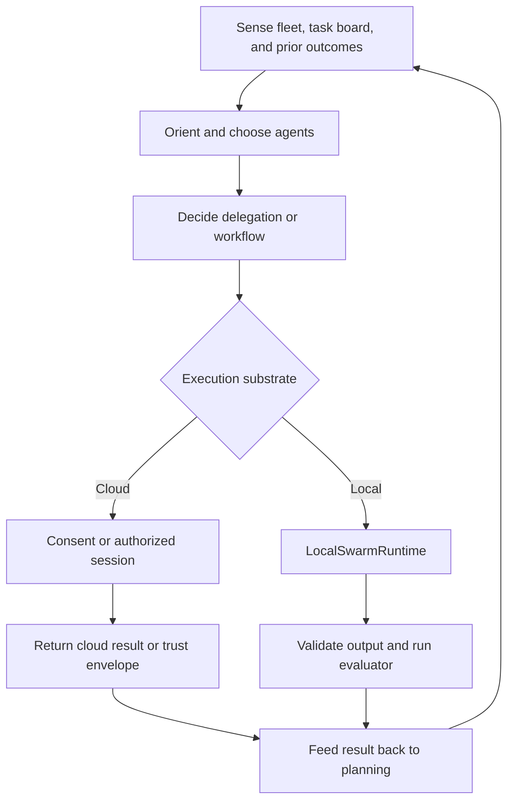
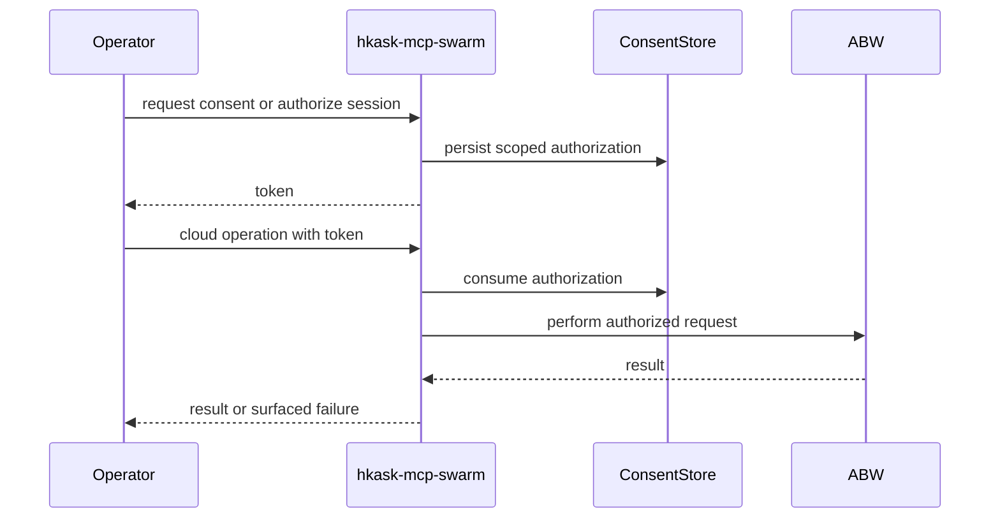

# Swarm Systems — Explanation: Why the Loops Are Shaped This Way

The swarm system separates cloud authority, local execution, type admission,
and result evaluation so each decision has one enforcement point. Its live MCP
surface is 87 tools: 48 cloud tools and 39 non-cloud tools
(`kask/mcp-servers/hkask-mcp-swarm/src/hkask_mcp_swarm.rs:731-754`).

## Planner, execution, and feedback

The planning skills produce and steer a delegation plan; the server executes
that plan through local or cloud tools. Local execution returns measured output
and optional deterministic verdicts, while the task board and event store keep
progress and observed delegation seams available to the next planning pass
(`kask/mcp-servers/hkask-mcp-swarm/src/local_tools.rs:2575-2669,2812-2899`).

<!-- DIAGRAM_ALIGNMENT
id: DIAG-SWARM-030
verified_date: 2026-09-16
verified_against: kask/mcp-servers/hkask-mcp-swarm/src/cloud_swarm_tools.rs:606-925; kask/mcp-servers/hkask-mcp-swarm/src/local_tools.rs:223-638; kask/mcp-servers/hkask-mcp-swarm/src/local_tools.rs:2575-2669; kask/mcp-servers/hkask-mcp-swarm/src/local_tools.rs:2812-2899
status: VERIFIED
-->

Cloud operations that spend ABW credits use the consent/session gate. Local
operations use the operator's configured inference substrate and therefore do
not require cloud-spend consent. They still remain bounded by delegation and
evaluation caps in the local tools
(`kask/mcp-servers/hkask-mcp-swarm/src/local_tools.rs:339-638,2616-2669,2848-3138`).

## Why tool counts are split by router

The build script discovers every `pub(crate) async fn swarm_*` function and
separately derives the cloud subset from `cloud_swarm_router`
(`kask/mcp-servers/hkask-mcp-swarm/build.rs:34-81`). The live-router tests then
compare both the total name set and cloud partition against the registered
routers (`kask/mcp-servers/hkask-mcp-swarm/src/hkask_mcp_swarm.rs:751-790`).

The 39-tool non-cloud complement is 32 local tools, four knowledge tools, and
three A2A tools. `swarm_get_local_agent` supplies one-card detail and execution
statistics; `swarm_workflow_check_local` validates a card's declared workflow
before execution (`kask/mcp-servers/hkask-mcp-swarm/src/local_tools.rs:702-795`).

## Why port labels are registered types

An agent card's `accepts` and `produces` values are type references, not free
labels. Admission rejects unresolved types, and output schemas are checked after
execution when the produced type has a supported schema
(`kask/mcp-servers/hkask-mcp-swarm/src/local_registry.rs:46-63`;
`kask/mcp-servers/hkask-mcp-swarm/src/port_registry.rs:69-170`). Unsupported
JSON Schema keywords surface as `UnsupportedSchema`, not success
(`kask/mcp-servers/hkask-mcp-swarm/src/schema_validate.rs:10-18,222-229`).

The runtime does not infer structured port types from task prose. Its bind
check recognizes only universal `text`; all other requests remain unclassified
rather than being guessed (`kask/mcp-servers/hkask-mcp-swarm/src/local_runtime.rs:708-729`).

## Why result trust is produced once

The local runtime is the point where the card, response, tool evidence, schema
verdict, and deterministic evaluator coexist. It stamps the reliance and task
success data there so fanout, pipelines, plans, and workflows read the same
result rather than recomputing it downstream
(`kask/mcp-servers/hkask-mcp-swarm/src/local_runtime.rs:135-150`;
`kask/mcp-servers/hkask-mcp-swarm/src/local_tools.rs:223-337`).

Cloud single-shot execution preserves ABW's trust envelope rather than reducing
it to narrative text (`kask/mcp-servers/hkask-mcp-swarm/src/cloud_swarm_tools.rs:467-528`).

## Why consent is durable

The consent store can persist single-use grants and authorized sessions in
SQLite. The server resolves the shared store path under `mcp/swarm/consent.db`
unless overridden (`kask/mcp-servers/hkask-mcp-swarm/src/hkask_mcp_swarm.rs:188-205`).
Token consumption and session deductions are database operations, allowing
separate callers to observe the same authorization state
(`kask/mcp-servers/hkask-mcp-swarm/src/consent.rs:399-609`).

<!-- DIAGRAM_ALIGNMENT
id: DIAG-SWARM-031
verified_date: 2026-09-16
verified_against: kask/mcp-servers/hkask-mcp-swarm/src/hkask_mcp_swarm.rs:188-205; kask/mcp-servers/hkask-mcp-swarm/src/consent.rs:399-609; kask/mcp-servers/hkask-mcp-swarm/src/cloud_swarm_tools.rs:606-925
status: VERIFIED
-->

## Further reading

- [Swarm procedures](./how-to.md)
- [Swarm tool and component reference](./reference.md)
