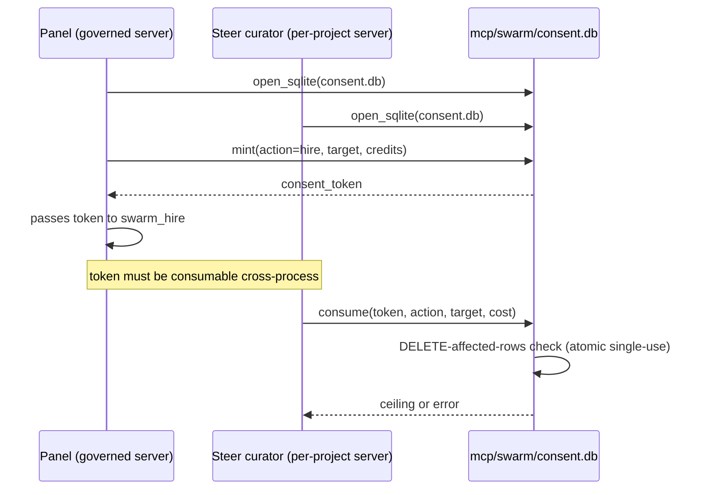

# Swarm Systems — Explanation: Why the Loops Are Shaped This Way

The swarm system's shape is not arbitrary — it emerges from a cybernetic
constraint: a swarm is a feedback loop, so the skill that governs it is a
feedback loop, and the components that close it are named (not implicit).
This explanation covers the four-loop architecture, why each loop has its
specific weak property, and the structural invariants that keep the loops
honest. It presupposes the [tutorial](./tutorial.md) and the
[reference](./reference.md).

## The shape: a planner, an actuator, and two gates

The system separates **planning** (composing/steering the swarm) from
**execution** (running the delegations) by design. The `swarm-intelligence`
skill is the planner — it emits a plan and never executes. The
`swarm-steering` skill is the actuator — it takes the plan, produces the
exact `swarm_delegate_local` sequence, and the re-invoke instruction. Two
gates sit under both: the consent/ceiling gate (Loop C) and the second-order
monitor + Go See (Loop D).

This separation is the Conant-Ashby Good Regulator theorem made literal: the
actuator must model the swarm it steers (the roster + the plan + the credit
budget). The steering skill's directive carries exactly that model.

## The four loops

```mermaid
stateDiagram-v2
    [*] --> Sense
    Sense: SENSE — balance, history, run_status, task_board
    Sense --> Orient: curator reads sense inputs
    Orient: ORIENT — swarm-intelligence PDCA cascade
    Orient --> Decide: plan emitted
    Decide: DECIDE — swarm-steering picks delegate sequence
    Decide --> Act: delegate_local calls
    Act: ACT — LocalSwarmRuntime::delegate
    Act --> Consent: spend gate (abw) or ceiling (local)
    Consent: Loop C — consent + ceiling
    Consent --> Record: authorize → complete → debit
    Record --> Sense: balance / history / task board updated
    Sense --> [*]: target reached or budget exhausted
```

<!-- DIAGRAM_ALIGNMENT
id: DIAG-SWARM-030
verified_date: 2026-08-28
verified_against: kask/mcp-servers/hkask-mcp-swarm/src/local_runtime.rs; kask/mcp-servers/hkask-mcp-swarm/src/spend_gate.rs; kask/mcp-servers/hkask-mcp-swarm/src/local_tools.rs; .agents/skills/swarm-intelligence/SKILL.md; .agents/skills/swarm-steering/SKILL.md (local budget removed 2026-09-08, operator ruling 2026-09-04)
status: VERIFIED
-->

A loop is healthy when all five properties (polarity, delay, gain, closure,
fidelity) are healthy. The swarm's four loops each have one weak property:

- **Loop A (planner → actuator):** weak *fidelity* — the plan is a natural
  language directive, not a typed contract. A prompt-injected curator could
  emit a plan that doesn't match the operator's intent. Mitigation: the
  actuator's tool surface is the governed MCP server, and the Steer
  prompt's tool advertisement is verified against the server's generated
  `TOOL_NAMES` (`hkask_steer::ensure_steer`, called at
  `crates/swarm_panel/src/swarm_panel.rs:1305`; pinned by
  `steer_prompt_mentions_only_known_tools`, `swarm_panel.rs:4312`) — the
  plan can only call tools that exist.
- **Loop B (actuator → delegation):** weak *delay* — the tool loop runs
  multiple inference rounds (`MAX_TOOL_ROUNDS = 4`,
  `agent_executor.rs:22`), so the actuator's view of "done" lags the actual
  completion. Mitigation: `swarm_delegate_and_wait`
  (`cloud_swarm_tools.rs:753`) polls for the run status.
- **Loop C (consent + ceiling):** weak *gain* — the per-dispatch ceiling
  bounds a single dispatch but not a cascade. A swarm of N agents each
  spending up to the ceiling can amplify cost N-fold. Mitigation: the
  session budget (`swarm_authorize_session`,
  `cloud_swarm_tools.rs:583`) bounds the total.
- **Loop D (monitor + Go See):** weak *closure* — the curator reads
  `swarm_balance_local` / `swarm_local_history` as the sense input, but the
  loop only closes if the curator actually calls them. Mitigation: the
  `swarm-intelligence` skill's SENSE step is a required cascade step, and
  the task board (`swarm_task_board`, `local_tools.rs:2176`) gives ORIENT a
  durable progress record instead of re-derived ephemeral state.

## Why local mode has no funding gate

There is no local budget — not even accounting. Local agents run on the
operator's own substrate (their machine, their inference credentials), so
there is nothing for the server to withhold or reconcile: refusing to run
costs the operator the work while saving them nothing, and pricing a run
records a fiction. Funding gates belong on *cloud* delegation, where credits
buy someone else's compute. The former ledger/cost/balance machinery was
removed entirely (operator ruling 2026-09-04: the budget concept is
deprecated; timeouts are the enforcement/kill mechanism).

The per-dispatch ceiling IS retained: it bounds a single runaway dispatch (a
cost-amplification limit), which is a different concern from whether an
account is funded (`local_runtime.rs:505-507`). A negative balance is
therefore normal and meaningful — it is the operator's unreconciled local
spend, not a fault.

## Why `cost_uncapped` is carried alongside `cost`

Real measurements remain: tokens used, latency, model, tool-call and
reasoning summaries. Those are the run's measurable facts.

## Why the consent store is shared SQLite



<!-- DIAGRAM_ALIGNMENT
id: DIAG-SWARM-031
verified_date: 2026-08-28
verified_against: kask/mcp-servers/hkask-mcp-swarm/src/hkask_mcp_swarm.rs:181-199,368-394; kask/mcp-servers/hkask-mcp-swarm/src/consent.rs:46-54,462-470
status: VERIFIED
-->

The swarm server is launched by two independent paths: the governed
`McpRuntime` (app-global, used by the panel) and the per-project
`ContextServerStore` (used by the Steer curator). A consent token minted by
the panel's process must be consumable by the Steer curator's process. Both
processes open the same SQLite store at `mcp/swarm/consent.db`
(`hkask_mcp_swarm.rs:368-394`). Single-use is enforced atomically via the
DELETE-affected-rows check — two processes racing on the same token cannot
double-spend it (`consent.rs:462-470`).

On open failure, the server degrades to the session-local in-memory store
with a loud error — same-process consent still works; cross-process flows
(panel confirm → Steer spend) do not (`hkask_mcp_swarm.rs:384-393`). The
startup-failure-signal rule requires this so an operator reading logs can
distinguish "not configured" from "configured but broken."

## Why the executor does not price the run

`AgentExecutor::run` returns a `RawDelegateResult` carrying the raw output
text, model, token usage, and tool/reasoning summaries. The caller
(`LocalSwarmRuntime::delegate` → `build_result`) stamps the contract checks
and records the measured stats. This separation keeps the agent-run policy
(skill cascade, tool-loop orchestration) free of accounting concerns, so the
executor can be unit-tested with stubbed ports.

## Why port labels are type references, not free strings

A port label (`accepts`/`produces`) on an agent card looks like a free
string, but a label that resolves to nothing cannot form a composition seam
— it matches nothing at bind time. The typing layer prevents this by
construction: every label must resolve to a registered type at admission
(`validate_typing`, `local_registry.rs:46-63`, against
`PortRegistry::resolves`, `port_registry.rs:93-95`; built-in seed
`["text", "json", "task", "task_result"]` at `port_registry.rs:41`).

The runtime half of this story is deliberately minimal. The old
`classify_request` heuristic — trying to infer from free text whether a
request "is a task" — was **deleted**: widened, it swallowed structured
ports; narrowed, it missed real declarations; there was no correct setting
(`local_runtime.rs:708-720` documents the deletion). What remains is
`check_bind` (`local_runtime.rs:721-729`): `Some(true)` only for
`accepts: ["text"]` (universal accept), `None` for everything else.
Runtime bind matching against structured labels is the typing layer's
unfinished transition — the admission gate is the enforced surface, and
this doc says so rather than pretending the runtime checks more than it
does.

Output validation closes the loop at the other end: when a `produces` type
carries a schema (only `task_result` does today,
`port_registry.rs:53-63`), the agent's actual output is validated against
it after each delegation (`validate_output`, `port_registry.rs:132-170`;
invoked from `swarm_delegate_local` at `local_tools.rs:246`). The validator
supports exactly 7 JSON Schema keywords (`schema_validate.rs:10-18`) and an
unsupported keyword is **never a pass** — it surfaces as
`UnsupportedSchema` (`schema_validate.rs:84-93`, status enum at
`:222-229`) — because a validator that silently ignores what it cannot
interpret returns `valid` for a document it never checked.

## Why cloned cards import port labels via `port_types.json`

A third-party ABW agent card can declare `accepts`/`produces` labels that
are not in the built-in set. Rejecting them would make the catalogue
unusable; accepting them silently would paper over the admission gate. The
clone path instead persists the imported labels to a `port_types.json`
extension file in the agents dir (`PORT_TYPES_FILE`,
`local_registry.rs:195`) and merges them into the registry
(`promote_imported_port_types`, `local_registry.rs:294-332`) — so the gate
resolves them on this and every subsequent load, and locally-authored cards
still face the full built-in check.

## Why `swarm_clone_to_local` filters `allowed_tool_servers`

A third-party ABW agent card can declare `capabilities.mcp_tools` with any
qualified `server/tool` names. If the clone copied them verbatim, the cloned
local agent would extend the delegated tool surface beyond the operator's own
governed servers — a privilege escalation through the catalogue. The clone
filters the declared tools against `allowed_tool_servers` (sourced from
`HKASK_MCP_SERVER_IDS`, the parent's `BUILT_IN_MCP_SERVERS_IDS`) so only
tools on the operator's own governed servers survive the clone
(`config.rs:100-106`; `local_tools.rs:667`). The declared list is also the
runtime allowlist: the executor only declares listed tools to the model and
the qualified list travels with every dispatch so the zed-side IPC server
enforces it at the dispatch boundary (`agent_executor.rs:211-233`).

## Why cards carry their own evaluators

Without a declared oracle, every delegation is an open task — `task_success`
stays `null` and judging quality is the curator's manual job. The evaluator
contract (`capabilities.evaluators`, `local_registry.rs:158-166`) lets a card
declare deterministic checks (contains / not_contains / regex / exit_code /
file_exists, `run_evaluator`, `local_tools.rs:43-81`); `swarm_delegate_local`
runs them all and stamps the verdict with
`provenance: DeterministicEvaluator` (`local_tools.rs:214-240`). Two
discipline points in the implementation: the declared evaluators are
conjunctive (all must pass), and a broken evaluator spec propagates as an
error rather than stamping `pass: false` — the agent must not be blamed for
a broken oracle (`local_tools.rs:38-42`).

## Why the A2A transport is in-process

The A2A (Agent2Agent) integration uses the `a2a-lf` crate's data model types
(AgentCard, Task, Message, Part, Artifact) to wrap the existing
`LocalSwarmRuntime::delegate` in A2A-compliant types. No HTTP server is
required — the MCP tool dispatch path IS the A2A transport. Agents
communicate by calling `swarm_a2a_send` as an MCP tool, which internally
creates an A2A Message, delegates to the target agent, and returns an A2A
Task with the response as an Artifact (`a2a.rs:1-12`). An HTTP binding
(`a2a_http.rs`, opt-in via `HKASK_A2A_HTTP_ENABLE`) can be added for
cross-machine communication — the types are already wire-compatible
(`hkask_mcp_swarm.rs:330-366`).

## The fermi trust-evolution absorption (2026-09-09)

fermi's 56-commit wave (62c434f6..1468f18b) hardened its verification and
coordination model. This section records what zed-kask adopted, what it
deliberately deferred with named triggers, and why — so a future session
reading fermi's `completeness.rs` or `reliance.rs` does not port them
before their prerequisites exist (fermi's own rule: *a contract cannot
name a source that does not exist* — a check the platform cannot run reads
as coverage and is worse than no check).

**Adopted** (prerequisites existed):

- **The trust envelope on cloud delegation.** fermi computes `reliance` —
  one token for "can I use this answer?" — plus the enforced `document`,
  `grounding.stripped`, and `completeness.owed` on its execute route.
  zed-kask's `swarm_execute_agent` previously extracted the narrative and
  discarded the verdicts (the "grade then discard" disease one layer out)
  and bypassed the spend gate. It now passes the envelope through
  verbatim after sanitization and routes through the consent gate
  (target = agent name). The @mention path (`swarm_delegate`) keeps raw
  chat content by design — it serves workspace-embedded flows.
- **The workflow runner.** `workflow.rs`'s pure functions gained their
  promised consumer: `swarm_run_workflow_local` executes a declared
  `workflow_template` sequentially, the artifact flowing verbatim between
  stages (fermi's `coordination_graph` feeding rule). Open slots and
  missing agents stop the run with named outcomes.
- **The observed topology.** fermi measured that declared ports predict
  NONE of the real hand-offs (3 of 3 production compositions had zero
  label overlap), so the declared-only seam check reports the norm as a
  mismatch. Delegation edges (agent A's output fed agent B's input) are
  now recorded at dispatch — by `swarm_pipeline_local` when the
  `{prev_output}` placeholder carries the upstream output, and by the
  workflow runner between stages — and `swarm_observed_seams_local`
  reports them with per-edge agreement against the declared ports. The
  edge is recorded at dispatch, not success: a downstream agent that ran
  and failed still received the artifact (fermi's `parent_episode_id`
  semantics). Observed is the fact; declared is the aspiration; the
  report is a note, never a block.

**Deferred, with triggers** (porting before the trigger is theatre):

| fermi piece | trigger that unblocks it | why it waits |
| --- | --- | --- |
| `completeness.rs` / `grounding_trust` gates on local delegation | the panel authors typed-tier output contracts (`contract.rs` excludes them today — "a blocking check the form cannot satisfy would be theatre") | a gate needs a contract to check against; local cards declare none |
| `reliance.rs` one-token verdict locally | the row above lands | one signal (`task_success`) has no combination problem; the vocabulary is adopted so the first local verification surface emits one token from day one |
| `fleet_digest.rs` three-tier meta-agent awareness | the local fleet grows past listing size | `swarm_list_local_agents` suffices today; the discipline (registry-first answers, name-what-you-don't-know, staleness anchor) is adopted as a rule regardless |
| `select_agent` competition | measured verdict volume per agent justifies ranking (run the count first) | with a handful of stamped verdicts per agent, ranking is noise — fermi's own §4.4 lesson is measure before promoting |

**Adopted as discipline** (rules, not modules): subject + machine-stable
reason on every verdict/decision record (fermi's gate-ledger lesson — a
record that cannot say what it was about cannot be reviewed); one producer
of the verdict, everything else reads it; registry-first fleet answers for
the Curator (the `biotech_analyst` confabulation incident); break-script
falsification for new guards.

## Source citations

| Concept                          | Location                                                                |
| -------------------------------- | ----------------------------------------------------------------------- |
| Planner/actuator separation      | `.agents/skills/swarm-intelligence/SKILL.md`; `.agents/skills/swarm-steering/SKILL.md` |
| `steer_system_prompt` (curator)  | `crates/swarm_panel/src/swarm_panel.rs:155`                             |
| Steer advertisement verification | `crates/swarm_panel/src/swarm_panel.rs:1303-1309`                       |
| No balance gate (local)          | `kask/mcp-servers/hkask-mcp-swarm/src/local_runtime.rs:492-507`         |
| Shared SQLite consent store      | `kask/mcp-servers/hkask-mcp-swarm/src/hkask_mcp_swarm.rs:368-394`       |
| DELETE-affected-rows single-use  | `kask/mcp-servers/hkask-mcp-swarm/src/consent.rs:462-470`               |
| Typing admission gate            | `kask/mcp-servers/hkask-mcp-swarm/src/local_registry.rs:46-63`          |
| `check_bind` (classification deleted) | `kask/mcp-servers/hkask-mcp-swarm/src/local_runtime.rs:708-729`     |
| `BUILTIN_PORT_TYPES` / `task_result_schema` | `kask/mcp-servers/hkask-mcp-swarm/src/port_registry.rs:41,53-63` |
| Unsupported-keyword-is-not-a-pass | `kask/mcp-servers/hkask-mcp-swarm/src/schema_validate.rs:84-93,222-229` |
| `port_types.json` extension      | `kask/mcp-servers/hkask-mcp-swarm/src/local_registry.rs:192-195,294-332` |
| `allowed_tool_servers` filter    | `kask/mcp-servers/hkask-mcp-swarm/src/config.rs:100-106`                |
| Runtime tool allowlist           | `kask/mcp-servers/hkask-mcp-swarm/src/agent_executor.rs:211-233`        |
| Evaluator contract               | `kask/mcp-servers/hkask-mcp-swarm/src/local_registry.rs:158-166`; `local_tools.rs:43-81,214-240` |
| Task board (Loop D closure)      | `kask/mcp-servers/hkask-mcp-swarm/src/task_board.rs:1-13`; `local_tools.rs:2176` |
| A2A in-process transport         | `kask/mcp-servers/hkask-mcp-swarm/src/a2a.rs:1-12`                      |
| A2A HTTP gateway (opt-in)        | `kask/mcp-servers/hkask-mcp-swarm/src/hkask_mcp_swarm.rs:330-366`       |
| `MAX_TOOL_ROUNDS`                | `kask/mcp-servers/hkask-mcp-swarm/src/agent_executor.rs:22`              |
| Spend gate two-phase shape       | `kask/mcp-servers/hkask-mcp-swarm/src/spend_gate.rs:1-22`                |
| Session budget (Loop C gain)     | `kask/mcp-servers/hkask-mcp-swarm/src/cloud_swarm_tools.rs:583`          |
| Trust envelope passthrough      | `kask/mcp-servers/hkask-mcp-swarm/src/cloud_swarm_tools.rs:446-531`; `spend_gate.rs` `complete_execute` |
| Workflow runner (pure closures)  | `kask/mcp-servers/hkask-mcp-swarm/src/workflow.rs` `run_workflow`        |
| Observed delegation edges       | `kask/mcp-servers/hkask-mcp-swarm/src/local_tools.rs` `record_delegation_edge`, `DELEGATION_EDGE_EVENT_KIND` |
| Observed-seam agreement         | `kask/mcp-servers/hkask-mcp-swarm/src/workflow.rs` `observed_seam_agreement` |
| fermi reference (upstream)       | `Clones/fermi` 62c434f6..1468f18b: `src/reliance.rs`, `src/completeness.rs`, `src/port_trust.rs`, `src/agent_backend/coordination_graph.rs`, `docs/plans/WHAT_THE_PLATFORM_CAN_REFUSE.md`, `docs/architecture/META_AGENT_FLEET_AWARENESS.md` |