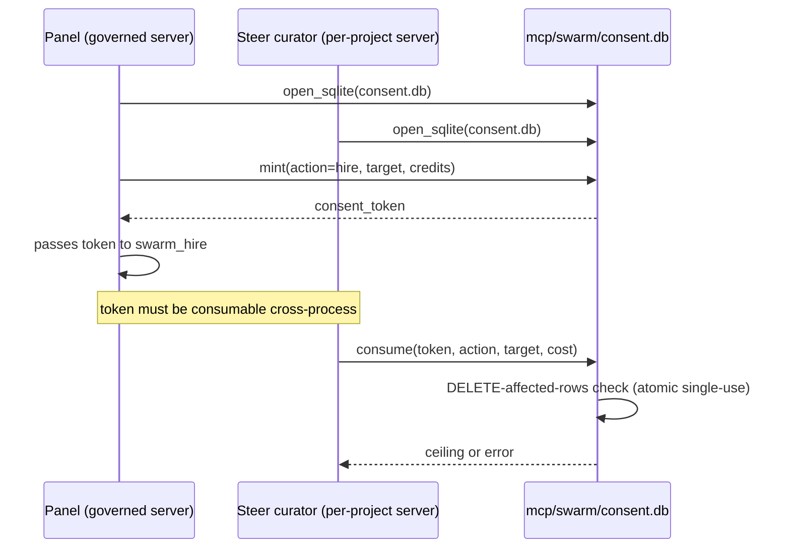

# Swarm Systems — Explanation: Why the Loops Are Shaped This Way

The swarm system's shape is not arbitrary — it emerges from a cybernetic
constraint: a swarm is a feedback loop, so the skill that governs it is a
feedback loop, and the components that close it are named (not implicit).
This explanation covers the four-loop architecture, why each loop has its
specific weak property, and the two structural invariants that keep the loops
honest. It presupposes the [tutorial](./tutorial.md) and the
[reference](./reference.md).

## The shape: a planner, an actuator, and two gates

The system separates **planning** (composing/steering the swarm) from
**execution** (running the delegations) by design. The `swarm-intelligence`
skill is the planner — it emits a plan (`emitted_calls`) and never executes.
The `swarm-steering` skill is the actuator — it takes the plan, produces the
exact `swarm_delegate_local` sequence, and the re-invoke instruction. Two
gates sit under both: the consent/ceiling gate (Loop C) and the second-order
monitor + Go See (Loop D).

This separation is the Conant-Ashby Good Regulator theorem made literal: the
actuator must model the swarm it steers (the roster + the plan + the credit
budget). The steering skill's directive carries exactly that model.

## The four loops

```mermaid
stateDiagram-v2
    [*] --> Sense
    Sense: SENSE — read balance, history, run_status
    Sense --> Orient: curator reads sense inputs
    Orient: ORIENT — swarm-intelligence PDCA cascade
    Orient --> Decide: plan emitted (emitted_calls)
    Decide: DECIDE — swarm-steering picks delegate sequence
    Decide --> Act: delegate_local calls
    Act: ACT — LocalSwarmRuntime::delegate
    Act --> Consent: spend gate (abw) or ceiling (local)
    Consent: Loop C — consent + ceiling
    Consent --> Record: authorize → complete → debit
    Record --> Sense: balance / history updated
    Sense --> [*]: target reached or budget exhausted
```

<!-- DIAGRAM_ALIGNMENT
id: DIAG-SWARM-030
verified_date: 2026-08-13
verified_against: kask/mcp-servers/hkask-mcp-swarm/src/local_runtime.rs:362-483; kask/mcp-servers/hkask-mcp-swarm/src/spend_gate.rs:169-480; kask/mcp-servers/hkask-mcp-swarm/src/ledger_tools.rs:66-118; .agents/skills/swarm-intelligence/SKILL.md; .agents/skills/swarm-steering/SKILL.md
status: VERIFIED
-->

A loop is healthy when all five properties (polarity, delay, gain, closure,
fidelity) are healthy. The swarm's four loops each have one weak property:

- **Loop A (planner → actuator):** weak *fidelity* — the plan is a natural
  language directive, not a typed contract. A prompt-injected curator could
  emit a plan that doesn't match the operator's intent. Mitigation: the
  actuator's tool surface is the governed MCP server, so the plan can only
  call tools that exist.
- **Loop B (actuator → delegation):** weak *delay* — the tool loop runs
  multiple inference rounds (`MAX_TOOL_ROUNDS = 4`, `agent_executor.rs:22`),
  so the actuator's view of "done" lags the actual completion. Mitigation:
  `swarm_delegate_and_wait` polls for the run status.
- **Loop C (consent + ceiling):** weak *gain* — the per-dispatch ceiling
  bounds a single dispatch but not a cascade. A swarm of N agents each
  spending up to the ceiling can amplify cost N-fold. Mitigation: the session
  budget (`swarm_authorize_session`) bounds the total.
- **Loop D (monitor + Go See):** weak *closure* — the curator reads
  `swarm_balance_local` / `swarm_local_history` as the sense input, but the
  loop only closes if the curator actually calls them. Mitigation: the
  `swarm-intelligence` skill's SENSE step is a required cascade step.

## Why local mode has no funding gate

The local ledger is **accounting, not authorization**
(`ledger_tools.rs:1-13`). Local agents run on the operator's own substrate
(their machine, their inference credentials), so there is nothing for the
server to withhold: refusing to run costs the operator the work while saving
them nothing. Funding gates belong on *cloud* delegation, where credits buy
someone else's compute (`local_runtime.rs:381-396`).

The per-dispatch ceiling IS retained: it bounds a single runaway dispatch (a
cost-amplification limit), which is a different concern from whether an
account is funded (`local_runtime.rs:394-396`). A negative balance is
therefore normal and meaningful — it is the operator's unreconciled local
spend, not a fault.

## Why `cost_uncapped` is carried alongside `cost`

`cost` stays capped at `credits_authorized` — that is the operator's declared
budget and what the ledger charges. But the cap makes the recorded figure
under-state real spend whenever a delegation overruns it, and the local
ledger is purely a reconciliation surface, so a silent understatement
corrupts the only data that surface exists to provide. `cost_uncapped` is
carried alongside so the gap is visible, and a bounded overrun is warned
about rather than swallowed (`local_runtime.rs:405-427`).

## Why the consent store is shared SQLite



<!-- DIAGRAM_ALIGNMENT
id: DIAG-SWARM-031
verified_date: 2026-08-13
verified_against: kask/mcp-servers/hkask-mcp-swarm/src/hkask_mcp_swarm.rs:149-167,301-327; kask/mcp-servers/hkask-mcp-swarm/src/consent.rs:46-54,159-214
status: VERIFIED
-->

The swarm server is launched by two independent paths: the governed
`McpRuntime` (app-global, used by the panel) and the per-project
`ContextServerStore` (used by the Steer curator). A consent token minted by
the panel's process must be consumable by the Steer curator's process. Both
processes open the same SQLite store at `mcp/swarm/consent.db`
(`hkask_mcp_swarm.rs:149-153`). Single-use is enforced atomically via the
DELETE-affected-rows check — two processes racing on the same token cannot
double-spend it (`consent.rs:46-54`).

On open failure, the server degrades to the session-local in-memory store
with a loud error — same-process consent still works; cross-process flows
(panel confirm → Steer spend) do not (`hkask_mcp_swarm.rs:301-327`). The
startup-failure-signal rule requires this so an operator reading logs can
distinguish "not configured" from "configured but broken."

## Why the executor does not debit the ledger

`AgentExecutor::run` returns a `RawDelegateResult` carrying the raw output
text, model, token usage, and tool/skill summaries — it does NOT debit the
ledger (`agent_executor.rs:9-12`). The caller (`LocalSwarmRuntime::delegate`)
computes the cost and debits. This separation keeps the agent-run policy
(skill cascade, tool-loop orchestration) ledger-unaware, so the executor can
be unit-tested with stubbed ports and the runtime owns the single spending
seam (`local_runtime.rs:68-83`).

## Why a failed balance measurement is not 0

`swarm_balance_local` returns an error, not 0, when the ledger query fails
(`ledger_tools.rs:77-86`). The `.rules` trap is explicit: `unwrap_or(0)` on
regulation-loop sense inputs is a broken feedback loop — a DB outage returns
0, which the loop reads as "no deviation." `LocalDelegateResult::balance` is
`Option<i64>` and stays `None` on a failed measurement, serializing as `null`
(`local_runtime.rs:434-464`). SENSE reads this as the Onto4MAT `energy`
property and DECIDE branches on it, so a fabricated value would be read as a
real measurement.

## Why `swarm_clone_to_local` filters `allowed_tool_servers`

A third-party ABW agent card can declare `capabilities.mcp_tools` with any
qualified `server/tool` names. If the clone copied them verbatim, the cloned
local agent would extend the delegated tool surface beyond the operator's own
governed servers — a privilege escalation through the catalogue. The clone
filters the declared tools against `allowed_tool_servers` (sourced from
`HKASK_MCP_SERVER_IDS`, the parent's `BUILT_IN_MCP_SERVERS_IDS`) so only tools
on the operator's own governed servers survive the clone
(`config.rs:95-101`, `local_tools.rs:358-525`).

## Why the A2A transport is in-process

The A2A (Agent2Agent) integration uses the `a2a-lf` crate's data model types
(AgentCard, Task, Message, Part, Artifact) to wrap the existing
`LocalSwarmRuntime::delegate` in A2A-compliant types. No HTTP server is
required — the MCP tool dispatch path IS the A2A transport. Agents
communicate by calling `swarm_a2a_send` as an MCP tool, which internally
creates an A2A Message, delegates to the target agent, and returns an A2A
Task with the response as an Artifact (`a2a.rs:1-12`). An HTTP binding
(`a2a_http.rs`, opt-in via `HKASK_A2A_HTTP_ENABLE`) can be added for
cross-machine communication — the types are already wire-compatible
(`hkask_mcp_swarm.rs:263-299`).

## Source citations

| Concept                          | Location                                                                |
| -------------------------------- | ----------------------------------------------------------------------- |
| Planner/actuator separation      | `.agents/skills/swarm-intelligence/SKILL.md`; `.agents/skills/swarm-steering/SKILL.md` |
| `steer_system_prompt` (curator)  | `crates/swarm_panel/src/swarm_panel.rs:148-326`                          |
| Local ledger = accounting        | `kask/mcp-servers/hkask-mcp-swarm/src/ledger_tools.rs:1-13`              |
| No balance gate (local)          | `kask/mcp-servers/hkask-mcp-swarm/src/local_runtime.rs:381-396`          |
| `cost_uncapped` rationale        | `kask/mcp-servers/hkask-mcp-swarm/src/local_runtime.rs:405-427`          |
| Shared SQLite consent store      | `kask/mcp-servers/hkask-mcp-swarm/src/hkask_mcp_swarm.rs:149-167,301-327` |
| DELETE-affected-rows single-use  | `kask/mcp-servers/hkask-mcp-swarm/src/consent.rs:46-54`                  |
| Executor does not debit          | `kask/mcp-servers/hkask-mcp-swarm/src/agent_executor.rs:9-12`            |
| `balance` is `Option<i64>`       | `kask/mcp-servers/hkask-mcp-swarm/src/local_runtime.rs:434-464`          |
| `swarm_balance_local` error path | `kask/mcp-servers/hkask-mcp-swarm/src/ledger_tools.rs:77-86`            |
| `allowed_tool_servers` filter    | `kask/mcp-servers/hkask-mcp-swarm/src/config.rs:95-101`                  |
| `swarm_clone_to_local` filtering | `kask/mcp-servers/hkask-mcp-swarm/src/local_tools.rs:358-525`           |
| A2A in-process transport         | `kask/mcp-servers/hkask-mcp-swarm/src/a2a.rs:1-12`                       |
| A2A HTTP gateway (opt-in)        | `kask/mcp-servers/hkask-mcp-swarm/src/hkask_mcp_swarm.rs:263-299`        |
| `MAX_TOOL_ROUNDS` / `MAX_SKILLS_PER_DELEGATION` | `kask/mcp-servers/hkask-mcp-swarm/src/agent_executor.rs:22` / `:27` |
| Spend gate two-phase shape       | `kask/mcp-servers/hkask-mcp-swarm/src/spend_gate.rs:1-14`                |
| Session budget (Loop C gain)     | `kask/mcp-servers/hkask-mcp-swarm/src/cloud_swarm_tools.rs:506-538`            |
