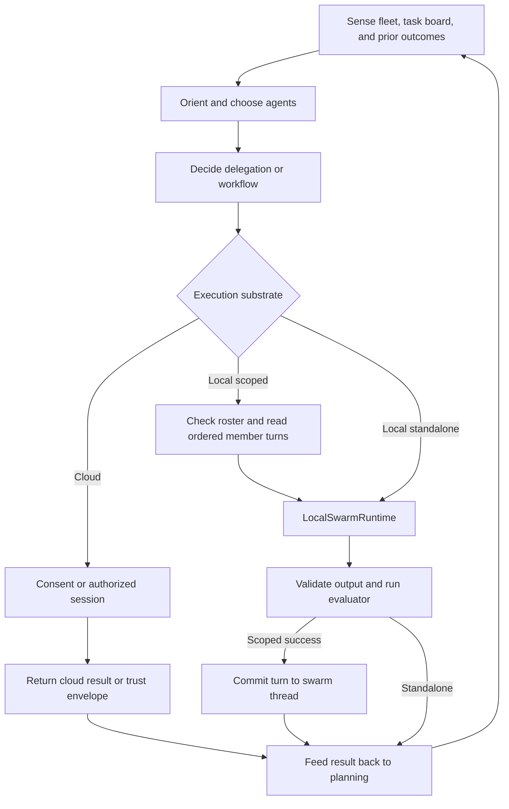
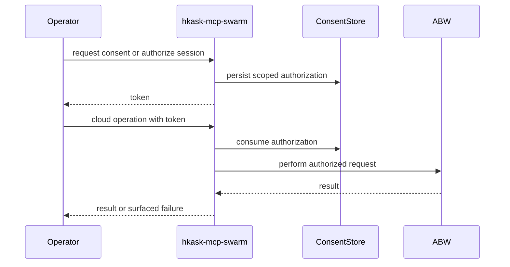

# Swarm Systems — Explanation: Why the Loops Are Shaped This Way

The swarm system separates cloud authority, local execution, type admission,
and result evaluation so each decision has one enforcement point. Its live MCP
surface is 90 tools: 48 cloud tools and 42 non-cloud tools (35 local, 4
knowledge, 3 A2A — count by pinning test for the total and per-file grep for
the partition; `kask/mcp-servers/hkask-mcp-swarm/src/hkask_mcp_swarm.rs:1026-1060`).
The Zed-side Steer surface renders its ABW/local tool split from the same
build-generated name consts, never a hand-maintained list
(`crates/swarm_panel/src/swarm_panel.rs:154-158`).

## Planner, execution, and feedback

The planning skills produce and steer a delegation plan; the server executes
that plan through local or cloud tools. A local call with `swarm_id` first checks
roster membership, reads the encrypted ordered member conversation, runs the
member with its previous turns, then commits the successful turn. Without a
swarm id, the local agent call is standalone. The task board and event store
track progress and observed handoffs; neither is the member conversation
(`kask/mcp-servers/hkask-mcp-swarm/src/local_tools.rs:278-352` (roster check,
ordered turn read, commit), `:354-566` (the dispatch tools);
`kask/mcp-servers/hkask-mcp-swarm/src/thread_store.rs:100,148`).

```mermaid
flowchart TD
    S[Sense fleet, task board, and prior outcomes] --> O[Orient and choose agents]
    O --> D[Decide delegation or workflow]
    D --> A{Execution substrate}
    A -->|Cloud| C[Consent or authorized session]
    A -->|Local scoped| T[Check roster and read ordered member turns]
    A -->|Local standalone| L[LocalSwarmRuntime]
    T --> L
    C --> R[Return cloud result or trust envelope]
    L --> V[Validate output and run evaluator]
    V -->|Scoped success| J[Commit turn to swarm thread]
    J --> F[Feed result back to planning]
    R --> F
    V -->|Standalone| F
    F --> S
```

<!-- DIAGRAM_ALIGNMENT
id: DIAG-SWARM-030
verified_date: 2026-09-28
verified_against: kask/mcp-servers/hkask-mcp-swarm/src/local_tools.rs:278-352 (dispatch_in_thread: roster check, ordered turns, commit),:354-566 (thread, delegate tools),:567-775 (fanout); kask/mcp-servers/hkask-mcp-swarm/src/thread_store.rs:38-148 (lock, turns, append); kask/mcp-servers/hkask-mcp-swarm/src/scoped_dispatch_tests.rs:148 (scoped_plan_broadcast_send_share_history_and_keep_verdict_and_board)
status: VERIFIED
-->

Cloud operations that spend ABW credits use the consent/session gate. Local
operations use the operator's configured inference substrate and therefore do
not require cloud-spend consent. They still remain bounded by delegation and
evaluation caps in the local tools (`MAX_FANOUT` at
`kask/mcp-servers/hkask-mcp-swarm/src/local_runtime.rs:654`;
`MAX_EVAL_TASKS`, `MAX_EVAL_REPEATS`, `MAX_EVAL_ROLLOUTS` at
`kask/mcp-servers/hkask-mcp-swarm/src/local_tools.rs:29-40`), and the eval
harness rolls out and scores through the same local dispatch path
(`kask/mcp-servers/hkask-mcp-swarm/src/local_tools.rs:2844-3365`).

## Why tool counts are split by router

The build script discovers every `pub(crate) async fn swarm_*` function and
separately derives the cloud subset from `cloud_swarm_router`
(`kask/mcp-servers/hkask-mcp-swarm/build.rs:36-74`). The live-router tests then
compare both the total name set and cloud partition against the registered
routers (`kask/mcp-servers/hkask-mcp-swarm/src/hkask_mcp_swarm.rs:1026-1060`).

The 42-tool non-cloud complement is 35 local tools, four knowledge tools, and
three A2A tools (per-file grep over the same signature pattern). `swarm_get_local_agent`
supplies one-card detail and execution statistics; `swarm_workflow_check_local`
validates a card's declared workflow before execution
(`kask/mcp-servers/hkask-mcp-swarm/src/local_tools.rs:963,1009-1057`).

## Why port labels are registered types

An agent card's `accepts` and `produces` values are type references, not free
labels. Admission rejects unresolved types, and output schemas are checked after
execution when the produced type has a supported schema
(`kask/mcp-servers/hkask-mcp-swarm/src/local_registry.rs:46-63`;
`kask/mcp-servers/hkask-mcp-swarm/src/port_registry.rs:41-170`). Unsupported
JSON Schema keywords surface as `UnsupportedSchema`, not success
(`kask/mcp-servers/hkask-mcp-swarm/src/schema_validate.rs:10-18,222-229`).

The runtime does not infer structured port types from task prose. Its bind
check (`check_bind`) recognizes only universal `text`; all other requests
remain unclassified rather than being guessed
(`kask/mcp-servers/hkask-mcp-swarm/src/local_runtime.rs:551-556`).

## Why result trust is produced once

The local runtime is the point where the card, response, tool evidence, schema
verdict, and deterministic evaluator coexist. It stamps the reliance and task
success data there — one producer, `LocalSwarmRuntime::delegate` — so fanout,
pipelines, plans, and workflows read the same `LocalDelegateResult` rather
than recomputing it downstream
(`kask/mcp-servers/hkask-mcp-swarm/src/local_runtime.rs:318-423,658-730`;
batch parity in `delegate_batch`,
`kask/mcp-servers/hkask-mcp-swarm/src/local_runtime.rs:425-543`).

Cloud single-shot execution preserves ABW's trust envelope rather than reducing
it to narrative text
(`kask/mcp-servers/hkask-mcp-swarm/src/cloud_swarm_tools.rs:467-528`).

## Why consent is durable

The consent store can persist single-use grants and authorized sessions in
SQLite. The server resolves the shared store path under `mcp/swarm/consent.db`
unless overridden (`kask/mcp-servers/hkask-mcp-swarm/src/hkask_mcp_swarm.rs:188-205`).
Token consumption and session deductions are database operations, allowing
separate callers to observe the same authorization state
(`kask/mcp-servers/hkask-mcp-swarm/src/consent.rs:399-609`).

```mermaid
sequenceDiagram
    participant Operator
    participant Swarm as hkask-mcp-swarm
    participant Consent as ConsentStore
    participant ABW

    Operator->>Swarm: request consent or authorize session
    Swarm->>Consent: persist scoped authorization
    Swarm-->>Operator: token
    Operator->>Swarm: cloud operation with token
    Swarm->>Consent: consume authorization
    Swarm->>ABW: perform authorized request
    ABW-->>Swarm: result
    Swarm-->>Operator: result or surfaced failure
```

<!-- DIAGRAM_ALIGNMENT
id: DIAG-SWARM-031
verified_date: 2026-09-28
verified_against: kask/mcp-servers/hkask-mcp-swarm/src/hkask_mcp_swarm.rs:188-205 (consent-store path); kask/mcp-servers/hkask-mcp-swarm/src/consent.rs:399-609 (grant TTL cleanup, action checks, atomic session deduction); kask/mcp-servers/hkask-mcp-swarm/src/cloud_swarm_tools.rs:606-925 (consent, session, authorized cloud dispatch)
status: VERIFIED
-->

## Further reading

- [Swarm tool and component reference — with procedures](./reference.md)
