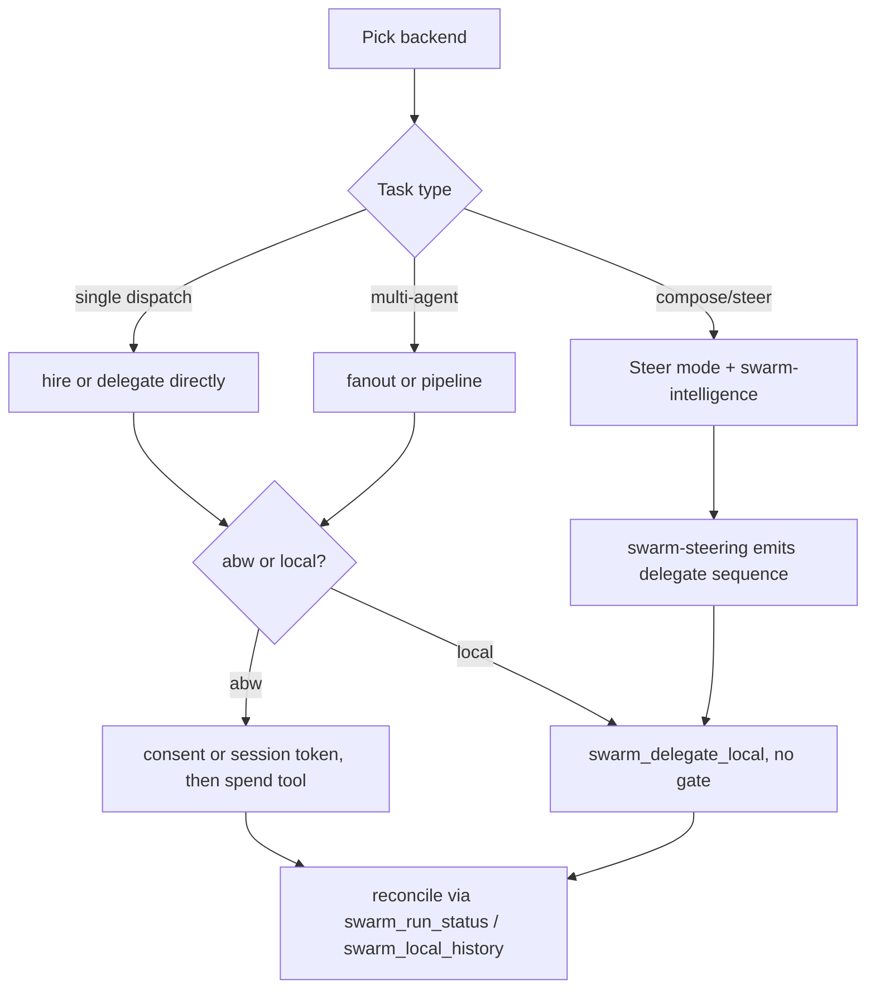
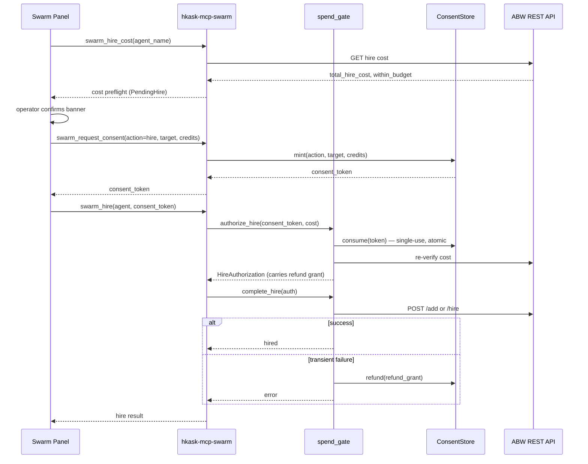

# Swarm Systems — How-to: Compose and Steer a Swarm

Procedural recipes for the panel modes and the steering execution modes.
Each recipe names the exact tool calls, the gate that must precede a spend,
and the feedback path that closes the loop. Read the
[tutorial](./tutorial.md) first for the component layout and the
[reference](./reference.md) for the full 82-tool surface.

## Source citations

| Symbol / concept                    | Location                                                                |
| ----------------------------------- | ----------------------------------------------------------------------- |
| `steer_system_prompt`               | `crates/swarm_panel/src/swarm_panel.rs:155`                             |
| `PanelMode` enum                    | `crates/swarm_panel/src/swarm_panel.rs:494-507`                        |
| `set_mode`                          | `crates/swarm_panel/src/swarm_panel.rs:1175`                            |
| `ensure_steer_conversation`         | `crates/swarm_panel/src/swarm_panel.rs:1303-1309`                       |
| `begin_hire` / `confirm_hire`       | `crates/swarm_panel/src/hire.rs:21` / `:123`                            |
| `create_swarm` / `ask_xaman`        | `crates/swarm_panel/src/swarm_panel.rs:1596` / `:1885`                 |
| `fetch_all` (sequenced fetches)     | `crates/swarm_panel/src/fetch.rs:21-52`                                 |
| `clone_to_local` / `push_to_cloud_swarm` | `crates/swarm_panel/src/fetch.rs:586` / `:629`                    |
| `open_swarm_detail` / `fire_agent`  | `crates/swarm_panel/src/swarm_ops.rs:30` / `:502`                      |
| 82-tool surface (generated)         | `kask/mcp-servers/hkask-mcp-swarm/src/hkask_mcp_swarm.rs:113`          |
| Consent gate (mint/consume/refund)  | `kask/mcp-servers/hkask-mcp-swarm/src/consent.rs` (consume at `:462-470`) |
| Spend gate (hire/delegate)          | `kask/mcp-servers/hkask-mcp-swarm/src/spend_gate.rs:169` / `:377`      |
| `swarm_request_consent` / `swarm_authorize_session` | `kask/mcp-servers/hkask-mcp-swarm/src/cloud_swarm_tools.rs:529` / `:583` |
| `swarm_delegate_local` / `swarm_fanout_local` / `swarm_pipeline_local` | `kask/mcp-servers/hkask-mcp-swarm/src/local_tools.rs:176` / `:294` / `:509` |
| `swarm_fund_local` / `swarm_balance_local` | `kask/mcp-servers/hkask-mcp-swarm/src/ledger_tools.rs:29` / `:71` |
| Planner PDCA                        | `.agents/skills/swarm-intelligence/SKILL.md`                            |
| Actuator directive                  | `.agents/skills/swarm-steering/SKILL.md`                               |

## Procedure map

<!-- DIAGRAM_ALIGNMENT
id: DIAG-SWARM-010
verified_date: 2026-08-28
verified_against: crates/swarm_panel/src/swarm_panel.rs:494-507,155; kask/mcp-servers/hkask-mcp-swarm/src/spend_gate.rs:169-480; kask/mcp-servers/hkask-mcp-swarm/src/local_tools.rs:176-530
status: VERIFIED
-->

## How-to: Hire an ABW agent (consent-gated)

This is the canonical spend flow. The panel orchestrates it; the same shape
applies to headless callers using a session token instead of a single-use
consent token.

<!-- DIAGRAM_ALIGNMENT
id: DIAG-SWARM-011
verified_date: 2026-08-28
verified_against: crates/swarm_panel/src/hire.rs:21-272; kask/mcp-servers/hkask-mcp-swarm/src/cloud_swarm_tools.rs:456-684; kask/mcp-servers/hkask-mcp-swarm/src/spend_gate.rs:169-371; kask/mcp-servers/hkask-mcp-swarm/src/consent.rs:462-470
status: VERIFIED
-->

1. **Preflight cost.** Panel calls `swarm_hire_cost`
   (`cloud_swarm_tools.rs:456`; auth required at `:458-460`). The server
   returns the cost fields; the panel populates `PendingHire` (`hire.rs`).
2. **Operator confirms.** The consent banner renders against the populated
   `PendingHire`.
3. **Mint consent token.** Panel calls `swarm_request_consent`
   (`cloud_swarm_tools.rs:529`). The server requires auth (`:536-539`) so a
   prompt-injected agent cannot self-authorize. The token is single-use,
   action-scoped (`consent.rs:15-30`), and expires after
   `CONSENT_TTL_SECS = 3600` (`consent.rs:76`).
4. **Execute the spend.** Panel calls `swarm_hire`
   (`cloud_swarm_tools.rs:621`) with the consent token. `authorize_hire`
   (`spend_gate.rs:169`) consumes the token (atomic single-use via the
   DELETE-affected-rows check, `consent.rs:462-470`), re-verifies the cost
   against ABW, and enforces the per-dispatch ceiling. `complete_hire`
   (`spend_gate.rs:317`) executes the POST and refunds the authorization on
   transient failure.
5. **Reconcile.** Read `swarm_run_status` (`cloud_swarm_tools.rs:871`) for
   the run state.

## How-to: Use a pre-authorized session (headless pipelines)

For headless ABW pipelines where per-spend confirmation is impractical, open
a session with a total budget upfront.

1. Call `swarm_authorize_session` (`cloud_swarm_tools.rs:583`) with
   `total_credits` and an optional `actions` allowlist (empty = all
   actions). Returns a `session_token`.
2. Pass `session_token` (instead of `consent_token`) to the spend tools.
   `resolve_auth` (`spend_gate.rs:44-60`) rejects both-set and neither-set;
   empty strings are treated as absent.
3. Each spend deducts from the session; `Settlement::Session`
   (`spend_gate.rs:74-77`) deducts on success and does nothing on failure
   (nothing was deducted to refund). When exhausted, open a new session.

## How-to: Delegate to a local agent (no gate)

Local mode has no consent token and no funding gate — the ledger records
spend rather than authorizing it (`local_runtime.rs:492-507`).

1. Ensure the agent exists in the local registry
   (`mcp/swarm/agents/curated/<id>/agent_card.json`, default
   `config.rs:151`).
2. Call `swarm_delegate_local` (`local_tools.rs:176`) with `agent_name`,
   `task`, and `credits_authorized`. The per-dispatch ceiling
   (`max_credits_per_dispatch`, default 50, `config.rs:148`) still bounds a
   single runaway dispatch (`local_runtime.rs:484-490`).
3. The runtime runs the skill cascade + tool loop (`AgentExecutor`),
   computes cost (1 credit / 1000 tokens, capped at `credits_authorized`,
   `local_runtime.rs:544-545`), and debits the ledger. `cost_uncapped` is
   carried alongside so a capped overrun is visible
   (`local_runtime.rs:525-535`).
4. Read the result's `balance` (may be negative — unreconciled local spend,
   not a fault) and `task_success`. If the agent's card declares
   `capabilities.evaluators`, the server runs them and stamps the verdict
   with `provenance: DeterministicEvaluator` (`local_tools.rs:214-240`);
   with no declared evaluators it stays `null` and the curator can stamp it
   via `swarm_evaluate_local` (`local_tools.rs:1907`).

## How-to: Fan out to N agents

- **Local:** `swarm_fanout_local` (`local_tools.rs:294`) defaults to
  sequential dispatch; set `parallel=true` to run the inference calls
  concurrently and debit the ledger sequentially after all completions
  (`delegate_batch`, `local_runtime.rs:612-706` — the TOCTOU concern is
  resolved by deferring the debit, not by serializing inference). Capped
  at `MAX_FANOUT = 10` (`local_runtime.rs:736`).
- **ABW:** `swarm_fanout` (`cloud_swarm_tools.rs:1373`) dispatches in
  parallel against ABW. Capped at `MAX_FANOUT_ABW = 10`
  (`cloud_swarm_tools.rs:1393`). Each dispatch carries its own consent or
  session token.

## How-to: Run a sequential pipeline

`swarm_pipeline_local` (`local_tools.rs:509`) runs a sequence of delegations
where each step's output is substituted into the next step's `task` via
`{{prev_output}}`. Capped at `MAX_PIPELINE_STEPS = 10`
(`local_tools.rs:524`). No consent token — local mode.

## How-to: Execute a plan and track task progress

`swarm_execute_plan_local` (`local_tools.rs:1954`) runs a delegation
sequence with optional per-step evaluators (cap `MAX_FANOUT`, `:1966`) and
writes each task's status to the per-swarm task board
(`<swarms dir>/<swarm_id>/task_board.json`, `task_board.rs:11-13`). The
Curator's ORIENT phase reads durable progress ("task 3 failed twice")
via `swarm_task_board` (`local_tools.rs:2176`) without re-deriving it from
delegate results.

## How-to: Evaluate an agent's reliability

`swarm_eval_agent_local` (`local_tools.rs:2473`) is a rollout harness: run
one agent against a task set N times each, evaluate every rollout with a
deterministic evaluator, and report per-task pass rates with standard
errors. Caps: `MAX_EVAL_TASKS = 10` tasks (`local_tools.rs:25`), repeats
default 3 / cap 10 (`:30-31`), total rollouts cap 50 (`:36`). Rollout
trajectories are recorded to the event store (`mcp/swarm/events.db`,
`hkask_mcp_swarm.rs:285-300`). For multi-agent case datasets, use
`swarm_eval_suite_local` (`local_tools.rs:2218`, cap 10 cases at `:2230`).

## How-to: Steer a swarm via the panel

1. Select a swarm in Browse mode (sets `selected_workspace`,
   `swarm_panel.rs:671`).
2. Switch to Steer mode (`set_mode`, `swarm_panel.rs:1175`). The panel
   calls `ensure_steer_conversation` (`swarm_panel.rs:1303`), which
   delegates to `hkask_steer::ensure_steer` (`:1305`) — the shared helper
   verifies the prompt's tool advertisement against the server's generated
   `TOOL_NAMES` and builds the system prompt via `steer_system_prompt`
   (`swarm_panel.rs:155`).
3. The curator runs the `swarm-intelligence` PDCA cascade (planner) and
   emits a plan. The `swarm-steering` skill (actuator) takes the plan and
   produces the `swarm_delegate_local` sequence plus the re-invoke
   instruction.
4. The curator's tool calls dispatch through the governed MCP server; local
   delegations hit `swarm_delegate_local` and record spend in
   `mcp/swarm/ledger.db`.

## How-to: Clone an ABW agent to local

`clone_to_local` (`fetch.rs:586`) calls `swarm_clone_to_local`
(`local_tools.rs:667`). The cloned card's `capabilities.mcp_tools` are
filtered against `allowed_tool_servers` (sourced from
`HKASK_MCP_SERVER_IDS`, `config.rs:100-106`) so a third-party ABW card
cannot extend the delegated tool surface beyond the operator's own
governed servers. The cloned card carries `cloud_id` so the panel shows a
"synced" badge (`local_registry.rs:93-97`). Port labels on the cloned card
that are not built-in are imported via the `port_types.json` extension
file so the typing gate resolves them on every subsequent load
(`local_registry.rs:192-195`, `:294-332`).

## How-to: Push a local agent to ABW

`push_to_cloud_swarm` (`fetch.rs:629`) calls `swarm_push_to_cloud`
(`local_tools.rs:854`). The local card is uploaded to ABW; the local card's
`cloud_id` is set to the ABW agent id, marking it synced. Swarms have an
analogous pair: `swarm_push_local_swarm` (`local_tools.rs:1453`) and
`swarm_pull_swarm_to_local` (`:1596`), which set/read the swarm's
`cloud_workspace_id` (`local_swarms.rs:50-52`).

## How-to: Reconcile local spend

1. Call `swarm_balance_local` (`ledger_tools.rs:71`). A failed measurement
   returns an error, not 0 (`ledger_tools.rs:85-95` — the `.rules`
   `unwrap_or(0)` trap).
2. Call `swarm_local_history` (`ledger_tools.rs:109`) for the recent
   fund/debit entries (newest first, default 50, cap 500 at `:119`).
3. If you want the balance to read as "remaining" rather than "consumed",
   call `swarm_fund_local` (`ledger_tools.rs:29`). This is optional — local
   delegation never refuses for lack of funds.