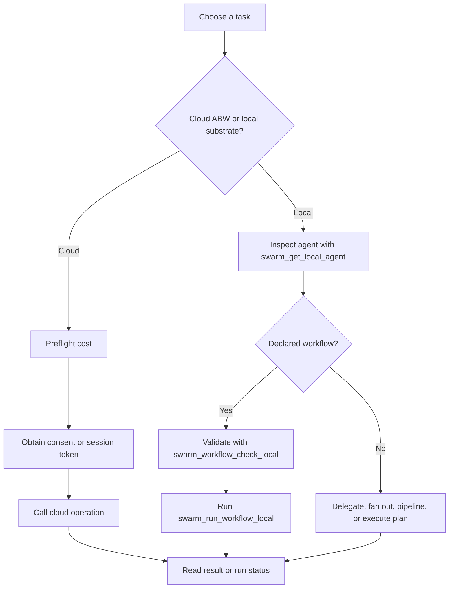

# Swarm Systems — How-to: Compose and Steer a Swarm

These procedures use the current 87-tool surface: 48 cloud tools and 39
non-cloud tools (`kask/mcp-servers/hkask-mcp-swarm/src/hkask_mcp_swarm.rs:731-754`).

## Choose the execution path

<!-- DIAGRAM_ALIGNMENT
id: DIAG-SWARM-010
verified_date: 2026-09-16
verified_against: kask/mcp-servers/hkask-mcp-swarm/src/cloud_swarm_tools.rs:530-925; kask/mcp-servers/hkask-mcp-swarm/src/local_tools.rs:223-638; kask/mcp-servers/hkask-mcp-swarm/src/local_tools.rs:702-909
status: VERIFIED
-->

## Hire or delegate through ABW

1. Call `swarm_hire_cost` before hiring
   (`kask/mcp-servers/hkask-mcp-swarm/src/cloud_swarm_tools.rs:530-605`).
2. Obtain a single-use token with `swarm_request_consent`, or open a bounded
   headless session with `swarm_authorize_session`
   (`kask/mcp-servers/hkask-mcp-swarm/src/cloud_swarm_tools.rs:606-686`).
3. Pass exactly one authorization form to `swarm_hire`, `swarm_delegate`,
   `swarm_delegate_and_wait`, `swarm_fanout`, `swarm_execute_agent`,
   `swarm_create_swarm`, or `swarm_xaman`. These operations route through the
   cloud authorization path in their definitions
   (`kask/mcp-servers/hkask-mcp-swarm/src/cloud_swarm_tools.rs:467-528,687-925,1160-1387,1452-1555`).
4. For asynchronous workspace work, inspect `swarm_run_status`
   (`kask/mcp-servers/hkask-mcp-swarm/src/cloud_swarm_tools.rs:926-977`).

## Delegate to a local swarm member

1. Select a local swarm and inspect its roster with `swarm_get_local_swarm`.
2. Call `swarm_delegate_in_thread_local` with `swarm_id`, a roster member's
   `agent_name`, and the task. Nonmembers are refused before inference. The
   next member receives the earlier committed turns as ordered chat messages.
3. Read the same durable conversation with `swarm_thread_local`; Steer shows
   the selected local swarm's turns beside the Curator conversation. Use
   `swarm_list_local_threads` to find retained history after swarm deletion.
   A cloned swarm begins with an empty conversation.

`swarm_delegate_local` is a **standalone** agent call: it accepts an agent
name and task without a swarm and neither reads nor writes member turns.
Local calls require no ABW consent token. Declared tool and output-contract
checks still apply (`kask/mcp-servers/hkask-mcp-swarm/src/local_runtime.rs`).

## Run a declared workflow safely

1. Inspect the agent with `swarm_get_local_agent`.
2. Call `swarm_workflow_check_local`; do not start execution if the declared
   workflow is invalid (`kask/mcp-servers/hkask-mcp-swarm/src/local_tools.rs:748-795`).
3. Call `swarm_run_workflow_local` with `swarm_id` when its stages must
   participate in that swarm's ordered conversation; omitting it runs a
   standalone workflow. The tool also records observed handoff seams.
4. Use `swarm_observed_seams_local` to compare observed handoffs with declared
   ports (`kask/mcp-servers/hkask-mcp-swarm/src/local_tools.rs:911-1014`).

## Fan out, pipeline, or execute a plan

- `swarm_fanout_local`, `swarm_pipeline_local`, and `swarm_run_workflow_local`
  use the shared conversation when `swarm_id` is supplied; without it they
  run standalone. Scoped fanout is ordered, so `parallel: true` with
  `swarm_id` is rejected instead of silently changing its meaning.
- `swarm_execute_plan_local` uses the shared conversation when `swarm_id` is
  supplied; it also records task progress on the swarm's task board.
  Omitting `swarm_id` keeps execution standalone.
- `swarm_task_board` reports progress and verdicts, **not** the conversation.

## Measure agent or swarm reliability

Use `swarm_eval_agent_local` for repeated single-agent rollouts and
`swarm_eval_suite_local` for multi-delegation cases. These are standalone
evaluations, not member conversation turns. The suite's optional `swarm_id`
selects task-board progress only; it does not admit members to the thread.

## Move agents and swarms between local and cloud

- `swarm_clone_to_local`, `swarm_push_to_cloud`, `swarm_remove_local`,
  `swarm_create_local_agent`, and `swarm_reconfigure_local_agent` manage local
  cards and cloud linkage
  (`kask/mcp-servers/hkask-mcp-swarm/src/local_tools.rs:1173-1905`).
- Local swarm CRUD and membership tools are defined at
  `kask/mcp-servers/hkask-mcp-swarm/src/local_tools.rs:1906-2127`.
- `swarm_push_local_swarm` and `swarm_pull_swarm_to_local` synchronize swarm
  composition with ABW
  (`kask/mcp-servers/hkask-mcp-swarm/src/local_tools.rs:2128-2335`).

## Further reading

- [Why the swarm loops are separated](./explanation.md)
- [Complete swarm tool reference](./reference.md)
