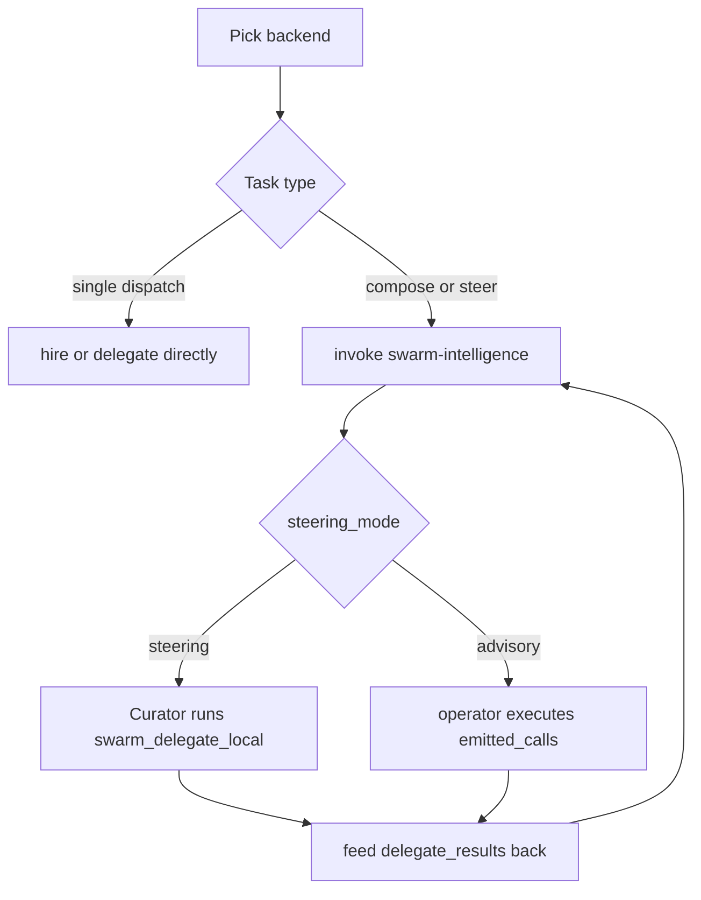

# Swarm Systems — How-to: Compose and Steer a Swarm

Procedural recipes for the four panel modes and the two steering execution
modes. Each recipe names the exact tool calls, the gate that must precede a
spend, and the feedback path that closes the loop. Read the
[tutorial](./tutorial.md) first for the component layout.

## Source citations

| Symbol | Location |
|--------|----------|
| `steer_system_prompt` | `crates/swarm_panel/src/swarm_panel.rs:100` |
| `PanelMode` enum | `crates/swarm_panel/src/swarm_panel.rs:289` |
| `set_mode` / `set_swarm_mode` | `crates/swarm_panel/src/swarm_panel.rs:1798` / `:1834` |
| `ensure_steer_conversation` | `crates/swarm_panel/src/swarm_panel.rs:1870` |
| `begin_hire` / `confirm_hire` | `crates/swarm_panel/src/swarm_panel.rs:1441` / `:1543` |
| `create_swarm` / `ask_xaman` | `crates/swarm_panel/src/swarm_panel.rs:1973` / `:2145` |
| 47-tool surface (pinned) | `kask/mcp-servers/hkask-mcp-swarm/src/hkask_mcp_swarm.rs:3003` |
| Consent gate (mint/consume/refund) | `kask/mcp-servers/hkask-mcp-swarm/src/consent.rs:150`/`:184`/`:227` |
| Spend gate (hire/delegate/curate) | `kask/mcp-servers/hkask-mcp-swarm/src/spend_gate.rs:83`/`:253`/`:334` |
| Debit-before-scan invariant | `kask/mcp-servers/hkask-mcp-swarm/src/agent_executor.rs:11` |
| Planner PDCA | `.agents/skills/swarm-intelligence/SKILL.md:62` |
| Actuator directive | `.agents/skills/swarm-steering/SKILL.md:59` |

## Procedure map



<!-- DIAGRAM_ALIGNMENT
id: DIAG-DIA-SWARM-HT
verified_date: 2026-08-03
verified_against: crates/swarm_panel/src/swarm_panel.rs:100,1798,1834,1870,1441,1543; .agents/skills/swarm-intelligence/SKILL.md:62,138; .agents/skills/swarm-steering/SKILL.md:59
status: VERIFIED
-->

## How-to 1: Switch the backend

The backend toggles the substrate, not the tool surface (all 47 tools stay
registered). Toggle in the panel header, or set `kask.swarm.mode` in
`settings.json`:

```json
{ "kask": { "swarm": { "mode": "local" } } }
```

`set_swarm_mode` (`swarm_panel.rs:1834`) persists to `settings.json` and
restarts the swarm MCP server with the new `HKASK_SWARM_MODE` env var. If a
Steer conversation is open, it is dropped so the next Steer entry rebuilds with
the new mode — otherwise the curator would pass a stale `context.mode` to the
skill cascade.

## How-to 2: Hire an agent (ABW)

The consent gate is a **real-time blocking gate** (not post-hoc redaction).
Every spend-mutating tool must consume a consent token before debiting.

1. `swarm_hire_cost` — read `within_budget`. If false, raise
   `HKASK_ABW_MAX_CREDITS` (default 50); do not attempt the hire.
2. `swarm_request_consent` — mint a single-use, action+target+credits-scoped
   token (`consent.rs:150`). The token has a TTL (`CONSENT_TTL_SECS`, `:77`).
3. `swarm_hire` — consumes the token (`spend_gate.rs:83`). A scope/action
   mismatch or over-spend **preserves the grant** (you can retry) — only a
   valid in-scope consume spends it.
4. On refusal (ceiling exceeded), the gate **refunds** the consent grant
   (`spend_gate.rs` `ceiling_gate_refunds_consent_on_refusal`, test at
   `consent.rs:948`).

For headless pipelines, `swarm_authorize_session` pre-authorizes a session
budget up front (`consent.rs:244`), then `swarm_hire`/`swarm_delegate` draw
down the session (`consume_session`, `:280`).

## How-to 3: Delegate (local)

Local mode has **no consent token** — the ledger balance is the gate.

1. `swarm_fund_local(credits)` — fund the operator ledger account (starts at 0).
2. `swarm_balance_local` — read the balance **before** planning a delegation
   (proactive sensing; the audit's Loop C fidelity note).
3. `swarm_delegate_local(agent_id, task, credits_authorized)` — the runtime
   scans input, runs the agent (inference + tool loop + skill cascade + guard),
   debits the ledger, then scans output (the debit-before-scan invariant,
   `agent_executor.rs:11` — a guard-quarantined result still costs credits).
4. Read `swarm_local_history` to reconcile recent transactions.

Capping knobs: `MAX_TOOL_ROUNDS = 4` and `MAX_SKILLS_PER_DELEGATION = 3`
(`agent_executor.rs:33`/`:38`) bound cost amplification per delegation.

## How-to 4: Compose a swarm via the skill

In `Steer` mode, tell the curator: "compose a swarm for `<task>`." The curator
invokes `swarm-intelligence`. **Always pass the backend and swarm id in the
context** so the cascade selects the right substrate:

```json
{"mode": "local", "swarm_id": "ws-1", "task": "compose a research swarm for X"}
```

If your task has a deterministic oracle, also pass `task_success`:

```json
{"mode": "local", "swarm_id": "ws-1", "task_success": {"pass": false, "detail": "tests failing"}, "task": "fix the failing tests"}
```

Never use an LLM to produce `task_success` — the judge must be deterministic
(audit Gap S3).

The cascade runs SENSE → ORIENT → DECIDE → FILTER → ACT → CHECK → CONVERGE.
Steps 4, 7, 8, 9 are deterministic `compute` (no LLM) — the accumulators and
guards live in the math layer because an LLM cannot reliably maintain a
running set/sum across LOOP iterations. See the
[PDCA cascade diagram](../../diagrams/flowchart-swarm-pdca-cascade.md).

## How-to 5: Steer (close the feedback loop)

The plan is not execution. Two execution modes close the loop
(`swarm-intelligence SKILL.md:138`):

- **advisory (default):** the plan (`emitted_calls`) IS the final output. You
  execute each `swarm_delegate_local` manually, collect the
  `LocalDelegateResult`s, and feed them back as `delegate_results` on the next
  invocation. **Loop A closure is degraded here** — if you never feed back, the
  loop is open (audit Loop A closure).
- **steering:** the Kask Curator (or Xaman Ek for cloud) executes the plan and
  feeds results back autonomously. Invoke the `swarm-steering` skill on the
  plan; it produces the `swarm_delegate_local` execution sequence + the
  `delegate_results` collection shape + the re-invoke instruction
  (`swarm-steering SKILL.md:59`). The Curator runs it and re-invokes
  `swarm-intelligence` with `delegate_results` set — closing C5 (fault
  attribution) and C6 (reconfigure).

To run in steering mode, ask the curator: "steer my swarm to `<target>`" and
the Curator handles execution. For a human-in-the-loop local swarm, use the
`swarm-steering` skill directly on the emitted plan.

## How-to 6: Respond to a Go See directive

When the second-order monitor (C1) flags a reasoning loop or sensor-truth
divergence, the cascade emits a `go_see` directive. Descend with the
checklist (audit Loop D):

1. Is `task_success` filtering task-failure truth (or are you trusting an LLM
   judge)?
2. Are `.rules` / SKILL.md priors still verified against the codebase?
3. Are these Steer guides having the intended effect?

Go See is the gap-cover for open tasks (no oracle). Its closure depends on you
— it is the weakest-closure loop by design (audit Loop D closure).

## How-to 7: Reconcile and wind down

- ABW: `swarm_run_status` + `swarm_search_knowledge` (vector knowledge-graph
  search) to review; `swarm_fire` to remove from roster (reversible),
  `swarm_delete_agent` / `swarm_delete_swarm` for permanent deletion
  (verified live 2026-08-02).
- Local: `swarm_remove_local` deletes the local card (a synced card's ABW
  agent is untouched). `swarm_balance_local` to confirm the ledger settled.
- Publish: `swarm_publish_checks` (preflight) then `swarm_publish_agent`
  (catalogue publish, with an audited admin force-publish path).

## See also

- [Reference: The 47-Tool Surface](./reference.md)
- [Explanation: Why the Loops Are Shaped This Way](./explanation.md)
- [Swarm Cybernetics/Semantics Audit](../../audits/swarm-cybernetics-semantics-audit.md)