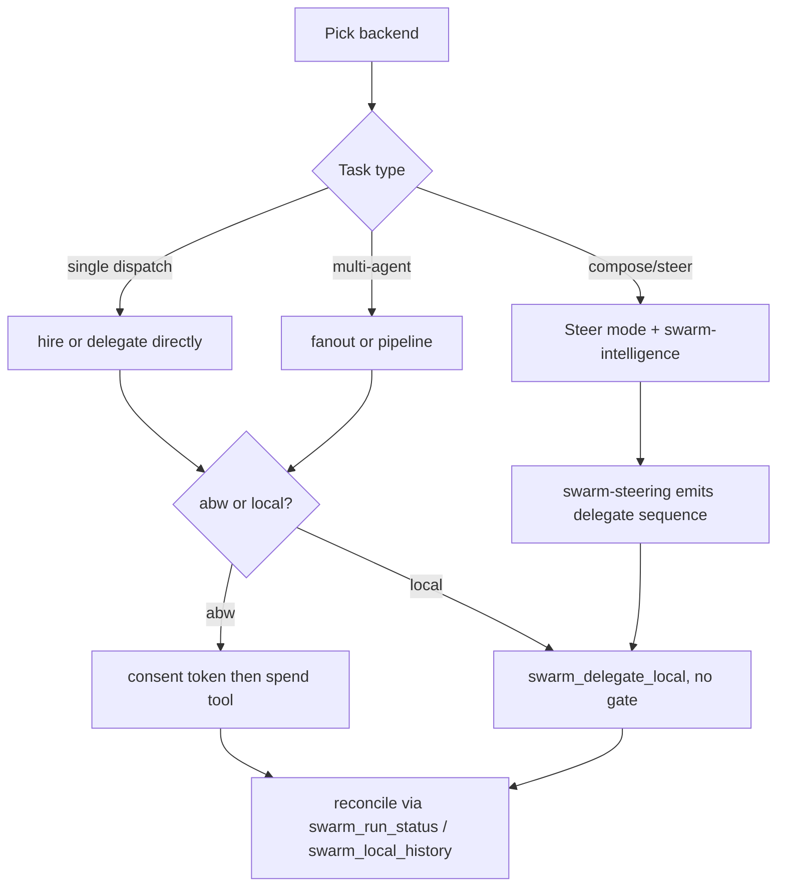
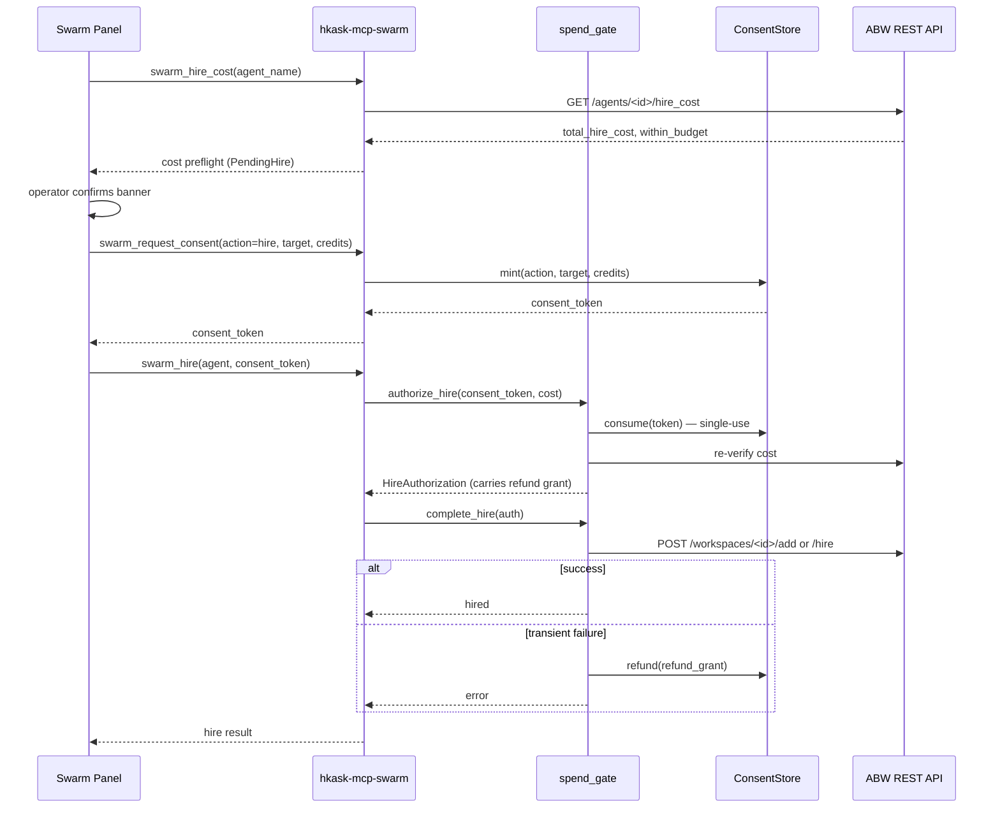

# Swarm Systems — How-to: Compose and Steer a Swarm

Procedural recipes for the four panel modes and the two steering execution
modes. Each recipe names the exact tool calls, the gate that must precede a
spend, and the feedback path that closes the loop. Read the
[tutorial](./tutorial.md) first for the component layout.

## Source citations

| Symbol / concept                    | Location                                                                |
| ----------------------------------- | ----------------------------------------------------------------------- |
| `steer_system_prompt`               | `crates/swarm_panel/src/swarm_panel.rs:148-326`                         |
| `PanelMode` enum                    | `crates/swarm_panel/src/swarm_panel.rs:387-395`                         |
| `set_mode` / `set_swarm_mode`       | `crates/swarm_panel/src/swarm_panel.rs:780-797` / `:851-883`            |
| `ensure_steer_conversation`         | `crates/swarm_panel/src/swarm_panel.rs:894-938`                         |
| `begin_hire` / `confirm_hire`       | `crates/swarm_panel/src/hire.rs:21-117` / `:123-272`                    |
| `create_swarm` / `ask_xaman`        | `crates/swarm_panel/src/swarm_panel.rs:1107-1314` / `:1319-1431`       |
| `fetch_all` (3 spawn groups)        | `crates/swarm_panel/src/fetch.rs:21-417`                                |
| `clone_to_local` / `push_to_cloud` | `crates/swarm_panel/src/fetch.rs:424-460` / `:467-502`                   |
| `open_swarm_detail` / `fire_agent` | `crates/swarm_panel/src/swarm_ops.rs:25-118` / `:237-290`                |
| 53-tool surface (pinned)           | `kask/mcp-servers/hkask-mcp-swarm/src/hkask_mcp_swarm.rs:361-434`        |
| Consent gate (mint/consume/refund) | `kask/mcp-servers/hkask-mcp-swarm/src/consent.rs:221` / `:255` / `:288` |
| Spend gate (hire/delegate/curate)   | `kask/mcp-servers/hkask-mcp-swarm/src/spend_gate.rs:169` / `:377` / `:492` |
| `swarm_request_consent` / `swarm_authorize_session` | `kask/mcp-servers/hkask-mcp-swarm/src/cloud_swarm_tools.rs:452` / `:506` |
| `swarm_delegate_local` / `swarm_fanout_local` / `swarm_pipeline_local` | `kask/mcp-servers/hkask-mcp-swarm/src/local_tools.rs:64` / `:119` / `:216` |
| `swarm_fund_local` / `swarm_balance_local` | `kask/mcp-servers/hkask-mcp-swarm/src/ledger_tools.rs:29` / `:66`  |
| Planner PDCA                       | `.agents/skills/swarm-intelligence/SKILL.md`                            |
| Actuator directive                  | `.agents/skills/swarm-steering/SKILL.md`                               |

## Procedure map

<!-- DIAGRAM_ALIGNMENT
id: DIAG-SWARM-010
verified_date: 2026-08-13
verified_against: crates/swarm_panel/src/swarm_panel.rs:387-395,148-326; kask/mcp-servers/hkask-mcp-swarm/src/spend_gate.rs:169-480; kask/mcp-servers/hkask-mcp-swarm/src/local_tools.rs:64-307
status: VERIFIED
-->

## How-to: Hire an ABW agent (consent-gated)

This is the canonical spend flow. The panel orchestrates it; the same shape
applies to headless callers using a session token instead of a single-use
consent token.

<!-- DIAGRAM_ALIGNMENT
id: DIAG-SWARM-011
verified_date: 2026-08-13
verified_against: crates/swarm_panel/src/hire.rs:21-272; kask/mcp-servers/hkask-mcp-swarm/src/cloud_swarm_tools.rs:379-602; kask/mcp-servers/hkask-mcp-swarm/src/spend_gate.rs:169-371; kask/mcp-servers/hkask-mcp-swarm/src/consent.rs:221-298
status: VERIFIED
-->

1. **Preflight cost.** Panel calls `swarm_hire_cost` (`cloud_swarm_tools.rs:379-442`).
   The server returns `total_hire_cost`, `required_cost`, `optional_cost`,
   `within_budget`, and `max_credits_per_dispatch`. The panel populates
   `PendingHire` (`hire.rs:70-99`). A missing `total_hire_cost` is surfaced as
   an error, not fabricated as 0 (`hire.rs:59-69`).
2. **Operator confirms.** The consent banner renders against the populated
   `PendingHire`. A new Hire click replaces any stale pending consent
   (`hire.rs:30-32`).
3. **Mint consent token.** Panel calls `swarm_request_consent`
   (`cloud_swarm_tools.rs:452-497`). The server requires auth (`require_auth()`) so a
   prompt-injected agent cannot self-authorize. `credits_authorized` must be > 0
   for spend actions (`cloud_swarm_tools.rs:478-483`). The token is single-use and
   action-scoped (`consent.rs:15-30`).
4. **Execute the spend.** Panel calls `swarm_hire` (`cloud_swarm_tools.rs:544-602`)
   with the consent token. `authorize_hire` (`spend_gate.rs:169-310`) consumes
   the token, re-verifies the cost against ABW, and enforces the per-dispatch
   ceiling. `complete_hire` (`spend_gate.rs:317-371`) executes the POST and
   refunds the authorization on transient failure.
5. **Reconcile.** Read `swarm_run_status` (`cloud_swarm_tools.rs:796-844`) for the
   run state.

## How-to: Use a pre-authorized session (headless pipelines)

For headless ABW pipelines where per-spend confirmation is impractical, open a
session with a total budget upfront.

1. Call `swarm_authorize_session` (`cloud_swarm_tools.rs:506-538`) with
   `total_credits` and an optional `actions` allowlist (empty = `hire` +
   `delegate`). Returns a `session_token`.
2. Pass `session_token` (instead of `consent_token`) to `swarm_hire`,
   `swarm_delegate`, or `swarm_fanout`. `resolve_auth`
   (`spend_gate.rs:44-60`) rejects both-set and neither-set; empty strings are
   treated as absent.
3. Each spend deducts from the session; `Settlement::Session`
   (`spend_gate.rs:74-77`) deducts on success and does nothing on failure
   (nothing was deducted to refund). When exhausted, open a new session.

## How-to: Delegate to a local agent (no gate)

Local mode has no consent token and no funding gate — the ledger records
spend rather than authorizing it (`local_runtime.rs:381-396`).

1. Ensure the agent exists in the local registry
   (`agents/local/curated/<id>/agent_card.json`, `local_registry.rs:18-47`).
2. Call `swarm_delegate_local` (`local_tools.rs:64-107`) with `agent_name`,
   `task`, and `credits_authorized`. The per-dispatch ceiling
   (`max_credits_per_dispatch`, default 50, `config.rs:75`) still bounds a
   single runaway dispatch (`local_runtime.rs:374-379`).
3. The runtime runs the skill cascade + tool loop (`AgentExecutor`), computes
   cost (1 credit / 1000 tokens, capped at `credits_authorized`), and debits
   the ledger (`local_runtime.rs:400-464`). `cost_uncapped` is carried
   alongside so a capped overrun is visible (`local_runtime.rs:411-427`).
4. Read the result's `balance` (may be negative — unreconciled local spend,
   not a fault) and `task_success` (left `None` by the server; the curator
   stamps it after running a declared evaluator, `local_runtime.rs:477-481`).

## How-to: Fan out to N agents

- **Local:** `swarm_fanout_local` (`local_tools.rs:119-208`) dispatches N
  agents sequentially (to avoid ledger TOCTOU — the local ledger is
  single-writer) and aggregates cost/tokens/latency. Capped at `MAX_FANOUT`
  (`local_runtime.rs:491`).
- **ABW:** `swarm_fanout` (`cloud_swarm_tools.rs:1276-1370`) dispatches in parallel
  against ABW. Capped at `MAX_FANOUT_ABW` (`cloud_swarm_tools.rs:1296`). Each
  dispatch carries its own consent token.

## How-to: Run a sequential pipeline

`swarm_pipeline_local` (`local_tools.rs:216-307`) runs a sequence of
delegations where each step's output is substituted into the next step's
`task` via `{{prev_output}}`. Capped at `MAX_PIPELINE_STEPS`
(`local_tools.rs:231`). No consent token — local mode.

## How-to: Steer a swarm via the panel

1. Select a swarm in Browse mode (sets `selected_workspace`).
2. Switch to Steer mode (`set_mode`, `swarm_panel.rs:780-797`). The panel
   calls `ensure_steer_conversation` (`swarm_panel.rs:894-938`) which builds
   the system prompt via `steer_system_prompt` (`swarm_panel.rs:148-326`).
3. The curator runs the `swarm-intelligence` PDCA cascade (planner) and emits
   a plan. The `swarm-steering` skill (actuator) takes the plan and produces
   the `swarm_delegate_local` sequence plus the re-invoke instruction.
4. The curator's tool calls dispatch through the governed MCP server; local
   delegations hit `swarm_delegate_local` and record spend in
   `mcp/swarm/ledger.db`.

## How-to: Clone an ABW agent to local

`clone_to_local` (`fetch.rs:424-460`) calls `swarm_clone_to_local`
(`local_tools.rs:358-525`). The cloned card's `capabilities.mcp_tools` are
filtered against `allowed_tool_servers` (`config.rs:101`) so a third-party ABW
card cannot extend the delegated tool surface beyond the operator's own
governed servers. The cloned card carries `cloud_id` so the panel shows a
"synced" badge (`local_registry.rs:32-36`).

## How-to: Push a local agent to ABW

`push_to_cloud` (`fetch.rs:467-502`) calls `swarm_push_to_cloud`
(`local_tools.rs:535-620`). The local card is uploaded to ABW; the local
card's `cloud_id` is set to the ABW agent id, marking it synced.

## How-to: Reconcile local spend

1. Call `swarm_balance_local` (`ledger_tools.rs:66-89`). A failed measurement
   returns an error, not 0 (the `.rules` trap — `ledger_tools.rs:77-86`).
2. Call `swarm_local_history` (`ledger_tools.rs:99-118`) for the recent
   fund/debit entries (newest first, capped at 500).
3. If you want the balance to read as "remaining" rather than "consumed",
   call `swarm_fund_local` (`ledger_tools.rs:29-53`). This is optional — local
   delegation never refuses for lack of funds.
