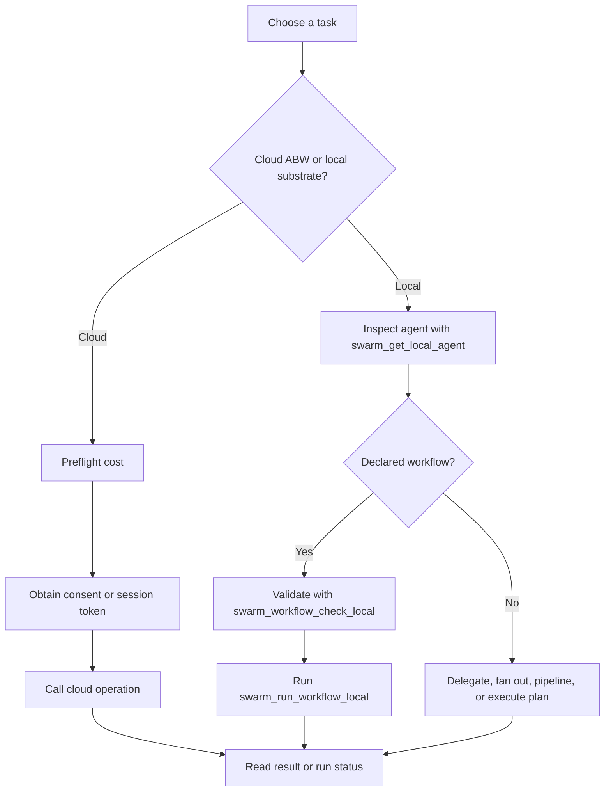

# Swarm Systems — How-to: Compose and Steer a Swarm

These procedures use the current 87-tool surface: 48 cloud tools and 39
non-cloud tools (`kask/mcp-servers/hkask-mcp-swarm/src/hkask_mcp_swarm.rs:731-754`).

## Choose the execution path

<!-- DIAGRAM_ALIGNMENT
id: DIAG-SWARM-010
verified_date: 2026-09-15
verified_against: kask/mcp-servers/hkask-mcp-swarm/src/cloud_swarm_tools.rs:530-925; kask/mcp-servers/hkask-mcp-swarm/src/local_tools.rs:223-638; kask/mcp-servers/hkask-mcp-swarm/src/local_tools.rs:702-909
status: VERIFIED
-->

## Hire or delegate through ABW

1. Call `swarm_hire_cost` before hiring
   (`kask/mcp-servers/hkask-mcp-swarm/src/cloud_swarm_tools.rs:530-605`).
2. Obtain a single-use token with `swarm_request_consent`, or open a bounded
   headless session with `swarm_authorize_session`
   (`kask/mcp-servers/hkask-mcp-swarm/src/cloud_swarm_tools.rs:606-686`).
3. Pass exactly one authorization form to `swarm_hire`, `swarm_delegate`,
   `swarm_delegate_and_wait`, `swarm_fanout`, `swarm_execute_agent`,
   `swarm_create_swarm`, or `swarm_xaman`. These operations route through the
   cloud authorization path in their definitions
   (`kask/mcp-servers/hkask-mcp-swarm/src/cloud_swarm_tools.rs:467-528,687-925,1160-1387,1452-1555`).
4. For asynchronous workspace work, inspect `swarm_run_status`
   (`kask/mcp-servers/hkask-mcp-swarm/src/cloud_swarm_tools.rs:926-977`).

## Inspect and delegate to a local agent

1. Use `swarm_list_local_agents` to discover cards
   (`kask/mcp-servers/hkask-mcp-swarm/src/local_tools.rs:640-701`).
2. Use `swarm_get_local_agent` before relying on a remembered model, prompt,
   port, or execution statistic
   (`kask/mcp-servers/hkask-mcp-swarm/src/local_tools.rs:702-747`).
3. Call `swarm_delegate_local` with the agent name and task
   (`kask/mcp-servers/hkask-mcp-swarm/src/local_tools.rs:223-337`).
4. If the card has deterministic evaluators, read the returned task-success
   verdict. Otherwise, call `swarm_evaluate_local`
   (`kask/mcp-servers/hkask-mcp-swarm/src/local_tools.rs:2575-2615`).

Local calls require no ABW consent token. They remain subject to the local
runtime's declared tool and output-contract checks
(`kask/mcp-servers/hkask-mcp-swarm/src/local_runtime.rs:135-150`).

## Run a declared workflow safely

1. Inspect the agent with `swarm_get_local_agent`.
2. Call `swarm_workflow_check_local`; do not start execution if the declared
   workflow is invalid (`kask/mcp-servers/hkask-mcp-swarm/src/local_tools.rs:748-795`).
3. Call `swarm_run_workflow_local`. It executes the declared stages and records
   observed handoff seams (`kask/mcp-servers/hkask-mcp-swarm/src/local_tools.rs:797-909`).
4. Use `swarm_observed_seams_local` to compare observed handoffs with declared
   ports (`kask/mcp-servers/hkask-mcp-swarm/src/local_tools.rs:911-1014`).

## Fan out, pipeline, or execute a plan

- Use `swarm_fanout_local` for independent local tasks; `parallel` selects
  concurrent execution (`kask/mcp-servers/hkask-mcp-swarm/src/local_tools.rs:339-518`).
- Use `swarm_pipeline_local` when each step consumes `{prev_output}` from the
  preceding step (`kask/mcp-servers/hkask-mcp-swarm/src/local_tools.rs:519-638`).
- Use `swarm_execute_plan_local` for a prepared delegation list with optional
  deterministic evaluators (`kask/mcp-servers/hkask-mcp-swarm/src/local_tools.rs:2616-2810`).
- Read persistent per-swarm progress with `swarm_task_board`
  (`kask/mcp-servers/hkask-mcp-swarm/src/local_tools.rs:2812-2846`).

## Measure agent or swarm reliability

Use `swarm_eval_agent_local` for repeated single-agent rollouts and
`swarm_eval_suite_local` for multi-delegation cases. Both apply deterministic
evaluators and bounded request sizes
(`kask/mcp-servers/hkask-mcp-swarm/src/local_tools.rs:2848-3138`).

## Move agents and swarms between local and cloud

- `swarm_clone_to_local`, `swarm_push_to_cloud`, `swarm_remove_local`,
  `swarm_create_local_agent`, and `swarm_reconfigure_local_agent` manage local
  cards and cloud linkage
  (`kask/mcp-servers/hkask-mcp-swarm/src/local_tools.rs:1173-1905`).
- Local swarm CRUD and membership tools are defined at
  `kask/mcp-servers/hkask-mcp-swarm/src/local_tools.rs:1906-2127`.
- `swarm_push_local_swarm` and `swarm_pull_swarm_to_local` synchronize swarm
  composition with ABW
  (`kask/mcp-servers/hkask-mcp-swarm/src/local_tools.rs:2128-2335`).

## Further reading

- [Why the swarm loops are separated](./explanation.md)
- [Complete swarm tool reference](./reference.md)
